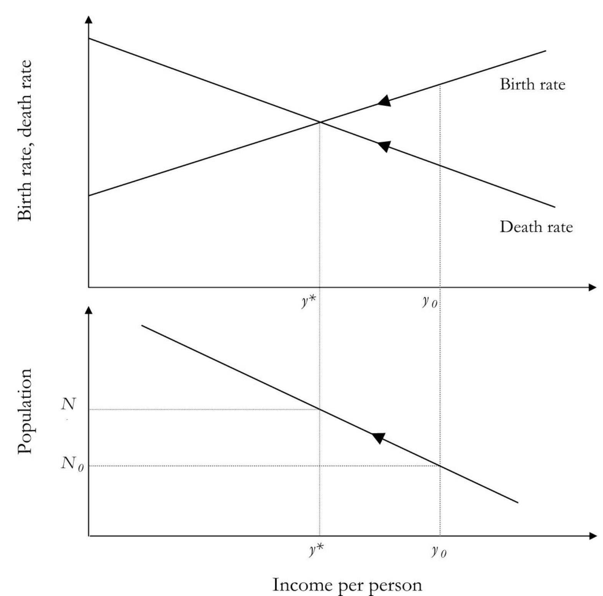

**MIDTERM **
- [**2026 Midterm**](https://drive.google.com/file/d/17mBhiOEylT2_91FeaO5EbuIXtid7OnZw/view?usp=sharing)
- [**Practice Past Midterm**](https://drive.google.com/file/d/1ZTUG9zfJrPb44bWmtAZvFe_Wd0OfBPuL/view?usp=sharing) (actual past exam)

**AI STUDY SUGGESTION:** Copy the course reading schedule (up to the content of our last class) into a text document (e.g. readings.txt). Open up any recent AI chatbot (e.g. [Google Gemini](https://gemini.google.com/app), [ChatGPT](https://chatgpt.com/), [Meta AI](https://www.meta.ai/), [Grok,](https://grok.com/) [Claude](https://claude.ai/new), etc). These all have free tiers that only require you to sign in. Drag the file into the chat window so that the content becomes part of the context. Next ask the chatbot something along these lines: "I'm preparing for my college Economic History Exam, based on the attached readings and topics. Use that and your own broader understanding to help me prepare an outline to answer the following question: " Interact with the chatbot to refine your outline (e.g. ask it to give specific historical examples, or to describe the debates that surround a topic, etc). You could provide it with the practice midterm and ask it to quiz you on the exact or related questions. Ask it to tell you why your answers are wrong or right (this is more effective than simply asking for answers).

Follow up, by asking it to add something you think important or to elaborate. Once you are satisfied you could ask it to write out a short essay response. Continue to interact, asking for clarification, elaboration on certain points, specific historical examples to illustrate a point, etc. Ask it factual questions that expand you understanding of history and historical debates.

If you do this with several of the questions below, you'll learn a lot and become prepared to answer well on the midterm.

**The following are examples of other types of questions:

** There is a large number of questions here, but many are variants of the same question. Your best preparation is to sketch out short bullet point answers to these questions, aided by the slides and the readings.

  1. Use the diagram below to write a description of the operation of the Malthusian model (covered in the slide deck, also in first pages of KR chapter 5). Describe the assumed relationships that have been used to draw each of the three curves shown in the figures (the 'Birth rate' curve as upward sloping, the 'Death rate' curve as downward sloping, and the relationship between population and per-capita income shown in the lower diagram. Why does income per-capita end up at y∗. Explain using economic reasoning (and not with non-explanations such as 'because that's where the two curves intersect')  

  2. Use the diagram below to write a description of the operation of the Malthusian model. Describe the assumed relationships that have been used to draw each of the three curves shown in the figures (the 'Birth rate' curve as upward sloping, the 'Death rate' curve as downward sloping, and the relationship between population and per-capita income shown in the lower diagram. Why does income per-capita end up at y∗. Explain using economic reasoning (and not with non-explanations such as 'because that's where the two curves intersect')

  3. Using the Malthusian model framework, what would be the effect of an effort to reduce societal-level birth rates, for example via economic incentives, government policies, or changes in social or cultural norms which lead to delayed age of first marriage. What is the impact on steady-state population and income per capita?

  4. Using the Malthusian model framework, what would be the effect of a prolonged increase in Death rates (a shift to the right of the Death rate curve in the figure), for example due to epidemics, war, or rising urbanization (which in the past used to have the effect of raising mortality because of poor sanitation and the spread of disease). Could episodes of plague, war, and urbanization have led to higher pre-capita incomes?

  5. Economic Historian Greg Clark points out that "while the Malthusian economy displayed stagnant material living standards, the consumption pattern of the preindustrial Englsish worker around 1800 ...implies... high living standards by the measure of the modern Third World." How can you use the Malthusian framework to explain why per-capita incomes of the poor in a country such as Malawi today, may be lower today than what their ancestors 200 years ago (hint: the death rate curve).

  6. Using the Malthusian model framework, what would be the effect of a one-time significant increase in technological advancement (e.g. the invention of a better plow). Think of this as a shift out in the curve that summarizes the relationship between income per person and population. What is the impact steady-state level of population and income per person? How do Galor and others use this finding to talk about the growth of empires in the Malthusian era?

  7. While Oded Galor emphasizes Malthusian mechanisms in the form of a negative relation between higher population and income-person (from the idea of diminishing returns to labor when technology and resources such as land are fixed) he also stresses the possibility that technological change could be stimulated by population growth. Can you provide examples of why that might happen and the mechanisms that he has in mind?

  8. Briefly describe the main elements in Oded Galor's "unified growth model." This claims to explain the mechanisms of the Malthusian epoch where technology advances may lead to higher population densities but ultimately do not succeed in raising per-capita incomes much above 'subsistence' levels of per-capita income, and some of the key factors and mechanisms that Galor emphasizes as having led to a transition and escape.

  9. Where did the agriculture and civilizations first become established and what were its consequences for human welfare. What advantages and disadvantages did the onset of agriculture provide to the societies who adopted. Contrast the attitudes and interpretations of at least two of the following authors: Galor, Diamond, and/or Scott.

  10. How does Douglas North define 'institutions'? What are some examples of what he means by institutions? Why does North place institutions at the center of his explanation of the determinants of economic performance and development? List at least two economic history applications that offer support for this view.

  11. What sort of evidence do historians point to to support the idea of a long Malthusian epoch? Give at least two types of example.

  12. In broad terms, how does Oded Galor explain the transition away from and the 'escape' from the Malthusian epoch? How do technological change, human capital, fertility, urbanization, and cultural factors all fit into his explanation?

  13. Koyama and Rubin' book explores _How the World Became Rich_ When did the modern explosion in growth start? Where? How does it relate to modern wealth differences between countries?

  14. In what sorts of areas did the Neolithic transition occur first? How did it lead to the rise of early states?

  15. Why do Jared Diamond and James C. Scott argue that, despite its enormous contributions to civilization, specialization, and technological advances including writing and Science, the neolithic revolution led to a worsening of freedom and quality of life for so many people. Why was human bondage so common to early civilizations?

  16. How might geographic features can constrain economic growth? How can they be overcome? Is this a reason some countries are rich and others are poor? Provide examples of your arguments.

  17. How has geography been used to explain the rise of Chinese civilization, bureaucracy, and a strong centralized state.

  18. How has geography also been used to explain warfare as well as the rise of modern bureaucratic administration in Europe.

  19. What is Diamond’s continental verticality hypothesis from _Guns, Germs, and Steel_?

  20. Are the maritime commercial successes of Venice and the Netherlands in spite of their marshy origins, or because of them? Do places which require more cooperation to overcome environmental hardship have an advantage?

  21. How can geography-based theories (and Institutions) explain the “reversal of economic fortunes” that has taken place in many parts of the world? For example, economic historians Engerman and Sokoloff point out that in 1790 "Haiti was likey the richest society in the world on a per-capita basis," yet today it is the poorest country in the Western Hemisphere.

  22. Karl Marx had a well developed theory of institutions or what he called 'the social relations of production.' In his approach, how do social relations of production change?

  23. Neo-institutionalists such as Douglas North argue that the "Glorious Revolution" of 1688 led to changes in institutions that credibly committed monarchs to accept constraints on their power. Why would this be helpful for economic growth?

  24. What institutional changes were brought about by the Black death. Describe rural institutional arrangements (e.g. serfdom) before and after the Black death, and some of the mechanisms that made things change. Have rises in the relative scarcity of labor improved wages and institutional arrangements in a way that favored labor everywhere?

  25. Did Culture make some regions rich and others poor? How might culture matter for economic growth. Give at least two examples that can be argued culture or religion mattered?

  26. What role did the Protestant reformation in the economic transformation of Europe. Give at least two examples.

  27. Describe the English manorial economy of the 11th century. Broadly, how were the lands of the manor held and utilized? What were labor relations? How had land property and labor relations changed by 1500?

  28. What were the consequences of the Black Death on institutions in Medieval England?

  29. What is meant by the 'neo-Smithian' or 'commercialization' model? What are some of the critiques that Marxist Ellen Wood levels against this model as an explanation for the rise of capitalism? What are key aspects of the alternative approach that she and Robert Brenner propose?

  30. In the Marxist view, how did English enclosures and the dispossession help to establish 'capitalist-imperatives' that led to the rise of agrarian capitalism and the industrial evolution? Is there evidence for this view?

  31. 

\---

We did not yet get to material on the following questions. So you may safely ignore

  1. What are land enclosures? Who enclosed lands? How did it affect villager usage rights? Why does Sir Thomas More's famous poem refer to enclosures using the metaphor of sheep devouring (eating) men?

  2. Robert Allen argues that while the early "Tudor enclosures" (during the period of the Tudor dynasty, 1485-1603) started as a seigneurial reaction that led to the depopulation of many villages and the loss of many smallholders property, peasant property and agriculture emerged actually strengthened by the end of the period, leading to the rise of the yeoman farmer. Why did this happen (p14)?

  3. Why does Robert Allen say there was a more important yeoman agricultural revolution before the later landlord agrarian revolution? Explain his arguments and reasoning. In his view, what was the main consequence of the later 'landlord revolution'?

  4. Robert Allen argues that many historians share a system of thought that he describes as 'Agrarian Fundamentalism,' for the way that they tie together ideas on enclosures, rising agricultural productivity, and the industrial revolution. Spell out the three key ideas that he claims defines agrarian fundamentalists. In what sense are both 'Tory' and 'Marxist' interpreters both agrarian fundamentalists? In what ways do they differ?