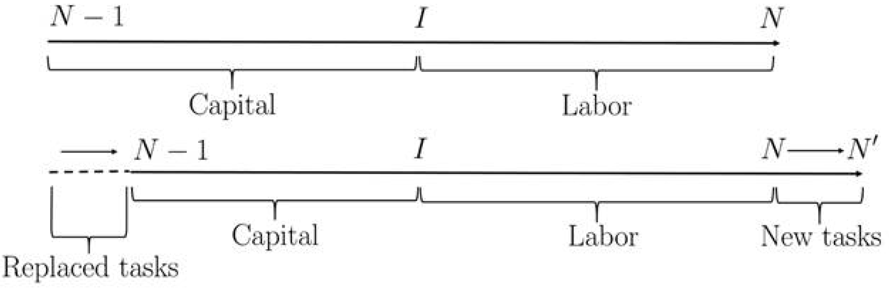
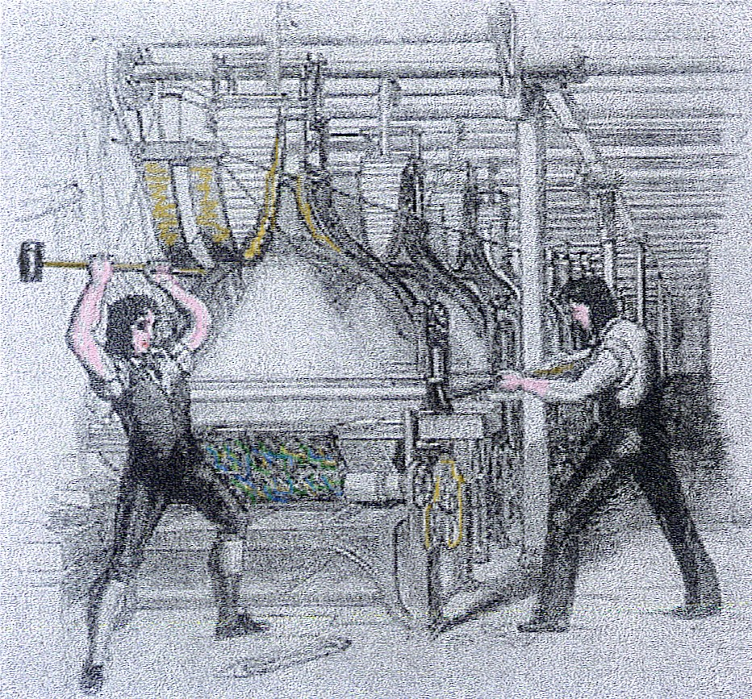
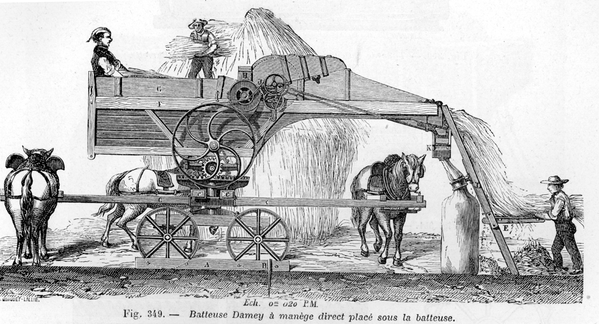
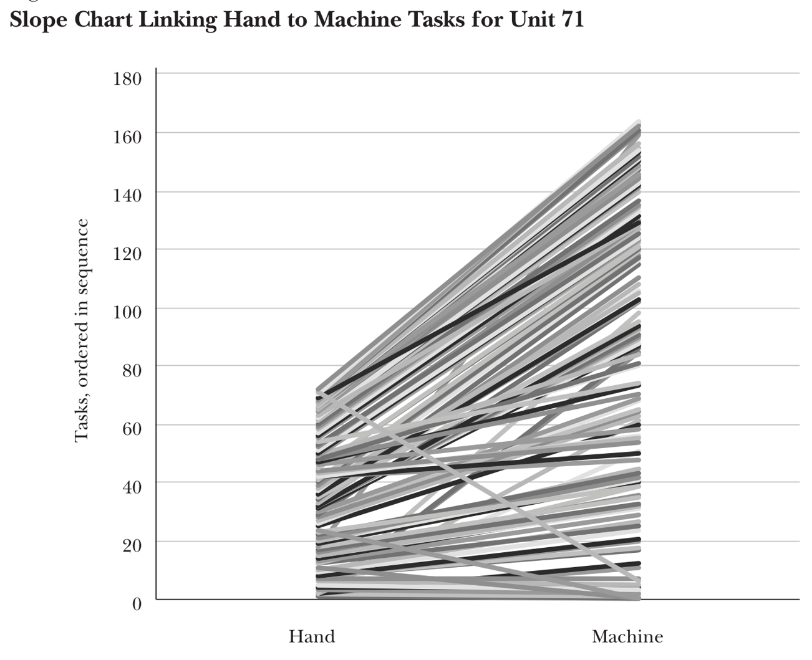
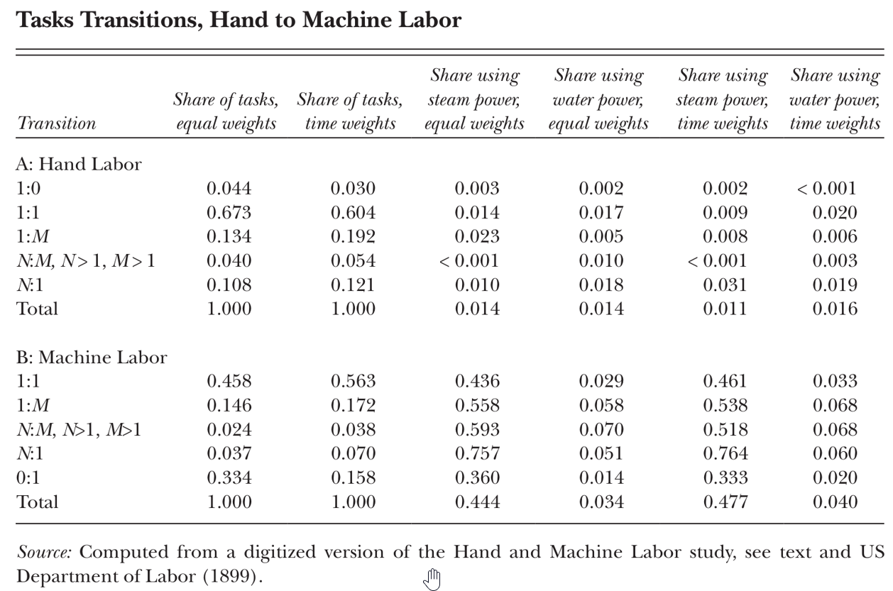
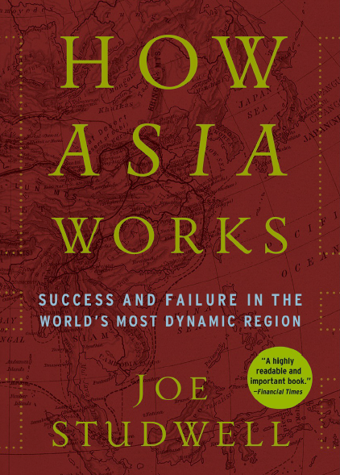
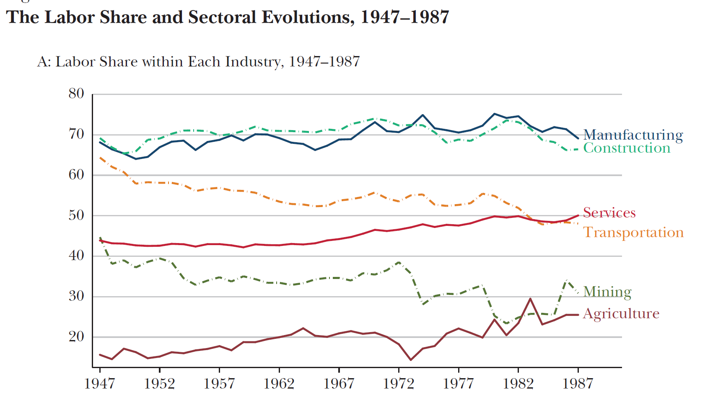
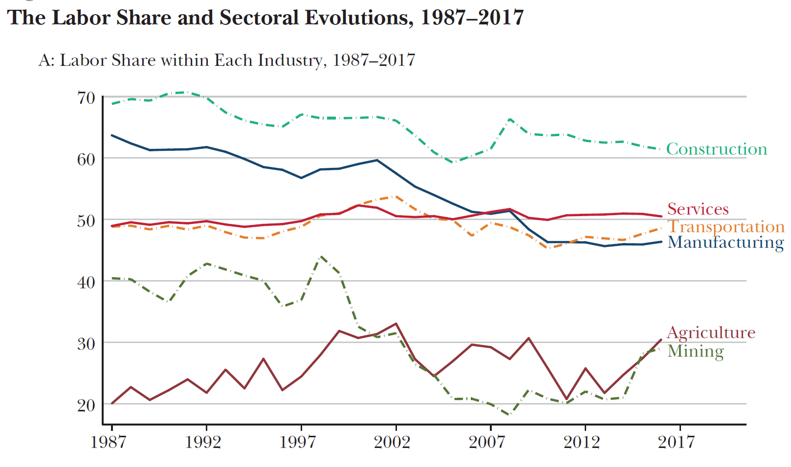

<!--
theme: gaia 
paginate: true
footer: ""
style: |
  section {font-size: 27px;}

-->

## ECO 331
# Economic History

```
Technology, Labor, and Inequality
```
Jonathan Conning
Spring 2026
<br></br>


---


## Labor and Technology 

- A central question that connects the many 'transitions' we've studied: How does technological/institutional come about and does it displace workers, or generate new employment?
- Acemoglu and Restrepo's framework helps connect these historical cases to modern automation and AI debate.

  >Atack, Jeremy, Robert A. Margo, and Paul W. Rhode. 2019. “‘Automation’ of Manufacturing in the Late Nineteenth Century: The Hand and Machine Labor Study.” _Journal of Economic Perspectives_ 33 (2): 51–70. [PDF](attachments/automation/atack.pdf)


  >Acemoglu, Daron, and Pascual Restrepo. 2019. “Automation and New Tasks: How Technology Displaces and Reinstates Labor.” _Journal of Economic Perspectives_ 33 (2): 3–30. [PDF (optional)](https://drive.google.com/file/d/1EN2vgjUJGaRaKScuriX6N8FCxzVkA5tQ/view?usp=sharing)

---


## The Direction of Technological Change

- Tech change is not a neutral, inevitable force. 
- The *direction* of innovation—whether it saves labor or creates new industries—is shaped by incentives.
- Determinants include:
  - **Factor Endowments:** The relative scarcity and cost of land, labor, and capital.
  - **Market Environment:** Scale and elasticity of demand.
  - **Institutions:** Property rights, tax policy, labor laws, bargaining power of labor and capital.

---
## The AR Task-Based Model of Production

- Standard models (like Cobb-Douglas, CES, etc.) treat production as a function of aggregate capital and labor: $Y = F(K, L)$.  This implies capital and labor are complements and more capital always makes labor more productive.
- Acemoglu & Restrepo instead model production as a **continuum of discrete tasks**. Capital and labor are substitutes in any given task.
- **Automation** occurs when capital replaces labor in a given task.

- Task $i \in [0, N]$ can be done with capital (K) or labor (L):

$$y(i) = \begin{cases} A^K k(i) & \text{if } i \le I \quad \text{(Automated Tasks)} \ A^L l(i) & \text{if } i > I \quad \text{(Labor Tasks)} \end{cases}$$
tasks are then aggregated into final output (Y) in a more traditional CES production:

$$Y = \exp \left( \int_{N-1}^{N} \ln y(i) di \right)$$

---


### Technological change creates competing forces:

1. **Displacement Effect:** Automation pushes labor out of specific tasks, reducing the labor share of value and placing downward pressure on wages.
2. **Productivity Effect:** Machines lower production costs, leading to lower prices and increased overall output. This raises demand for labor in non-automated tasks.
3. **Reinstatement Effect:** Technological change can also create **new tasks** where humans hold a comparative advantage, pulling labor back into production.

<center>


</center>


---

<style scoped>
  .interactive-widget { display: block; }
  .static-fallback { display: none; }
  
  /* This targets Marp's PDF export process */
  @media print {
    .interactive-widget { display: none !important; }
    .static-fallback { display: block !important; }
  }
</style>

<div class="interactive-widget">
  <iframe src="iframe/ar-model.html" width="100%" height="480px" style="border:none; overflow:hidden;" scrolling="no"></iframe>
</div>

<div class="static-fallback">
  
</div>

---

## Contrasting tech regimes

| Regime | Automation $I$ | New Tasks $N$ | Capital Prod. $A^K$ | Task Share $\Gamma$ | Total Output $Y$ | Wage Bill $\Gamma \times Y$ |
| :--- | :---: | :---: | :---: | :---: | :---: | :---: |
| **Benchmark** | 50 | 100 | 1.0x | 0.50 | 100 | **50** |
| **"So-So" Automation** | 80 | 100 | 1.0x | 0.20 | 100 | **20** |
| **"Brilliant" Automation** | 60 | 100 | 2.5x | 0.40 | 190 | **76** |
| **Golden Age** | 80 | 160 | 1.5x | 0.50 | 200 | **100** |

*Note: Automation ($I$) moves the threshold right; New Tasks ($N$) expands the frontier; $A^K$ multiplies machine efficiency.*

---



#### The Luddites

- The Luddites (1811–1816): 19th-century English textile workers, primarily based in Nottingham, protested against labor-replacing machinery and the erosion of their wages and rights.
- For centuries hand-woven stockings had been made by skilled weavers working in their homes. New factories with powered looms could produce stockings more quickly and cheaply, threatening the livelihoods of the handloom weavers.  
- Some stocking frames destroyed, but more typically threatened as bargaining tactic. Blamed mythical "Ned Ludd", who first smashed a stocking frame in 1779.  

---
## State Intervention and Labor's Bargaining Power

- The British state supported capital owners and suppressed labor organization.
- **The Combination Acts (1799/1800)** criminalized trade unionism and collective bargaining.
- **The Frame Breaking Act (1812)** made destruction of mechanized looms a capital crime. In 1813, 17 Luddites were executed. Many more to penal colonies.
- **The Result:** With labor legally restrained and a growing supply of displaced rural workers, capital captured the productivity gains. Part of reason why wages stagnated for decades ("Engels' Pause").

---
### Swing Riots 
-  Impoverished agricultural laborers in rural England. During Napoleonic Wars, prices for food had risen. Enclosures had pushed many off lands. Rioters protested low wages, the unfair tithe system, the draconian Poor Laws, and the introduction of labor-saving horse-drawn threshing machines in 1830-31.
- Smashed threshing machines and tithe barns.
- 2000 people put on trial.  292 sentenced to death (19 ultimately hanged).

<center>



</center>


---
## Automation of Manufacturing (US, 1899)
- Using the AR frameowrk, and to observe task shifts at the micro-level, *Atack, Margo, and Rhode (2019)* use the 1899 "Hand and Machine Labor" study.
- Study documented production methods before and after factory mechanization in the United States.
- Focused strictly on the **task level**: what specifically does a worker do, and how long does it take?
- A primary example: Making 100 pairs of medium-grade shoes.

---

### The Shift to Specialization

- **Hand production**: artisan performed most tasks involved in making a shoe. 
- Median number of tasks per worker was 2 (higher for masters).
- **Machine production**: median tasks per worker fell to **1**.
- Workers became highly specialized, allowing steam-powered machines to take over routine physical steps. 

---

### Task Transitions and Reinstatement

- Mechanization subdivided complex tasks and consolidated others.
- Crucially, it also generated **new tasks** (The Reinstatement Effect).
- Approximately 1/3 of the tasks in machine production were new to the process.
- Examples: maintaining steam engines, quality inspection, specialized foreman supervision.

---

### American Divergence: North vs. South

- **The Free North (Habakkuk Thesis):** Open frontier made free labor scarce and expensive. *Induced innovation* specifically labor-saving (e.g., the McCormick reaper, interchangeable parts).
- **The Coerced South:** Violent coercion artificially suppressed labor. Southern landowners had little incentive to adopt labor-saving technology. Region lagged in industrialization.
- **Deliberate Underdevelopment:** Gavin Wright argues that post-bellum landowners blocked higher-wage industrial competitors from entering the region and underfunded public schooling to keep the local populace dependent on agriculture.

---



### East Asian Miracles: Induced Innovation

- Economies like Japan, South Korea, and Taiwan experienced different technological trajectories, supported by early, widespread land reform.
- **Induced Innovation:** Rather than importing large, labor-displacing Western factories wholesale, they adapted technology to their specific factor endowments (scarce land, abundant labor).
- They reverse-engineered Western designs to create smaller, appropriate machinery that could be utilized within extensive subcontracting networks.


---
- Labor-intensive manufacturing expanded rapidly. New tasks arose in repair, maintenance, and adaptation of machinery.
- State investments in education and human capital were high.
- Export orientation provided highly elastic demand.
- Strong productivity growth. Output expanded rapidly, allowing labor demand to keep pace with displacement and driving sustained wage growth.

---
## Expanding the Task Frontier

- By adapting technology in this way, these economies generated a substantial **Reinstatement Effect**, expanding labor-intensive tasks in light manufacturing.
- **Human Capital:** State investments in education ensured the workforce could adapt to these new, increasingly complex tasks.
- **Export Orientation:** Competing in global markets provided highly elastic demand. 
- **The Result:** A strong Productivity Effect. Output scaled rapidly, allowing labor demand to keep pace with displacement and driving sustained wage growth.

---

### The US Golden Age (1947–1987)

- Acemoglu & Restrepo label the post-WWII era a "Golden Age."
- Automation displaced workers but matched by **Reinstatement Effect**.
- Net effect on "task content of production" remained relatively stable.
- Wages and employment grew with overall productivity.

---



---
### A Structural Shift (1987–2017)

- **Displacement** has continued, driven by software, algorithms, and robotics.
- **Reinstatement Effect** has slowed significantly.
- AR attribute this to rise of "so-so" technologies: innovations that are just efficient enough to replace human labor but fail to generate the large productivity gains needed to boost broader labor demand.

---




---
## Some explanations

- **Institutional Bias:** U.S. tax code, especially since 1980s, subsidizes capital investment (e.g. investment tax credits and accelerated depreciation) while taxing human labor (via payroll taxes). Weaker unions.
- **Industry Incentives:** The venture capital model prioritizes software designed to substitute for labor and reduce immediate payroll costs, rather than the longer-term investments required to generate new human-centric industries.

---
## The "So-So" Technology Trap

- **Definition:** Innovations that are just efficient enough to be adopted but fail to generate the large productivity gains needed to boost broader labor demand.
- **The Mechanism:** High **Displacement** (jobs lost) but very low **Productivity Effect** (no price drops or new demand).
- **Examples:** Automated grocery checkouts, automated customer service phone trees. 
- **Result:** Labor loses its share of production without the "pie" growing large enough to create replacement roles.

---
## Why Reinstatement has Slowed

- **Human Capital Mismatch:** Reinstatement requires workers with skills for *new* tasks. If the education system lags behind the frontier, firms cannot man new tasks even if they are technically possible.
- **Intellectual Bias:** AR argue current AI research (OpenAI, Google) is biased toward **Human-Mimicry** (getting machines to do what humans already do) rather than **Human-Complementarity** (creating tools that let humans do new things).
- **Market Power:** Large tech platforms may focus on "remote automation" (offshoring) and data-capture models that scale without adding domestic headcount.

---
## Historical Summary

| Regime | Institutional / Factor Context | Impact on Task Frontier | Net Outcome |
| :--- | :--- | :--- | :--- |
| **Early Britain** | State suppresses labor; enclosures increase supply. | Displacement heavily outpaces Reinstatement. | Wage stagnation (Engels' Pause). |
| **U.S. Frontier** | Land abundance creates high wages for free labor. | High wages induce automation; new factory tasks follow. | High productivity & wage growth. |
| **Slavery** | Coercion enforces artificial subsistence labor. | Stalls automation and new task creation. | Technological stagnation. |
| **East Asia** | Land reform + Export orientation. | Adaptation drives Reinstatement + Productivity. | Broad-based wage growth. |
| **Modern Era** | Tax bias for capital + Silicon Valley incentives. | Steady Displacement, slowing Reinstatement. | Stagnant median wages, rising inequality. |

---
## Concluding Thoughts

- The Industrial Revolution fundamentally reorganized the allocation of tasks between capital and labor.
- Economic history suggests that outcomes for workers are not strictly determined by the capabilities of new machines, but by the surrounding economic and political institutions.
- Sustained wage growth generally requires technology directed toward creating new tasks, supported by policies that invest in human capital and maintain labor's bargaining position.


Gemini is AI and can make mistakes.

