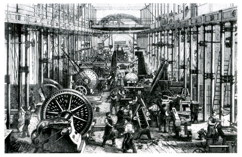
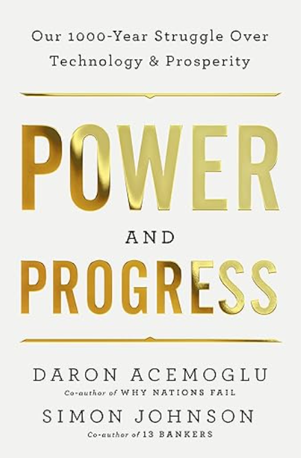
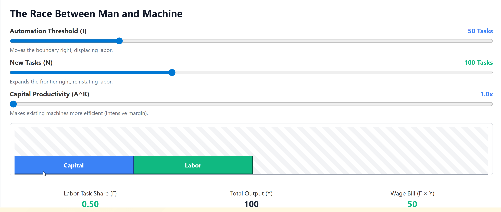
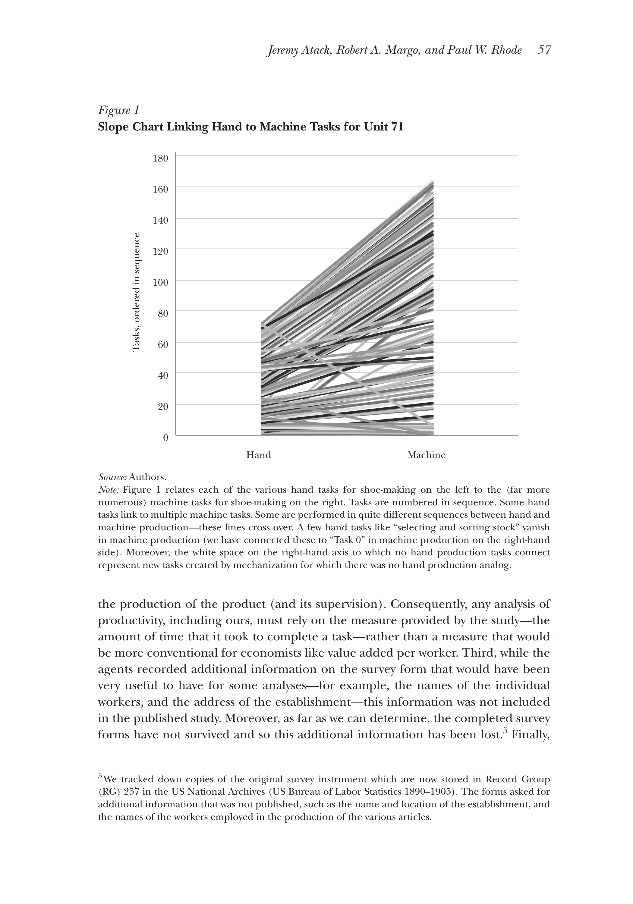
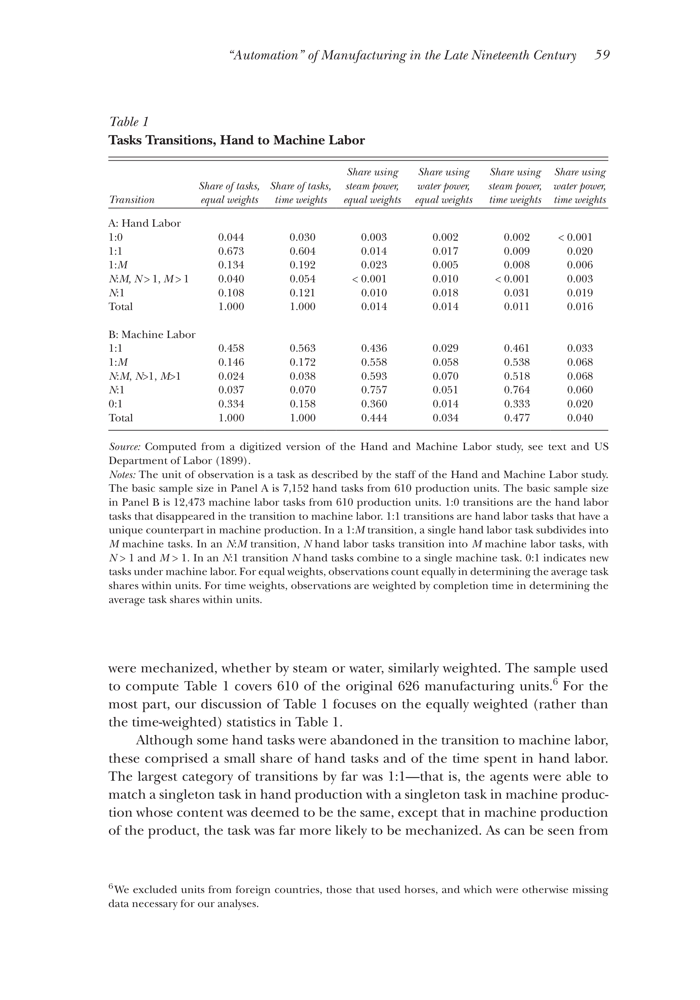
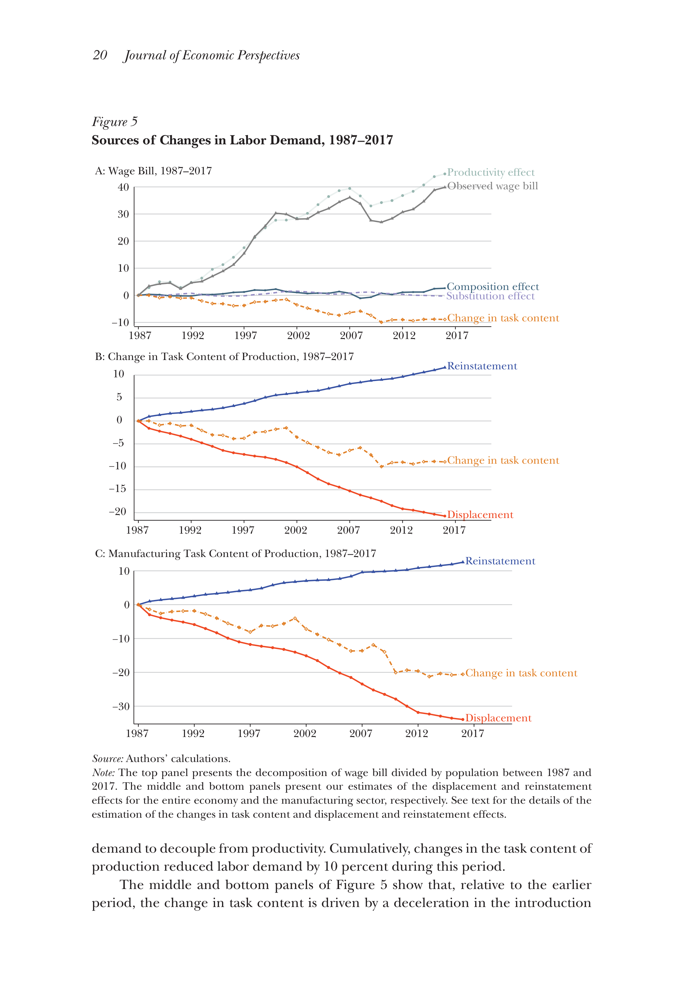
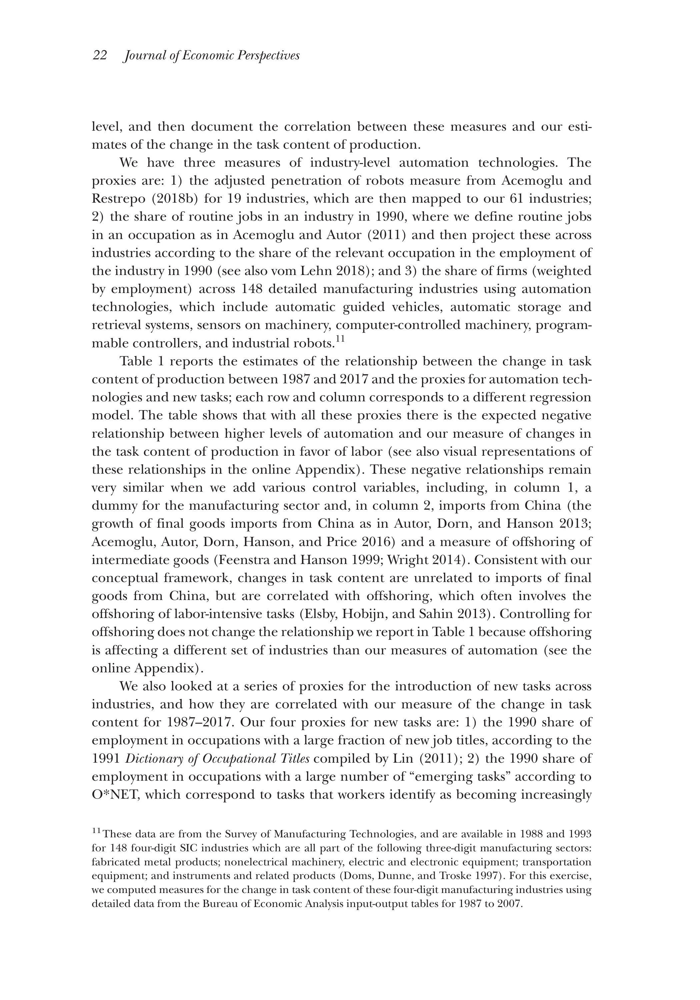

<!--
theme: gaia 
paginate: true
footer: ""
style: |
  section {font-size: 27px;}

-->

## ECO 331
# Economic History

```
Technology, Labor, and Inequality
```
Jonathan Conning
Spring 2026
<br></br>



---


## Technology and Labor in Historical Perspective

- Over the semester, we have examined the British Industrial Revolution, American frontier settlement, slavery, and the East Asian economic expansions.
- A central question connects these transitions: Does technological change primarily displace workers, or does it generate new employment?
- The historical record suggests the outcome depends heavily on the institutional framework.
- Today, we use the Acemoglu and Restrepo (2019) framework to connect these historical cases to the modern automation and AI debate.

---



## The Direction of Technological Change

- Tech change is not neutral, inevitable force. 
- The *direction* of innovation—whether it saves labor or creates new industries—is shaped by incentives.
- Determinants include:
  - **Factor Endowments:** The relative scarcity and cost of land, labor, and capital.
  - **Market Environment:** Scale and elasticity of demand.
  - **Institutions:** Property rights, tax policy, labor laws, bargaining power of labor and capital.

---
## The Task-Based Model of Production

- Standard macroeconomic models treat production as a function of aggregate capital and labor: $Y = F(K, L)$.
- In that framework, adding capital generally makes labor more productive.
- Acemoglu & Restrepo argue this misses the mechanics of the shop floor. They model production as a **continuum of discrete tasks**.
- **Automation** occurs when capital specifically replaces labor in a given task.

---


## Three Competing Forces

1. **Displacement Effect:** Automation pushes labor out of specific tasks, reducing the labor share of value and placing downward pressure on wages.
2. **Productivity Effect:** Machines lower production costs, leading to lower prices and increased overall output. This raises demand for labor in non-automated tasks.
3. **Reinstatement Effect:** Technological change can also create **new tasks** where humans hold a comparative advantage, pulling labor back into production.


---

<style scoped>
  .interactive-widget { display: block; }
  .static-fallback { display: none; }
  
  /* This targets Marp's PDF export process */
  @media print {
    .interactive-widget { display: none !important; }
    .static-fallback { display: block !important; }
  }
</style>

<div class="interactive-widget">
  <iframe src="iframe/ar-model.html" width="100%" height="480px" style="border:none; overflow:hidden;" scrolling="no"></iframe>
</div>

<div class="static-fallback">
  
</div>
---

---
## Contrasting tech regimes

| Regime | Automation $I$ | New Tasks $N$ | Capital Prod. $A^K$ | Task Share $\Gamma$ | Total Output $Y$ | Wage Bill $\Gamma \times Y$ |
| :--- | :---: | :---: | :---: | :---: | :---: | :---: |
| **Benchmark** | 50 | 100 | 1.0x | 0.50 | 100 | **50** |
| **"So-So" Tech** | 80 | 100 | 1.0x | 0.20 | 100 | **20** |
| **"Brilliant" Auto** | 60 | 100 | 2.5x | 0.40 | 190 | **76** |
| **Golden Age** | 80 | 160 | 1.5x | 0.50 | 200 | **100** |

*Note: Automation ($I$) moves the threshold right; New Tasks ($N$) expands the frontier; $A^K$ multiplies machine efficiency.*

---
## 1. Britain: Displacement and the Handloom Weavers

- How does this model apply to the early British Industrial Revolution?
- **The Displacement Shock:** The introduction of the power loom and spinning frame directly threatened the task share of highly skilled, well-paid artisans.
- The Luddite movement (1811–1816) was not an irrational rejection of progress; it was a targeted response by textile workers experiencing a rapid, severe displacement effect that eroded their human capital and bargaining power.

---
## State Intervention and Labor's Bargaining Power

- Why were the weavers ultimately unable to capture the productivity gains of mechanization?
- The British state actively intervened to support capital owners and suppress labor organization.
- **The Combination Acts (1799/1800)** criminalized trade unionism and collective bargaining.
- **The Frame Breaking Act (1812)** made the destruction of mechanized looms a capital offense.
- **The Result:** With labor legally restrained and a growing supply of displaced rural workers, capital captured the productivity gains. Wages stagnated for decades ("Engels' Pause").

---
## Automation of Manufacturing (US, 1899)
- To observe these task shifts at the micro-level, *Atack, Margo, and Rhode (2019)* use the 1899 "Hand and Machine Labor" study.
- This study documented production methods before and after factory mechanization in the United States.
- It focused strictly on the **task level**: what specifically does a worker do, and how long does it take?
- A primary example: Making 100 pairs of medium-grade shoes.

---

## The Shift to Extreme Specialization

- Under **hand production**: An artisan performed most tasks involved in making a shoe. 
- The median number of tasks per worker was 2 (and often much higher for masters).
- Under **machine production**: The median tasks per worker fell to **1**.
- Workers became highly specialized, allowing steam-powered machines to take over routine physical steps. 

---

## Task Transitions and Reinstatement

- Mechanization subdivided complex tasks and consolidated others.
- Crucially, it also generated **new tasks** (The Reinstatement Effect).
- Approximately one-third of the tasks in machine production were new to the process.
- Examples included maintaining steam engines, quality inspection, and specialized foreman supervision.

---
## The American Divergence: Frontier vs. Coercion

- **The Free North (Habakkuk Thesis):** An open frontier made free labor scarce and expensive. High wages *induced innovation* specifically aimed at saving labor (e.g., the McCormick reaper, interchangeable parts).
- **The Coerced South (Slavery):** Violent coercion artificially suppressed labor costs to subsistence levels. 
- **The Result:** With access to guaranteed cheap labor, Southern planters had little financial incentive to invest in labor-saving technology. The region lagged in mechanization while the North industrialized.

---
## 3. The East Asian Miracles: Induced Innovation

- Economies like Japan, South Korea, and Taiwan experienced different technological trajectories, supported by early, widespread land reform.
- **Induced Innovation:** Rather than importing large, labor-displacing Western factories wholesale, they adapted technology to their specific factor endowments (scarce land, abundant labor).
- They reverse-engineered Western designs to create smaller, appropriate machinery that could be utilized within extensive subcontracting networks.

---
## Expanding the Task Frontier

- By adapting technology in this way, these economies generated a substantial **Reinstatement Effect**, expanding labor-intensive tasks in light manufacturing.
- **Human Capital:** State investments in education ensured the workforce could adapt to these new, increasingly complex tasks.
- **Export Orientation:** Competing in global markets provided highly elastic demand. 
- **The Result:** A strong Productivity Effect. Output scaled rapidly, allowing labor demand to keep pace with displacement and driving sustained wage growth.

---

## The US Golden Age (1947–1987)

- Returning to the modern U.S. context, Acemoglu & Restrepo label the post-WWII era a "Golden Age."
- While automation displaced workers during this period, it was matched by a consistent **Reinstatement Effect** (the creation of new tasks).
- The net effect on the "task content of production" remained relatively stable.
- Consequently, wages and employment grew in tandem with overall productivity.

---

## A Structural Shift (1987–2017)

- The data indicates a notable shift in recent decades.
- **Displacement** has continued, driven by software, algorithms, and robotics.
- However, the **Reinstatement Effect** has slowed significantly.
- The authors suggest an increase in "so-so" technologies: innovations that are just efficient enough to replace human labor but fail to generate the large productivity gains needed to boost broader labor demand.

---
## Explaining the Current Trajectory

- If the direction of technology is shaped by incentives, why the shift toward labor displacement?
- **Institutional Bias:** The current U.S. tax code tends to subsidize capital investment while taxing human labor (via payroll taxes). 
- **Industry Incentives:** The venture capital model often prioritizes software designed to substitute for labor and reduce immediate payroll costs, rather than the longer-term investments required to generate new human-centric industries.

---
## Historical Summary

| Regime | Institutional / Factor Context | Impact on Task Frontier | Net Outcome |
| :--- | :--- | :--- | :--- |
| **Early Britain** | State suppresses labor; enclosures increase supply. | Displacement heavily outpaces Reinstatement. | Wage stagnation (Engels' Pause). |
| **U.S. Frontier** | Land abundance creates high wages for free labor. | High wages induce automation; new factory tasks follow. | High productivity & wage growth. |
| **Slavery** | Coercion enforces artificial subsistence labor. | Stalls automation and new task creation. | Technological stagnation. |
| **East Asia** | Land reform + Export orientation. | Adaptation drives Reinstatement + Productivity. | Broad-based wage growth. |
| **Modern Era** | Tax bias for capital + Silicon Valley incentives. | Steady Displacement, slowing Reinstatement. | Stagnant median wages, rising inequality. |

---
## Concluding Thoughts

- The Industrial Revolution fundamentally reorganized the allocation of tasks between capital and labor.
- Economic history suggests that outcomes for workers are not strictly determined by the capabilities of new machines, but by the surrounding economic and political institutions.
- Sustained wage growth generally requires technology directed toward creating new tasks, supported by policies that invest in human capital and maintain labor's bargaining position.


Gemini is AI and can make mistakes.

