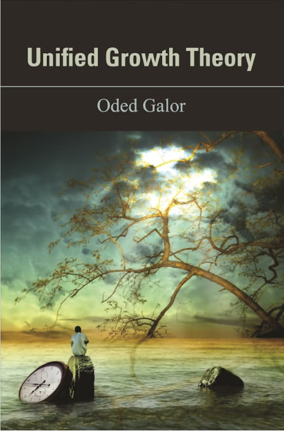
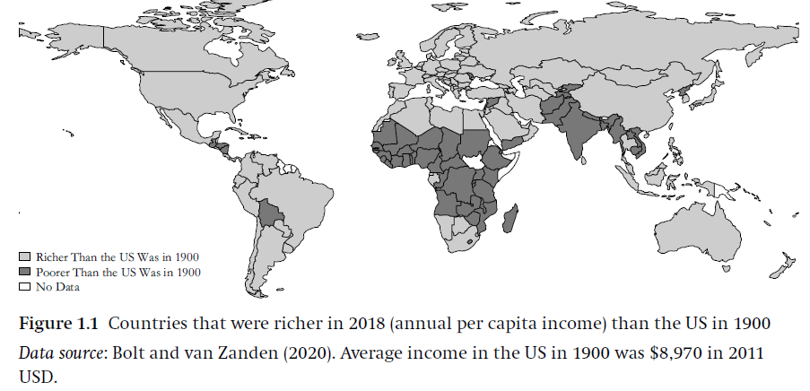
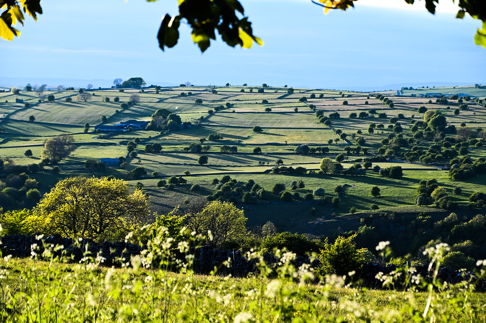
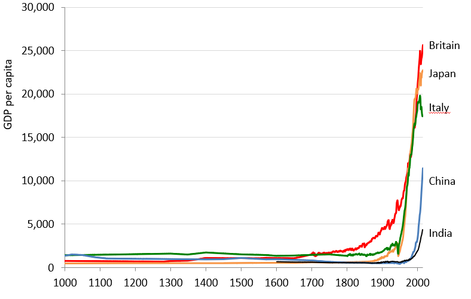
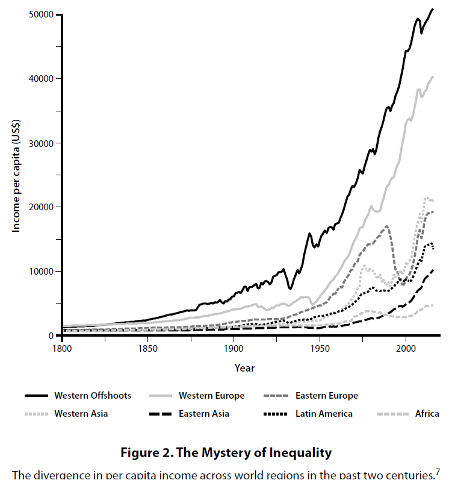
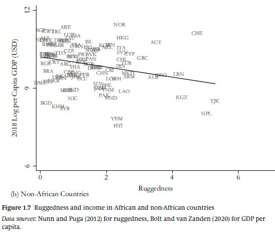
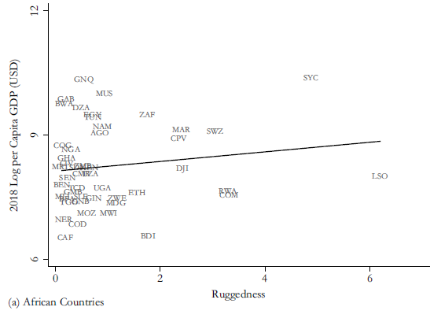
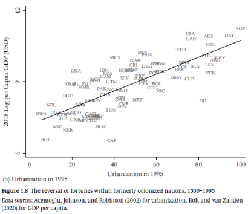
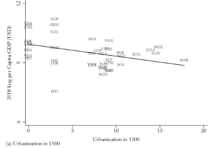

<!--
theme: gaia 
paginate: true
footer: Eco 331: Intro
style: |
  section {font-size: 27px;}

-->


## ECO 331
# Economic History
```
Introduction
```
<br></br>
Jonathan Conning
Spring 2026


---
## Required Texts
- Koyama, Mark, Rubin, Jared, 2022. _How the World Became Rich: The Historical Origins of Economic Growth_. John Wiley & Sons.
- Galor, Oded, 2022. _The Journey of Humanity: The Origins of Wealth and Inequality_. Penguin.
<br></br>


Reasonably priced in e-book, print, and/or audio formats.


---
## Canvas LMS


https://canvas.instructure.com/enroll/Y79KWT
<br></br>
* Syllabus, Reading Schedule
* Threaded Discussions
* Homework and grades
* free

<!-- transition: clockwise -->
---

## Grading


| Activity                               | pct |
| :------------------------------------- | ------- |
| Discussion/Participation               | 35 \%   |
| Midterm                                | 20 \%   |
| Article/Chapter Report                 | 15 \%   |
| Final Exam                             | 30 \%   |


---
<br></br>
<br></br>
**Oded Galor**
Brown University


---


---


<br></br>
<br></br>
**Mark Koyama** (GWU)

**Jared Rubin** (Chapman Univ)


---
## 'Big History' Questions

* How did the world become Rich?
* Why did it take so long?
* Why isn't the whole world rich?

---




---
## Transitions

* The Neolithic Revolution
* Rise and Fall of Feudalism
* Capitalist Transitions
  * The enclosure of lands
  * The rise of cities, Modern States
* Conquest, Colonization, Slavery
* The Industrial Revolution
   * Firms, Technology R&D 
   * Demographic Transition  
  * Latecomers and stragglers.


---


---


---


---
# Causal Mechanisms


* Proximate versus Fundamental Causes
* Causal Relationships vs. Correlations
* Exogenous vs Endogenous

<br></br>

* Can we identify causal relationships?


---

## KR's Explanation Categories
* Did Some Societies Win the Geography Lottery?
* Is it All Just Institutions? 
* Did Culture Make Some Rich and Others Poor?
* Fewer Babies?
* Was it Just a Matter of Colonization and Exploitation?

---

# Next Week

### Tuesday: Introduction
  - OG, "Mysteries of the Human Journey" (1-10) 
  - OG 1 "First Steps," (13-25).
  - KR 1, "Why, When, and How Did the World become rich" (1-16)

<br></br>

### Friday: Is it all Geography?
- OG 10 "The Shadow of Geography" 
- KR 2 "Did Some Societies Win the Geography Lottery" (19-thru 'Mountains..')

---

## Next and every week, due the night before class

- **Two questions**
    - One factual/conceptual 
    - One probing, to take the conversation in interesting directions.
- **Two comments**
    - Agree or disagree, reframe, etc. 
    - Historical observation or trivia

<br></br>  
Can be short or long. Submit via Canvas. Due 11pm the night before class.

---
## Introductions

 
---


## Chapter 1


### Why, When, and How 
### Did the World Become Rich?



---
<!-- footer: "" -->



 
- What does GDP measure?  
Same as income?
- Methods
  - GDP stats and deflators
  - PPP
  - Consumption baskets
  - Correlates
    - Height
    - Life Expectancy
- Are these the right measures?
  - what left out?
---
# Growth

* Does growth bring other values?
  * What other values?  
  * Tradeoffs?
* Growth vs Development
* Sustained economic growth
   * Efflorvescences
   * Shrinkages

---
# KR's list of theories
* Geography
* Institutions and Politics
* Culture
* Demographics
* Colonizationand Exploitation 


---

# Non-monocausal
# Contingent

Identification challenges

---




---



