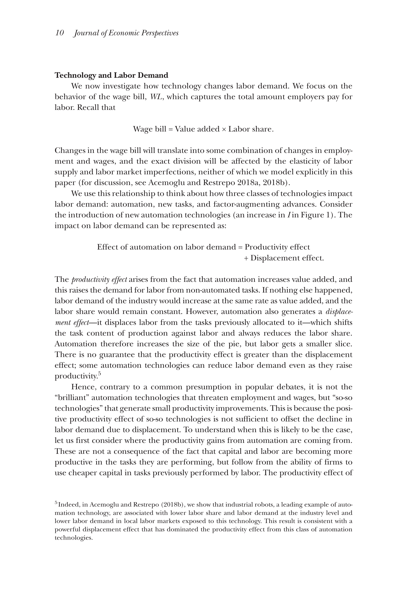

<!--
theme: gaia 
paginate: true
footer: Eco 331: Automation and Labor
style: |
  section {font-size: 26px;}
-->

<!-- footer: "" -->

# ECO 331
## Economic History

```
Automation, Technology, and Labor Demand
```
Jonathan Conning
Spring 2026
<br></br>


---
## Creative Destruction

- Does technological change destroy jobs or create them?
- The Industrial Revolution brought massive disruption.
- Artisans (like the Luddites) protested the mechanization of their livelihoods.
- Yet, over the 19th and 20th centuries, wages and employment grew rapidly.
- How do we reconcile this? And is today's AI "different"?

---
## Automation of Manufacturing (1899)
- *Atack, Margo, and Rhode (2019)* use the 1899 "Hand and Machine Labor" study.
- Incredibly detailed observation of how goods were produced before and after factory mechanization.
- Focused on the **task level**: what specifically does a worker do, and how long does it take?
- Example: Making 100 pairs of medium-grade shoes.

---

## The Shift to Extreme Specialization

- Under **hand production**: An artisan performed most tasks. 
- The median number of tasks per worker was 2 (often much more for master craftsmen).
- Under **machine production**: The median tasks per worker fell to **1**.
- Workers were intensely specialized. 

---
## Productivity Gains from Machine Labor

- On average, machine labor reduced total production time by a **factor of seven**.
- This massive productivity boost came primarily from **steam power**.
- Steam powered the cutting, trimming, and shaping machines that sped up individual tasks.
- But it wasn't just doing the same things faster—it reorganized the work entirely.

---

## Task Transitions

- Mechanization involved subdividing complex tasks and consolidating others.
- Most importantly, it created **new tasks**.
- Fully one-third of tasks in machine production were entirely new!
- Examples: maintaining steam engines, quality inspection, and foreman supervision.

---
## The Human Capital Impact ("Deskilling")

- Pre-industrial era: "Human capital" meant learning to make a shoe from start to finish.
- Factory era: Workers only needed to learn one specific task on an assembly line.
- This skill could be picked up quickly on the job.
- **Result:** This allowed a rapid, massive expansion of the manufacturing labor force. 

---
## Why Did Employment Grow?

- If machines were so efficient, why didn't factories just fire everyone?
- To understand this, we turn to the theoretical framework of *Acemoglu & Restrepo (2019)*.
- The traditional "black box" model of production (where capital and labor are just inputs to a formula) doesn't capture what actually happens.

---
## The Task-Based Model of Production

- Production is modeled as a **continuum of discrete tasks**.
- Some tasks can only be done by humans. Some can be done by capital (machines).
- **Automation** occurs when capital replaces labor in a task.
- This creates a **Displacement Effect**: Labor is pushed out of its traditional roles, decreasing the labor share of value.

---

## Counterbalancing Forces

If automation displaces labor, what saves it?
1. **Productivity Effect:** Machines lower costs, which lowers prices and increases total output. This expands demand for the remaining human tasks.
2. **Reinstatement Effect:** Technology creates entirely **new tasks** where humans have a comparative advantage.

---
## Reinstatement: Creating New Jobs

- Automation has always been accompanied by the creation of new roles.
- 19th Century: Engineers, machinists, repairmen, managers.
- 20th Century: Clerical workers, software developers, analysts.
- *Net Impact:* As long as the Productivity and Reinstatement effects outweigh the Displacement effect, labor demand grows!

---
## Evaluating the Modern Era

- Does this historical pattern still hold true today?
- Acemoglu & Restrepo compare two distinct periods:
  - **The Golden Age:** 1947–1987
  - **The Modern Era:** 1987–2017

---

## The Golden Age (1947–1987)

- Rapid automation displaced many workers.
- But it was accompanied by an equally strong **reinstatement effect** (new tasks).
- The net effect on the "task content of production" was zero.
- Wages and employment grew steadily alongside productivity.

---

## The Modern Era (1987–2017)

- The story changes significantly in recent decades.
- **Displacement** continued (or accelerated) due to software and robotics.
- But the **Reinstatement Effect** (creation of new tasks for labor) slowed down dramatically.
- The result is a shift *against* labor, causing stagnant wage growth and a falling labor share.

---
## Is "This Time" Different?

- Historically, the industrial model of intense specialization paid off.
- Today, being highly specialized in one routine task is a major risk, because AI and robots are increasingly capable of automating specialized roles.
- Modern automation might require a new human capital strategy: 
  - A "suite of diverse, relatively uncorrelated skills" as insurance against displacement.
  - A reversal of the 19th-century trend toward extreme specialization.

---
## Summary

- The Industrial Revolution fundamentally reorganized how tasks were allocated to labor and capital.
- While machines displaced artisans, new tasks and rising productivity drove massive labor demand.
- Today's wave of automation may be different if we fail to create new, high-productivity tasks for human workers.
