<!--
theme: gaia 
paginate: true
footer: Eco 331: Industrial Revolution
style: |
  section {font-size: 26px;}
-->


<!-- footer: "" -->


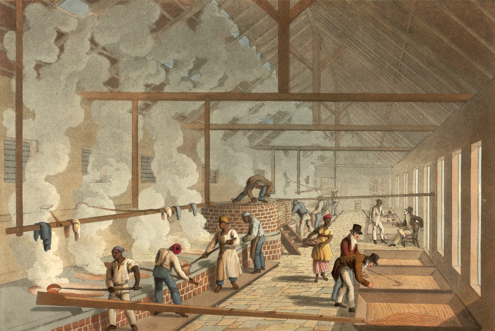
### ECO 331
## Economic History

```
The Atlantic Economy, Slavery and Colonization
```
Jonathan Conning
Spring 2023
<br></br>

---
### read 4/14

- Solow, Barbara, 1993. "Slavery and Colonization," Chapter 1 in *Slavery and the Rise of the Atlantic System*. Cambridge University Press. [PDF](https://drive.google.com/file/d/1eq6wZ9QlW77dBg46yDFD0swRFFWcZ1TX/view?usp=sharing)

### read 4/18

- KR 6 "Was it Just a matter of Colonization and Exploitation?"
- Inikori, J (2007) “Africa and the globalization process: Western Africa, 1450–1850” *Journal of Global History*, 2, pp. 63-86. (read pages 79-84, skim the rest) [PDF](https://drive.google.com/file/d/1FVPGnZxyrXcSz_TzStInGiW81YSRbD6l/view?usp=sharing) 

---
## A large part of the World Was colonized by just a few
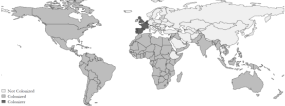


---
- “Opening of the Atlantic” a key turning point in global economic history.
- England, France, Spain, Portugal, Netherlands, Russia colonized a large fraction of the world's landmass.

- What role did this play in Europe becoming rich?
- In other parts of the world remaining or becoming poor?
- How did North America develop?

---
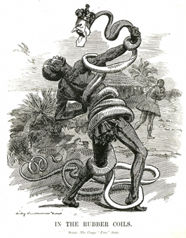
### Legacies of Colonialism
- The colonial powers exploited the natural resources of their colonies
  - Precious metals (South America) 
  - Rubber (Congo)
  - Sugar (Caribbean, Brazil)
  - Spices and sugar (Indonesia)
  - Oil (Middle East)
  - Slaves
- Cheap inputs and labor from the colonies allowed for dramatic economic expansion in Western Europe
- The legacy of colonization is still with us in many respects. But was it responsible for modern economic growth?

---
### How Colonization mattered
- New World crops changed Eurasian diets
Nunn and Qian (2010): potato explains one-quarter of Old World population growth/urbanization 1700-1900
- Pomeranz (2000): key to Europe’s rise was new land (“ghost acreage”) in the New World, relieved population pressures and brought in new natural resources
- Slave/coerced labor thought to play a role in Britain’s industrialization via cotton and sugar production

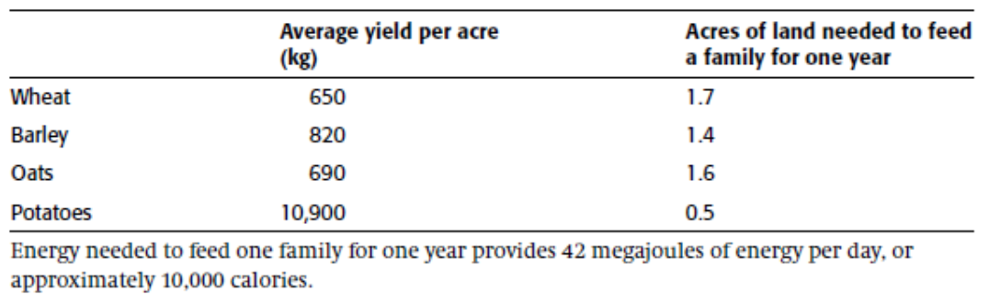

---

## Slavery in Americas and the Caribbean
- 1440s Portuguese explore and establish African slave trading posts
- 15th C Spanish and Portuguese colonization of Caribbean and Americas
- 1600s Dutch, French, English Caribbean 
- 1619 First slave captives to Jamestown colony
- - Cheasapeake region, sugar, tobacco, rice
- 1700s largest number of slaves transported in this century
- 1780s Peak of slave trade. Half transported on British ships.
- 1807 Great Britain abolishes slave trade with its colonies.
- 1808 US Congress bans importation of slaves (smuggling continues)
- British Slave abolition act of 1834 frees slaves in British colonies
- 1863 Emancipation Proclamation frees slaves in US
- 1888 Brazil abolishes slavery 

---
### The Slave Trade
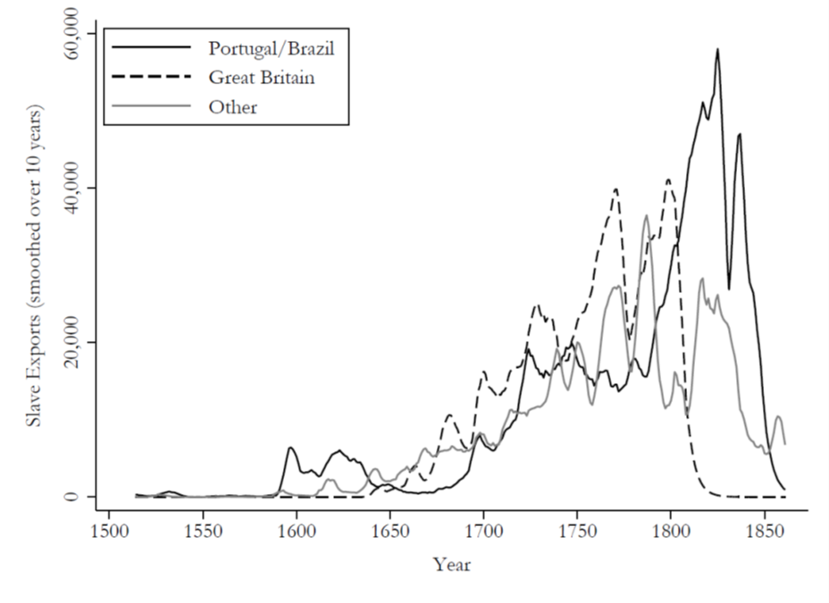
- most odious aspect of colonization
- Colonial powers brought over 12 million slaves to the New World
- By 1850, Africa’s population only half what it would have been had slave trades never taken place

---

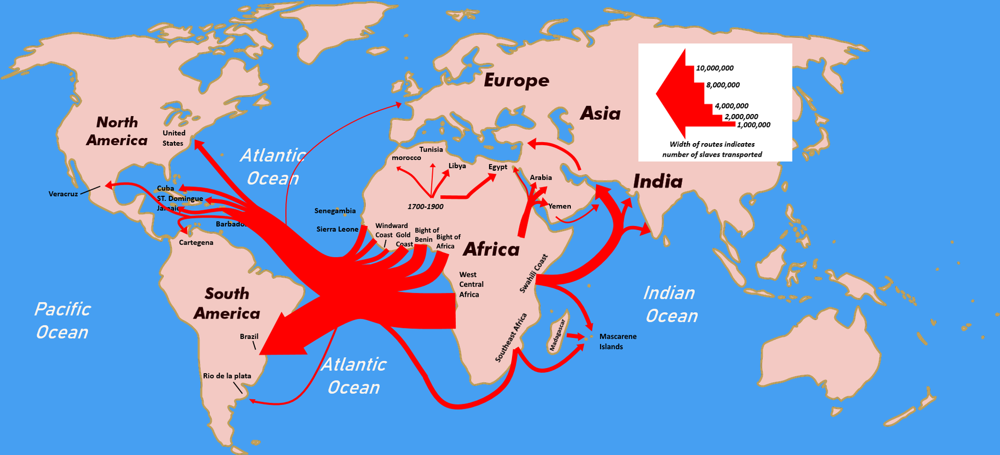

---
## Triangular Trade
- Britain to West African Coast
- West African Coast to Americas
- Carribbean and Americas to Britain

---
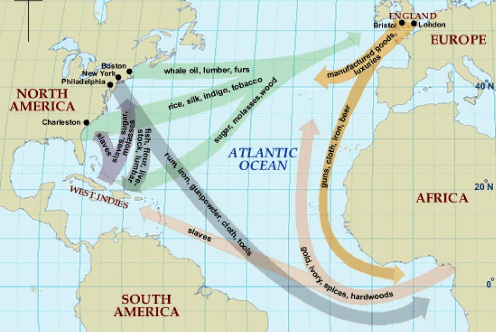

---
## Barbara Solow

- Conventional Historical Accounts of rise of North America
  - Smithian Vent-for-surplus and commercialization
  - Difference in factor endowments
    - immigration and convergence
    - over-time, growing specialization and eventual industrialization

- This leaves several puzzles
  - Settlement was late and slow. 
  - Most migrants were indentured servants and slaves
  - Until early 1800s more African arrivals than Europeans
  - 2/3 to Cheseapeake.  2/3 of Whites, 19/20 Africans
  - Southern Slavery vs. Northern Free Men/Soil ideology. Civil War.

--- 
### The Labor Supply Problem and Political Economy
- Early political economists (e.g. Sir James Steuart, Sir William Petty, Richard Cantillon and the Physiocrats, Edward G. Wakefield) argued that the labor supply/discipline problem was key to understanding the economic development.
- Elites frequently decried 'sloth and indolence' and legislated. Poor Law Reform of 1834 criminalize 'idleness' and 'vagrancy.' Workhouses.
- J. Bentham's (known for utilitarianism and defense of women and animal rights) also 1798 Panopticon design (surveillance at prison and factories) and workhouse designs "whole body of burdensome poor." 
  - Recommended that children start work at 4 rather than 14). To be spared the loss of those “ten precious years in which nothing is done! Nothing for industry! Nothing for improvement, moral or intellectual!”

- Adam Smith and Ricardo's work became prominent more than a generation after 1776 publication, when Free Trade ideology became popular in the mid- and late 19C, after Britain established as empire and world's largest manufacturer.


---

In mid 18th C America, Benjamin Franklin had argued

>It is impossible that manufactures should succeed in America from the high price of labour . This is occasioned by the great demand of labour for agriculture . A manufacturer from Europe will turn to labour of other kinds if he finds more can be got by it , and he finds some emploiments [ sic ] so profitable that he can lay up enough money to buy fifty acres of land to the culture of which he is irresistibly tempted by the independence in which it places him.

Reflects arguments of early political economists and anticipates Wakefield.

---
## Relative Factor Endowments and Factor Prices

- Factor endowments (factor price): 
  - Labor supply $\bar L$ (wage rate $w$ per unit labor)
  - Land endowment $\bar T$ (rental rate $r$ per unit land)
  
---

- Production Techology on farm $i$
$$
Q_i = A \cdot T_i^\alpha L_i^{1-\alpha}
$$

- Average Product of labor:  
    $$APL_i = \frac{Q_i}{L_i} \hspace{1cm} APT_i = \frac{Q_i}{T_i}$$

- Marginal Products can be written:

$$MPL_i = (1-\alpha) \cdot \frac{Q_i}{L_i} \hspace{1cm} MPT_i = \alpha \cdot \frac{Q_i}{T_i}$$

---
###### Firm profit-maximization
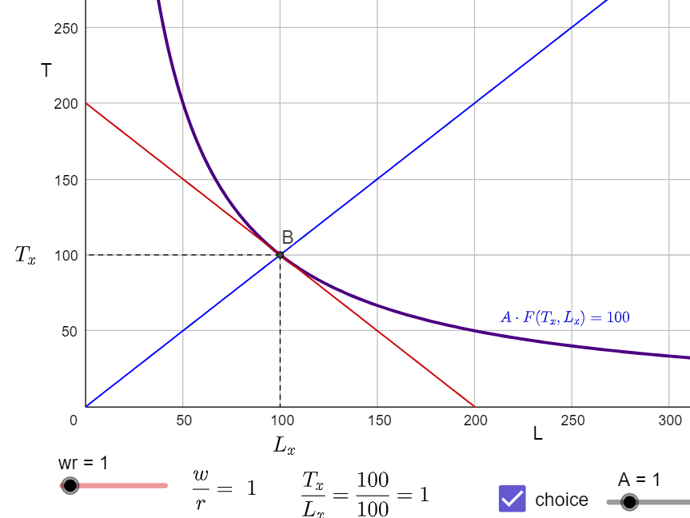
Hire each factor until the marginal value product equals the factor price:

$$
w = P \cdot MPL_i
$$

$$
r = P \cdot MPT_i
$$

Cost-minimizing technique $T_i/L_i$ responds to $w/r$:

$$
\frac{w}{r} = \frac{MPL_i}{MPT_i} = \frac{1-\alpha}{\alpha} \cdot \frac{T_i}{L_i}
$$

---
## Economywide Equilibrium
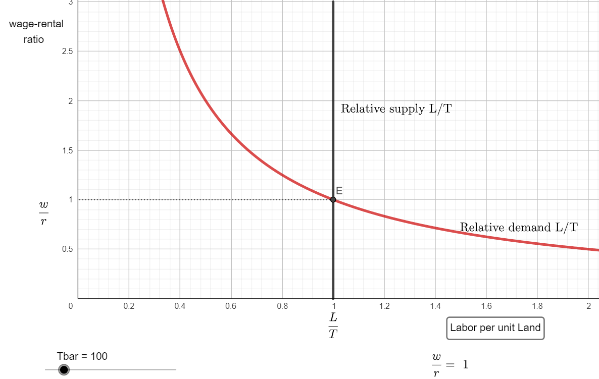
$$\frac{w}{r} = \frac{1-\alpha}{\alpha} \cdot \frac{T}{L}$$


#### Demand for Labor relative to Land:


$$\frac{L}{T} =  \frac{1-\alpha}{\alpha} \cdot \frac{r}{w}$$


Intuitively, when $w/r$ is low, relative demand for labor is high.


What determines $w/r$?

---

#### Relative Factor Supply
- Relative factor supply: $\frac{\bar L}{\bar T}$
  - e.g.  $\bar T=\bar L=100$,  $\frac{\bar L}{\bar T}=1$


Equilibrium $w/r$ where relative labor demand equals relative labor supply.

---

- Wages will be low relative to rents in labor abundant (land scarce) areas.
  - e.g. Europe in the 19th Century

- Wages will be high relative to rents in labor scarce (land abundant) areas.
  - e.g. North America in the 19th Century
  
- Markets or Politics?  When might landlords use politics and force to change/establish property rights and market outcomes?

  - When land is scarce, efforts to enclose (exclusive control of land)
  - When labor is scarce, efforts to restrict mobility (e.g. serfdom, slavery)
  

---

###### Evsey Domar (1970) 

- Why did Russian frontier expansion in 16th C (rise in land/person) lead to imposition of new serfdom?
- While Black Death in 14th C West (also rise in land/person) lead to collapse of old serfdom?

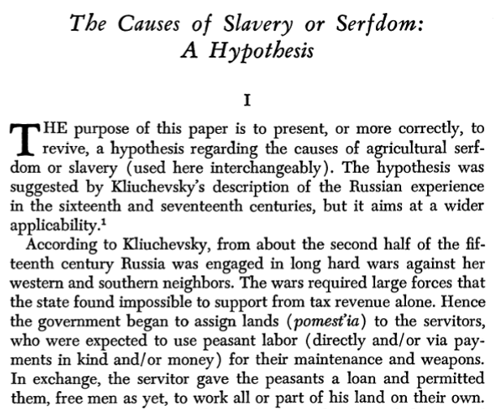

---
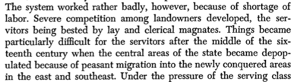
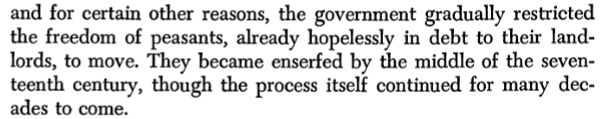

---
#### Of interest

[Paul Krugman's](https://en.wikipedia.org/wiki/Paul_Krugman) short essay: ["Why I am an Economist (sigh)"](http://web.mit.edu/krugman/www/Serfdom.htm) interprets Domar's paper.


>Russia imposed strict restrictions on the mobility of peasants from the late 16th century onward, precisely because the availability of rich new farmland on the expanding frontier would otherwise have increased their bargaining power against landlords. (The frontier expansion itself was probably the result of the growing effectiveness of firearms, which turned the military balance against the steppe nomads; so gunpowder, which contributed to the rise of the bourgeoisie in the West, created serfdom in the East). And, of course, slavery - which, along with serfdom, had died out in the West during the labor-abundant high Middle Ages - was reintroduced in the land-abundant conditions of the New World.

>On the other hand, of course, it has not always worked that way. England's peasants were not reenserfed after the Black Death drove up their wages; attempts to build a system of indentured white servitude in America failed; slavery was abolished; and in the modern world wages do more or less reflect marginal productivity.

---
#### Effect of Frontier expansion:  $\bar T \uparrow$ 


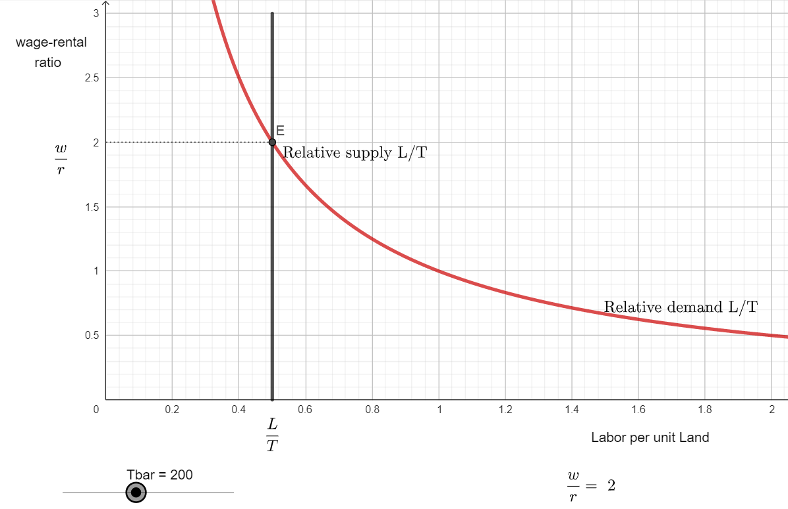

---
## Domar's Trilemma

- An economy can have only TWO of the following three things at the same time:
   - Free Land
   - Free Labor
   - Landlord Rentier class

 - Possible combinations: 
   - Free Land + Free Labor (no landlord class)
   - Free Land + Landlord Rentier class  (unfree labor)  --  seize PRs over labor.
   - Free Labor + Landlord class (all land enclosed)  -- seize PRs over land.

<br></br>
Note: 'free land' need not literally free -- broadly means labor has access to land.

---
## Land abundance 1
### Free Land + Free Labor  (no landlord rentier class)
  - Free land: Open frontier for homesteading and squatting
  - Free labor: No restrictions on labor mobility
  - Landlords cannot earn land rents (no rentier class)
    - land rents low because land abundant
    - labor expensive because labor scarce (landlords would have to pay a wage equal to what labor can earn establishing their own farms)


**Examples:**
  - West Europe after Black Death
  - Northern USA in early 19th C. Open frontier, family farming. 
  - Free peasantries in Africa or Europe in different time periods
  


---
## Land abundance 2
### Free Land + Landord Class (labor mobility restricted)
  - With an open frontier Landlords must restrict labor mobility (serfdom, slavery, or restrict labor from access to land)
  - Landlords then keep wages low and capture rents.

 
**Examples:***
  - American South and African slavery.
  - Serfdom in Russia 

<br></br>
- Hence Free Land (frontier) may lead to either free labor or labor coercion.
- Which depends on relative strength of landlords and laborers.

---
### Free Labor + Landlord Class (all land enclosed)
- Frontier becomes 'closed' once all land becomes enclosed and exclusively owned.
- Those without access to land now 'freely' sell their labor.
- If Landlords control most land they capture rents from ownership of land.

**Examples:***
  - English landlords after enclosures
  - The developed world today

These examples differ in how unequal the distribution of land is.

---
Even where outright slavery or sefdom are outlawed, dominant groups have attempted to limit labor's mobility as well as access to land.

Two extreme examples:
  
  - post-bellum US South:
    - Black Codes enacted soon after Abolition, restricted property ownership and limited labor mobility.  
  - South Africa:
    - Natives Land Act of 1913 dismantled African peasantry (seizing lands and limiting tenancies) to create a low-wage labor reserve for mines and white owned farms.
    - Apartheid laws > 1948 further established segregation and regulated labor mobility.

---

### Edward Gibbon Wakefield
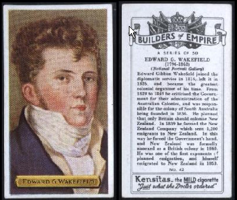
- Writing in early 19th century, after British abolition of slave trade.
- Concerned that, absent coercion, colonization efforts in frontier colonies would be stymied by problem of maintaining 'constancy of labor' to large farms and other enterprises.
- Proposed solution: limit immigrants access to land via minimum land price.
- Shaped British settlement schemes in New Zealand and Australia.
- In Capital Vol I, Marx points to Wakefield for inadvertently demonstrating why capitalist system cannot thrive where workers have access to land and other means of production.
  
---

 >“[If] all members of the society are supposed to possess equal portions of capital... no man would have a motive for accumulating more capital than he could use with his own hands. This is to some extent the case in new American settlements, where a passion for owning land prevents the existence of a class of labourers for hire.” 

- Wakefield 'Systematic Colonization' and Colonial Reform policy
  - Sold as a way to relieve unemployment in Britain (which though industrializing had fast growing population and at times deplorable working conditions and poverty/vagrancy) -- Remember Engel's Pause.
  - Government support for organized settlement and colonization schemes in Australia and New Zealand. 

---
### Why no slavery in the North?
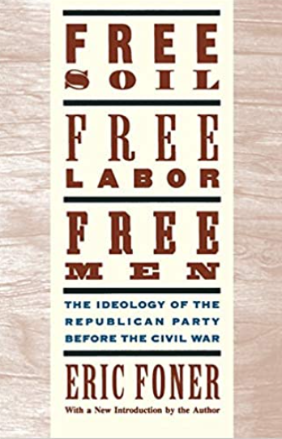
- Grain crops based on family labor, history of settlement meant no tight-knit Virginia aristocracy.
- By eve of civil war, Republican party created around ideas of **Free Soil** opposed the expansion of slavery into new territories and in favor of Federal lands cheaply to settlers.  Homestead Acts, 1862 and 1866. Settlers could claim up to 160 acres of public land.
- The **Free Labor** ideology emphasized importance of free labor, as opposed to slave labor, as cornerstone of American democracy and economic opportunity.  

---
### Why Slavery in the South?
- Bacon's Rebellion (1676) in Virginia:  armed rebellion of white indentured servants, landless former servants, and African slaves against the colonial government and its perceived favoritism for wealthy planters. Rebels also wanted more frontier expansion (which created conflict with Native Americans).
- Colonial response led to shift away from indentured servants to African slave labor, seen as more easily controlled. Development of strict racial hierarchies and plantation system.
- Several plantation Crops pith some economies of scale, easier to introduce chain gang and plantation. 
---

## Did Slavery Profits lead to Industrial Revolution?
- Eric Williams (1944): sugar plantations in the West Indies supplied capital for British industry and calories for workers.
- Counter-argument by Engerman and others: slave trade and plantation profits not large relative to the fast growing British economy.  Also, hard to prove capital flows.
- A very recent empirical paper mounts an important counter-counter-argument...  

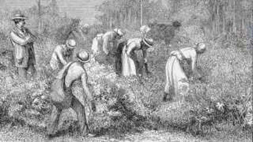

---
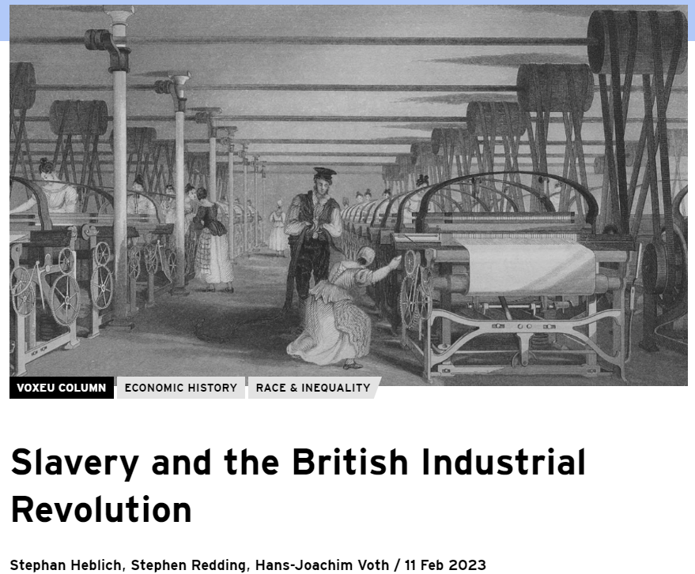

**Important Recent paper:**
> Heblich, S., Redding, S.J., Voth, H.-J., 2022. [Slavery and the British Industrial Revolution](https://doi.org/10.3386/w30451). WP. 

- [Shorter blog summary](https://cepr.org/voxeu/columns/slavery-and-british-industrial-revolution)
- [VoxTalks podcast interviews authors](https://cepr.org/multimedia/slavery-and-industrial-revolution)


---
### Slavery and the Industrial Revolution: Research Design

- Parliament compensated slave owners for 'loss of property' in 1833.
- Database of 25K compensated. £20 million (~£108 bn today)
  - Shows slavers residence in Britain, slaves owned, etc.
  - Can trace family wealth accumulation in areas of Britain.
- Empirical challenges: 
  - perhaps wealthy enter slave trade (so not causal)
  - how measure accumulation primarily due to slave trade?
  - No regional GDP data for Britain before 1830s. 
- Empirical strategies:
  - Trace family histories to capture accumulation due to slave trade + holding.
  - Use predicted ('instrumented') wealth to capture how shifts in accumulation affect outcomes.  Instrument: weather and slave voyage losses. 
  
--- 

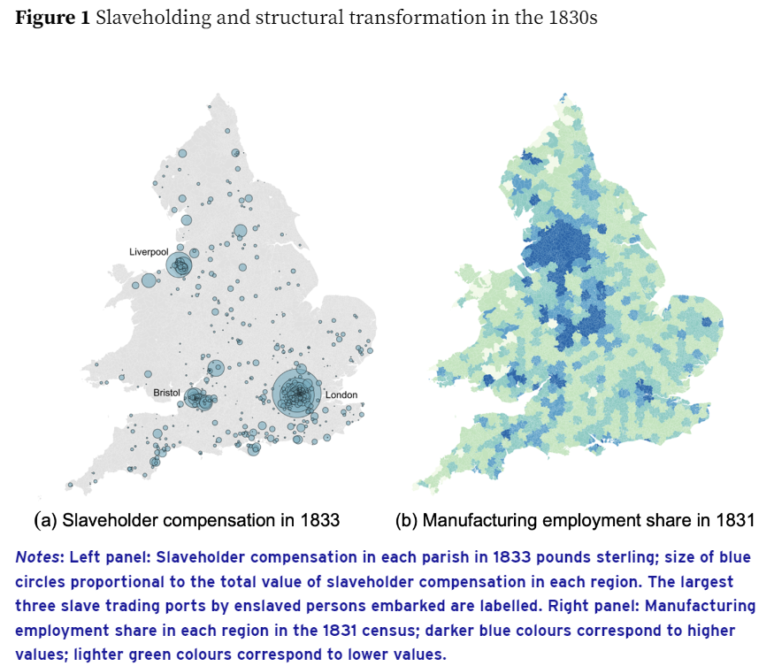

---

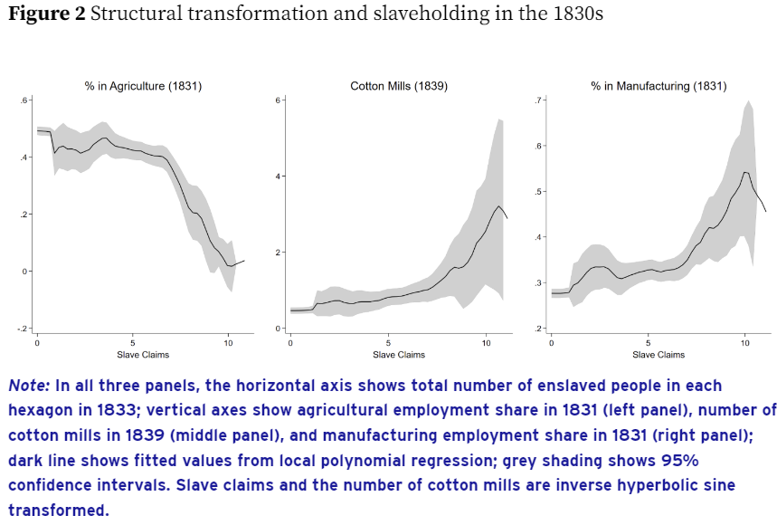

---

### Slavery and the Industrial Revolution: Results
- Slavery increased Britain aggregate GDP at least 3.5 percent (a decade of growth)
- Shaped the geography of industrialization
  - Locations w/ heaviest slave investments 40% higher GDP.
  - More structural transformation. Helps explain rise of North of England >1750.  
  - Could this have been determining?  Might the IR have stalled, might population growth returned to Malthusian era?  Remember Engel's pause.

- Why not similar effect in Spain/Portugal?
  - Institutions/seeds for IR.

- Conclusion:
  - "Slavery wealth accelerated Britain's industrial revolution." 
  Possibly in a determining way.

---

  ## Abolition and the labor systems that followed
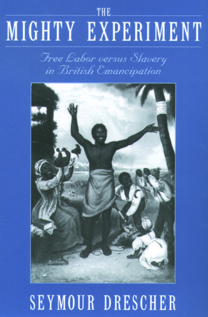
- British abolished slave trade 1807, slavery itself in 1834.
- Slavery abolished USA 1863, Serfdom in Russia 1861, Brazil 1888.
- Was slavery abolished for economic reasons or moral reasons?
- Fogel+Engerman (1974) and others showed American slavery economically profitable on eve of civil war. Drescher: primarily moral and political reasons.  
- Political economists argued free labor was more efficient.

---
## The "Dismal Science"
- Since slavery was a large and profitable industry, abolitionists often appealed to work of classical economists (Smith, Ricardo, Mill) to argue that free labor would lead to more efficient allocations.

- Thomas Carlyle (Scottish historian) criticized market economic theories of classical economists (Smith, Ricardo, Mill). Labeled economics the "dismal science" for advocating emancipation and imaginging a society ruled by markets and individuals primarily motivated by self-interest. Saw this as undermining social order and paternalistic hiearchical relationships (built upon racist categories) which he argued offered a more 'optimistic' future.
- [Why Economics Is Really Called 'the Dismal Science'](https://www.theatlantic.com/business/archive/2013/12/why-economics-is-really-called-the-dismal-science/282454/), *The Atlantic*


---
  
#### Labor markets following abolition
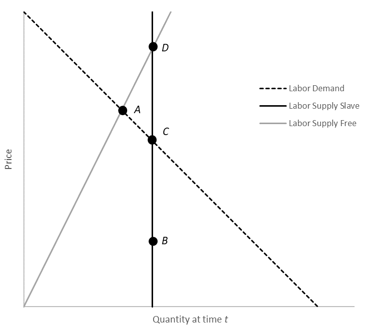
- Downward sloping demand for labor
- **Slavery** (coerced labor) forced to inelastically supply of labor at low subsistence wage **B**.
  - Market price for slaves at **C**  
  (BC = economic rent coercion) 
- **Free labor:** Labor supply more elastic (workers outside options).
  - Market should clear at higher wage **A** and lower efficient voluntary labor supply and output.
  
  
---
#### Labor markets following abolition
- Wherever slavery was abolished landlord often then engaged in efforts to limit the now freed slaves: 
  - mobility restrictions (e.g. vagrancy laws)
  - limit competition amongst landlords
  - Limit access to land (e.g. restrictions on ownership)
  - terror and 'paternalistic' protection

- New 'extractive' institutions
- US sharecropping, Brazil 'peonage', Labor-service tenancies in LAC.
 
---
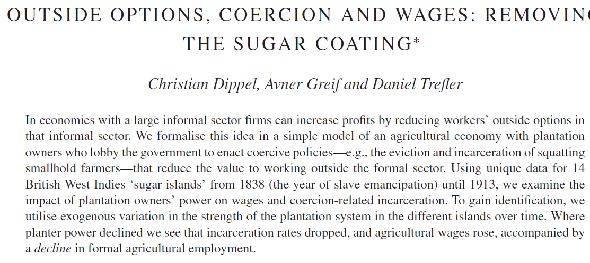

[blog summary](https://cepr.org/voxeu/columns/labour-coercion-and-outside-options)

---
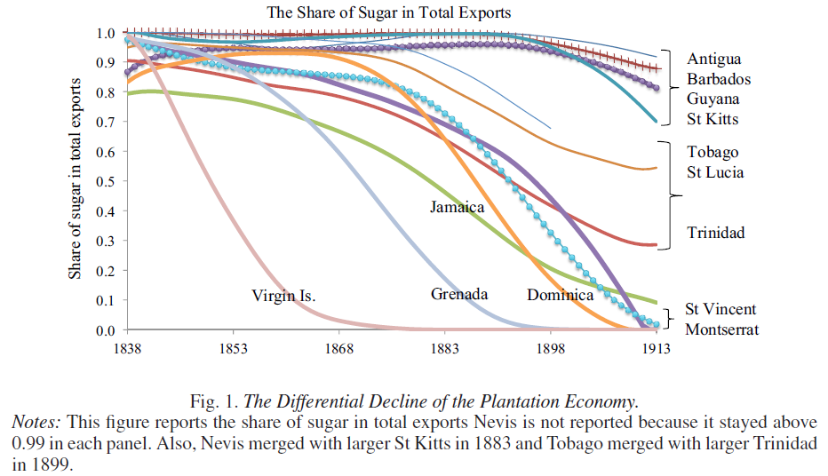


---

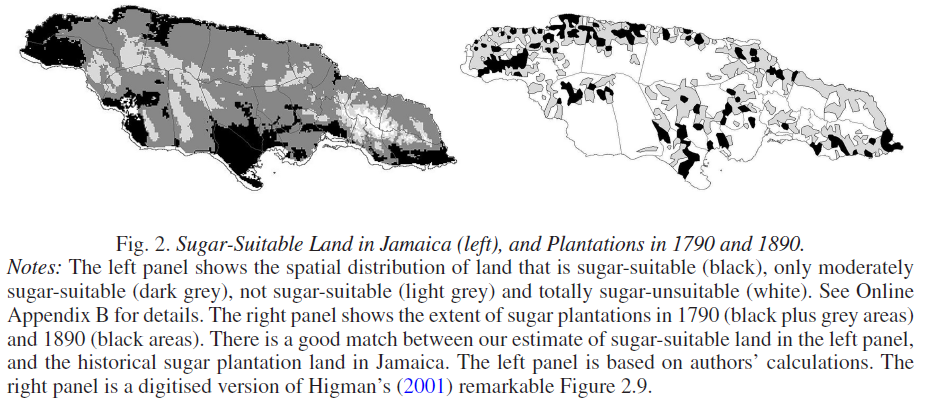

---

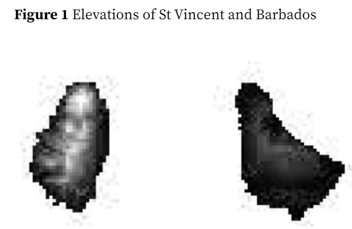

---
## Geography, Institutions and Persistence
- 65 million years ago much of the southern US under water. 
- Shoreline nutritious organic debris left as sea departed
- thick, rich 'black soil' layer runs from Louisiana to South Carolina.
- Cotton thrives in this soil.


---

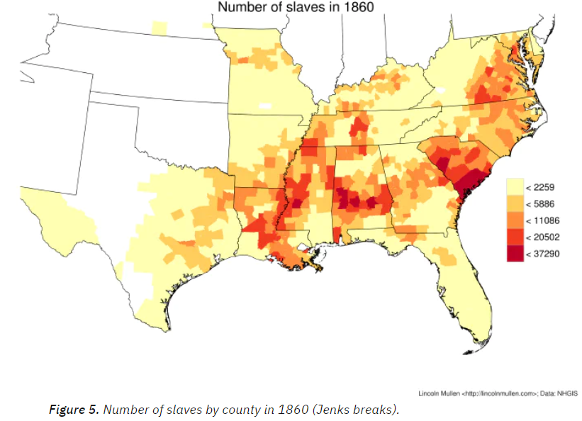


---


---
## Cotton Black Belt
- Refers originally to rich black soils
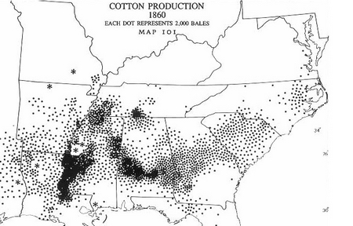


---
## McCain vs Obama vote 2008
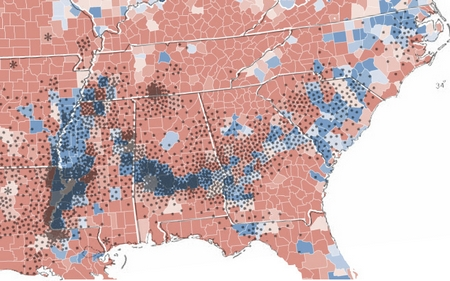

