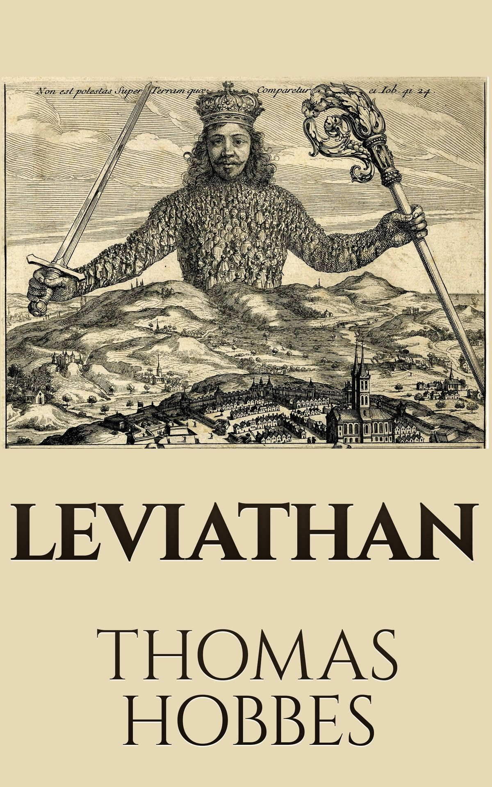
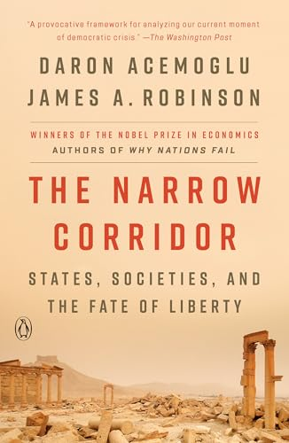
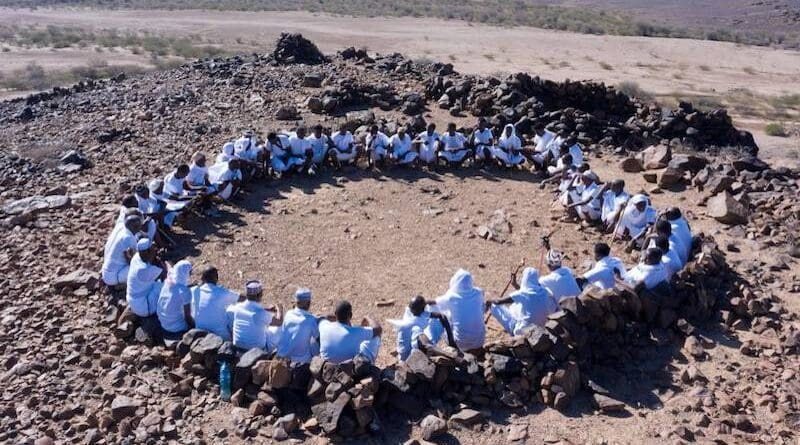
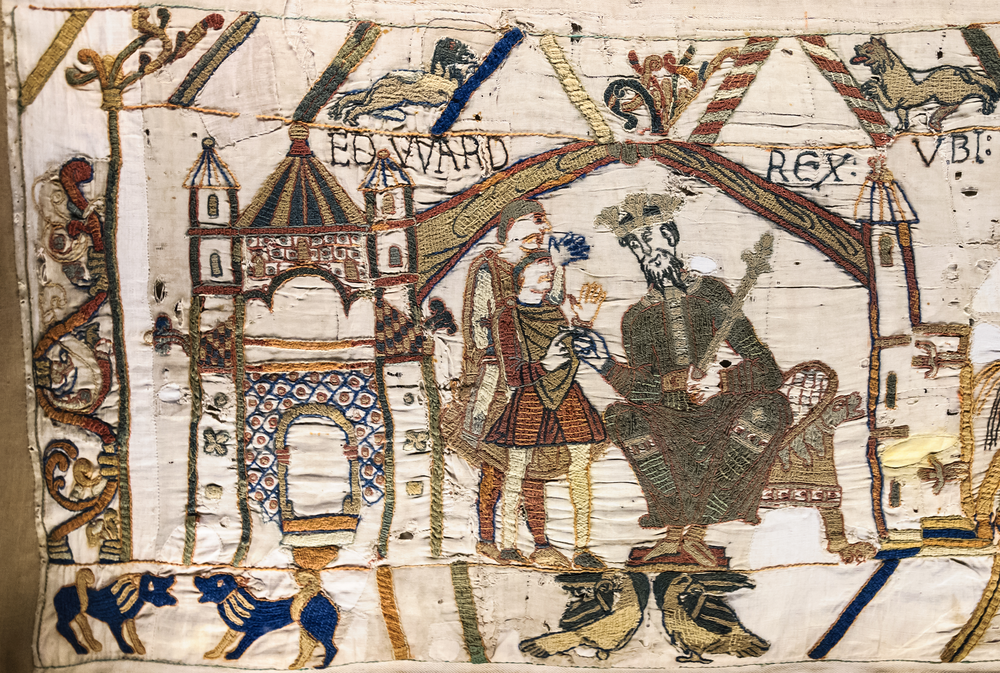
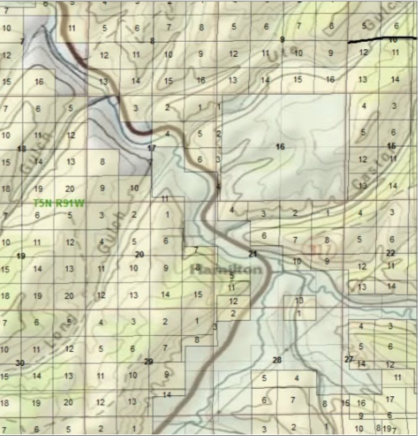
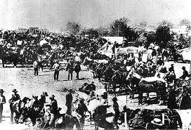
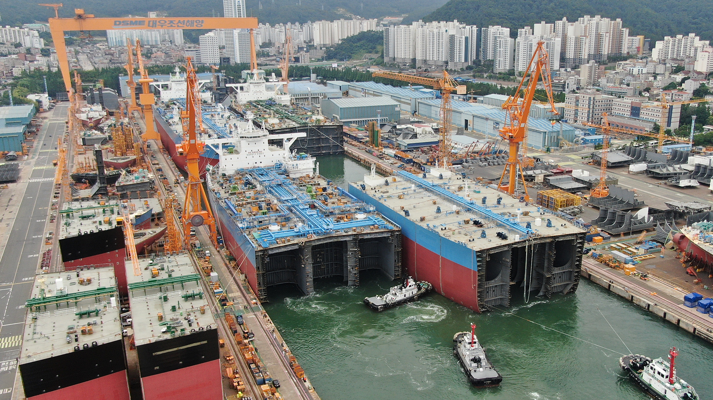
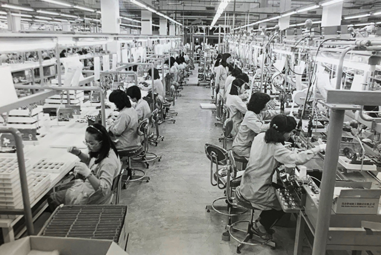
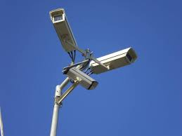
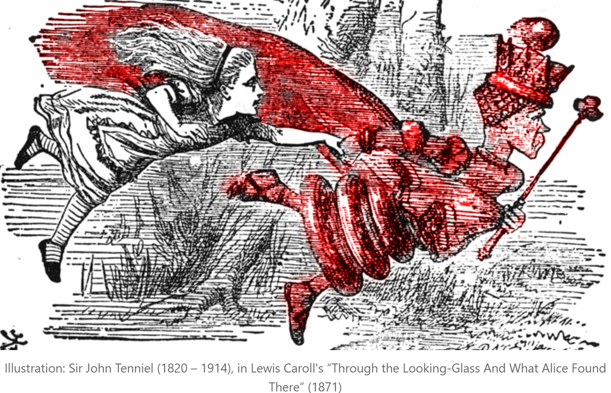

<!--
theme: gaia 
paginate: true
footer: ""
style: |
  section {font-size: 27px;}

-->

## ECO 331
# Economic History

```
Liberty, The State, and Civil Society
```
Jonathan Conning
Spring 2026
<br></br>


---

## Institutional frameworks

- Inclusive versus extractive institutions
- The role of the state and civil society
- Acemoglu and Robinson's *The Narrow Corridor* framework

---



## State and Civil Society

- The State: organizational capacity to enforce laws, resolve disputes, provide public goods
- Civil Society: collective action, norms, and ordinary citizens holding elites accountable
- Tensions between state power and society's ability to constrain it

---



## The Narrow Corridor

- **Absent Leviathan**: Civil society without a strong state
- **Despotic Leviathan**: Strong state without civil society constraints. Captured by elites.
<br>
- **Liberty** flourishes in the narrow corridor where free from both.
<br>
- **Shackled Leviathan**: The "narrow corridor" where state capacity and civil society balance each other.
- The "Red Queen" effect: state and society must continuously evolve together (to avoid capture or anarchy).

---




## Absent Leviathan: Somalia

- **Centralized State is absent**: Lacks the capacity to enforce broad laws, guarantee property rights, or provide public goods.
- **Civil Society is strong**: Complex clan structures and customary law (*Xeer*) regulate behavior and resolve disputes.
- Lack of state capacity prevents the formation of inclusive institutions needed for broader economic growth.

---

## The Cage of Norms

- In the absence of a state, societies rely on intense social customs and kinship networks to maintain order.
- **Egalitarian but Rigid:** Many such norms aim to prevent the rise of centralized powers, keeping society egalitarian.
- However, this creates a "cage" that severely restricts individual liberty and stifles innovation, as deviating from the norm is punished.
- While it prevents despotism, the Absent Leviathan is unable to coordinate large-scale projects or achieve sustained economic growth.

---

## The Shackled Leviathan

- **Norman Conquest 1066**. Despotic Norman state invades England, replacing its elites.
- **Civil Society:** England had deep-rooted traditions of common law and local assemblies (the *Witan* and moot courts).
- **Concession:** William the Conqueror, facing resistance, had to reconfirm existing Anglo-Saxon law codes.
- **The Result:** Despotic state was "shackled;" forced to operate within constraints of civil society.
- **Magna Carta 1215:** Further limits monarch's power.



---



### USA: Establishing Economic Property Rights

- The American West and the problem of state capacity
- The US government held legal rights but lacked economic property rights over vast territories
- Military enforcement was too costly or impossible
- Strongly organized civil society (e.g. squatters claims clubs) and private firms helped establish property rights and extend state control.

---



## The Homestead Act and Railroad Grants

- A strategy of giving away land to citizens and private firms
- The goal: rapidly populate the frontier to establish sovereignty
- Empowering civil society and private enterprise to achieve state objectives

---


## Land Abundance and Institutions

- Recall Domar's Trilemma: free land often leads to coerced labor (serfdom, slavery)
- The US avoided latifundia by distributing small land plots to millions
- Fostered decentralized wealth and inclusive institutions rather than a land-owning aristocracy

---

## The Evolution of State Capacity

- **Early States & Extraction:** Often emerged through coercion and taxation (James Scott), while land abundance drove elite coercion (Evsey Domar).
- **Stateless Societies:** Historically common as populations actively evaded state coercion.
- **The Cost of State Failure:** Robinson argues that the failure to build an *effective* centralized state is a primary cause of modern underdevelopment.
- **The Modern Shift:** To achieve catch-up growth, states must transition from pure extraction to *catalyzing development*.

---

## Historical Extractive Institutions

- The Atlantic Economy and colonial extraction
- States or elites suppressing civil society to maximize rent extraction
- Slavery and the plantation economy as examples of despotic, unconstrained power

---

## The State in Modern Catch-Up Growth

- How active should the Leviathan be in the modern economy?
- Joe Studwell’s *How Asia Works*: A study in contrasting state capacities and industrial policies.
- The "Developmental State" requires state intervention, but it must be disciplined, not extractive.

---




### Asian Experiences

- **Successful (Japan, Korea, Taiwan):** 
  - Radical land reform created broad-based wealth.
  - State nurtured infant industries but demanded strict *export discipline*
- **Stunted  (Philippines, Indonesia):** 
  - Crony capitalism, weak/failed land reform. 
  - State protected elites without enforcing performance metrics, despotic rather than developmental force.

---


## Tech Disruption

- The Industrial Revolution displaced labor but eventually led to shared prosperity
- Required civil society and the state to respond (labor laws, education)
- Automation, globalization, and AI represent a similar structural shock today?

---

## Eroding the Corridor: Illiberal Democracy

- **Falling Out of the Corridor:** The rise of "illiberal democracy" (e.g., Hungary, Turkey, Russia, threats in the US).
- **Dismantling Civil Society:** The deliberate erosion of independent institutions that serve as checks on state power (the press, universities, justice systems, bureaucracies).
- **Elite Capture:** The risk of the state apparatus being captured by elite business or class interests, pulling society back toward extractive institutions.

---




- **Strengthening the State:** AI, surveillance, and centralized data collection offer unprecedented tools for state repression and propaganda (a high-tech Despotic Leviathan).
- **Strengthening Civil Society:** Social media and decentralized networks lower the cost of collective action, allowing citizens to organize rapidly.
- Outcome depends on who leverages technology faster—the modern "Red Queen" race.

---



## Staying in the Corridor

- The balance of power is shifting: it now includes the State, Civil Society, and immensely powerful technology monopolies.
- Inclusive institutions, liberty, and shared prosperity are not the default; they are fragile achievements.
- Staying in the "Narrow Corridor" requires constantly vigilant civil society willing to hold both state and private power accountable.

