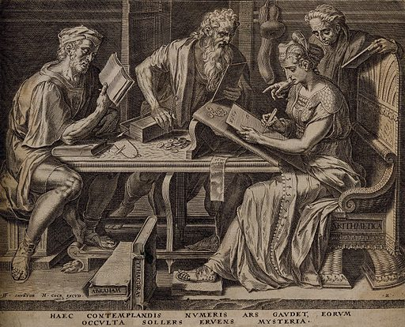
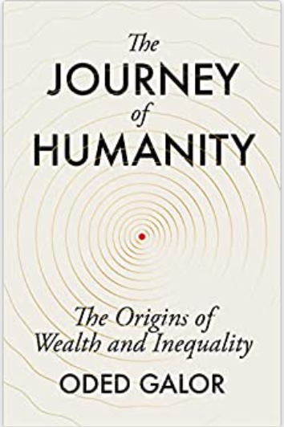
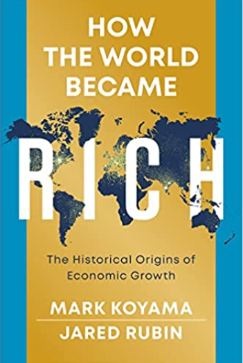
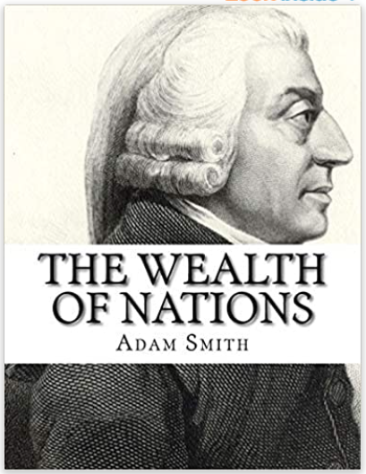
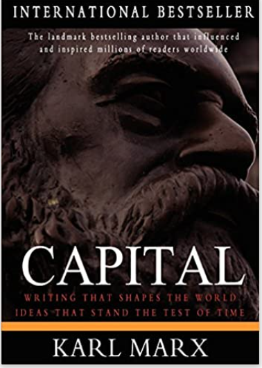
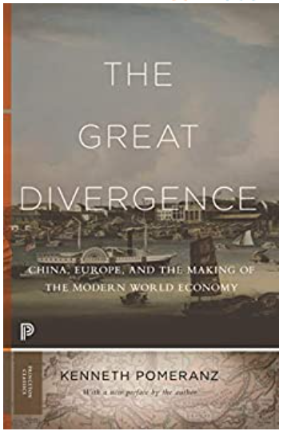
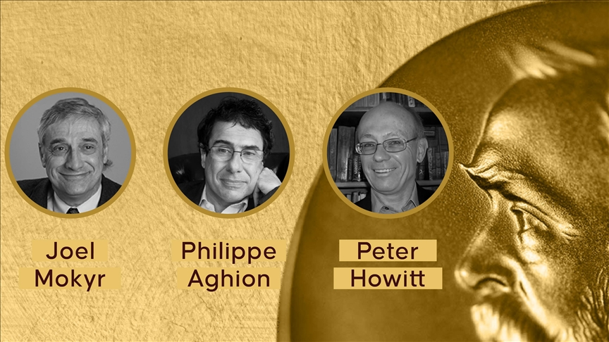

<!--
theme: gaia 
paginate: true
footer: ""
style: |
  section {font-size: 27px;}

-->


## ECO 331
# Economic History
```
Introduction
```
<br></br>
Jonathan Conning
Spring 2026


---
## Required Texts
- Koyama, Mark, Rubin, Jared, 2022. _How the World Became Rich: The Historical Origins of Economic Growth_. John Wiley & Sons.
- Galor, Oded, 2022. _The Journey of Humanity: The Origins of Wealth and Inequality_. Penguin.
<br></br>


Reasonably priced in e-book, print, and/or audio formats.


---
## Canvas LMS


[canvas.instructure.com/enroll/P9XDGD](https://canvas.instructure.com/enroll/P9XDGD)

<br></br>
* Syllabus, Reading Schedule
* Threaded Discussions
* Homework and grades
* free

<!-- transition: clockwise -->
---

## Grading



| Activity                               | pct |
| :------------------------------------- | ------- |
| Discussion/Participation               | 35 \%   |
| Midterm                                | 20 \%   |
| Article/Chapter Report                 | 15 \%   |
| Final Exam                             | 30 \%   |


---
<br></br>
<br></br>
**Oded Galor**
Brown University




---


---




<br></br>
<br></br>
**Mark Koyama** (GWU)

**Jared Rubin** (Chapman Univ)


---
## 'Big History' Questions

* How did the world become Rich?
* Why did it take so long?
* Why did it happen first in some places before others?
* Why isn't the whole world rich?

---


---
## Transitions

* The Neolithic Revolution
* Early States, Empires
* Malthusian Trap
* Rise and Fall of Feudalism

---
## Transitions (continued)

* Capitalist Transitions
  * The enclosure of lands
  * The rise of cities, Modern States
  * Demographic Transitions. Malthusian escape  

* Conquest, Colonization, Slavery

* The Industrial Revolution(s)
   * Firms, Technology R&D
   * Global Trade and Finance 
  


---
Classical Political Economy



---




---


---

<!-- footer: "" -->

**2025 Nobel Prize in Economics**

- Joel Mokyr: “for having identified the prerequisites for sustained growth through technological progress.” 
- Aghion and Howitt: “for the theory of sustained growth through creative destruction.”


---

**2024 Nobel Prize in Economics**
"for studies of how institutions are formed and affect prosperity"


---


---
# Causal Mechanisms


* Proximate versus Fundamental Causes
* Causal Relationships vs. Correlations
* Exogenous vs Endogenous

<br></br>

* Can we identify causal relationships?


---

## KR's Explanation Categories
* Did Some Societies Win the Geography Lottery?
* Is it All Just Institutions? 
* Did Culture Make Some Rich and Others Poor?
* Fewer Babies?
* Was it Just a Matter of Colonization and Exploitation?

---

# This Week

### Tuesday/Thursday: Introduction
  - OG, "Mysteries of the Human Journey" (1-10) 
  - OG 1 "First Steps," (13-25).
  - Henrich, Joseph (2017) "Chapter 1: A Puzzling Primate"
  <br>
  - KR 1, "Why, When, and How Did the World become rich" (1-16)

<br></br>

---

## Next and every week, due the night (8am) before class

- **Two questions**
    - One factual/conceptual 
    - One probing, to take the conversation in interesting directions.
- **Two comments**
    - Agree or disagree, reframe, etc. 
    - Historical observation or trivia
    
    Submit via Canvas. Due 11pm the night before class.
<br>
- **Student Led presentations**
	- Groups of 4. Responsible for short slide deck, typically on additional reading.


---
## Introductions
- Your name (nickname?)
- Major/minor
- Interests in economic history.
- Anything else interesting about yourself.

 
---


## Chapter 1


### Why, When, and How 
### Did the World Become Rich?


---
<!-- footer: "" -->


 
- What does GDP measure?  
Same as income?
- Methods
  - GDP stats and deflators
  - PPP
  - Consumption baskets
  - Correlates
    - Height
    - Life Expectancy
- Are these the right measures?
  - what left out?
---
# Growth

* Does growth bring other values?
  * What other values?  
  * Tradeoffs?
* Growth vs Development
* Sustained economic growth
   * Efflorvescences
   * Shrinkages

---
# KR's list of theories
* Geography
* Institutions and Politics
* Culture
* Demographics
* Colonization and Exploitation 


---

# Non-monocausal
# Contingent

Identification challenges

---


---


---

### What Makes Humans Different?
#### A Puzzling Primate (Henrich)

* Physically weak, slow, poor climbers
* Any chimp can overpower us. 
* Yet we spread to every terrestrial ecosystem on Earth
* From frozen Siberia to arid deserts to tropical rainforests

**The puzzle:** How did the world's most physically vulnerable primate become the most successful?


---
## Video Title

<iframe width="100%" height="600" src="https://www.youtube.com/embed/PNrWUS13th8" frameborder="0" allowfullscreen></iframe>


---
## Culture: Our Secret Superpower

**Humans are a cultural species**

* We learn from each other
* Knowledge accumulates across generations
* Skills improve and compound over time

Unlike other animals, humans can:
- Build on previous generations' discoveries
- Transmit complex knowledge through language
- Solve problems that no individual could figure out alone

**Culture makes us smart. We are not smart because our species is innately brilliant; we are smart because we have culturally evolved vast tools and knowledge.**

---

## Language & Symbolic Thought

**Language enables:**
* Precise communication of complex ideas
* Storage of knowledge beyond individual memory
* Teaching of abstract concepts
* Cooperation at unprecedented scales

**Without language:**
* Fire, cooking, tools would not accumulate
* Each generation would start from scratch
* We could not maintain the body of knowledge needed to survive new environments

**Language is uniquely human** - our capacity for grammar, symbols, and abstract thought sets us apart fundamentally from all other species.

---

## Tools, Technology & Cumulative Innovation

**From Henrich: Culture-Gene Coevolution**

Humans have evolved the capacity to:
* Make and use increasingly complex tools
* Learn through demonstration and imitation
* Transmit technological knowledge intergenerationally

**Examples of cumulative cultural packages:**
- Fire and cooking (requires knowledge transmission)
- Fishing nets and boats (requires multiple integrated skills)
- Shelters adapted to local environments
- Food preparation and preservation techniques
- Hunting strategies and weapons

Each generation inherited and improved upon previous knowledge, creating technological ratchets that other species cannot match.

---

## Global Expansion: A Recent Phenomenon

**Tens of thousands of years ago**, humans migrated across the globe:
* Crossed land bridges to Australia (40,000+ years ago)
* Reached the Arctic and subarctic (20,000+ years ago)
* Adapted to every major terrestrial ecosystem
* Developed specialized technologies for each environment

**The Malthusian Reality:**
* For nearly 300,000 years, per capita income barely rose above subsistence
* Plagues and famines were abundant
* 25% of babies did not reach their first birthday
* Life expectancy rarely exceeded 40 years
* Population growth offset all technological gains

**This paradox is central to understanding economic history.**

