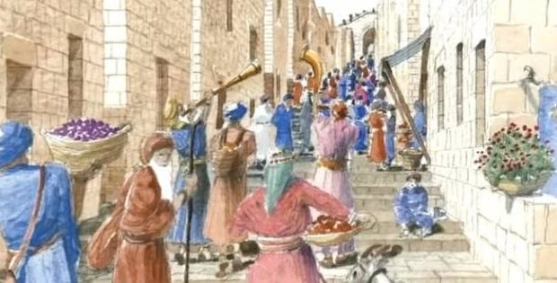
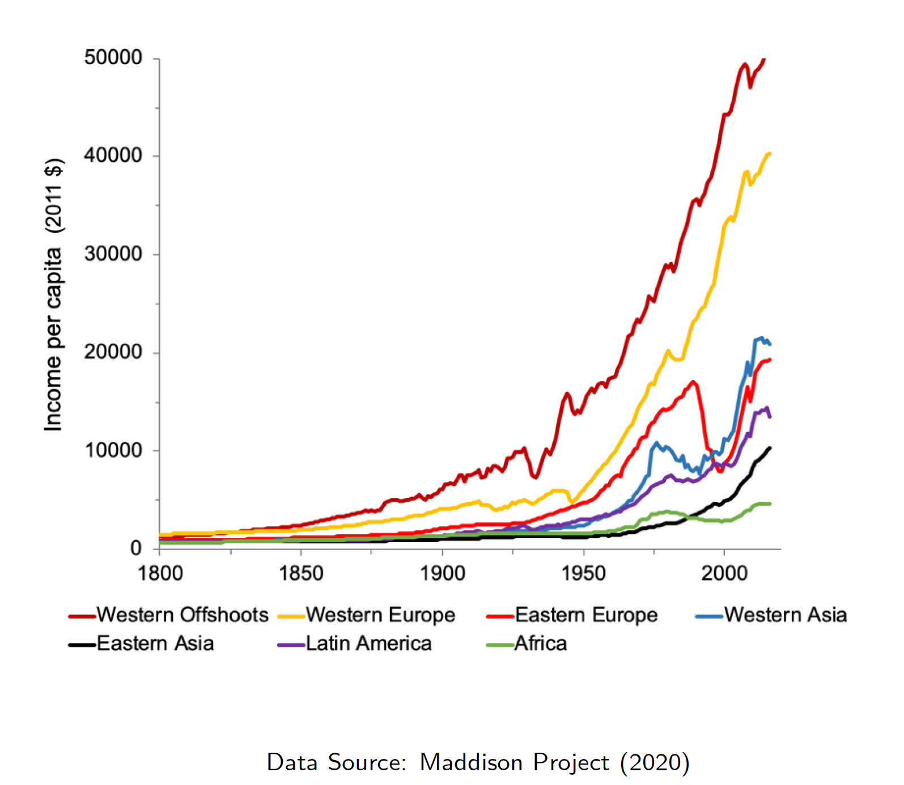
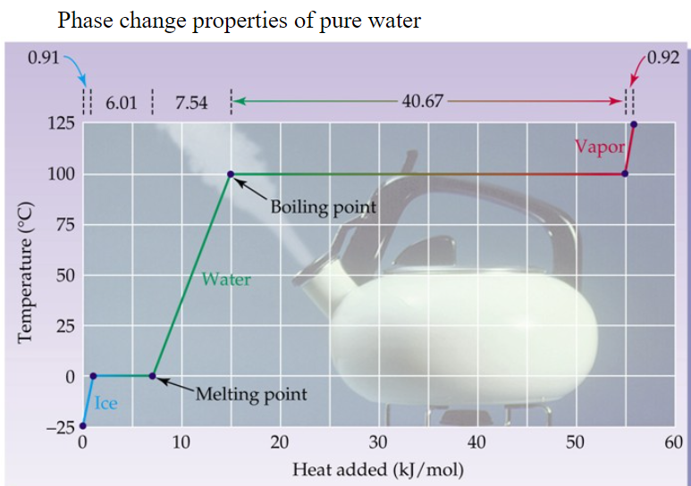
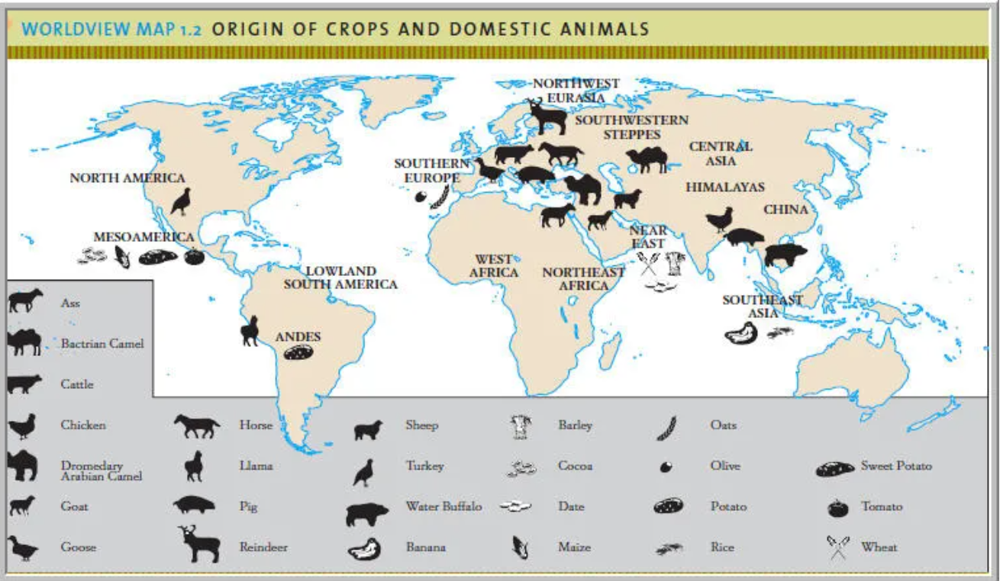
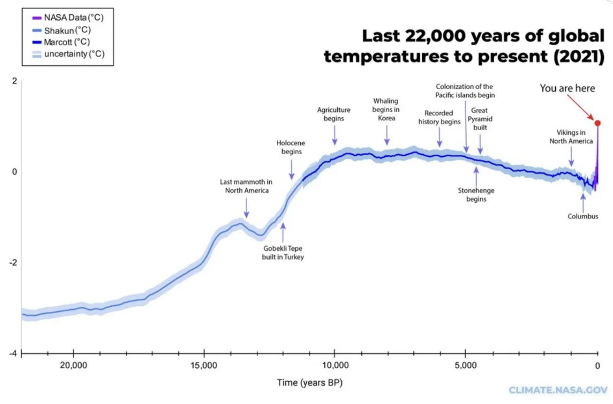
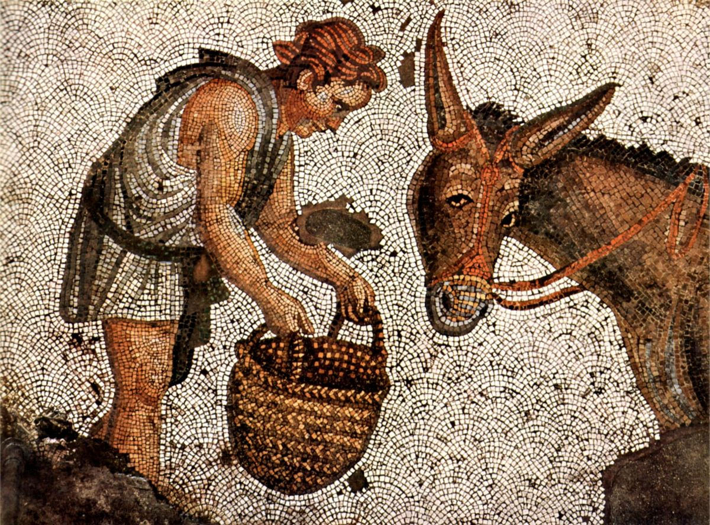
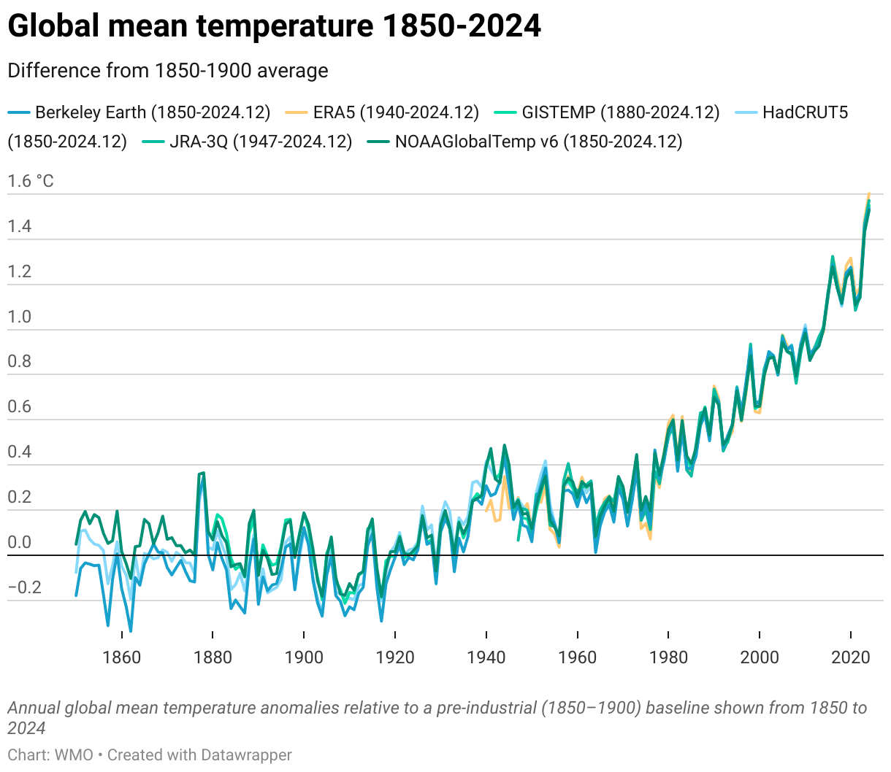
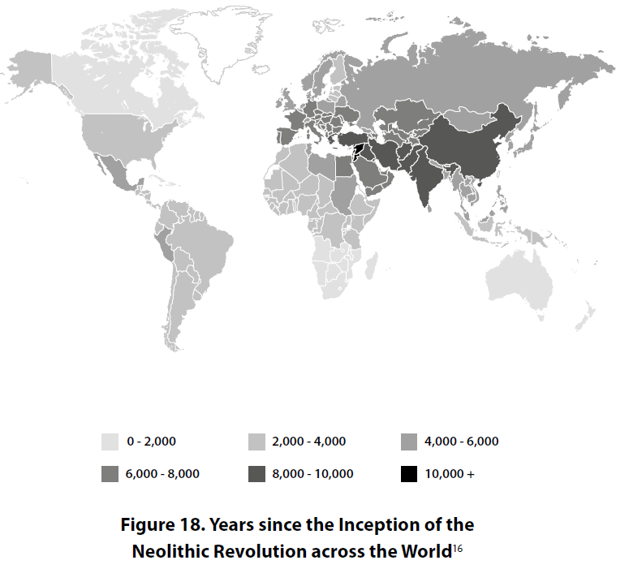
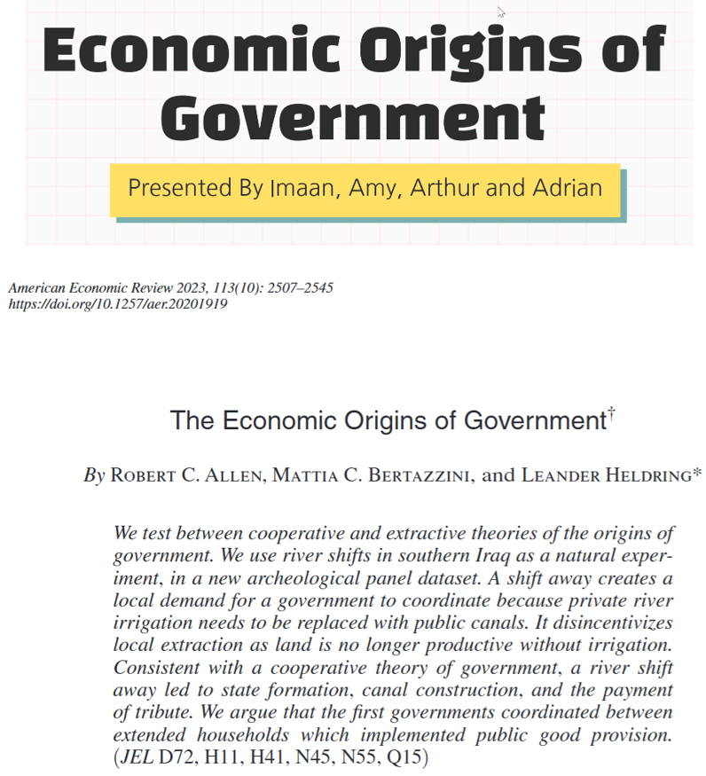
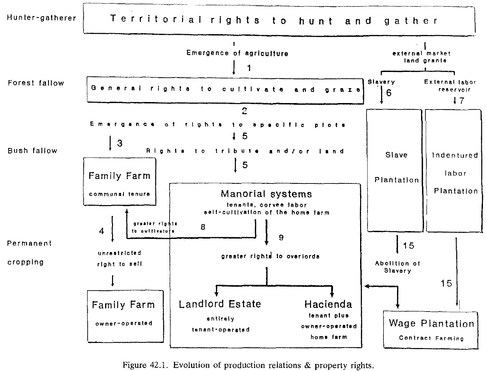

<!--
theme: gaia 
paginate: true
footer: Eco 331: Neolithic Revolution, Early States
style: |
  section {font-size: 26px;}


<!-- footer: "" -->


# ECO 331
## Economic History

```
THE NEOLITHIC REVOLUTION, EARLY STATES
```
<br></br>
Jonathan Conning
Spring 2026
<br></br>


---
These slides cover readings from :

- OG, "Mysteries of the Human Journey" (1-10 Links to an external site.) 
- OG 1 "First Steps," 13-25.
</br>
- OG 11 "The Legacy of the Agricultural Revolution" 201-214
- Diamond, D.W., 1999. "The Worst Mistake in the History of the Human Race". Discover Magazine. 
- Scott, J.C., 2017. "Population Control: Bondage and War," Chapter 5 in _Against The Grain: A Deep History of the Earliest States_. Yale University Press. (p 150-157, 171-179).)
---

Presentation volunteers for Fri 2/7?
([PDF link](https://www.aeaweb.org/articles?id=10.1257/aer.20201919))


---
# Galor's 'Mysteries of the Human Journey'

**What was life like in 1651\?**


When **Thomas Hobbes** wrote _Leviathan_ in 1651.
It was "Nasty, Brutish, and Short:"


</br>
(Thomas Hobbes, 1588-1679, English philosopher argued humans in their natural state live in chaos and constant conflict, leading them to form a "social contract" where they surrender certain rights to a sovereign authority in exchange for security and peace.)

---

## Living standards a few centuries ago
* 25\% newborns died < age 1. Mother childbirth deaths.
* Life expectancy rarely exceeded 40.
* Darkness after sunset. Long winters, smoke filled homes.
* Long hours to get water; washed infrequently. 
* Kings, lords, wars, conquest, banditry.
* A crisis $\Rightarrow$ 'belt-tightening', $\Rightarrow$  starvation/extinction. 


---
## Jerusalem 

Employment prospects for a worker from 1 BC in:

- 1 BC
- 1800 AD
- 2000 AD




---


---



---


---
## The Malthusian Epoch


> ... during the Malthusian epoch - ... the entirety of human history up until the recent dramatic leap forward - the fruits of technological advancements were channelled primarily towards larger and denser populations and had only glacial impact on their long-term prosperity. (Galor p4-5).

- What were underlying causes?
- How break out of this poverty trap? 


---

<!-- footer: "" -->


---


---


---


* English data 1200-1790s
* Note clear effects of the Black Death > 1340s
* Transition ~ 17th century
   * Population rising without falling income per capita
* Sustained rising income per capita > 1870s

---


---
## Resolving the mysteries

- What forces permitted the transition from stagnation to growth?
  - one or more transitions?
- Why has timing been different across regions?
- Role of historical and pre-historical factors in this process.

- Malthusian Epoch
- Post-Malthusian Regime
- The Modern Growth Regime


---
## Galor's Unified Growth Theory


- **Population size and diversity** $\rightarrow$ Tech progress 
- But Malthusian pressures eventually overwhelm 
- For most of human history not enough for a "phase transition" 

- Until enough factors come together to cause transition
    - **Technology, Human Capital and Family Size** will play a role in transition.

Analogy: You can continuously increase heat 0 to 100 C to the kettle but water will not boil, but a sudden phase transition may happen at 100 C.

---

* **During Malthusian epoch**
  * Pop size & composition $\rightarrow$ Tech progress
  * Tech Progress $\rightarrow$ Pop size & composition
* **Transition**
  * Tech progress accelerated, reaching a critical threshold
  * Human capital became essential to cope
* **Rise in return to human capital triggered fertility transition**
  * Malthusian equilibrium vanished
  * Growth freed from counterbalancing effect of rising pop
* **Tech progress & human capital formation & decline in pop growth**
  * $\rightarrow$ modern sustained growth


---
# Galor's 'The Human Odyssey: First Steps'

## The Human Brain
* Human brain : large, compressed, complex. 
* Tripled in size over 6M years, mostly 200-800K years ago
* Drawbacks:
  * uses enormous amounts of energy.
  * large size --> birth canal passage difficult. 
    * 'half-baked' brains; helpless babies, years until maturity. 
* Why evolved this way?  Unique? Why no *convergent evolution*?

<br></br>
 * Also: Hands, bipedalism, [voice boxes](https://www.npr.org/2010/08/11/129083762/from-grunting-to-gabbing-why-humans-can-talk), etc.  


---
### Technology and Technological Progress

* **Technology:** the recipes for transforming resource inputs into useful outputs.
* **Technological progress:** getting more for less
    * more, better and more useful outputs from inputs
    * or similar outputs with less inputs
    * may be embodied in new or improved methods and tools, forms of organization, etc.
* **Human Capital**: 'factors that influence worker productivity (e.g. training, problem-solving skill, health and longevity' p52)

---
## Hominid brain, sociability, parental investment
  * Brain characteristics as impetus for Technological progress
  * learning for adaptation
  * dependent child --> long parental investment in human capital
    * inter-generational transmission of technology and know-how.


---
## The Puzzling Primate
### Humans are neither the strongest or smartest


* **Individual humans** are not strongest, fastest, or most intelligent primates
  * Can't survive alone in wild without learned skills
  * Dependent children require years of care
  * Lack instinctive behaviors other animals possess

* **Henrich's contest**: 
  -* Capuchin monkey versus human in the wild.

---


## The Puzzling Primate
### Yet Humans are Collectively Strong

* **One species of humans** thrives in arctic, desert, tropical, and high-altitude environments
  * Through **cultural adaptation** — not biological adaptation

* **Contrast**: ~15000 ant species exist, but no single species dominates all habitats
  * Ants are physically superior to humans
  * Yet they specialize: some in deserts, some in forests, some in temperate zones
  * **Only one human species** (*homo sapiens*). We use culture to do what thousands of specialized species cannot

---
## Humans Dominate Every Habitat


**Why?** Culture enables solving survival problems through **learned knowledge** rather than biological adaptation

---
## Cumulative Culture
### Building Knowledge Across Generations

* **Culture** = information stored outside the genome
  * recipes, tools, techniques, beliefs, social norms
  * transmitted from individual to individual, generation to generation

* **Cumulative** = each generation builds on what previous generations learned
  * Stone tools: simple rocks → hand axes → composite tools
  * Fire use: controlling fire → cooking → thermal technology
  * Ecological knowledge: which plants edible, hunting tactics, seasonal patterns

* Unlike other animals, humans can acquire knowledge they did not discover
  * No individual reinvents the wheel
  * Knowledge can accumulate faster than biological evolution

---

## Stone Tool Progression: Evidence of Cumulative Culture


Over hundreds of thousands of years: simple rocks → hand axes → composite tools. Each generation built on knowledge of prior generations.

---
## Selective Cultural Learning
### How Knowledge Gets Transmitted

**Not all information is learned equally:**

* **Prestige-biased learning**: tend to copy successful, high-status individuals
  * If a respected hunter uses a new technique, others adopt it
  * Spreads effective solutions without individual discovery

* **Content-biased learning**: copy behaviors that seem beneficial
  * Cooking makes food more digestible → people adopt cooking
  * Observe results, not just copy indiscriminately

* **Conformist bias**: tend toward behaviors others are doing
  * Social coordination; reduces conflict over multiple options

These mechanisms allow **rapid cultural evolution** and diffusion of innovations

---
## Culture-Gene Coevolution
### How Culture Shapes Human Biology

* Culture and genes evolve together in a **feedback loop**:
  * **Gene → Culture**: Genetic predispositions for learning, imitation, language
  * **Culture → Gene**: Cultural practices create selection pressures

* This creates a **coevolutionary process** where cultural practices shape which genes increase in frequency over generations

---

### Self-Domestication: Humans Evolving Through Culture


* Cultural norms reward **cooperation**, punish **aggression**
* Selection toward prosocial traits:
  * Reduced aggression and dominance-seeking
  * empathy and tolerance
  * capacity for cooperation
* Similar to how animals are domesticated through selective breeding
* But humans did it to themselves through **cultural practices**

---
## Culture and Biology Inseparably Linked

**Result**: Humans are products of both biological and cultural evolution, inseparably linked.

Culture doesn't just change behavior — it shapes human genetics and biology itself.



---

## Lactase Persistence
### Culture and Gene Frequency


* **Culture**: Domestication of dairy animals (herding societies)
* **Genetic consequence**: Selection for ability to digest lactose into adulthood
* **Geographic pattern**: High gene frequency in pastoral populations, low in others
* Demonstrates how cultural practices create biological adaptation

---
### Technological advancements $\Longleftrightarrow$ further evolution

  * **Mastery of Fire** 
  (by *homo erectus* >400K years ago, pre-dating *Homo Sapiens*) 
    * **Cooking** 
      * faster absorption of more calories -> larger brains
      * less chewing -> less need for large jaw bones and muscles 
      -> more cranium space for larger brains
    * **Domestication of the environment**
      * The first great tool to 'domesticate' and shape the environment.
 
---

## Fire
Long before agriculture, hominids were domesticating the environment:

From J.C. Scott _Against the Grain_


---
# Galor's Positive Feedback loops

- environmental changes
  $\Rightarrow$ technological innovations
     $\Rightarrow$ population growth
     $\Rightarrow$ new adaptations of the environment
     $\Rightarrow$ enhancement of ability to manipulate environment
     $\Rightarrow$ more technological change.

---

# Hominids

* *Homo erectus* (~2M years ago) spread to Euroasia.
  * longest lived early human species, ~9X longer than *homo sapiens*
  * Survived until ~117K years ago


---


### Mitochondrial Eve
- unique genetic code passed down from female to female.
- "The most recent woman from whom all living humans descend in an unbroken line purely through their mothers and through the mothers of those mothers, back until all lines converge on one woman."
- Every female (person) alive today is descended from this woman, estimated to have lived ~155,000 years ago.


---

# Out of Africa 
### Homo Sapiens
- Anatomically modern Homo Sapiens developed ~200-300,000 years ago in the Horn of Africa.

- Several 'out of Africa' dispersals  as early as 270K years ago. 
Greece ~215K
- Evidence reached China 80K years ago

---


# Climate Trends: 20,000 Years to Present

Humans have adapted to dramatic climate shifts:
- Ice Ages → global migration
- Warming → agriculture emerges
- Climate variability → civilizations rise and fall
- Modern warming → industrialization era

---


---
## Last Glacial Maximum
**20,000 years ago**


- 6°C cooler than today
- Sea levels 120m lower
- Massive ice sheets over North America/Europe
- Land bridges exposed (Bering Strait, Australia)

---

## Warming and Global Migration
**20,000-10,000 years ago**

* **Gradual warming** as ice sheets retreated
  * Rising sea levels, glacial retreat
  * Near-modern temperatures by 10,000 years ago

* **Human global migration enabled**
  * Out of Africa → Middle East/Asia (~60K years ago already ongoing)
  * Australia settlement (65K-47K years ago)
  * Americas via Bering Strait (23K-14K years ago)

* **Climate change was the gateway** for humans to populate every continent

---

## Holocene Climatic Optimum and Agriculture
**9,000-5,000 years ago**

- 1-2°C warmer than today, wetter conditions
- **Green Sahara**: vegetation where desert exists today
- **Stable, warm climate enabled agricultural revolution** (~12K years ago)
  - Fertile Crescent, Nile Valley, Indus Valley flourish
  - Human populations grow and settle

**Neoglacial cooling (5,000-2,000 years ago)**
- Sahara dries out, populations migrate
- Climate variability increases

---

## Climate Variability and Civilizations
**250 BCE - 1850 CE**

**Roman Warm Period (250 BCE - 400 CE)**
- Warmer Europe → agricultural prosperity → Roman expansion and stability

**Dark Ages Cold (400-800 CE)**
- Cooling, drought → instability and societal disruption

---
## Climate Variability and Civilizations


**Medieval Warm Period (900-1300 CE)**
- North Atlantic warming → Viking expansion, Greenland settlement

**Little Ice Age (1300-1850 CE)**
- Glacier growth, failed harvests
- Viking Greenland collapse, widespread European famines
- Demonstrates how climate variability shapes civilizations

---

## Modern Period: Industrialization and Unprecedented Warming
**1850-present**



- General warming begins ~1850
- **Accelerated warming since 1950** (industrial era)
- Glacier retreat, sea level rise
- Rate of change unprecedented in human history
- Unlike past climate shifts, this change is rapid and human-caused


---
## 
- Most humans today from a significant migration out of Africa 60-90K years ago
  - to the Levant: Eastern mediterranean 
  - Southern: via Red Sea into Arabian Peninsula 
 - Reaches 
   - South Asia >70K years ago
   - Australia 47-65K years ago
   - Europe 45K years ago
   - Cross Bering Straight in several migrations 14-23K years ago.

---
* By time humans reach Americas, hunting methods are evolved. 
* Local large animal populations (that had not co-evolved with human predators) are rapidly wiped out.
*  30 mammals hunted or otherwise led to extinction including: Wooly mamoths, giant armadillos, horses.
  
  

---
# The Neolithic Revolution
## and the Early States


---

### Galor "Ch 11: The Legacy of the Agricultural Revolution"
* Transition from nomadic Hunter Gatherer to sedentary Agricultural Societies.
  * "Hundreds of thousands of years of painfully slow technological and social change (p21)"
* Accepted dawn of Ag revolution ~ 12K years ago
  * Fertile crescent
  * Yet human settlements and 'domestication' and harvesting of plants long before.
    * 23K-year-old Galilee village. 
       * Found ag. implements dated 11K years < accepted dawn of ag revolution
       * What does this tell us?


---

Galor, p 21

---


---

## Timing of Agricultural Revolution
* Jared Diamond
  * Favored regions 
    * had more biodiversity and domesticable animals.  
    * Fertile crescent: abundance of harvestable grains, easily improved. 
    * Domesticable large animals: cattle, sheep, goat, oig, cat, goose.
    * Agriculture easily spreads on east-west axis (similar latitude/weather)
  * Less Favored regions
    * Far fewer domesticable plants and animals
    * Agricultural technology harder to spread North-South


---

- Only 14 large animals have been domesticated: sheep, goat, cow, pig, horse, Arabian camel, Bactrian camel, llama and alpaca, donkey, reindeer, water buffalo, yak, Bali cattle, and Mithan (gayal, domesticated Gaur).

- Fertile Crescent had 4
- Most in Eurasia


---
## Social Frameworks

- Hunter Gatherer societies 
  - Small-scale tribal societies, densely interwoven kinship ties
  - Facilitate cooperation, sharing, mitigation of disputes.
  - Signficant social strata rarely emerged.

- Early agricultural settlements maintained such arrangements.
  - Combined agriculture with hunter-gathering. At times abandoned agriculture.


- Settlements grew in size, populations denser.
- New technologies, specialization, and trade
- New social layers emerge
  - Rulers, noblemen, priests, artists, tradesmen, soldiers.
  - Taxes, accounting, writing, artistic production

---
## Stratification and State formation
- Taxes
- Agricultural producers had to produce surplus to maintain non-producing class
- States as predators, as providers of public goods, or both?
 

---



---
## Timing of Agricultural Revolution

* What advantages/disadvantages conferred by agricultural revolutions?
  * Disadvantages
    * measurable decrease in stature and health
    * exposure to new epidemics from animals
    * Taxes, stratification
    * bondage and slavery
  * Advantages
    * larger concentrated populations, specialization 
    -> more technological and artistic creation
    * public goods: protection, irrigation, communal life.

--- 
## Jared Diamond 
## The Worst Mistake in the History of the Human Race


<!-- footer: Eco 331: Neolithic Revolution, Early States -->


---
### Earlier Ag Transition societies as Conquerors

* larger stratified populations with better technologies
* class of warrior/raiders
* immunity to many diseases

* Spread, displacing or absorbing existing hunter-gatherer groups
* e.g. The Austronesian expansion.  Started ~6000 years ago from Taiwan
	* Easter Island ~800-1000 CE
	* New Zealand ~1250-1300 CE


---
<!-- footer: Bantu Expansion starting ~3000 BCE-->


---
<!-- footer: Eco 331 -->
### The rise of Civilizations

- Mesopotamia ~4000-3000 BCE
- Indus Valley ~2500 BCE
- China ~ 1500 BCE
- Central America/Mexico  1200 BCE
- ultimately on every continent

## Characteristics
- Urban Areas
- Monuments, infrastructure
- Writing systems
- Administration and Stratification
- Expansion

---

<!-- footer: "" -->

**Some books by James C. Scott**


* For much of human history, even today, people hiding from and evading control by states.
* States more likely to for where easy to tax
  * Grain crops need to be harvested and stored, easy to seize, hard to hide.
  * Tubers and forest products: can be left in ground. 
* States try to organize society to be 'legible.' easier to measure and control. 
* Centrally  planned versus bottom-up emergent order.

---
## Early States and Population Control


---
## Land abundance
### Free Peasantry or Coerced Labor?


 

---
 

---


[Student Presentation](https://docs.google.com/presentation/d/1MHEAAUxGoKHh_E6etKQnf87NBAoveu0vdcZoKoVtWKU/edit?usp=sharing)

---
## Mesopotamia (Sumer)
- Area between rivers (Tigris and Euphrates)
- Civilizations emerge 4th and 3rd millenia BCE (cuneiform writing)
- Originally organized in extended kinship groups -- self-governing lineages
- Built numerous cities including Uruk, Ur.  Temple towers and palaces.
- Lower sea levels. Rich alluvium soils. Frequent, unpredictable flooding.
- Kingship and code of laws


---

## Empirical Methodology
- 1374 5x5km grid cells covering area between the modern Euphrates and Tigris rivers
- Each observed 31 historical periods, 5000 BCE to 1950 CE
- Differences in Differences estimation.
	- compare treated (flooded) to untreated control groups
	- how much did the event *increase* the outcome over trend (C)
	- accounts for trends and possible fixed differences (A) due to unobserved factors.


---


---


---
### Methodological concerns
- The 'identification' problem:  Estimates of effect of river shifts might be 'biased' (too high or too low) due to other factors that coincide with the shifts.
- Verify parallel trends assumption (rule out differences due to different trends)
- Argue river shift truly exogenous (e.g. not man made events... rainfall in Turkey)
- Argue no bias in archaeological evidence (e.g. no tendency to search more in places where river shifted in a )
- Balance checks (not correlated to confounding effects such as ec activity in 1950)
- Placebo test:  focus on areas where river shifted *closer* (disruption -- expect negative effect)

---

## Induced institutional, organizational, and technological change

**Douglas North** sports analogy:
- Institutions: Rules of the Game.  Organizations: Teams.   Individuals:  players.

Institutions:  e.g. State Laws, system of property rights.

Organizations form to coordinate and advance individual interests. 
Compete with other organizations.

Constrained by institutions but also, over time, attempt to change institutions to advance their interests. 

What accounts for emergence and transformation of institutions?
Will this change be evolutionary or marked by conflict?

Will it lead to more efficient outcomes or persistent inefficient ones?

---
## Agrarian Production Organization, Property, and their evolution
- Families, kinship groups, villages, tribes, ...
- Territorial Rights to Lands
- General usufruct rights to cultivate

- Family, individual farms
- Communal Tenure

**How do these vary across regions and time, how are they transformed?**
- agroeconomic environment
- population density
- technology and opportunities for trade
- conquest and conflict
  
---


---


<!-- 
## Questions 

- Consequwnces of rapid economic growth?
- How uneven benefits?
- Have we reached peak growth? 

- Does growth allow peace or peace allow growth? Pax Islamica and the Pax Mongolica 

- Thomas Malthus background

# Observations

- Can death/depression improve things?
- fewer declines
- What is 'Poverty trap'  why so long?
- Compared to animals humans are dependent and frail... would seem incredible hardships... yet long-run advantageous? ('paternal care' cooperation.. 80\% birds 6\% mammals increases inclusive fitness ..  )

- Chile, Argentina.. colonization by Europeans?

- country of many people vs of smaller.

- growth and environment?
- does technology free time/leisure?
- Which jobs have disappeared forever?

- Hongyan: Does more pop -> more tech?
  Is technology shared?
- Diana (and others): drawback of infants..

- Shehan: Why didn't migrate further?
- Leo: relationship between ec growth and increased birth rates.

- Elias: why could ec growth not be sustained in the past? 

- Angela: association fertility and HK?

- Mamadou: why haven't other animals brains developed as much?

Areesha:  growth and living standards.. more expensive.

Callie: what triggers/sparks ideas of tech advancement? 

Kevin: Are modern wars more impactful economically?

 -->
