<!--
theme: gaia 
paginate: true
footer: Eco 331: Neolithic Revolution, Early States
style: |
  section {font-size: 26px;}
-->

<!-- footer: "" -->

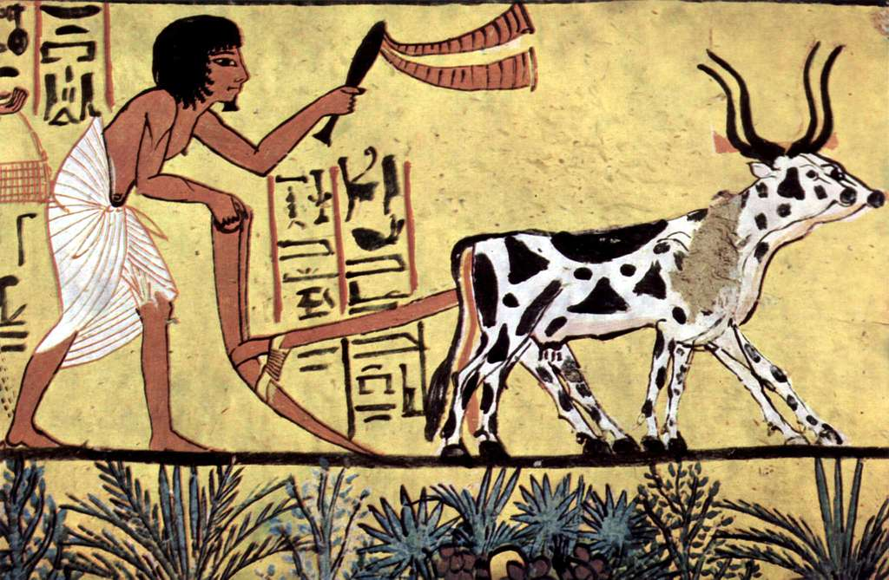
# ECO 331
## Economic History

```
THE NEOLITHIC REVOLUTION, EARLY STATES
```
<br></br>
Jonathan Conning
Spring 2026
<br></br>


---
These slides cover readings from :

- OG, "Mysteries of the Human Journey" (1-10) 
- OG 1 "First Steps," 13-25.
</br>
- OG 11 "The Legacy of the Agricultural Revolution" 201-214
- Diamond, J., 1999. "The Worst Mistake in the History of the Human Race". Discover Magazine. 
- Scott, J.C., 2017. "Population Control: Bondage and War," Chapter 5 in _Against The Grain_. Yale University Press.
- Olson, M. "Dictatorship, Democracy, and Development" (1993)

---

<!-- PART I: THE LONG VIEW -->

# Part I: The Long View

---
# Galor's 'Mysteries of the Human Journey'

**What was life like in 1651?**


When **Thomas Hobbes** wrote _Leviathan_ in 1651.
It was "Nasty, Brutish, and Short."

</br>
(Hobbes argued humans in their natural state live in chaos, leading them to form a "social contract" surrendering rights to a sovereign in exchange for security.)

---

## Living standards a few centuries ago
* 25% newborns died < age 1. Mother childbirth deaths common.
* Life expectancy rarely exceeded 40.
* Darkness after sunset. Long winters, smoke filled homes.
* Long hours to get water; washed infrequently. 
* Kings, lords, wars, conquest, banditry.
* A crisis $\Rightarrow$ 'belt-tightening' $\Rightarrow$ starvation/extinction. 


---

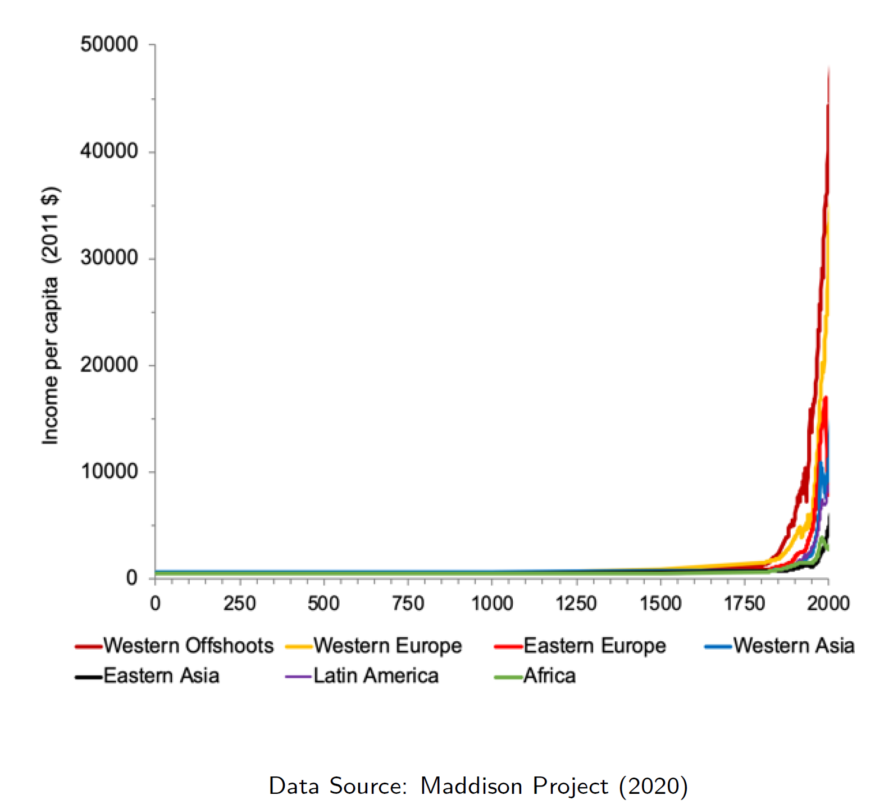

---


---
## The Malthusian Epoch


> ... during the Malthusian epoch - ... the entirety of human history up until the recent dramatic leap forward - the fruits of technological advancements were channelled primarily towards larger and denser populations and had only glacial impact on their long-term prosperity. (Galor p4-5).

- What were underlying causes?
- How break out of this poverty trap? 


---


---


* English data 1200-1790s
* Note clear effects of the Black Death > 1340s
* Transition ~ 17th century
   * Population rising without falling income per capita
* Sustained rising income per capita > 1870s

---

## The Puzzle

- What forces permitted the transition from stagnation to growth?
- Why has timing been different across regions?
- Role of historical and pre-historical factors in this process.

**Galor's answer:** Population size, diversity, and eventually human capital accumulation drive technological progress until a "phase transition" occurs.

---

<!-- PART II: HUMAN ORIGINS & CAPABILITIES -->

# Part II: Human Origins & Capabilities

---
# Galor's 'The Human Odyssey: First Steps'

## The Human Brain
* Human brain: large, compressed, complex. 
* Tripled in size over 6M years, mostly 200-800K years ago
* Drawbacks:
  * uses enormous amounts of energy.
  * large size --> birth canal passage difficult. 
    * 'half-baked' brains; helpless babies, years until maturity. 
* Why evolved this way? Unique? Why no *convergent evolution*?

<br></br>
 * Also: Hands, bipedalism, [voice boxes](https://www.npr.org/2010/08/11/129083762/from-grunting-to-gabbing-why-humans-can-talk), etc.  


---
### Technology and Technological Progress

* **Technology:** the recipes for transforming resource inputs into useful outputs.
* **Technological progress:** getting more for less
    * more, better and more useful outputs from inputs
    * or similar outputs with less inputs
    * may be embodied in new methods, tools, forms of organization
* **Human Capital**: factors that influence worker productivity (training, problem-solving skill, health and longevity)

---
## Hominid brain, sociability, parental investment
  * Brain characteristics as impetus for Technological progress
  * learning for adaptation
  * dependent child --> long parental investment in human capital
    * inter-generational transmission of technology and know-how.


---
## The Puzzling Primate
### Humans are neither the strongest nor smartest


* **Individual humans** are not strongest, fastest, or most intelligent primates
  * Can't survive alone in wild without learned skills
  * Dependent children require years of care
  * Lack instinctive behaviors other animals possess

* **Henrich's contest**: 
  * Capuchin monkey versus human in the wild.

---
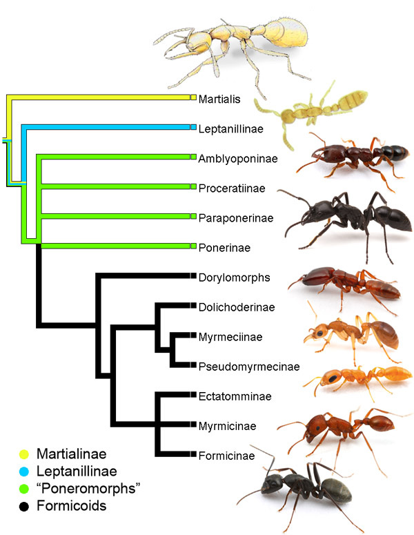


## A Puzzling Primate
### Yet Humans are Collectively Strong

* **One species of humans** thrives in arctic, desert, tropical, and high-altitude environments
  * Through **cultural adaptation** — not biological adaptation

* **Contrast**: ~15000 ant species exist, but no single species dominates all habitats
  * **Only one human species** (*homo sapiens*). We use culture to do what thousands of specialized species cannot

---
## Humans Dominate Every Habitat

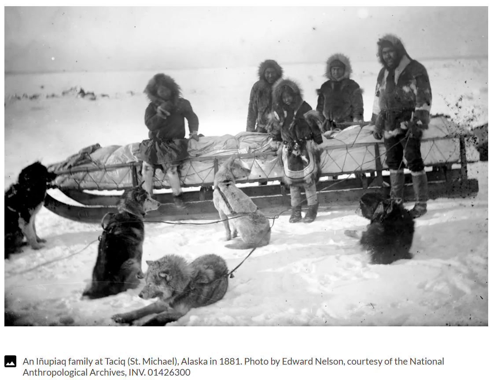

**Why?** Culture enables solving survival problems through **learned knowledge** rather than biological adaptation

---
## Cumulative Culture
### Building Knowledge Across Generations

* **Culture** = information stored outside the genome
  * recipes, tools, techniques, beliefs, social norms
  * transmitted from individual to individual, generation to generation

* **Cumulative** = each generation builds on what previous generations learned
  * Stone tools: simple rocks → hand axes → composite tools
  * Fire use: controlling fire → cooking → thermal technology

---

## Stone Tool Progression: Evidence of Cumulative Culture

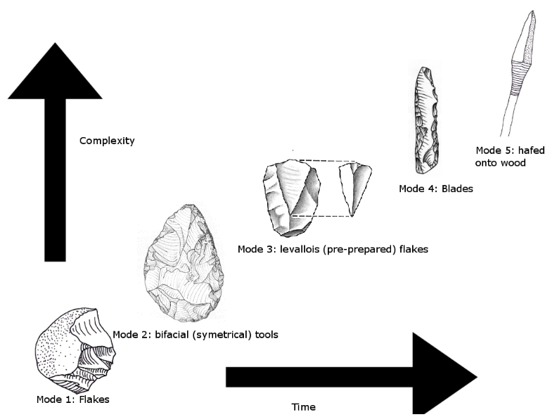

Over hundreds of thousands of years: simple rocks → hand axes → composite tools. Each generation built on knowledge of prior generations.

---
## Selective Cultural Learning
### How Knowledge Gets Transmitted

**Not all information is learned equally:**

* **Prestige-biased learning**: copy successful, high-status individuals
* **Content-biased learning**: copy behaviors that seem beneficial
* **Conformist bias**: tend toward behaviors others are doing

These mechanisms allow **rapid cultural evolution** and diffusion of innovations

---
## Culture-Gene Coevolution
### How Culture Shapes Human Biology

* Culture and genes evolve together in a **feedback loop**:
  * **Gene → Culture**: Genetic predispositions for learning, imitation, language
  * **Culture → Gene**: Cultural practices create selection pressures

* This creates a **coevolutionary process** where cultural practices shape which genes increase in frequency over generations

---

### Self-Domestication: Humans Evolving Through Culture

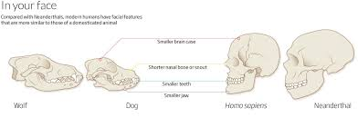

* Cultural norms reward **cooperation**, punish **aggression**
* Selection toward prosocial traits
* Similar to how animals are domesticated through selective breeding
* But humans did it to themselves through **cultural practices**

---

## Lactase Persistence
### Culture and Gene Frequency

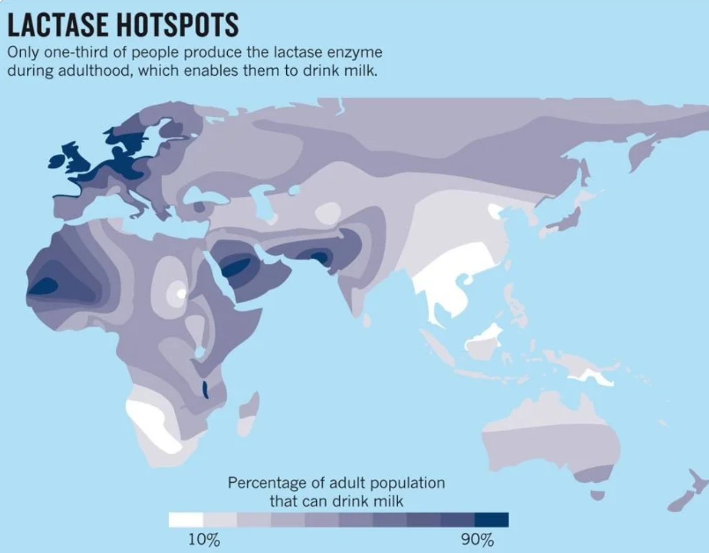

* **Culture**: Domestication of dairy animals (herding societies)
* **Genetic consequence**: Selection for ability to digest lactose into adulthood
* **Geographic pattern**: High gene frequency in pastoral populations
* Demonstrates how cultural practices create biological adaptation

---
### Technological advancements $\Longleftrightarrow$ further evolution

  * **Mastery of Fire** 
    (by *homo erectus* >400K years ago, pre-dating *Homo Sapiens*) 
    * **Cooking** 
      * faster absorption of more calories -> larger brains
      * less chewing -> less need for large jaw bones and muscles 
    * **Domestication of the environment**
      * The first great tool to shape the environment.

---

## Fire
Long before agriculture, hominids were domesticating the environment:

From J.C. Scott _Against the Grain_

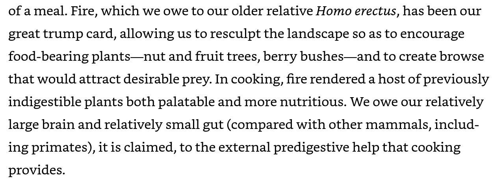

---
# Galor's Positive Feedback loops

- environmental changes
  $\Rightarrow$ technological innovations
     $\Rightarrow$ population growth
     $\Rightarrow$ new adaptations of the environment
     $\Rightarrow$ enhancement of ability to manipulate environment
     $\Rightarrow$ more technological change.

---

<!-- PART III: MIGRATION & HUNTER-GATHERER LIFE -->

# Part III: Migration & Hunter-Gatherer Life

---

# Hominids

* *Homo erectus* (~2M years ago) spread to Eurasia.
  * longest lived early human species, ~9X longer than *homo sapiens*
  * Survived until ~117K years ago

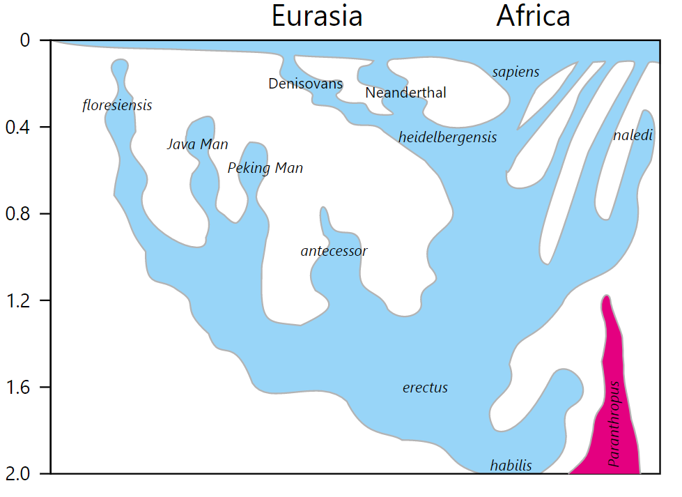

---

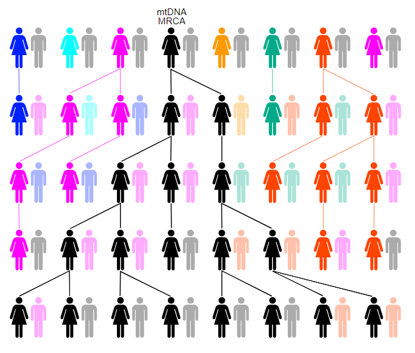
### Mitochondrial Eve
- unique genetic code passed down from female to female.
- "The most recent woman from whom all living humans descend in an unbroken line purely through their mothers."
- Every female (person) alive today is descended from this woman, estimated to have lived ~155,000 years ago.


---

# Out of Africa 
### Homo Sapiens
- Anatomically modern Homo Sapiens developed ~200-300,000 years ago in the Horn of Africa.
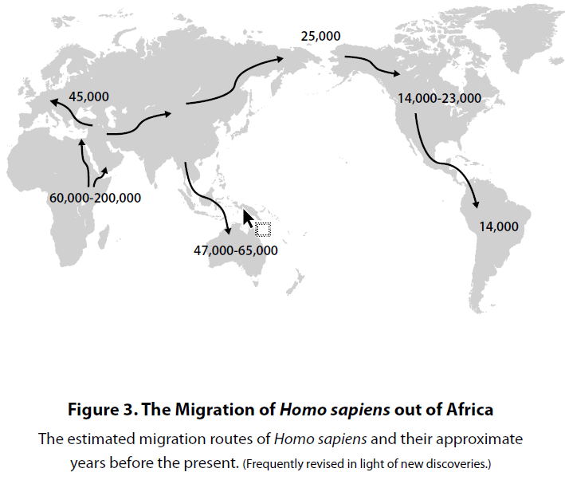
- Several 'out of Africa' dispersals as early as 270K years ago. 
- Evidence reached China 80K years ago

---
## 
- Most humans today from a significant migration out of Africa 60-90K years ago
  - to the Levant: Eastern mediterranean 
  - Southern: via Red Sea into Arabian Peninsula 
 - Reaches 
   - South Asia >70K years ago
   - Australia 47-65K years ago
   - Europe 45K years ago
   - Cross Bering Strait in several migrations 14-23K years ago.

---
## Megafauna Extinction in the Americas

* By time humans reach Americas, hunting methods are highly evolved. 
* Local large animal populations (that had not co-evolved with human predators) are rapidly wiped out.
* 30+ mammals hunted or otherwise led to extinction including: Woolly mammoths, giant armadillos, horses.
  
  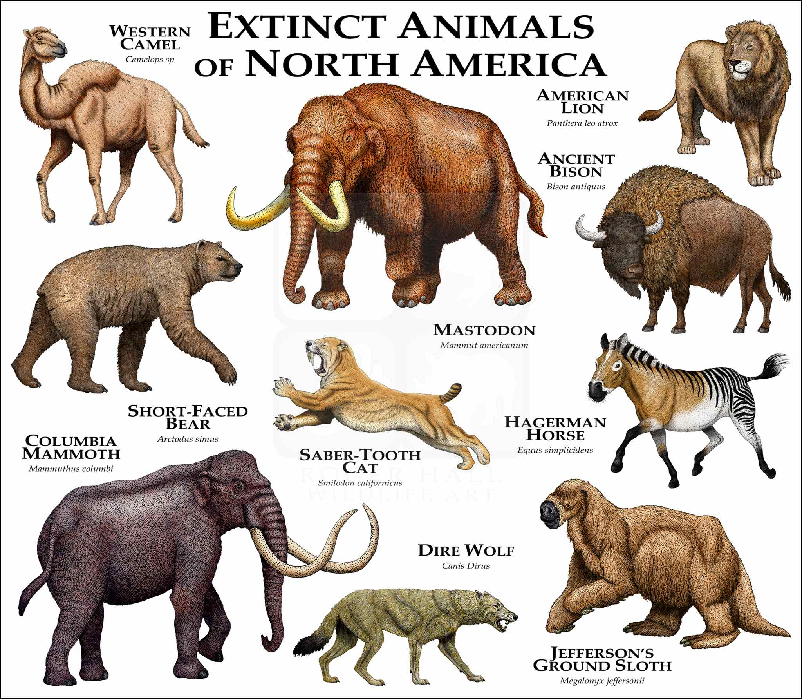

---
## Why Africa Was Different

* In Africa, large animals **co-evolved** with human hunters over millions of years
* Animals learned to fear humans; developed escape behaviors
* Result: Africa retained its megafauna (elephants, rhinos, lions)

* In the Americas and Australia, animals had **no evolutionary experience** with human predators
* They were naive prey → rapid extinction

---

## Hunter-Gatherer Societies

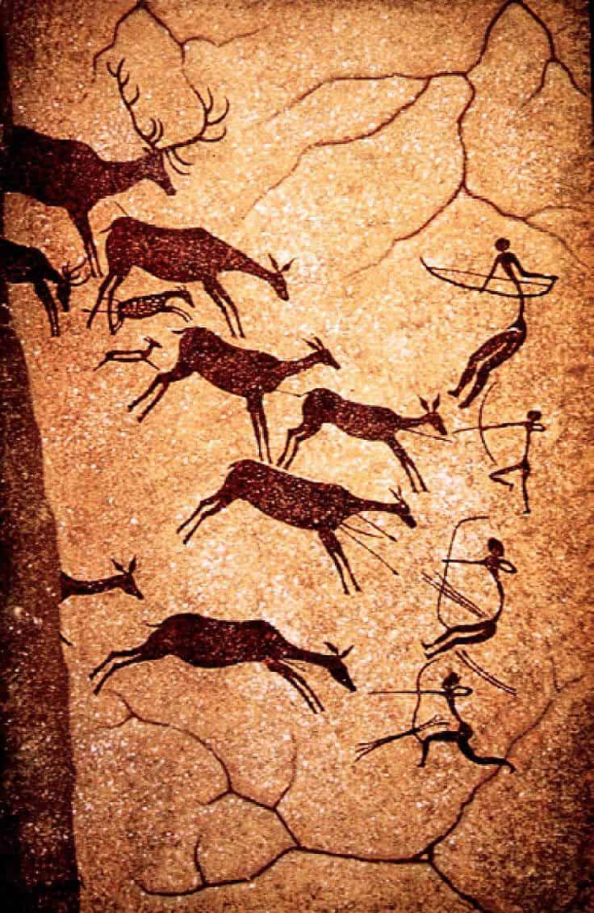
<!-- PLACEHOLDER IMAGE: Photo of contemporary hunter-gatherer society (e.g., Hadza, !Kung San) -->

- Small-scale tribal societies, densely interwoven kinship ties
- Facilitate cooperation, sharing, mitigation of disputes
- Significant social strata rarely emerged
- Mobile lifestyle following seasonal resources
- Egalitarian social structures

---

### The "Original Affluent Society"?

Marshall Sahlins (1972):

* Hunter-gatherers worked *15-20 hours per week* for subsistence
* Diverse, nutritious diets; extensive leisure time. Low material possessions by choice, not deprivation

Diamond, Scott add political dimension:

* For most of history, people **fled** states when they could
* Periphery was a refuge, not a wasteland. "Barbarians" **choose** freedom over domus

If forager life was good, why adopt agriculture?

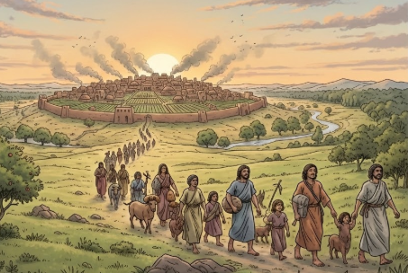

---

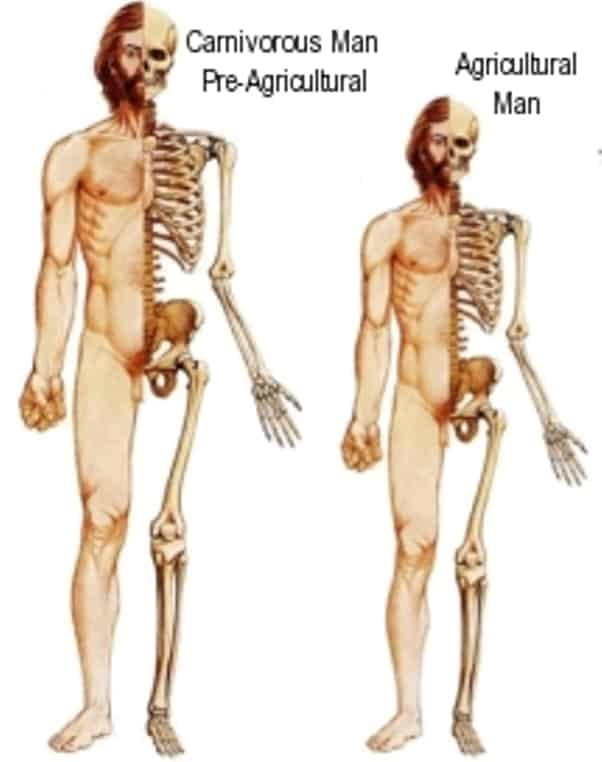
## Hunter-Gatherer Health

Skeletal and archaeological evidence suggests:

* **Taller stature** than early agriculturalists
* **Better dental health** (less carbohydrate decay)
* **Fewer signs of nutritional stress**
* **Lower disease burden** (small, mobile groups limit epidemics)

Early farmers show: shorter stature, more cavities, signs of anemia, repetitive stress injuries

---

<!-- PART IV: THE AGRICULTURAL TRANSITION -->

# Part IV: The Agricultural Transition


---

## Climate and the Holocene
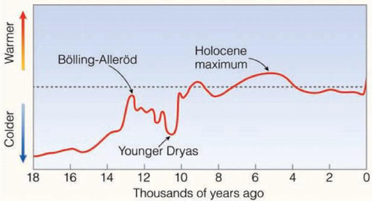


**The end of the last Ice Age 
 (~11,700 years ago):**

* Younger Dryas cold snap ends. 
(see [xkcd](https://xkcd.com/1732/) chart)
* Warmer, wetter, and crucially **more stable** conditions
* Green Sahara period (~10,000-5000 years ago)
* This stability mattered: agriculture requires predictability

The wild ancestors of wheat, barley, lentils grew naturally in the Fertile Crescent

---

## The Fertile Crescent

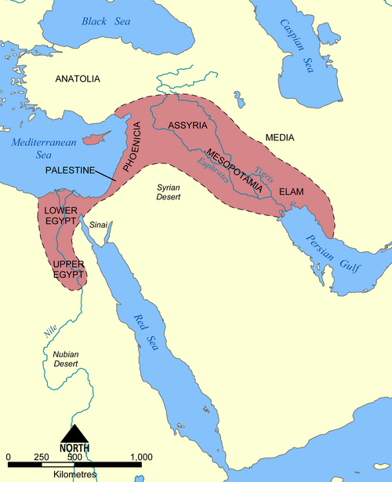
<!-- PLACEHOLDER: Map showing Fertile Crescent with wild grain distribution -->

* Arc from Levant through southeastern Turkey to Zagros foothills
* Concentration of domesticable plants: wheat, barley, lentils, chickpeas
* Concentration of domesticable animals: sheep, goat, cattle, pig

**Jared Diamond's point:** Geography gave some regions a head start

---

### Galor "Ch 11: The Legacy of the Agricultural Revolution"

  * "Hundreds of thousands of years of painfully slow technological and social change"

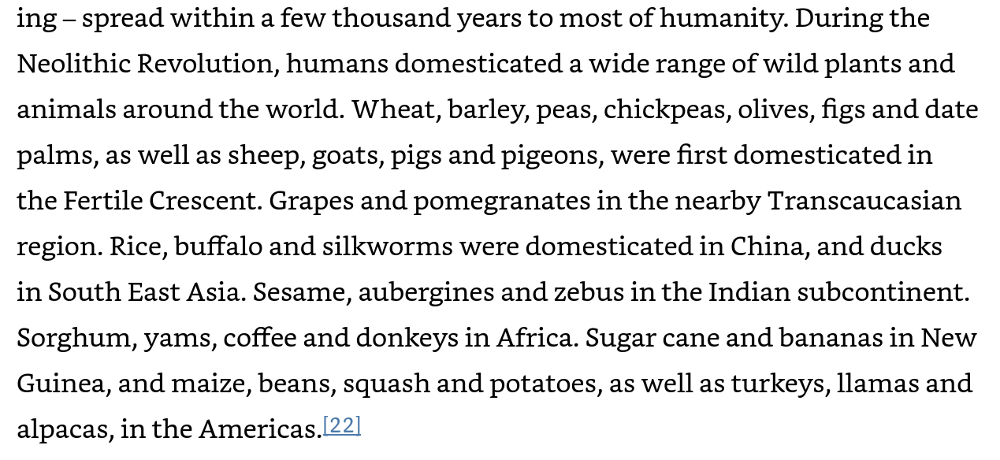
Galor, p 21

---
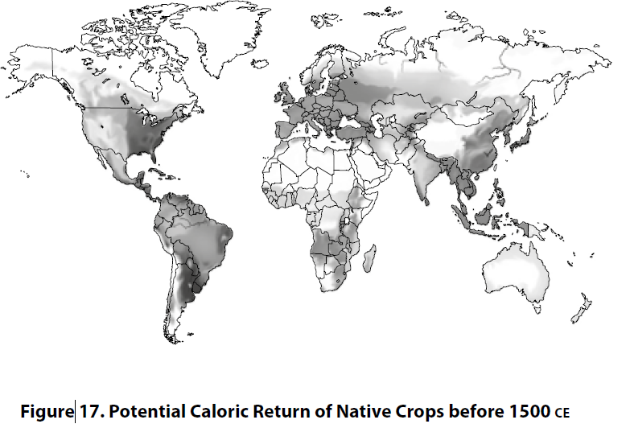

---

## Galor's Narrative

Population pressure drove the transition:

* Rising populations in favorable environments
* Declining wild resources per capita
* Necessity pushed communities toward intensification
* Suggests agriculture as **solution** to scarcity

**Implication:** Agriculture was progress, enabling larger populations and eventually civilization

This view is not uncontested.

---

#### Jared Diamond 
## The Worst Mistake in the History of the Human Race

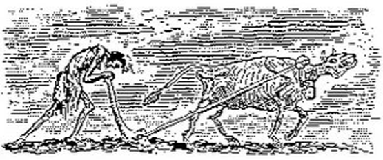

---
## Diamond: Agriculture as Decline


**Skeletal evidence confirms the costs:**
* Shorter stature, more cavities, signs of anemia
* Repetitive stress injuries from grinding grain
* New epidemic diseases from animal proximity and crowding

**Beyond health:**
* Harder work: more hours than foraging
* Worse nutrition: dependence on fewer crops
* Inequality: surplus enables elites
* Bondage: dense populations can be controlled

**If agriculture made life worse, why did it spread?**

---

## James Scott's Grain Thesis


James C. Scott argues:

* Agriculture didn't require states
* **States required agriculture**
* Grain is visible, storable, divisible, taxable
* States form where grain makes populations "legible"
* Tubers, forest products: can be hidden, left in ground

<br>

* Longer term implications for state formatiorn and development

---

## The Grain Thesis

Why grain? From the state's perspective:

* **Visible**: grows in fields, can be surveyed
* **Storable**: can be accumulated in granaries
* **Divisible**: can be measured and taxed precisely
* **Predictable harvest**: timing known in advance

This is what Scott means by "legibility" — states need to see and count their subjects and their produce

---

## Domesticable Species

- Only 14 large animals have been domesticated: sheep, goat, cow, pig, horse, Arabian camel, Bactrian camel, llama/alpaca, donkey, reindeer, water buffalo, yak, Bali cattle, Mithan.

- Fertile Crescent had 4 of these
- Most in Eurasia
- Agricultural technology harder to spread North-South (different latitudes/climates)


---

## The Costs of Agriculture


<!-- PLACEHOLDER: Chart comparing forager vs. farmer health indicators -->

Evidence from skeletal remains:

* Decline in average stature
* Increase in dental cavities
* Signs of anemia and nutritional deficiency
* Repetitive stress injuries from grinding grain
* New diseases from animal proximity

---

## Why Adopt Agriculture?

Three possibilities (not mutually exclusive):

1. **Pushed**: Climate change, population pressure, declining wild resources forced the transition

2. **Pulled**: Elites emerged who benefited from controlling surplus and coerced others into farming

3. **Trapped**: Once adopted, populations grew; couldn't return to foraging even if worse off

The transition was **gradual, halting, and sometimes reversed**

---

<!-- PART V: EARLY STATES -->

# Part V: Early States

---

### The Rise of Civilizations
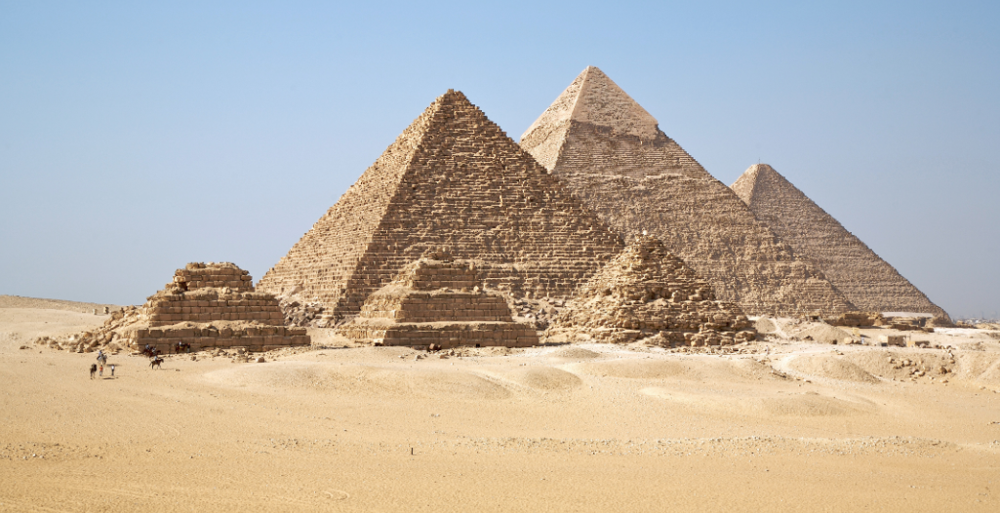
- Mesopotamia ~4000-3000 BCE
- Egypt ~3100 BCE
- Indus Valley ~2500 BCE
- China ~ 1500 BCE
- Central America/Mexico 1200 BCE

## Characteristics
- Urban Areas
- Monuments, infrastructure
- Writing systems
- Administration and Stratification

---

## Mesopotamia: The Setting

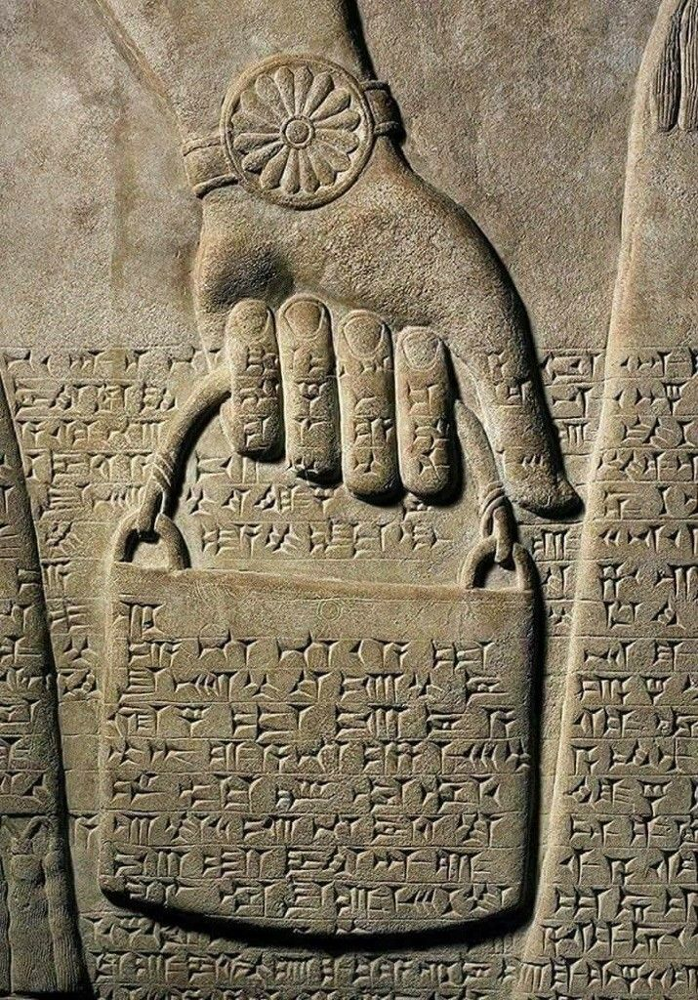

- Area between rivers (Tigris and Euphrates)
- Civilizations emerge 4th and 3rd millennia BCE
- Rich alluvium soils but volatile rivers
- Irrigation required — but extraordinarily productive
- Kingship, temples, and code of laws emerge

---

## Uruk: The First City


<!-- PLACEHOLDER: Artistic reconstruction of ancient Uruk -->

* By 3000 BCE: perhaps 40,000 inhabitants
* Unprecedented in human history
* Eanna temple complex: religious and administrative center
* Invention of writing (cuneiform) — initially for accounting
* Monumental architecture, cylinder seals, complex hierarchy

---

## The Warka Vase: Overview


<!-- YOUR IMAGE: Full photograph of the Warka Vase -->

* Found at Uruk (modern Warka, Iraq)
* Dated ~3200-3000 BCE
* Carved alabaster, approximately 1 meter tall
* One of the earliest narrative artworks
* Discovered in the Eanna temple complex, dedicated to goddess Inanna

---

## The Warka Vase: Reading the Registers


<!-- YOUR IMAGE: Drawn diagram showing the four registers -->

Four horizontal bands, read bottom to top:

**Bottom**: Water (rivers), grain and reeds
**Second**: Procession of rams and ewes
**Third**: Naked men carrying baskets of produce
**Top**: Goddess Inanna receiving tribute; priest-king presenting offerings

---

## The Warka Vase: A Visual Ideology

**What the arrangement communicates:**

* **Natural hierarchy**: Water → Plants → Animals → Humans → Gods
* Each level supports and feeds into the one above
* **Surplus as sacred duty**: Tribute is cosmic obligation, not theft
* **Workers are naked; elites are clothed**
* The vertical reading naturalizes the flow of tribute upward

The temple mediates between humans and divine forces. Agricultural surplus ensures continued fertility and protection.

---

## Social Frameworks

- Hunter Gatherer societies 
  - Small-scale, kinship ties, cooperation, sharing
  - Significant social strata rarely emerged

- Early agricultural settlements maintained such arrangements
  - Combined agriculture with hunter-gathering
  - At times abandoned agriculture

- But settlements grew; populations became denser
  - Rulers, noblemen, priests, artists, soldiers emerge
  - Taxes, accounting, writing, artistic production

---
## Stratification and State formation
- Taxes
- Agricultural producers had to produce surplus to maintain non-producing class
- **But why did they?**
- States as predators, as providers of public goods, or both?


---

## Timing of Agricultural Revolution

* What advantages/disadvantages conferred by agricultural revolutions?
  * Disadvantages
    * measurable decrease in stature and health
    * exposure to new epidemics from animals
    * Taxes, stratification, bondage and slavery
  * Advantages
    * larger concentrated populations, specialization 
    * more technological and artistic creation
    * public goods: protection, irrigation, communal life

---

## Three Views of State Formation

| **Predatory State** | **Public Goods State** | **Stationary Bandit** |
|---------------------|------------------------|----------------------|
| Scott, early Hobbes | Social contract theory | Olson |
| State extracts surplus through coercion | State solves coordination problems | Bandit settles down, invests in tax base |
| Walls keep people *in* | Walls keep enemies *out* | Both: protection + extraction |
| Slavery, bondage central | Defense, irrigation central | Ruler's interest aligned with subjects |

---

## Olson: Roving vs. Stationary Bandits

**Roving Bandit:**
* Raids, takes what he can, moves on
* No incentive to leave anything behind
* Maximizes short-term extraction

**Stationary Bandit:**
* Settles, claims territory, becomes "ruler"
* Has incentive to let subjects prosper (larger future tax base)
* Provides some public goods (protection, order)
* "An invisible hand guides him to produce the public good"

---

## Olson's Logic

The stationary bandit's incentive:

* If he takes 50% of output, he wants output to be as large as possible
* So he provides order, property rights, basic public goods
* His interests partially align with subjects' interests

**But:** Still extracts as much as he can without killing the goose
**And:** Subjects would prefer no bandit at all

This is a **theory of autocracy**, not democracy or voluntary cooperation

---

## Scott: The State as Predator

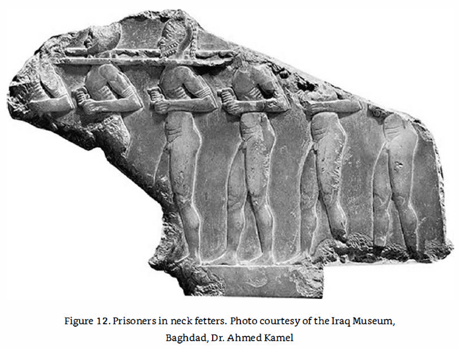

Scott emphasizes coercion, bondage, and population control as central to early statecraft.

---

## Land Abundance and the Coercion Problem

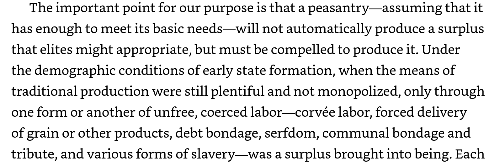 

---
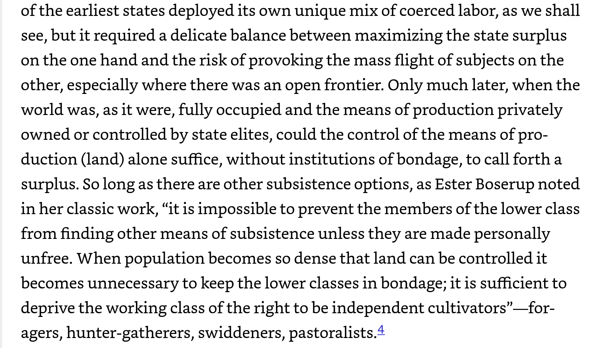 

---

## The Open Frontier Problem

Scott's key insight:

* When land is abundant, people can **flee** oppressive rulers
* States lack the power to prevent "leakage"
* Early legal codes obsessed with runaways, escapees

* **Ester Boserup**: Only when population becomes dense and land scarce can elites control by owning land alone
* Until then: bondage, slavery, walls, forced resettlement

---

## Chayanov and Peasant Logic

A.V. Chayanov showed:

* Peasant families produce enough for sufficiency, then stop
* No incentive to produce surplus without compulsion
* "Beyond sufficiency... there was no reason to increase the drudgery of agricultural production"

**Implication:** Surplus doesn't exist naturally — the state creates it through extraction

---

## Mesopotamian Warfare

Seth Richardson's research on early Mesopotamian wars:

* Wars were **not primarily about territory**
* They were about **capturing populations**
* Petty wars to conquer smaller communities and bring them to the "grain core"
* The prize was captives — especially women and children
* "The state with the most people was generally richest"

---

## "No Slavery, No State"

Scott argues bondage was central to early states:

* War captives as labor force
* Debt bondage trapped locals
* Corvée labor for public works
* Women captives for reproduction

* As late as 1800, perhaps three-quarters of world's population in some form of bondage
* Athens: slaves were two-thirds of population

---

### Earlier Ag Transition societies as Conquerors

* larger stratified populations with better technologies
* class of warrior/raiders
* immunity to many diseases

* Spread, displacing or absorbing existing hunter-gatherer groups
* e.g. The Austronesian expansion. Started ~6000 years ago from Taiwan
	* Easter Island ~800-1000 CE
	* New Zealand ~1250-1300 CE


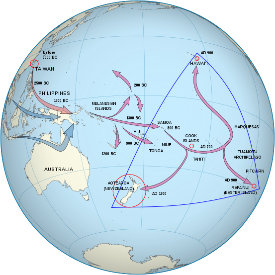

---
<!-- footer: Bantu Expansion starting ~3000 BCE-->
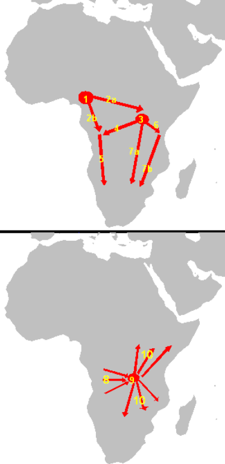
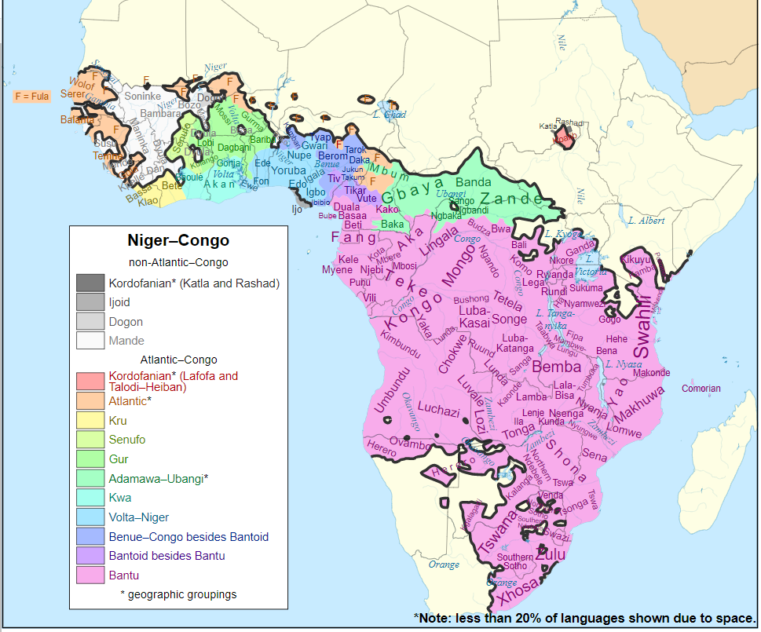

---
<!-- footer: Eco 331: Neolithic Revolution, Early States -->

## Evidence: River Shifts and State Formation

Presentation volunteers for Fri 2/7?
([PDF link](https://www.aeaweb.org/articles?id=10.1257/aer.20201919))
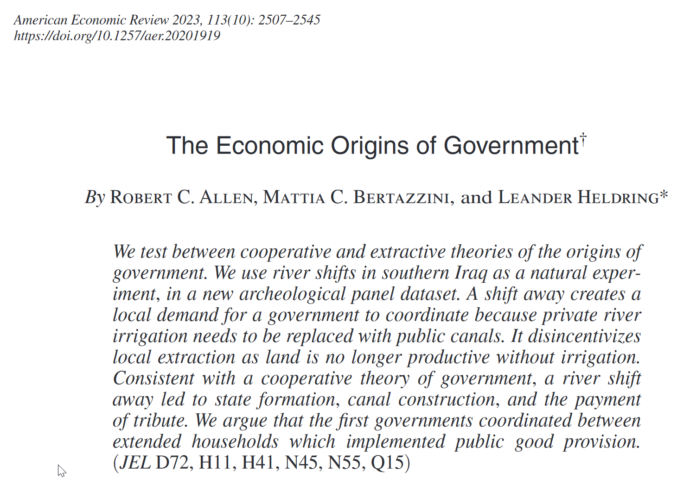
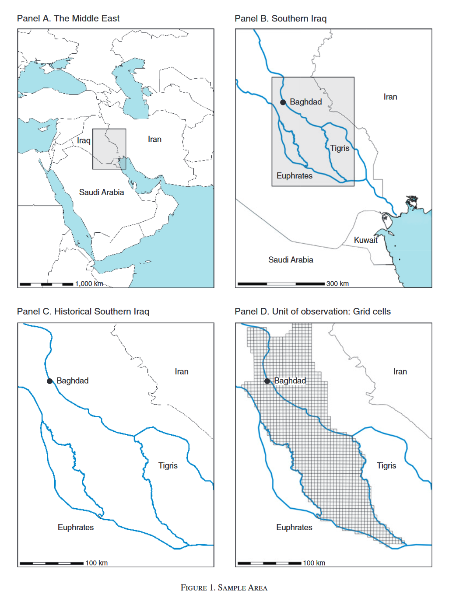

---

## Empirical Methodology
- 1374 5x5km grid cells covering area between modern Euphrates and Tigris
- Each observed 31 historical periods, 5000 BCE to 1950 CE
- Differences in Differences estimation
	- compare treated (flooded) to untreated control groups
	- how much did the event *increase* the outcome over trend
	

---


---
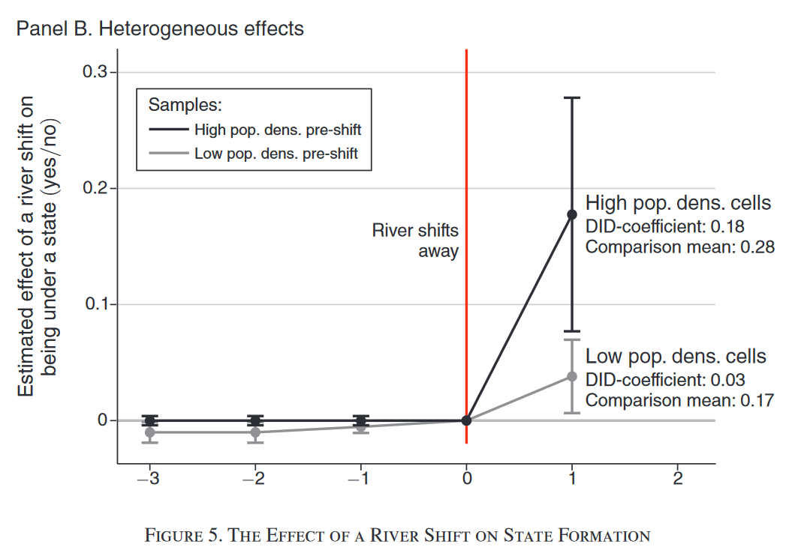

---
### Methodological concerns
- The 'identification' problem: Estimates might be 'biased' due to other factors that coincide with the shifts.
- Verify parallel trends assumption
- Argue river shift truly exogenous (not man-made)
- Argue no bias in archaeological evidence
- Placebo test: areas where river shifted *closer* (expect negative effect)

---

## Induced institutional, organizational, and technological change

**Douglas North** sports analogy:
- Institutions: Rules of the Game. Organizations: Teams. Individuals: players.

Institutions: e.g. State Laws, system of property rights.

Organizations form to coordinate and advance individual interests. 
Compete with other organizations.

Constrained by institutions but also attempt to change institutions.

---

## Summary: Why Did States Emerge?

No single answer — likely all factors played a role:

1. **Geography**: Grain-favorable environments made taxation possible
2. **Climate**: Holocene stability enabled sedentary agriculture  
3. **Coordination needs**: Irrigation, defense required organization
4. **Coercion capacity**: Surplus extraction required bondage, control
5. **Population dynamics**: Density enabled hierarchy; open frontiers limited it

The debate continues: Were early states net benefits or net costs to most people?

---

## Looking Ahead

* How do these patterns of state formation shape long-run development?
* Why do some regions develop strong states, others weak?
* How do property rights and institutions evolve?
* What explains the eventual "escape" from the Malthusian trap?

---
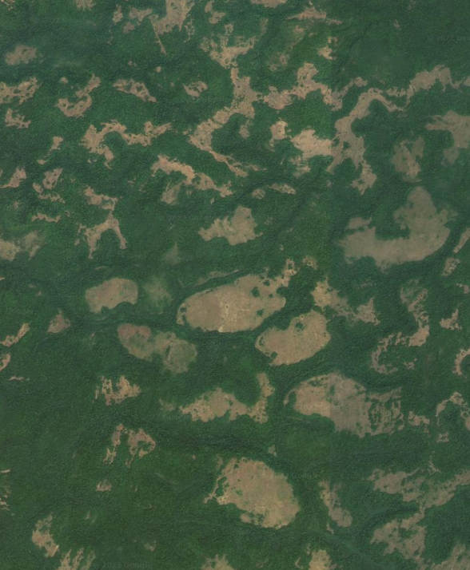
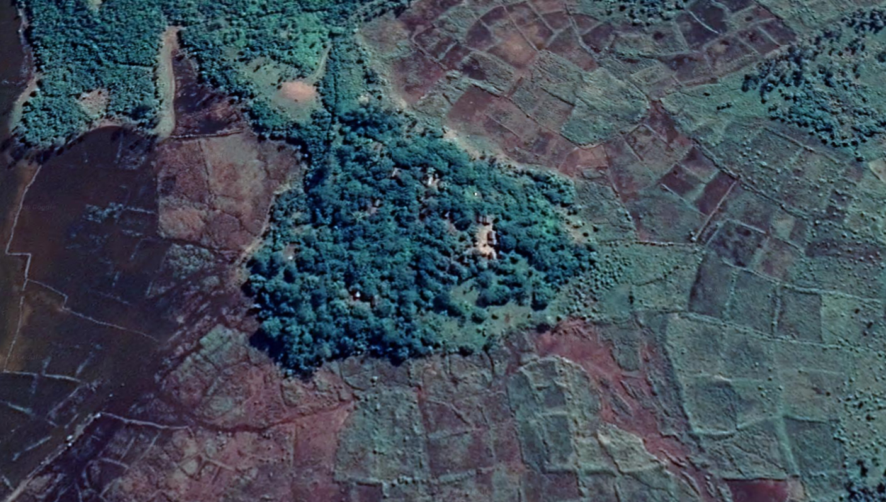
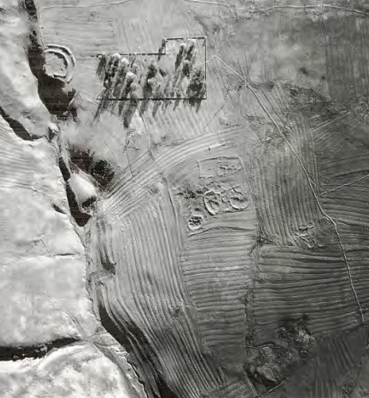
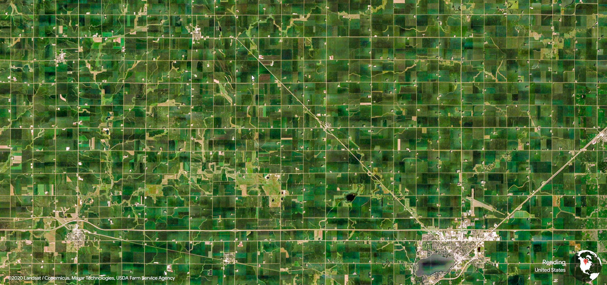

