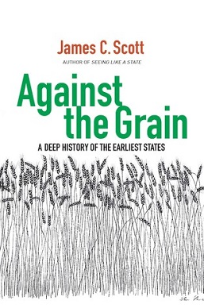
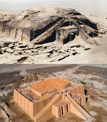
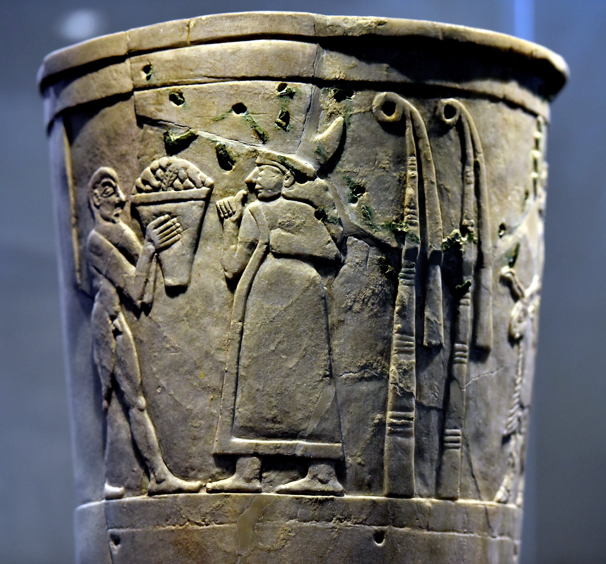
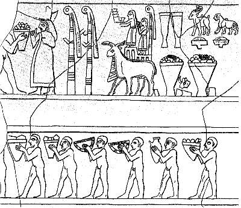
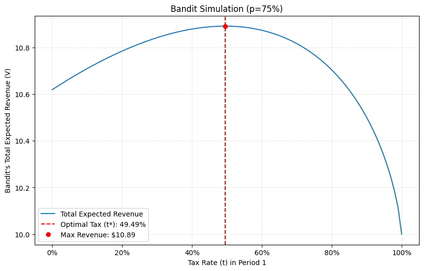
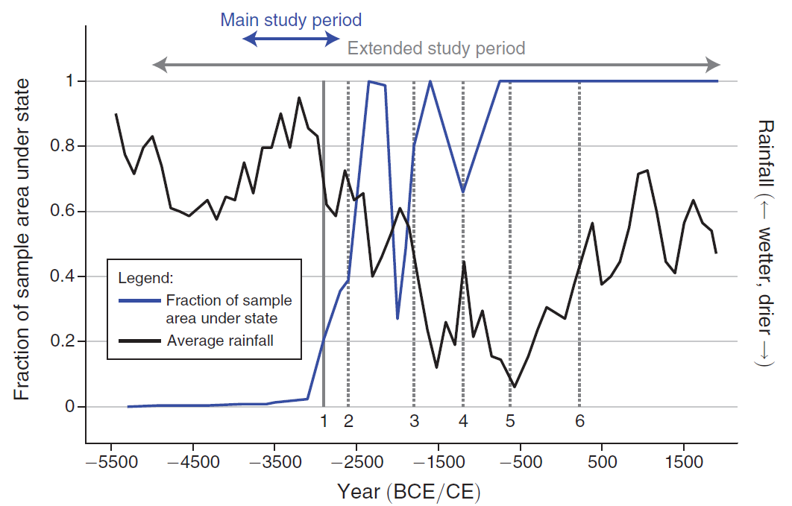

<!--
theme: gaia
paginate: true
footer: Eco 331: Neolithic Revolution, Early States
style: |
  section {font-size: 26px;}
-->

<!-- footer: "" -->

sl3_river-basins.jpg
# ECO 331
## Economic History

```
THE NEOLITHIC REVOLUTION, EARLY STATES
```
<br></br>
Jonathan Conning
Spring 2026
<br></br>


---
These slides cover readings from:

- OG, "Mysteries of the Human Journey" (1-10) 
- OG 1 "First Steps," 13-25
- OG 11 "The Legacy of the Agricultural Revolution" 201-214
- Diamond, J., 1999. "The Worst Mistake in the History of the Human Race"
- Scott, J.C., 2017. "Population Control: Bondage and War," Ch. 5 in _Against The Grain_
- Olson, M. "Dictatorship, Democracy, and Development" (1993)

---

<!-- PART I: THE LONG VIEW -->

# Part I: The Long View

---
# Galor's 'Mysteries of the Human Journey'

**What was life like in 1651?**


When **Thomas Hobbes** wrote _Leviathan_ in 1651, life was "Nasty, Brutish, and Short."

</br>

Hobbes argued humans in their natural state live in chaos, leading them to form a "social contract" surrendering rights to a sovereign in exchange for security.

---

## Living standards a few centuries ago

* 25% newborns died < age 1. Maternal deaths common.
* Life expectancy rarely exceeded 40.
* Darkness after sunset. Long winters, smoke-filled homes.
* Long hours to get water; washed infrequently. 
* Kings, lords, wars, conquest, banditry.
* A crisis $\Rightarrow$ 'belt-tightening' $\Rightarrow$ starvation/extinction. 

---


---


---
## The Malthusian Epoch


> ... during the Malthusian epoch... the fruits of technological advancements were channelled primarily towards larger and denser populations and had only glacial impact on their long-term prosperity. (Galor p4-5)

- What were underlying causes?
- How break out of this poverty trap? 

---
### Malthusian Predictions

New land or improved technology:
$\rightarrow$ rise in income per capita
$\rightarrow$ higher birth rate, Lower death rate $\rightarrow$ larger population.
$\rightarrow$ income per capita falls back.

Implications:
* Places with higher land productivity $\rightarrow$ higher population density 
* But, unless improvements are sustained, will return to steady sate with no higher income per capita.
<br>

* Next slides investigate this claim empirically:
---


---


---


## British evidence
* English data 1200-1790s
* Note effects of the Black Death > 1340s
* Transition ~ 17th century
   * Population rises without falling income per capita
* Escape: rising pop and income per capita > 1870s

---

## The Puzzle

- What forces permitted the transition from stagnation to growth?
- Why has timing been different across regions?
- Role of historical and pre-historical factors?

**Galor's answer:** Population size, diversity, and eventually human capital accumulation drive technological progress until a "phase transition" occurs.

---

<!-- PART II: HUMAN CAPABILITIES -->

# Part II: Human Capabilities

---
### The Human Brain

* Human brain: large, compressed, complex
* Tripled in size over 6M years, mostly 200-800K years ago
* Drawbacks:
  * Enormous energy use
  * Large size → difficult birth → 'half-baked' brains
  * Helpless babies, years until maturity

Why evolved this way? Why no *convergent evolution* in other species?

---

### Technology and Human Capital

* **Technology:** recipes for transforming inputs into useful outputs
* **Technological progress:** getting more for less
    * More/better outputs from same inputs, or same outputs with less
* **Human Capital**: factors influencing worker productivity (training, skills, health)

**Key insight:** Dependent children → long parental investment → inter-generational transmission of knowledge

---

## The Puzzling Primate


**Individual humans** are not strongest, fastest, or most intelligent primates
  * Can't survive alone in wild without learned skills
  * Lack instinctive behaviors other animals possess

**Henrich's contest**: Capuchin monkey vs. human in the wild — who wins?

---
### Yet Humans Dominate Every Habitat


**Why?** Culture enables solving survival problems through **learned knowledge** 
rather than biological adaptation.

---
## Ants vs. Humans


* **One species of humans** thrives in arctic, desert, tropical, and high-altitude environments
  * **Cultural adaptation** — not biological adaptation

* **~15,000 ant species:** each specialized for particular habitats

<br>
* One human species does what thousands of ant species cannot

---

## Cumulative Culture


* **Culture** = information stored outside the genome (tools, techniques, norms)
* **Cumulative** = each generation builds on prior knowledge
* Over hundreds of thousands of years: simple rocks → hand axes → composite tools

---

### Fire: The First Domestication


Long before agriculture, hominids were domesticating the environment.

---

## Culture-Gene Coevolution

Culture and genes evolve together in a **feedback loop**:

* **Gene → Culture**: Predispositions for learning, imitation, language
* **Culture → Gene**: Cultural practices create selection pressures

Example: Domestication of dairy animals → selection for lactase persistence


---
### Technological advancements $\Longleftrightarrow$ further evolution

  * **Mastery of Fire** 
    (by *homo erectus* >400K years ago, pre-dating *Homo Sapiens*) 
    * **Cooking** 
      * faster absorption of more calories → larger brains
      * less chewing → less need for large jaw → more cranium space
    * **Domestication of the environment**
      * The first great tool to shape the environment


---

### Self-Domestication: Humans Evolving Through Culture


* Cultural norms reward **cooperation**, punish **aggression**
* Selection toward prosocial traits
* Similar to how animals are domesticated through selective breeding
* But humans did it to themselves through **cultural practices**

---


# Galor's Positive Feedback Loops

- environmental changes
  $\Rightarrow$ technological innovations
     $\Rightarrow$ population growth
     $\Rightarrow$ new adaptations of the environment
     $\Rightarrow$ enhancement of ability to manipulate environment
     $\Rightarrow$ more technological change


---

# Hominids

* *Homo erectus* (~2M years ago) spread to Eurasia
  * Longest-lived early human species (~9X longer than *homo sapiens*)
  * Survived until ~117K years ago


---


### Mitochondrial Eve

- Unique genetic code passed from female to female
- Every person alive descends from this woman (~155,000 years ago)

**Humans are remarkably similar genetically:**
- One band of chimps in the Congo has more genetic diversity than all 8 billion humans
- Likely due to a **population bottleneck** ~70,000 years ago
- All humans descend from a small surviving population — perhaps only thousands

---

# Out of Africa 


- Anatomically modern *Homo Sapiens*: ~200-300,000 years ago in Horn of Africa
- Major migration out of Africa 60-90K years ago
- Reaches South Asia >70K, Australia 47-65K, Europe 45K, Americas 14-23K years ago

---

## Megafauna Extinction in the Americas


* By time humans reach Americas, hunting methods highly evolved
* Local large animals had **not co-evolved** with human predators
* 30+ mammals rapidly driven to extinction: mammoths, giant armadillos, horses

**Africa was different:** Animals co-evolved with humans, learned to fear them → megafauna survived

---

## The "Original Affluent Society"?


<!-- PLACEHOLDER: Photo of Hadza or San people -->

**Marshall Sahlins** (1972) challenged the view of primitive hardship:

* Hunter-gatherers worked **15-20 hours/week**
* Diverse, nutritious diets; extensive leisure
* Low material possessions by choice

**James Scott** adds: For most of history, people **fled** states when they could. The periphery was refuge, not wasteland.

---

<!-- PART IV: THE AGRICULTURAL TRANSITION -->

# The Neolithic Transition

Or the Invetions of agriculture.

---

## Climate and the Fertile Crescent


<!-- PLACEHOLDER: Map showing Fertile Crescent -->

**End of last Ice Age (~11,700 years ago):**
* Younger Dryas cold snap ends
* Warmer, wetter, and crucially **more stable** conditions

**The Fertile Crescent:**
* Concentration of domesticable plants: wheat, barley, lentils
* Concentration of domesticable animals: sheep, goat, cattle, pig

---

### Galor on the Agricultural Revolution


Transition from nomadic hunter-gatherer to sedentary agricultural societies began ~12K years ago.

---


---

## Galor's Narrative: Agriculture as Progress

Population pressure drove the transition:

* Rising populations in favorable environments
* Declining wild resources per capita
* Necessity pushed communities toward intensification

**Implication:** Agriculture as **solution** to scarcity, enabling larger populations and eventually civilization

---

#### Jared Diamond 
## The Worst Mistake in the History of the Human Race


---

## Diamond: Agriculture as Decline


<!-- PLACEHOLDER: Health comparison image -->

**Skeletal evidence confirms the costs:**
* Shorter stature, more cavities, signs of anemia
* Repetitive stress injuries from grinding grain
* New epidemic diseases from animal proximity

**Beyond health:**
* Harder work: more hours than foraging
* Worse nutrition: dependence on fewer crops
* Inequality and bondage emerge

**If agriculture made life worse, why did it spread?**

---

## Scott: Agriculture as Precondition for States


James C. Scott argues:

* Agriculture didn't require states
* **States required agriculture**
* The "domus" (settled agricultural life) was a site of control, not progress.

**The "barbarians" beyond the State's control:**
  * often refugees *from* civilization
  * choosing freedom, mobility, and often better health in frontier regions, 
  over the grain tax and the corvée.


---

## Grain States

From the state's perspective, grain is ideal:

* **Visible**: grows in fields, can be surveyed
* **Storable**: can be accumulated in granaries
* **Divisible**: can be measured and taxed precisely
* **Predictable**: harvest timing known in advance

Tubers, forest products: can be hidden, left in ground, hard to tax

 

---

## Why Adopt Agriculture? Three Views

| **Galor** | **Diamond** | **Scott** |
|-----------|-------------|-----------|
| Necessity/Progress | Decline/Mistake | Precondition for extraction |
| Population pressure  | Made life worse | Enabled states to tax and control |
| Led to civilization | Led to disease, inequality | Led to bondage |

The transition was **gradual, halting, and sometimes reversed.**  Over hundreds or even thousands of years


---

### Early Civilizations


- Mesopotamia ~4000-3000 BCE
- Egypt ~3100 BCE
- Indus Valley ~2500 BCE
- China ~1500 BCE
- Mesoamerica ~1200 BCE

**Characteristics:** Urban areas, monuments, writing, administration, stratification

---

## Mesopotamia: The Setting


- Area between Tigris and Euphrates rivers
- Rich alluvium soils but volatile, unpredictable floods
- Irrigation required — but extraordinarily productive once developed
- Civilizations emerge 4th-3rd millennia BCE
- Cuneiform writing, kingship, temples, legal codes

---

## Uruk: The First City



* By 3000 BCE: perhaps **40,000 inhabitants** — unprecedented
* Eanna temple complex: religious and administrative center
* Invention of writing (cuneiform) — initially for accounting
* Monumental architecture, cylinder seals, complex hierarchy

---

## The Warka Vase: Overview


 

* Found at Uruk (modern Warka, Iraq)
* Dated ~3200-3000 BCE
* Carved alabaster, ~1 meter tall
* One of the earliest surviving narrative artworks
* From the Eanna temple complex, dedicated to goddess Inanna

---

## The Warka Vase: Reading the Registers


<!-- YOUR IMAGE: Drawn diagram of registers -->

Four horizontal bands, read bottom to top:

**Bottom**: Water (rivers), grain and reeds
**Second**: Procession of rams and ewes
**Third**: Naked men carrying baskets of produce
**Top**: Goddess Inanna receiving tribute; priest-king presenting offerings

---

## The Warka Vase: A Visual Ideology

**What the arrangement communicates:**

* **Natural hierarchy**: Water → Plants → Animals → Humans → Gods
* Each level supports and feeds the one above
* **Surplus as sacred duty**: Tribute is cosmic obligation, not theft
* **Workers are naked; elites are clothed**

The vertical reading **naturalizes** the flow of tribute upward. The temple mediates between humans and gods.

---

## Three Views of State Formation

| **Predatory State** | **Public Goods State** | **Stationary Bandit** |
|---------------------|------------------------|----------------------|
| Scott | Social contract | Olson |
| Extracts surplus via coercion | Solves coordination problems | Settles, invests in tax base |
| Walls keep people *in* | Walls keep enemies *out* | Both |
| Bondage central | Defense, irrigation central | Interests partially aligned |


---
## Olson's Stationary versus Roving Bandits
Olson, Mancur (1993) "Dictatorship, Democracy, and Development," *American Political Science Review 87*: 567-576.

- **The Roving Bandits:**
  - Move from place to place with no long-term stake.
  - Incentive: Plunder 100% of assets.
  - Result: Destroys the economy.
 
  </br>
- **The Stationary Bandit:**
  - Stays in one place (e.g., a long-term dictator).
  - Incentive: "Steal" (tax) at a rate that maximizes revenue *over time*.
  - Will *not* tax at 100%, as it kills future income.
  - *May provide public goods (protection, roads, irrigation) to increase future tax base.*

---

## Olson's Bandit model

- Period 1 and 2.  
- Plunders proportion $t$ of outputs $y_1$ and all of $y_2$ .  Time discount $\beta$.
- In second period output is a function of remaining output  (e.g. harvest from left over seed stock):
$$
y_2=f[(1-t)\cdot y_1]
$$

**Stationary bandit** chooses $t$ to solve:
$$
\max_t \ \ t \cdot y_1+\beta f[(1-t)\cdot y_1]
$$
---

The **stationary bandit** maximizes:
$$
\max_t \ \ t \cdot y_1+\beta f[(1-t)\cdot y_1]
$$
Too high of a tax $t$ today lowers output for plunder tomorrow. 
The maximum plunder return is achieved when:
$$
y_1-\beta y_1 f^{\prime}\left[(1-t) y_1\right]=0
$$
or 
$$
\beta f^{\prime}\left[(1-t) y_1\right]=1
$$
Leads to an interior solution $0<t<1$

See [python Colab Notebook](https://colab.research.google.com/drive/1aM13a-Zu8zk3mlp_wkmncFxsE9Gs8zan?usp=sharing)


---




---

### Example 

$$
\max_t \ \  t y_1+\beta \sqrt{((1-t)y_1)}
$$
first-order conditions:

$$
\beta \frac{1}{2\sqrt{(1-t)y_1}}=1
$$

Solve to find optimal plunder rate $t$ of:
$$
t = 1-\frac{\beta^2}{y_1}
$$
Bandit raids less when: 
- More patient (higher $\beta$).   
- Prize today $y_1$ not large (better to wait).


---
**Mancur Olson:**  **An autocracy is essentially a "stationary bandit"** who has monopolized the use of violence and theft (we call it "taxation") in a specific area.

Making states accountable:

- **The threat of revolt:** Higher taxes now decreases the probability ($p_{effective}$) that the bandit survives to collect any revenue in Period 2.  
$$p(t) = p_{base} \cdot (1 - t^k)$$

$$V = \underbrace{t \cdot y_1}_{\text{Period 1 Revenue}} + \underbrace{p(t) \cdot f((1 - t)y_1)}_{\text{Expected Period 2 Revenue}}$$

<br>

- **Democracy** Government will need to be accountable to (at least) 51% of the electorate to stay in power. Incentive to offer public services that the _people_ (the median voter) wants, not just what the _ruler_ wants.  


---

## Scott: The State as Population Machine


Scott emphasizes coercion, bondage, and population control as central to early statecraft.

---

## The Open Frontier Problem

 

---

 

---

## Land Abundance and Coercion, or ... Freedom?

* When land is abundant, people are scarce. 
* People can **flee** oppressive rulers
* States try to prevent "leakage"
* Early legal codes obsessed with runaways, escapees

<br>
* As late as 1800, perhaps **three-quarters** of world's population in some form of bondage. In Athens, slaves were **two-thirds** of population.


---

## Mesopotamian Wars for People

**Seth Richardson's research:**

* Early Mesopotamian wars were **not about territory**
* They were about **capturing populations**
* Petty wars to conquer smaller communities, bring them to the "grain core"
* The prize was captives — especially women and children

Scott: "The state with the most people was generally richest"


---

## Evidence: River Shifts and State Formation


([PDF link](https://www.aeaweb.org/articles?id=10.1257/aer.20201919))

---

## Evidence: River Shifts and State Formation

**Different empirical implications or competing theories of government:** 
* **Extraction-based:** states should form where rivers are (intact tax base). 
* **Cooperation-based:** states should form where rivers shifted away (need collective coordination for canals).

Authors distinguish between **initial state formation** and later evolution, acknowledging they may have become extractice.  Yet they point to continued public goods provision after state provision (when rivers shifted away), suggesting states responded to coordination demands even if also extractive.  


---

### Why was state formation rare?

States formed as regional rainfall declined (making irrigation valuable) and where:

* High Population density (pre-shift)
* Settlements aligned with landscape gradients (enabling canal efficiency)
* water access relatively easy and irrigation productivity gains substantial 
<br>
Without these conditions, migration or nomadism  was a preferable alternative to state formation.
---

## Why Did Agriculture Spread? A Synthesis (I)

Agriculture spread not because it made life better, but by incremental steps that became irreversible:

- **Caloric density and carrying capacity:** Agriculture supports 10-100X more people per square mile. More calories per acre (even though fewer calories per hour work!).  Even if individuals worse off, populations grow. Agriculturalists field more warriors.  Epidemic disease as weapon.

| Phase | Mechanism |
|-------|-----------|
| **Initial experimentation** | Low-cost insurance; "play farming" alongside foraging |
| **Gradual intensification** | Population growth creates pressure; ratchet effects |
| **Commitment/trap** | Can't return to foraging; land becomes scarce |


Each step seemed rational. No single generation "chose" agricultural life—they inherited commitments made by ancestors.

---

## Why Did Agriculture Spread? A Synthesis (II)

| Phase | Mechanism |
|-------|-----------|
| **State formation** | Coercion extracts surplus; bondage prevents flight |
| **Expansion/conquest** | Demographic and military advantage over foragers |

**Who benefits?**
- Early phases: everyone (backup food source)
- Middle phases: population grows, but individuals work harder
- Late phases: elites benefit enormously; commoners are stuck

Agriculture enabled states thatmight have formed to solve coordination problems but grew to coerce and conquer. Agricultural societies outcompeted foragers demographically and militarily—even when foragers were healthier and happier.

---
## Summary: Why Did States Emerge?

No single answer — likely all factors:

1. **Geography**: Grain-favorable environments made taxation possible
2. **Climate**: Holocene stability enabled sedentary agriculture  
3. **Coordination needs**: Irrigation, defense required organization
4. **Coercion capacity**: Surplus extraction required bondage, control
5. **Population dynamics**: Density enabled hierarchy; open frontiers limited it

**The debate continues:** Were early states net benefits or net costs to most people?

---

## Looking Ahead

* How do patterns of state formation shape long-run development?
* Why do some regions develop strong centralized states, others neevr or weak?
* Where, when, and how do property rights and other institutions emerge and evolve?
* What explains the eventual "escape" from the Malthusian trap?

---


---
## Slides we did not use
- But might be of interest...

---
## Climate Variability and Civilizations


**Medieval Warm Period (900-1300 CE)**
- North Atlantic warming → Viking expansion, Greenland settlement

**Little Ice Age (1300-1850 CE)**
- Glacier growth, failed harvests
- Viking Greenland collapse, widespread European famines
- Demonstrates how climate variability shapes civilizations

---

## Modern Period: Industrialization and Unprecedented Warming
**1850-present**


- General warming begins ~1850
- **Accelerated warming since 1950** (industrial era)
- Glacier retreat, sea level rise
- Rate of change unprecedented in human history
- Unlike past climate shifts, this change is rapid and human-caused


---

### Jared Diamond: Agricultural Advantage as Conquest


**"Guns, Germs, and Steel" Thesis:**

States with earlier agriculture developed **larger, stratified populations** with better technologies:
* Domesticated animals → disease immunity
* Surplus → specialization 
→ weapons and military technology
* Warrior/raider classes emerge

**Result:** Earlier agricultural societies **conquer and displace** hunter-gatherers and later development agricultural societies.  

---

## Classic Cases of Conquest-Based Expansion

**European Conquest of Americas (1492+)**
* Epidemic disease killed 90% of indigenous populations
* Steel weapons, horses, and military technology
* Military conquest despite being outnumbered

**Arab/Islamic Expansion (7th-8th centuries)**
* Fertile Crescent agriculture + domesticated animals
* Iron weapons, organized armies
* Conquest across North Africa, Iberia, Central Asia

---
## Classic Cases of Conquest-Based Expansion (contd)
**Chinese Expansion South**
* Early agriculture (Yellow River basin)
* Iron technology, large populations
* Gradual conquest and assimilation of southern regions

**Mongol Empire**
* Pastoral horse nomads with superior cavalry technology
* Conquered vast agricultural societies through military force

---

## But Are All Agricultural Expansions the Same?

**Three Different Models of Expansion:**

| **Model** | **Primary Driver** | **Mechanism** | **Interaction** | **State Formation** |
|-----------|---|---|---|---|
| **Diamond's Model** | Agriculture + disease immunity | Military conquest | Violent displacement | Coercive extraction |
| **Bantu Expansion** | Agriculture + population growth | Gradual settlement | Intermarriage & mixing | Late (16th-19th centuries) |
| **Austronesian Expansion** | Maritime technology | Peaceful settlement | Demographic assimilation | Maritime trade-based (2nd-7th centuries) |

**Key point:** Not all agricultural expansions followed Diamond's conquest model

---

### Early Bantu Expansion: Settlement


**Timeline:** ~3000 BCE - 1000 CE

**Origin & Extent:** West-Central Africa (Cameroon/Nigeria) → spread across sub-Saharan Africa

**Key differences from Diamond:**
* Primarily **settlement-based**, not militaristic conquest
* Small migrating groups, not conquering armies
* **Intermarriage** with San/Khoisan hunter-gatherers common
* Iron-working came *centuries after* initial expansion
* **Demographic dominance** through population growth

---

## Later Bantu Expansion: State Conquest


**Early Expansion (3000 BCE - 1000 CE):**
* Decentralized communities
* Gradual colonization with cultural mixing

**States emerged *much later* (13th-19th centuries):**
* Kingdom of Kongo
* Lunda Empire
* Great Zimbabwe
* Zulu, Ndebele (warrior kingdoms, 19th century)

**Pattern:**
Peaceful settlement → population growth → **later** state consolidation and militarization

---

## The Austronesian Expansion: Maritime Innovation


**Timeline:** ~3000 BCE onward; most intensive 2000 BCE - 1 CE

**Origin & Extent:** Taiwan/Southeast Asia → half the planet
* **West**: Madagascar. **East**: Easter Island, Hawaii. **South**: New Zealand (~1280 CE)

**Revolutionary maritime technology**
* Outrigger canoes and catamarans
* Sophisticated wayfinding (star paths, wave patterns, bird observations)
* Settled previously uninhabited Pacific islands

---

## Austronesian Expansion: Initial Peaceful Settlement

**Mechanism:** Settlement colonization, not military conquest
* Peaceful **demographic assimilation** with indigenous groups
* High rates of intermarriage in Indonesia
* Exception: "Neolithic standoff" in New Guinea (indigenous agricultural societies resisted cultural displacement)

**Agricultural package:** Rice cultivation, domesticated animals (pigs, chickens), crops

**State formation came much later (2nd-7th centuries CE):**
* Maritime **trade networks** → thalassocracies (sea-based polities)
* Srivijaya, Majapahit empires
* Based on controlling **trading ports (emporia)**, not territorial conquest
* Some adopted foreign (Hindu) administrative models

---

## The Māori: From Peaceful Settlers to Fierce Warriors

**Austronesian/Polynesian settlers** arrived in New Zealand ~1280 CE

* Found rich, previously uninhabited territory
* No human competition or endemic disease

**Later development (15th-19th centuries):**
* Population growth + resource competition
* **Fierce inter-tribal warfare** developed
* Fortified villages (pā), hierarchical chiefdoms
* Warrior culture and territorial conquest emerged

**Key insight:** **Sequence matters**
* Peaceful settlement first → Later militarization as constraints emerged
* Supports Allen et al.: institutions created for cooperation can later be used for coercion

---

## What Explains Different Expansion Patterns?

**Empty vs. occupied territory:**
* Pacific islands (Austronesian): No competition → peaceful colonization
* Americas (European): Indigenous populations → violent conquest

**Disease asymmetry:**
* Europeans: Epidemic disease as devastating weapon
* Bantu/Austronesian: Less disease differential

**Technology type:**
* Military technology (European, Arab) → conquest-based
* Maritime technology (Austronesian) → settlement-based colonization
* Agricultural productivity (Bantu) → demographic growth

---

**State formation timeline:**
* States before expansion → conquest more likely (organized armies available)
* States after expansion → settlement pattern → later militarization
* Trade networks → thalassocracies (maritime states)

