<!--
theme: gaia
paginate: true
footer: Eco 331: Neolithic Revolution, Early States
style: |
  section {font-size: 26px;}
  .columns {
    display: grid;
    grid-template-columns: repeat(2, minmax(0, 1fr));
    gap: 1rem;
  }
-->

<!-- footer: "" -->


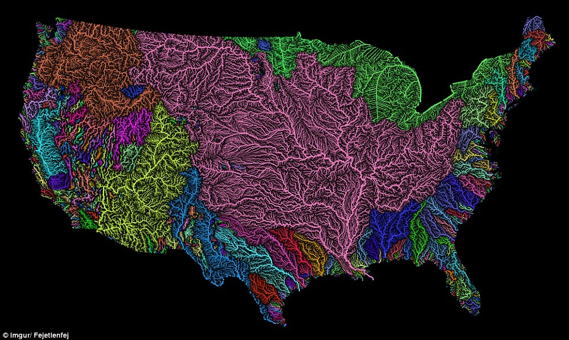

# ECO 331
## Economic History

```
GEOGRAPHY
```
Jonathan Conning
Spring 2026

---
### Readings


- OG 10 "The Shadow of Geography"
- KR 2 "Did Some Societies Win the Geography Lottery" (19-36)
- National Geographic (2015) _Guns, Germs, and Steel_. Episode 1 of 3, especially 29:41-end. (video link.)

<!-- 
## Large Language Models
* Amazing tools.  Use them !  
	* Great for filling in historical knowledge. Digging deeper.
	* Interact. Follow up and debate.
* [Gemini](https://gemini.google.com/), [Claude](https://claude.ai/), [ChatGPT](https://chatgpt.com/), [Open Meta](https://www.meta.ai/), [Deepseek](https://chat.deepseek.com/), [Mistral](https://chat.mistral.ai/chat)
	* Free, have free tier, or free trial.
* Do not substitute for reading (but do use to dig deeper).
* Write your own questions/comments. 
	* I can spot, and will penalize, generic answers!
-->
---
### Fundamental versus Proximate Causes of Growth

* Proximate Causes
  * Capital and Human Capital Accumulation
  * Trade and Specialization
  * Technological Innovation

* But what causes these things to happen?

* Candidates: Geography, Institutions, Culture, Demography.


---
### Geography Questions

- What geography features constrain/enable economic growth?
	- What are the causal mechanisms?
	- What is Jared Diamond's main thesis?
- Is geography fate?  Can transport infrastructure reverse effects?  
- Do places that require more cooperation to overcome environmental hardships have an advantage or disadvantage?
- Does better geography raise the level and/or the growth rate?

---

## A simple primer on linear regression

Suppose we have data on students scores on a midterm and a final.

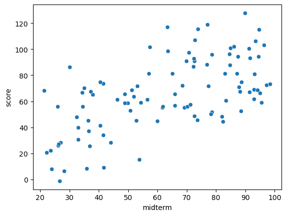

---
We hypothesize 


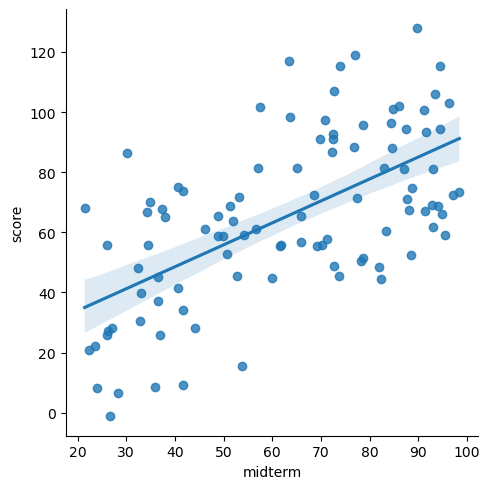


Linear Regression to fit a hypothesized linear relation of the form

$$
y_i = a + b_1 \cdot x_i + e_i
$$


where:

$y_i$ = final exam score
$x_i$ = midterm exam score
$e_i$ = i.i.d. error

---
Students w/ high attendance (orange) have on avg. higher scores:

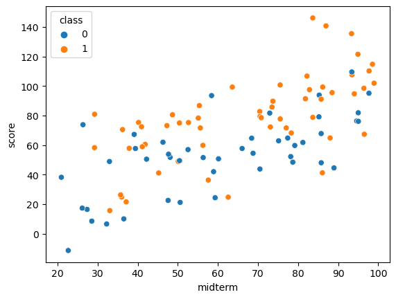


---
## Revised model 
- Controls for a previously omitted variable 

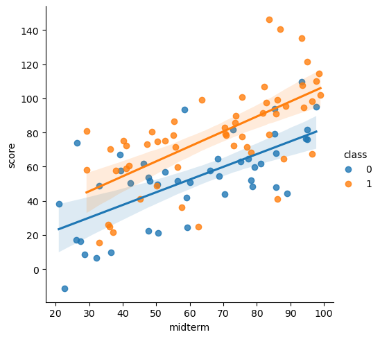

$$
y_i = a + b_1 \cdot x_i + b_2 \cdot D_i + e_i
$$

$y_i$ = final exam score
$x_i$ = midterm exam score
$D_i$ = 1 if attended regularly
$e_i$ = error term


---


If `class` dummy is omitted; estimated $b_1$ coefficient biased upward. 


---

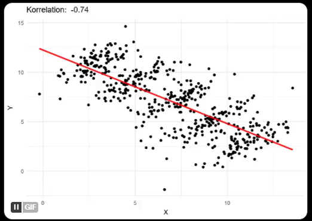
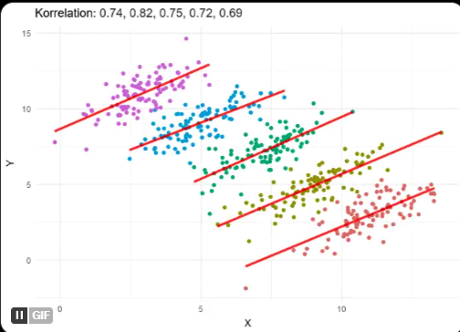


---
## Econometric Challenges

  - Identification challenges: are estimated effects causal and unbiased.
   -   Spurious correlation or Causation?
	   - Are the regressors exogenous or Endogenous? 

- Biased estimates might be due to:
  - omitted variables
  - selection or endogeneity bias 
    e.g. is $x_i$ variable exogenous (like the weather) or determined by same unobserved factors that affect $y_i$ 

---
## Does ice-cream explain pool drownings?

* ice-cream consumption jointly determined with pool drownings
* both are affected by temperature
    * when weather is hot
      * more pool use and drownings
      * more ice-cream consumption


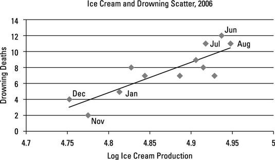


---

## Empirical Methodology: Difference-in-Differences
Recall Allen et al (2023) “The Economic Origins of Government.” 

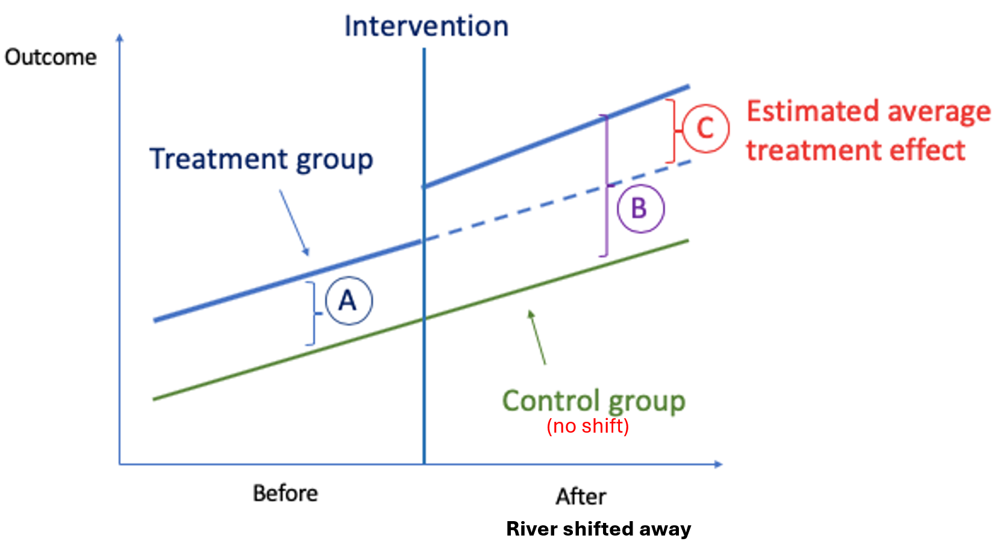

- 1374 grid cells covering Tigris-Euphrates area
- 31 historical periods, 5000 BCE to 1950 CE
- Compare treated (river shifted toward) vs. control areas
- How much did the shift *increase* state formation?


---

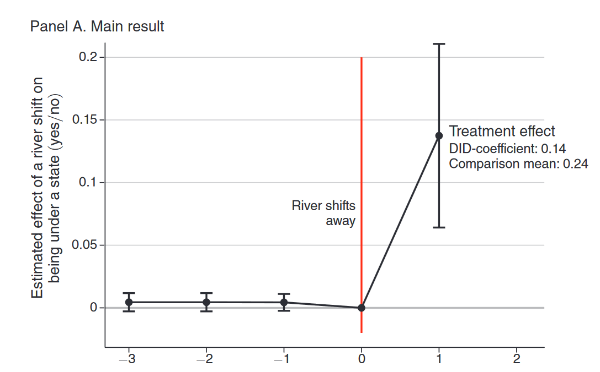


---
## Machine learning versus econometrics

- ML (including neural networks) is a new term for *applied predictive modeling*.
  - ML values robust prediction accuracy. 
  - Searches through very flexible non-linear models to find best 'fit'.
  - but generally not for causal identification or unbiased estimate of impacts.
  - If ice-cream helps predict drownings, model will use ice-cream.
  - Not useful for policy: Prohibit ice-cream will not reduce drownings!
- Econometrics is for hypothesis-testing.
  - Economist uses theory and evidence to posit an identified causal relationship
  - Uses statistical inference methods to obtain unbiased estimates of causal model parameters and tests hypothesised relationships.


---
### Geography and Economic Development
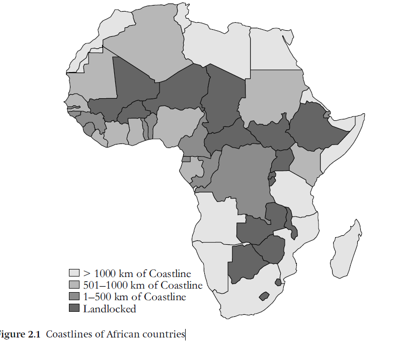
* How does geography shape development?
* Jeff Sachs (Columbia) observes many poorest countries are landlocked.
* Water-based the most cost-effective transport, so a major disadvantage.
---


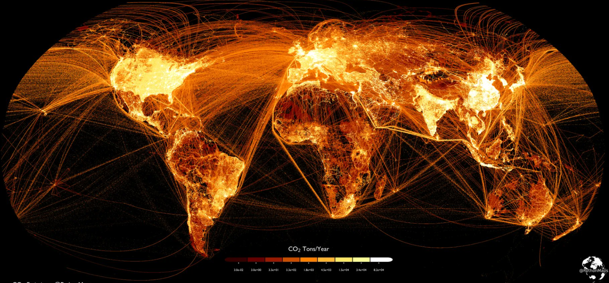
---

---
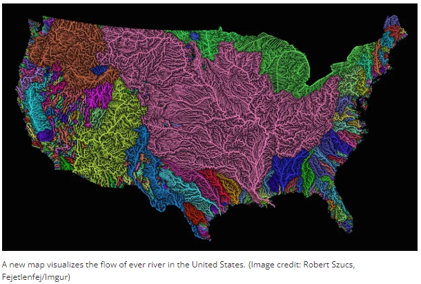


---
next slide:

### India's Ganges River Basin

- One of the most fertile places on earth
- Hot (at same latitude as deserts)
- But moist due to monsoon rains off the Arabian sea


---

<div class="columns">
<div class="columns-left">

## River Basins

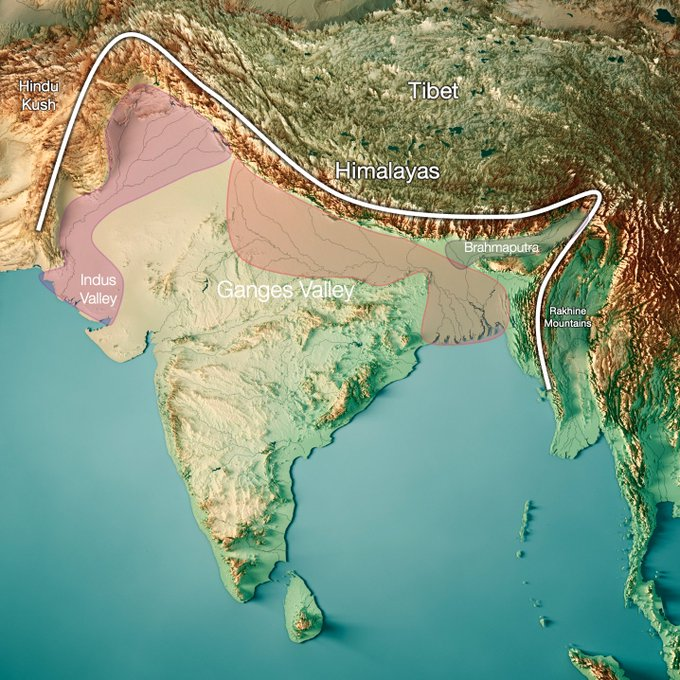
[Source](https://twitter.com/tomaspueyo/status/1622753371663867905)

</div>
<div class="columns-right">


## Population Density


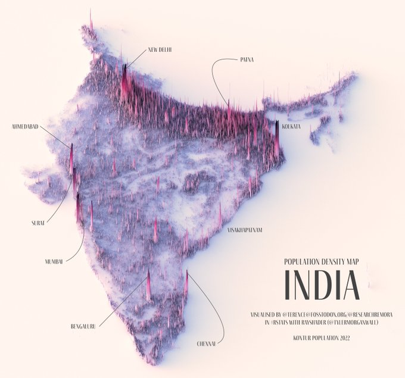


</div>
</div>


---
<!-- iframe not visible in preview, use --html option in marp cli -->

<iframe width="700" height="394" src="https://www.youtube.com/embed/yLGSDtCiswA" title="YouTube video player" frameborder="0" allow="accelerometer; autoplay; clipboard-write; encrypted-media; gyroscope; picture-in-picture; web-share" allowfullscreen></iframe>

[Population through the ages video](https://www.youtube.com/watch?v=PUwmA3Q0_OE)


---

## Geography and Disease Environment
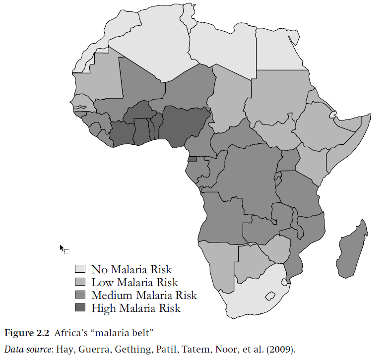

* Geography determines disease environment.
* Malaria has likely killed more than any other cause.
* Malaria belt regions grow as much as 1.3% slower (Gallup and Sachs, 2001).
* By reducing population density, delayed state formation.

---


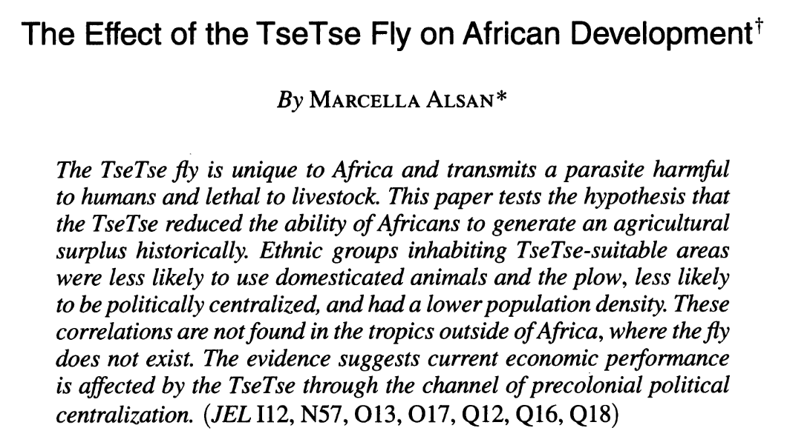

---

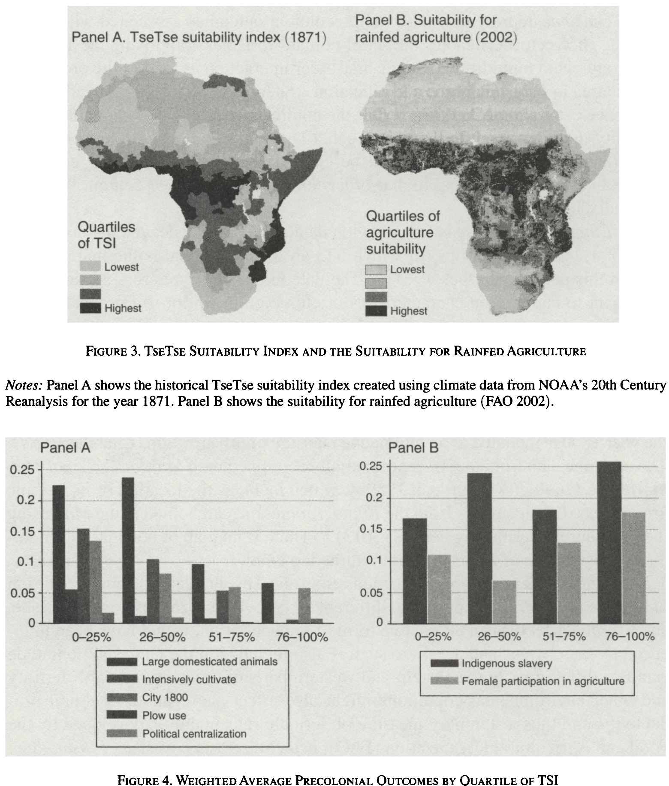

## Geography and Disease Environment

* tsetse fly causes sleeping sickness.
* kills livestock
* Impacts economic development and political formation
* Where fly is active less likely to develop large-scale states (Alsan, 2014)
---
### Jared Diamond
### Guns, Germs, and Steel

* Shape of Continents determined speed of technological diffusion.

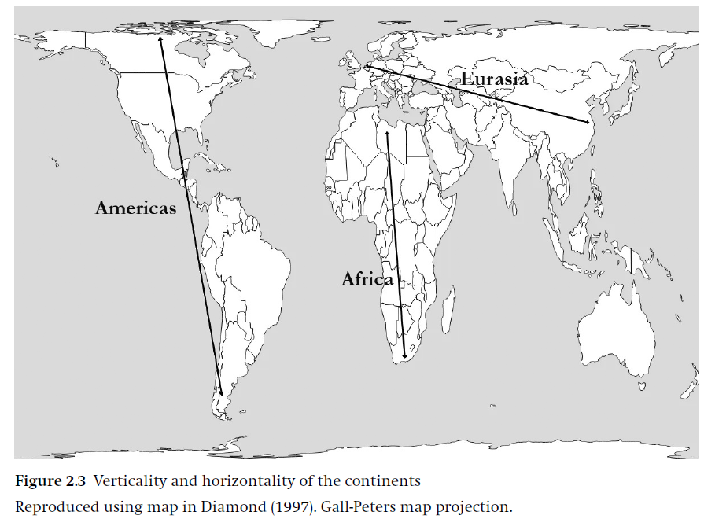

---
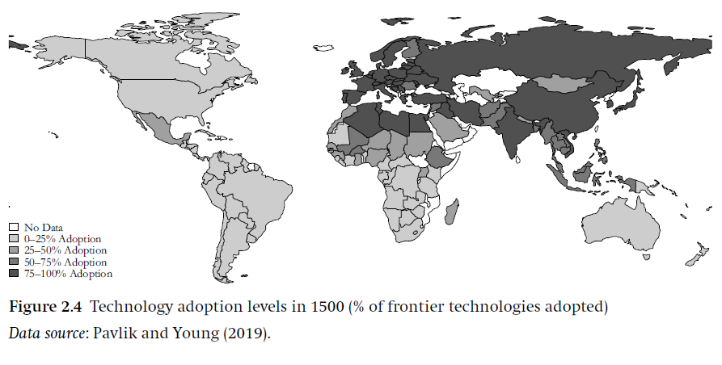

---


 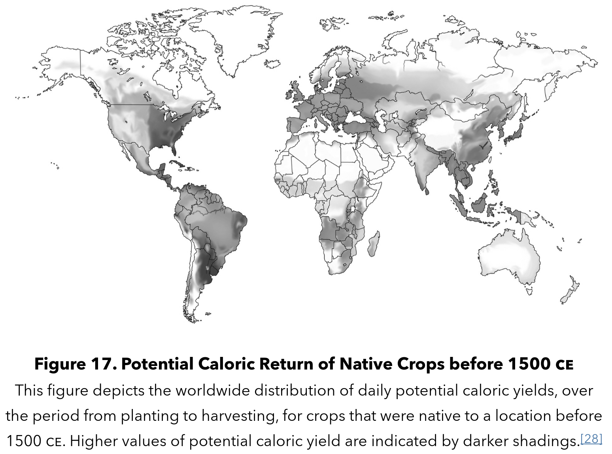

---
## Geography and Climate

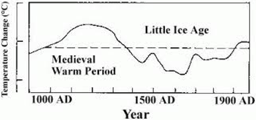
* Climate changes.
* Roman Empire arose during period of exceptionally warm weather.
  * Decline during colder period
* After 1000 CE warmer weather again, higher yields and growth in  W Europe.
* Colder weather spells $\Rightarrow$ negative econ shocks.
  * Conflict, pogroms...

---
### Geography and Transport Infrastucture

* Geography matters but can be adapted
* Investment in transport infrastructure can reduce barriers to trade.
* Roman Road building
* Persistent long effects: 
  * European road network until 19th Century
  * Location of cities
  * Positive and Negative effects

---

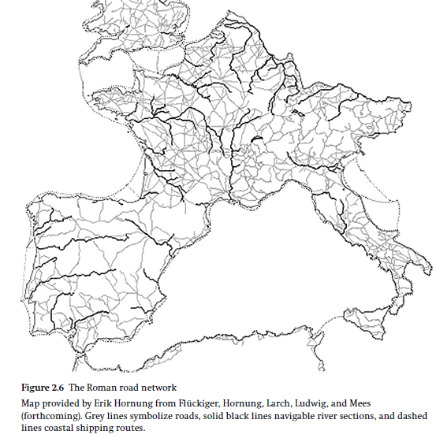
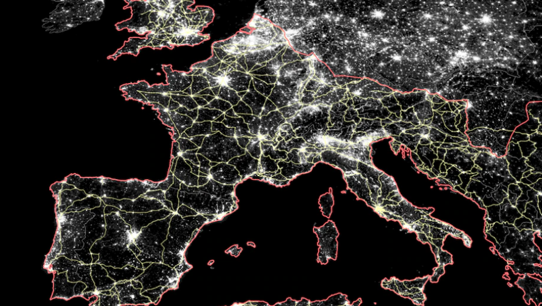

---

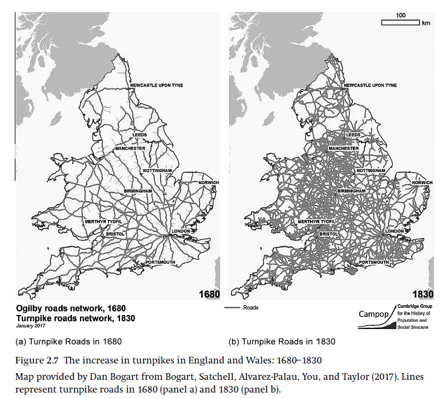

---

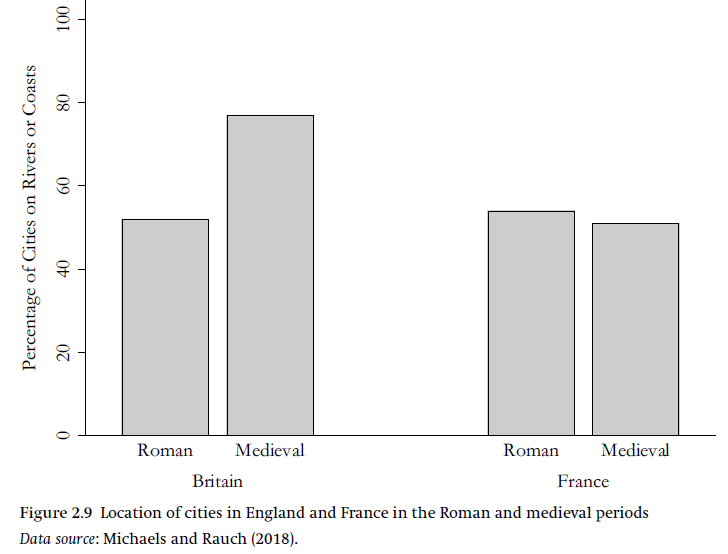


---

### The Columbian Exchange
## The Potato

(Friday presentation)
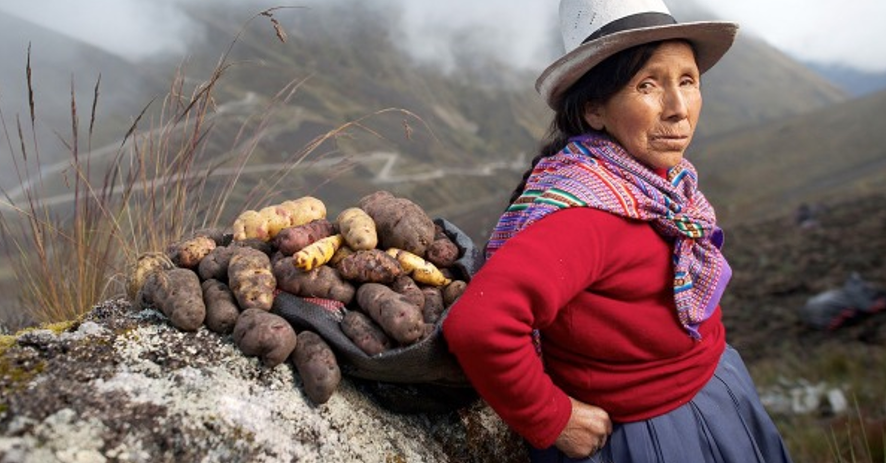

<!--
---


---


---


---


-->

---

## Centralization vs Competition
- Landscape fragmentation and the rise of Europe (Hume, Tilly)
    - Competition (vs Incumbent Monopolist)
      - Military
      - Public goods to attract population
      - Entrepreneurs, scientists, shopped regions.
  - Witfogel hydraulic hypothesis. Fractal coastline.
- Is geographical connectivity a benefit or a disadvantage?

---
### Origins of Extractive vs. Inclusive Institutions
- Did agroclimate shape institutions in US South, Latin America?
- Did geography/disease environment affect where colonization left 
  
---
## Geography, Crops, and future-orientation
* Future orientation: People from areas with higher _potential_ caloric return appear to be more future-oriented (from surveys).
  * Reverse causality?  
* Gender roles
  * Ploughs vs hoes and rakes.
  * World Values Survey suggests gender biases correlate.
    * Even in second-generation immigrants from countries that used the plough.


---

### Next class Readings

<br></br>
- OG 2 "Lost in Stagnation" 27-41
- OG 3 "The Storm Beneath the Surface", 43-55.
- (optional) KR 5 Fewer Babies?

Student focus paper: 

- Nunn, Nathan, and Nancy Qian. 2011. “The Potato’s Contribution to Population and Urbanization: Evidence from a Historical Experiment.” _The Quarterly Journal of Economics_ 126 (2): 593–650. ([PDF](https://drive.google.com/file/d/12EekL6XUzBIVkm4TMWyZndTCTvR5xkXI/view?usp=sharing))

---
### Population and growth Questions 1

- What is the "Malthusian Trap?"  
- What key elements of human demography and economic history does it explain?
- What are key assumptions of the model?
- Steady states and level versus growth effects
- Malthusian comparative statics
  - effect of raising/lowering birth rate?
  - effect of raising/lowering death rate
  - effect of raising/lowering technological productivity
- Date of onset of agriculture and expansion?