---
title: sl6_Culture
deploy: true
title_custom: true
created: 2023-02-06T21:13:32.340Z
modified: 2025-01-25T19:17:05.688Z
marp: true

---


<!--
theme: gaia 
paginate: true
footer: Eco 331: Institutions
style: |
  section {font-size: 26px;}
-->


<!-- footer: "" -->


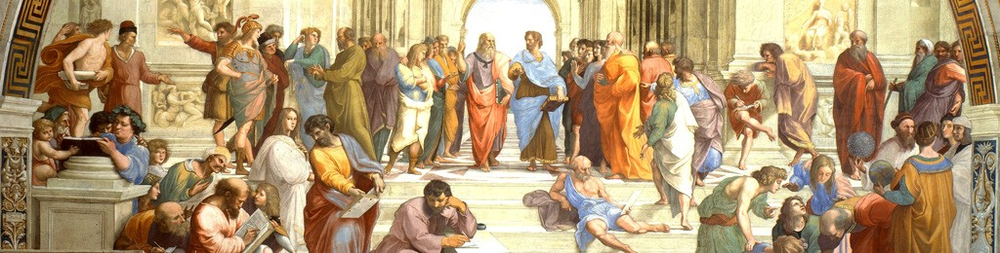
### ECO 331
## Economic History

```
INSTITUTIONS
```
Jonathan Conning
Spring 2026
<br></br>

---
### Readings

- North, Douglas, 1990. "An Introduction to Institutions and Institutional Change", Chapter 1 in _Institutions, Institutional Change, and Economic Performance_. Cambridge.
- OG 7 "Splendour and Misery" 127-142.
- OG 8 "The Fingerprints of Institutions"

### Readings 
- KR "Is it all just Institutions?"

---
### Fundamental ("Deeper") versus Proximate Causes

- Your neighbor's lawn is greener than yours. Why?
  
---

### Institutions
Douglas North, Nobel 
* Institutions are 'the rules of the game'
* "Humanly devised constraints that shape human interaction".
* Formal or Informal
* Reduce uncertainty by providing structure to our daily lives.
* Allow us to make commitments and trust others
  * incentives to invest, innovate, improve allocations, and trade. 


---
##### A side note on the History of Ideas

#### Some Political Economy labels:
- Autocratic Rule
	- Divine right of Kings. Aristocracy
	- Hierarchies, privilege and vertical control.
- **Mercantilists**: 
	- Economic nationalism:  Accumulating wealth and power via monopolies on trade and colonies. Tends to see economy in zero-sum terms (your loss, my gain).  
	- Government intervention: Taxes, tariffs, regulations, licenses, offices for sale. Rent extraction.
- Cultivation of virtue seen as the foundation of good government.
	- Good obedient religious citizens and virtuous leaders who internalize moral values.

---
### Emerging challenges

• Experience of centuries of war (e.g. 30 years war 1618-1648) and dogma. 
Kings vs parliaments.

• Rising challenges to absolutism, aristocracy  
and arbitrary power. 

• Protestant reformation, spread of literacy, printing press.

• Age of discovery, new settlements, ideas from trade and colonialism

• Scientific revolution.

• Commercialization, urbanization and rise of middle class.

---
## Classical Liberals
   *  John Locke, David Hume, Adam Smith, Wilhelm von Humboldt, Thomas Jefferson, Jean-Batiste Say, Frederich Hayek, Ludwig von Mises ...  
      * Individualism.  Natural rights (life, liberty, property) 
      * Empiricism: skepticism, reason over dogma.
      * Self interest as motivator. Spontaneious order. 
        Can lead to good societal outcomes.
      * Limited Government. Rule with legitimacy/consent of the governed.
	      * Rule of Law
	      * Free Markets. State role subsidiary, support markets.

- Mechanism design:  Constitutions, Separation of powers, Rule of Law.  To harness and direct self-interest.
 
---
#### Political Economy labels (continued):  
* **Marx:** Rising bourgeoisie class throws out the old, dispossess the poor to make 'free' wage labor/proletariat. 
* The Social Relations of Production (Institutions, property rights) established by rising class to their advantage. 
* Capitalist revolution challenges feudal order but also dispossesses peasantry to jump start wage-labor and market imperative. Markets transform the world but with periodic crises and only the few get rich.
* Marx is labeled a Classical Political economist (builds on Ricardo and classical tools). But not a Liberal. 
* Many Marxian interpretations and elaborations. 


<br></br>

---
#### How economics emerged and pushed institutions to the background:
Twentieth century:
* **Neo-classical:** Like the classicals, but with marginalism and math and less institutional detail.
  - Firms as black boxes at arms length from consumers
  - everyone a price-taker on perfectly competitive market
  - secure property rights assumed to be costlessly enforced by third party.
  - Invisible hand results:  free markets+competition --> efficiency.

    >An economic transaction is a solved political problem ... Economics has gained the title Queen of the Social Sciences by choosing solved political problems as its domain (Abba Lerner, 1972).

---
#### Political Economy labels (continued):
* **Hamiltionian / Keynesian / Development Planning:**  Markets are good, but market failures are very real.  Government needed to create and repair markets, confer legitimacy and stability.
* **Neo-classical synthesis**: post-war fusion of Keynesian and Neo-classical ideas. Dominant academic and policy paradigm for 50 years.
	* Bretton Woods Institutions: UN, World Bank, IMF, WTO. 
	* Sovereignty. Globalization.
* ***Neo-liberals*** (a political more than an academic label.) 
  * Return to Classical liberal ideas: Hayek, Friedman, Mises.
  * Thatcher, Reagan, Southern Cone authoritarianism.
  * 'Washington policy Consensus' advocated by IMF, World Bank, in early 1990s.
  * Social Democratic variations (Clinton, Obama)
* Today:  Resurgent mercantilism and Economic Nationalism.
  
  
---
## Neo-classical Growth & Development Model 
- The mainstream market-based growth and development model/narrative. 
- Differences in per-capita incomes are due to differences in technology and $K/L$. Time and markets should lead to "convergence". 
- Main barrier are 'bad policies' that distort markets and slow growth.  
Blame on rent-seeking bureaucrats and 'special interests.'

- Prominent economic historians worked withing this framework.  History driven by swings in relative prices, population, resources (epidemics, expansion of frontiers and trade, etc). Institutions secondary and adaptive.

- Market-driven 'Neo-Liberal' reforms following debt-crises of 80s and Soviet collapse/transition of 90s.  Liberalize trade, privatize and de-regulate business, open up capital markets, reduce the role of the state, etc.

- Academia typically more heterodox, but economic orthodoxy ascendant in policy circles.

---
## Neoclassical Growth accounting and the Solow 'residual'
- Aggregate production function: 
  $$Y = A \cdot K^{\alpha} \cdot L^{1-\alpha}$$
  
  in logs:
     $$\ln Y = \ln A + \alpha \ln K + (1-\alpha) \ln L$$

- Captured as an empirical regression:
     $$\ln Y_t = b_0 + b_1 \cdot \ln K_t + b_2 \ln L_t + \epsilon_t$$
*  The $\epsilon_t$ "residual" term could be interpreted as TFP $A_t$ plus perhaps other factors (e.g. geography, human capital, etc).  
$$\ln Y_{it} = b_0 + b_1  t + b_2 \cdot \ln K_{it} + b_3 \cdot \ln L_{it} + b_4 \cdot X_it + \epsilon_{it}$$
- Solow found that factor growth accounted for only 13% of variation. Remaining 87% in the residual -- interpreted as TFP growth (technology).  
  
---  
## New Growth Theory (1990s-2000s)
- Focus on increasing returns to scale (IRS)
  - Knowledge and technology spillovers
  - Trying to 'endogenize' (explain) TFP growth.
- Models imply constant or increasing returns to factor accumulation, rather than standard neo-classical diminishing returns to capital or human capital 
(e.g. productivity of new engineer higher where there are more engineers).
- Implies agglomeration and *divergence* of incomes.

<br></br>
But like the neo-classical growth models, these remain mechanical and abstract models, driven by the shape of technology. Institutions (markets, property rights protections) are *assumed* rather than explained.

---
### What other factors account for differences in gdp per capita?
##### Cross country regressions popular in early 90s

$$\ln Y_{it} = b_0 + b_1 \cdot t + b2 \cdot \ln K_{it} + b3 \cdot \ln L_{it} + b_4 \cdot X_it + \epsilon_{it}$$

- Country panel data with countries $i$ and year $t$
- $X_{it}$ is a vector of other variables.
  - Human capital (Barro)
  - Geographic variables (Sachs)
  - Cultural variables (e.g. dominant religion).
  - Measures of institutions  
    - Legal or colonial system (Barro), 'Rule of law', 'expropriation risk', etc.

---
##### Cross country regressions 
- Battle lines: Geography vs. Culture, vs. Institutions, etc. 
- Many severe criticisms: Measurement issues, omitted unobservable variables, endogenous variables, etc.
- 'Credibility Revolution in Economics' made people very wary of cross-country regressions, unless has clear causal identification strategy (i.e. can convincingly argue that right hand-side variables are not endogenous).

---  
### Neo-institutional critiques

* **Ronald Coase:** What is a firm?  Where does a firm stop and the market begin? Firms exist to minimize transactions costs. Economic performance is a function of the institutions that minimize transactions costs.

* **Douglass North:** capital accumulation and innovation are only proximate causes of growth. They are manifestations of growth.  What are the deeper causes growth? Institutions, property rights, and the rule of law, shape incentives and the ability to accumulate capital and innovate.

* But how do institutions come about and change?
  * These authors, at least initially, tended to emphasize evolutionary adaptation.  Institutions evolve over time to minimize transactions costs in a changing environment. 

---
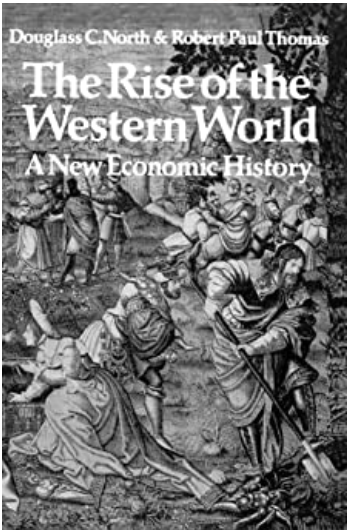
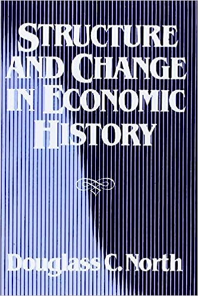
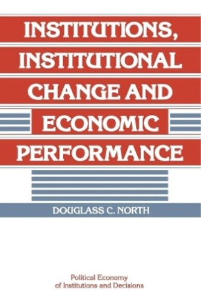

---

### Neo-institutional economics

* **How do institutions evolve?**
  - **Douglas North** and **'Transaction Cost'** Economists (e.g. Coase).
    - Costs of enforcing contracts, monitoring, etc.
  * Property rights and institutions adapt to changing conditions, via Coasian bargains, evolutionary process.
  
---

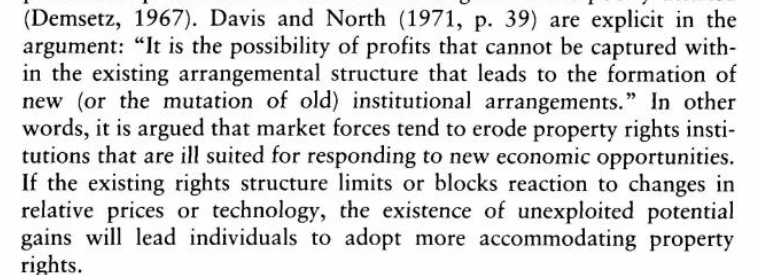

--- 
### The Later North


* In earlier work, North argued that Institutions tend to evolve to minimize transactions costs. Societies with more efficient institutions would grow faster, better institutions would spread.
* North came to elaborate his theory of institutional change to allow for the fact that institutions are shapedto the benefit of elites and the powerful and that this meant that inefficient or dysfunctional institutions could persist for a long time. 

---
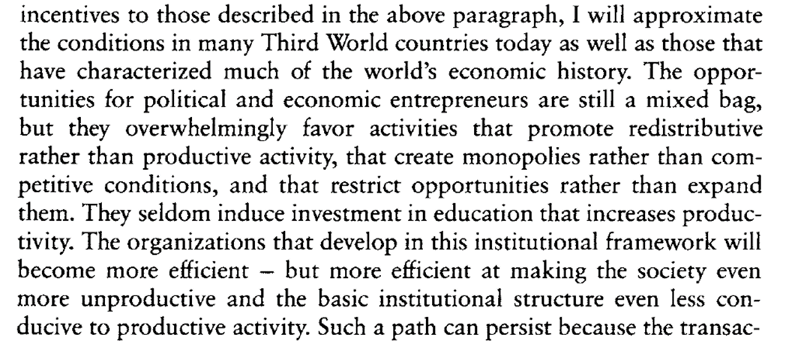

---
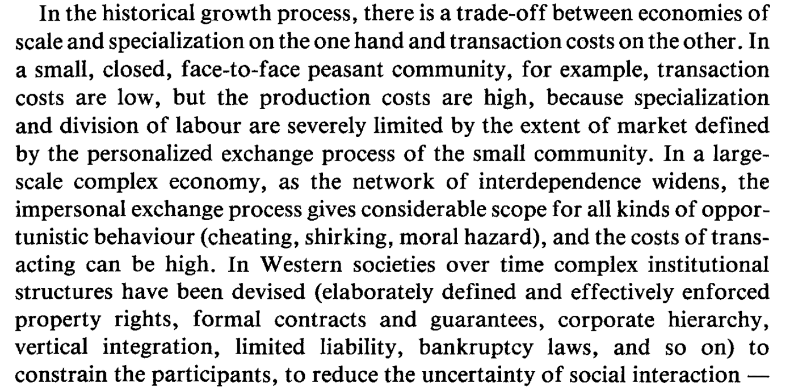

---

#### 'Modern Political Economy' (late 1990s-present)
- Renewed interest in economic history and political economy.
- Engerman and Sokoloff (1997) "Factor Endowments, Inequality, and Paths of Development in the New World."
- Acemoglu and Robinson (2000) "Colonial Origins of Comparative Development." 
- Many other papers cited in KR chapter.
- Build on earlier neo-institutional economists
  - more theoretically elaborate and empirical. 
  - Natural experiments and historical case studies over regressions.

---

---
### History Lessons: Institutions, Factor Endowments, and Paths of Development in the New World

##### Sokoloff & Engerman (2000)

- **Initial Puzzle**: Countries like the U.S. and Canada ultimately became more economically successful than Latin America, but this wasn't obvious at the start
    
    - In 1700: Mexico = British colonies (future U.S.) in per capita income
    - Caribbean colonies (Barbados, Cuba) were 50-67% wealthier than future U.S.
    - Haiti was possibly the world's richest society per capita in 1790
- **Traditional Explanation**: British institutions vs. Spanish/Portuguese institutions
    
    - But this doesn't explain variations within the same colonial heritage
    - Many British colonies (Caribbean) didn't succeed like U.S./Canada

---

### Factor Endowments and Inequality. Three paths:

1. **Sugar/Slave Economies** (Caribbean, Brazil)
     - Large plantations, scale economies, extreme inequality
    - Elite control of wealth, human capital, political power
2. **Spanish America** (Mexico, Peru)
    
    - Mineral resources + large native populations
    - Land grants, tribute systems, concentrated wealth
    - Restrictive immigration policies preserved elite status
3. **North American Mainland** (U.S., Canada)
      - No large native populations for labor
    - Climate unsuited for plantation agriculture
    - More homogeneous population, less inequality
    - Broad distribution of land, wealth, human capital

---

### Institutions and Persistence of Inequality.  

- **Political Participation**: U.S./Canada led in extending voting rights
    
    - Latin America maintained wealth/literacy requirements longer
    - Lower voting rates persisted through 1940
- **Public Education**: U.S./Canada invested earlier and more extensively
    
    - Strong local support for schools from settlement
    - Latin America delayed public education investments
    - Literacy rates followed the same pattern
- Institution development perpetuated initial inequality patterns
    
    - Elites created rules that protected their advantages
    - Inequality persisted through policies on land, credit, voting, education

---

#### Neo-institutional economists

* **Ronald Coase**, Nobel 1991
  * 30s-80s
* **Douglas North**, Nobel 2011
  * 70s - 90s
* **Kenneth Sokoloff and Stanley Engerman**
  * 90s
* **Daron Acemoglu and James A. Robinson**
  * late 90s - present

Building on older traditions and other contemporaries.
  - e.g. Asymmetric Information revolution (Stiglitz, Holmstrom, etc) who provide a more micro-founded theory of contracts.
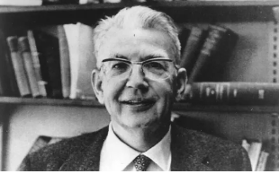
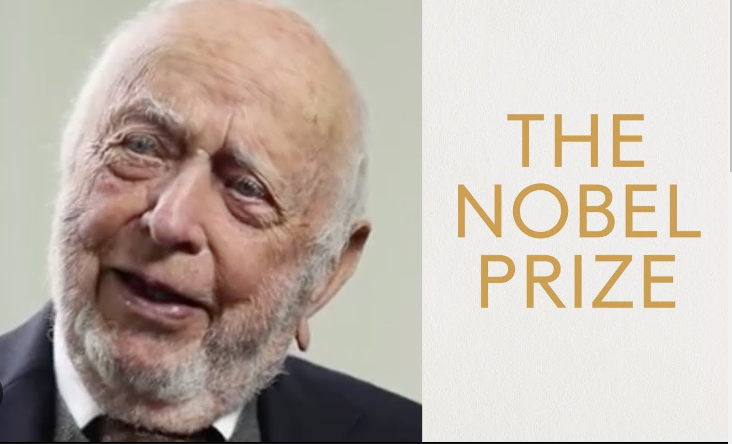
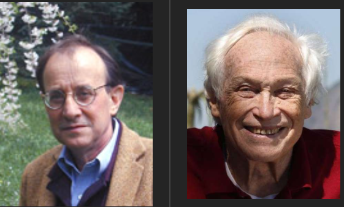


---
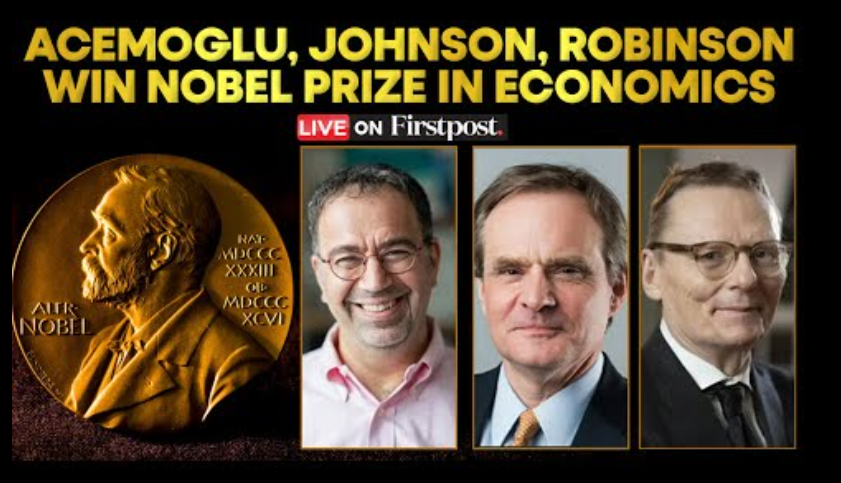

---
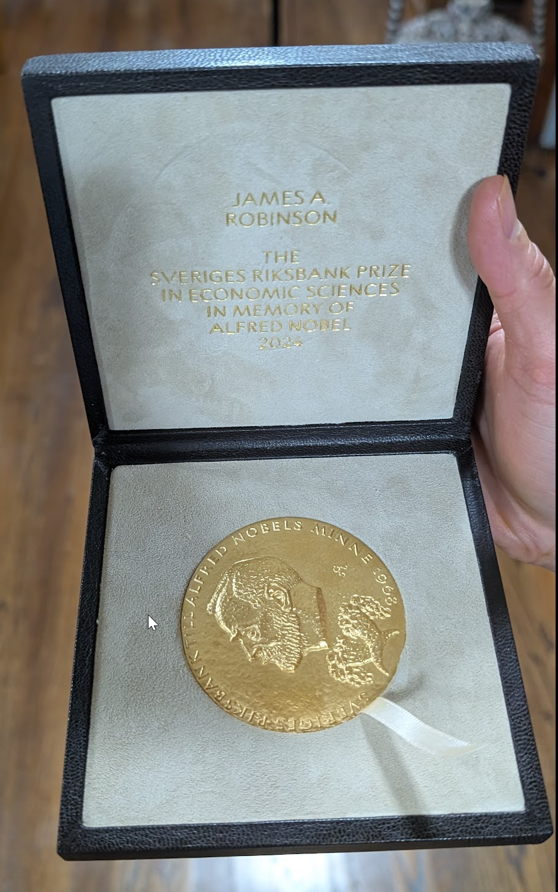
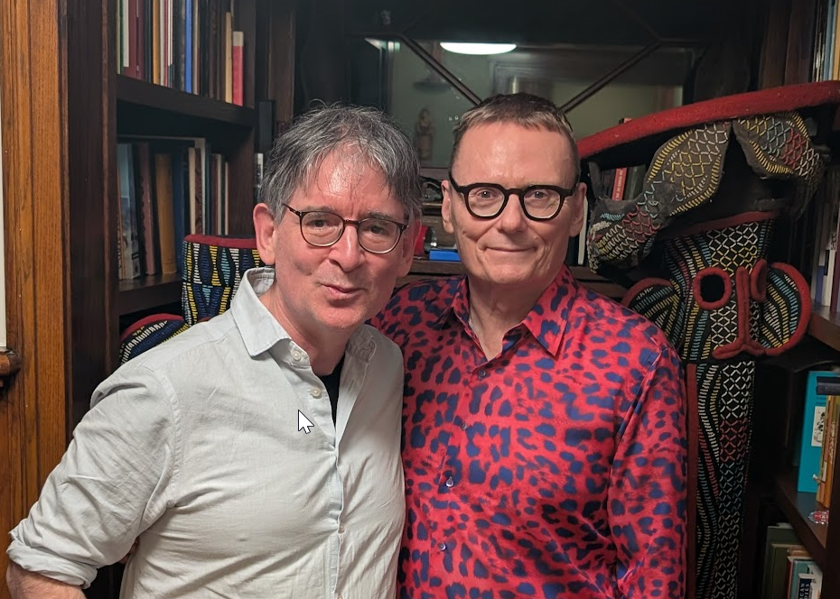


---
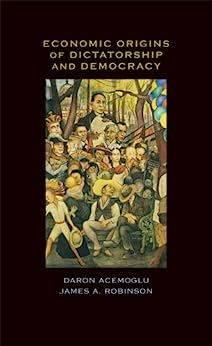
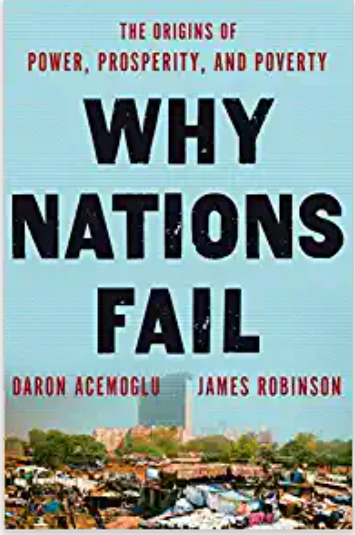
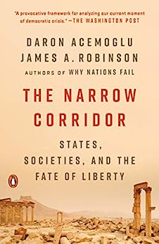

---

### Marx on Institutions

- **Social Relations of Production**  -- Institutions
- **Material Productive Forces** -- physical resources and technology
- **Mode of Production** -- e.g. Feudalism, Capitalism

As productive forces develop, new classes may see possibilities for new ways of organizing production to their benefit. Existing relations of production -- property rights and institutions -- may become obstacles and are challenged and replaced. There will be winners and losers as institutions are changed. 

Social relations shaped/transformed by **class conflict**.

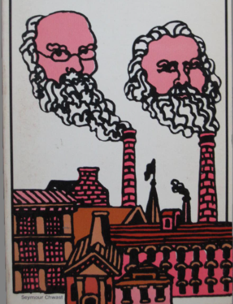

---

##### Marx in Preface to a Contribution to the Critique of Political Economy (1860)


<br></br>
<br></br>
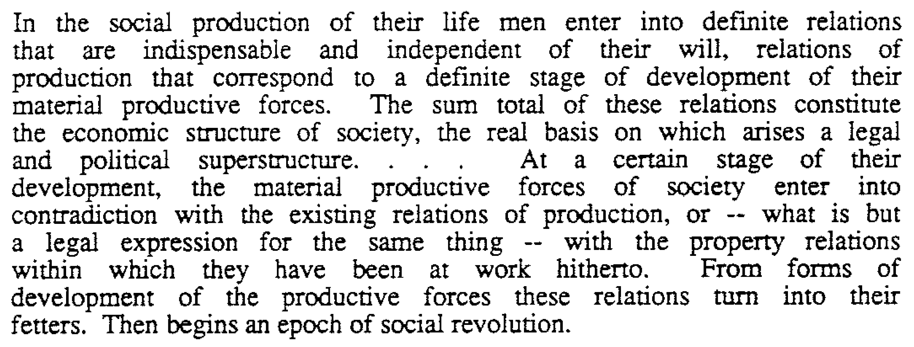

---
### Marxian vs. Marxist

- Marx and Marxian analysis vs. Marxist revolutionary politics and regimes.

- What do neo-institutionalists, and Marxians have in commmon?
  - Materialist conception of history
  - Institutions matter
  - Institutions are shaped by evolutionary proceseses and conflict. 

- Many of the most interesting institutional analyses and debates in economic history are debates amongst Marxian or between Marxian and non-Marxian historians. 
  - What led to the transition to capitalism in Europe? 
  e.g. Dobb-Sweezy and Brenner debates.
  - political Marxists vs neo-Smithian... many flavors.
  
(though a lot of Marxian analysis can be tiresome, tedious, heavy handed or just plain bad ... e.g. endless debates about taxonomies, single-minded focus on exploitative relations, Soviet propaganda, etc).

---
## Economic Institutions
* Security & flexibility of property rights
* Free entry (to ensure competitive markets)
* Ability to form business organizations
* Ability to quit and move jobs

---
## Political Institutions
* Political rights
* Constraints on the executive
* Democracy
* Free media
* Independent Judiciary 

---

## Property Rights
- Social institutions that define and delimit the range of privileges granted to individuals to specific assets, such as parcels of land or water.
- Private ownership *may* involve a variety of rights:
  - right to appropriate stream of rents from us e and investments in the resource.
  - right to exclude others from access
  - right to rent, sell or otherwise trnsfer.
- PRs may be based on 
  - formal arrangements (constitutional provisions, statures, judicial decisions).
  - informal conventions and customs. 
  - enforced privately and/or with state/community support.

---
## PRs shape incentives 
- By allocating decision-making authority 
  - shape incentives to invest and improve resources
  - also define distribution of wealth and power in society

### PRs enforcement
- PRs may be created/enforced both privately, by community and/or state.
- Insecure PRs
  - often overlapping, contested.
  - limited (e.g. limitations on use, leasing, sale)


---
## North and Thomas (1973)
#### France and Spain: 
 - absolutist monarchies, relied on granting and taxing local monopoly privileges.
  - feared adjusting property would undermine their political and economic base, even if such changes might offer broader gains.
#### England and the Netherlands:
  - commercial interests were stronger (particularly after 1688 "Glorious Revolution").
  - Property rights tended to be adopted that allowed for more fluid resource movements and respond to market opportunities.
  - Enclosures and market for private land.

>"the fact that growth has been more exceptional than stagnation or decline suggests that efficient property rights are unusual in history (North, 1981, p6)"

---
### The Glorious Revolution of 1688
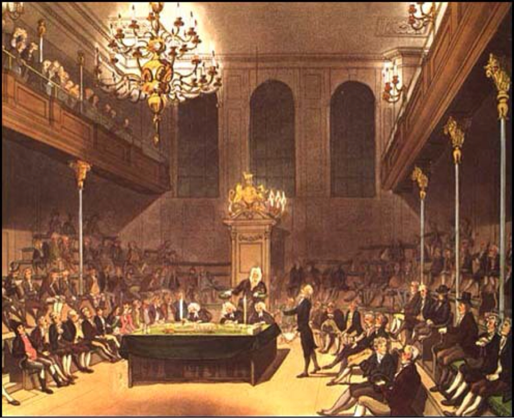

---

## The Glorious Revolution of 1688

- King James II of England was a Catholic and a proponent of absolute monarchy and the Divine Right of Kings.
- Protestant William of Orange invades, overthrows (his father-in-law) James II in 1688, and is crowned.
- English Bill of Rights, Toleration Act, Mutiny Act etc. **credibly committed** monarchs to accept constraints. Parliamentary oversight, authority to impose and collect taxes, impeach judges, etc.
- It has been argued this improved:
  - Fiscal credibility (falling risk premia) 
  - Improved security of Property Rights, leading to investment and more efficient organization (North and Weingast, 1989).
- A "bourgeois revolution": merchants and traders expanded power over landlords.

---
### Critiques
- Is this all just Whig history?  
- In many ways reforms strengthened the power of the centralized state to redefine PRs
- e.g. Parliamentary enclosure acts often led to more concentrated land ownership, and less secure PRs for the poor.
- Oliver Cromwell, victor of earlier English Civil War (1642-1651). Professionalized army (removed Nobility from leadership roles). Also led colonization of Ireland and wholesale exropriation of Irish Lands. 
- So perhaps less about PRs protections in general, and more about strengthened centralized State to advance the commercial interests of rising new class at home and abroad?

---
## "Rule of Law" index 2017


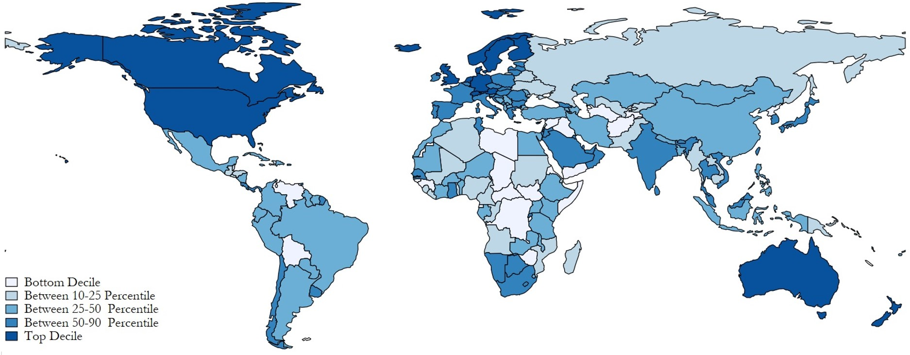

---
#### Causation or Correlation?
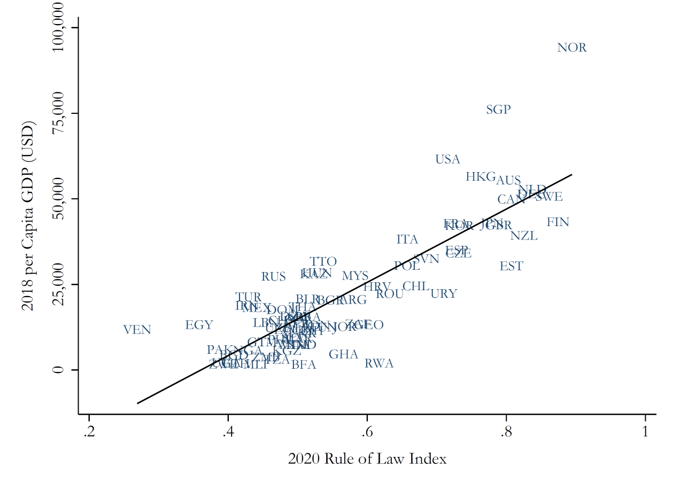


---

## Natural Experiments


- North and South Korea provide a “natural experiment” for importance of institutions.
- Prior to Korean War, North and South were highly comparable (North was more ndustrial!). 
- Today South Korea is a rich country. North Korea is mired in poverty. 20X
- Given geography and culture are similar above and below the 38th parallel, this suggests institutions can make a large difference 

---

#### Dissolution of the Monasteries

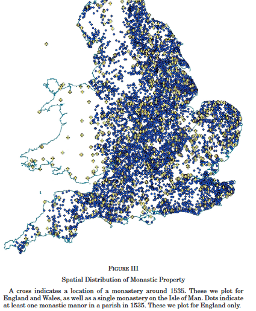

- Heldring, Robinson, Vollmer (2021)
 "The Long-Run Effects of the Dissolution of the English Monasteries," _Quarterly Journal of Economics_
- Starting 1535-1540: Henry VIII dissolved the monasteries.
- Created a large supply of land, unencumbered by feudal land tenure. 
- Contributed to the "Rise of the gentry."
  - New generation of successful landlords, distinct from hereditary nobility.
- Authors find that parishes that had more dissolution in long run had higher rise in agricultural yields, greater non-ag pop, higher industrialization.
  
---

## Napoleonic Invasions
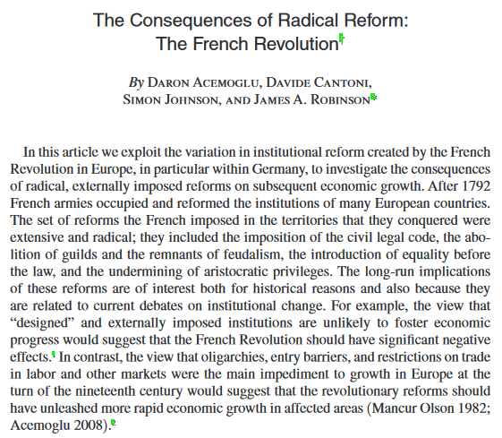

- French Revolution 1789-1799.
- Republic. Abolishes feudalism, Church's right to collect tithes.
- Strong new Army, 'total war' strategy. 
    - From defense of the Revolution to conquest of Europe.
- 1804 Napoleonic Codes: Civil law code to replace complex patchwork.  Codifies PRs, makes it easier to buy/sell/inherit.
  
---
### Empirical strategy
- Difference-in-difference: German regions had different exposure to French presence and reforms.

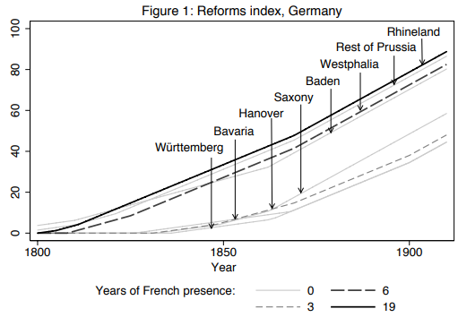

---
Possible Impacts:
- Negative: disruption of occupation, mal-adapted institutions imposed from above.
- Positive: new institutions more conducive to growth.

Their empirical conclusion:

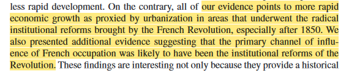
and
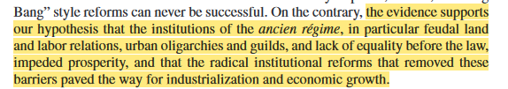


---
### Inclusive vs. Extractive Institutions


- key feature of political and economic institutions: how broadly power is distributed.
- Acemoglu and Robinson (2012) distinguish between **inclusive** and **extractive** political and economic institutions.
- North, Wallis, and Weingast (2009) distinguish between closed-access orders (natural states) and open access orders. 

---
#### Political Institutions during the Commercial Revolution
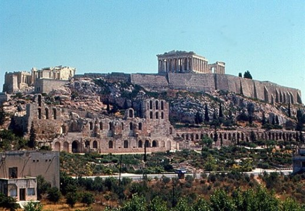
- Fundamental political institutions: those that govern the selection of who rules.
- Today one of the most important distinctions is between democracy and autocracy. 
- Democracy emerged in the ancient Greek city-states. 
- But democracy was absent for most of medieval and early modern European history.
- Two important developments that DID occur between 1000-1300: 
   - The rise of independent city-states
   - The rise of parliaments

---
### Political Institutions: City States
- Independent cities emerged in Italy, the Low Countries, and Germany after c. 1000 CE. 
- These cities were self-governing and often oligarchic. 
- They were governed in the interest of the mercantile elite.
- As such they often passed laws and established institutions favorable to trade.

---
### Political Institutions: Parliaments
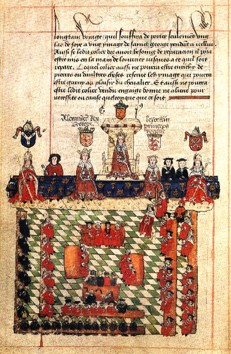
-  England, Spain, and France were governed by territorial monarchies. 
- Kings in these territories called councils of their leading nobles in order to consult them. 
- Over time these councils became more formal. 
- By 1240s in England, they had acquired the name Parliament. Elsewhere in Europe, they were called cortes, estates, or parlements. 
- Forums where the king could ask for taxes from the “political nation”. 
- English “Model Parliament” of 1295 established the principle that the towns would be represented. 

---
#### Rise and Fall of Parliaments
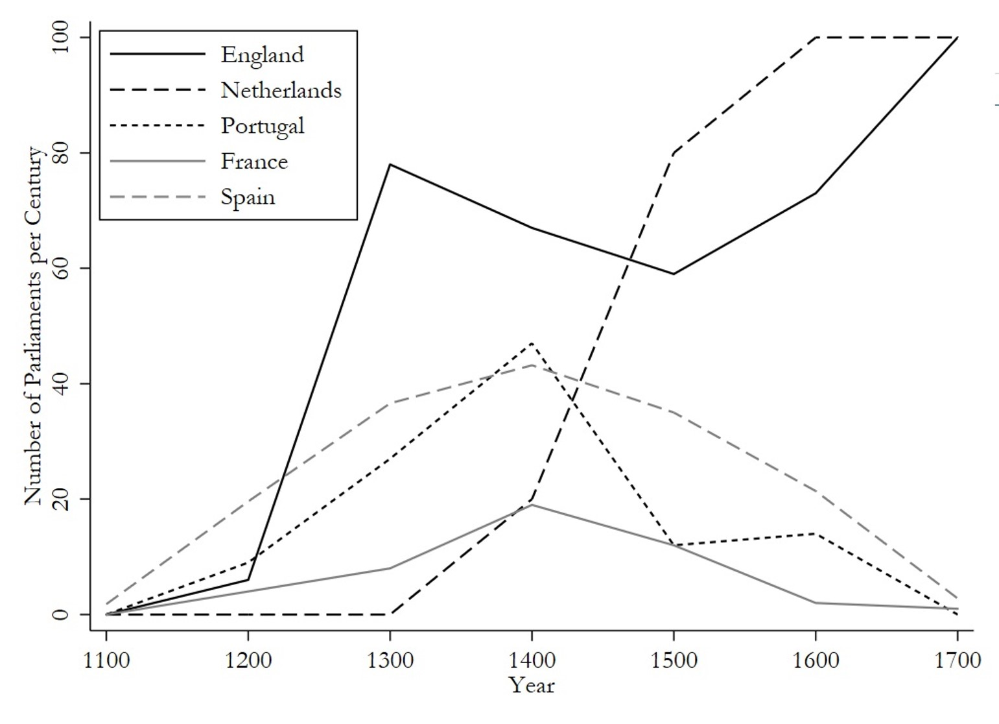
- Number of parliaments per century, 1100-1700.

---
#### Rise and Fall of Parliaments
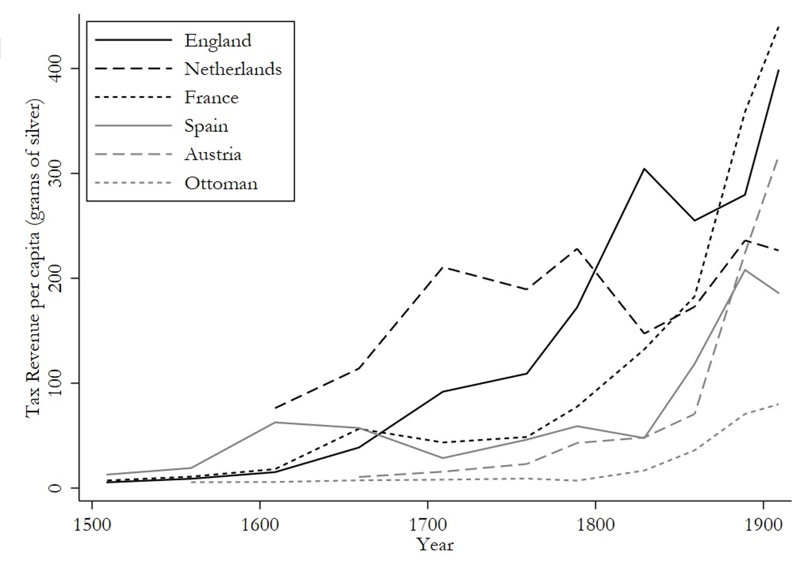
- Tax Revenue per capita, 1100-1700.

---
#### Rise and Fall of Parliaments
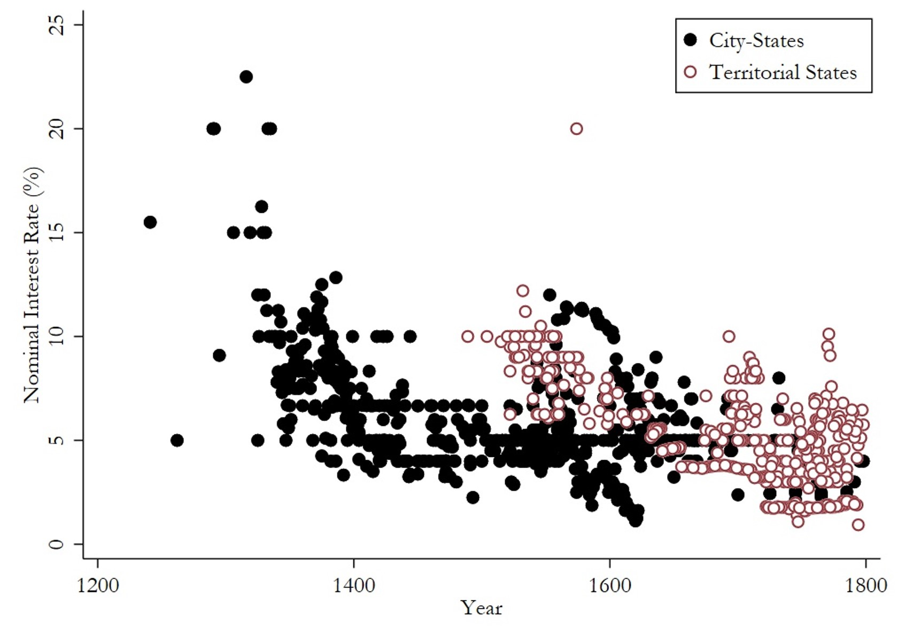
- Interest rates in city states and territorial states, 1200-1800.
- Representative institutions mattered for the cost of capital in medieval and early modern Europe.
- Kings paid high interest rates on their loans due to the uncertainty that they would repay. 
- City states and (later) parliamentary regimes could borrow at lower rates. 

---
### AJR 2001
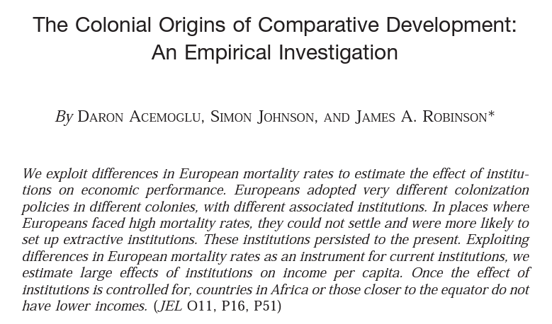

---
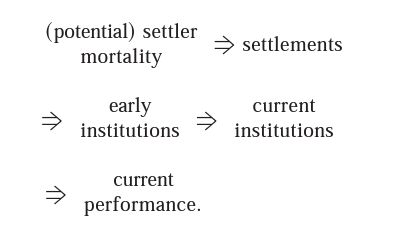

---

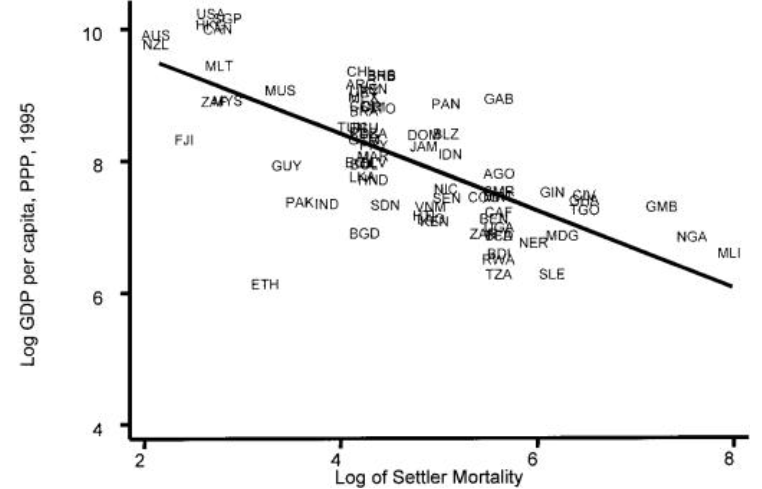

---
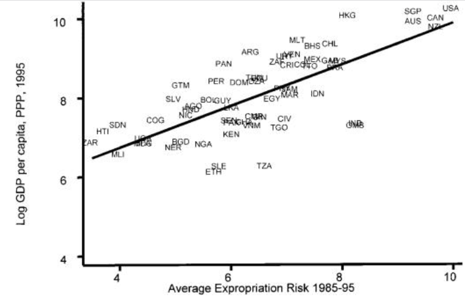

---

## The Peruvian Mita
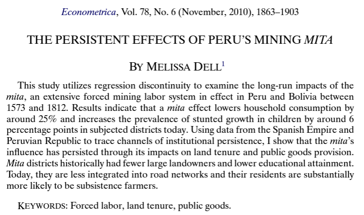
- The Spanish Crown imposed a forced labour tax (corvee) on the conquered Inca Empire to man silver and mercury mines.
  
- [See online Slides](https://drive.google.com/file/d/19guksdMR5e7Kt6WUYWo2piD_fCiN3E77/view?usp=sharing)


