<!--
theme: gaia 
paginate: true
footer: Eco 331: Culture
style: |
  section {font-size: 26px;}
-->

<!-- see [Culture notes](../../Culture%20notes.md)  -->
<!-- footer: "" -->


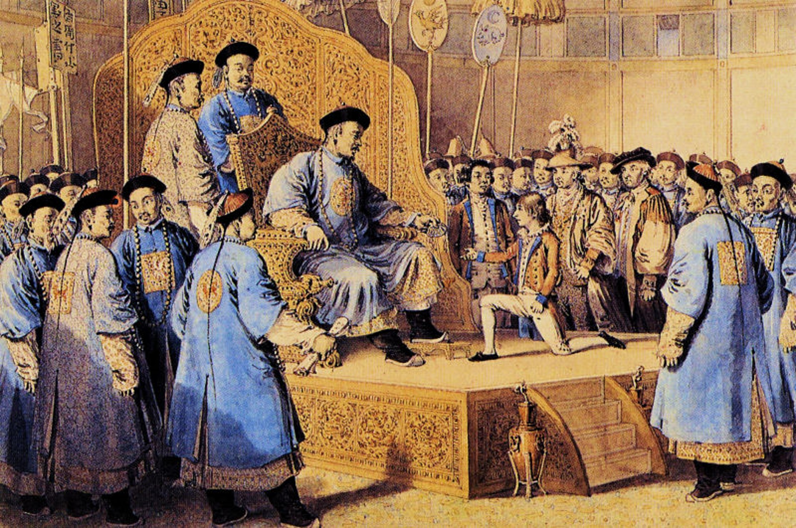
## ECO 331
# Economic History

```
CULTURE
```
Jonathan Conning
Spring 2026
<br></br>

---
## Readings 3/5

OG 9 "The Cultural Factor"
KR "Did Culture make some rich and others poor?"

---
## What is culture?
  * "learned rules of behavior ... Rules or heuristics are short-cuts to help make sense of a complex world (Henrich, 2015)"
* How transmitted?
*  Why does culture matter for economic development?
   * shapes the incentives individuals face to trust strangers, engage in trade, or cooperate on a large scale.
* How is culture different from 'institutions'?


---
## Can we treat culture as exogenous?
 * Economists generally do NOT like using 'culture' as an explanatory variable. 
   They are materialists! 
 * Culture can adapt, and adapt quickly at times.
 * Careful:  Many situations where 'culture' was first described as impeding economic development when the region was poor, but later celebrated asthe  key to success when the region prospered.
   * e.g. Japan, Korea, China.


---
## Bad cultural arguments

>"[Britons] cannot be taught to read, and are the ugliest and most stupid race I ever saw"  -- Cicero (Roman philosopher and orator, 106-43 BCE)

KR list 4 major problems with cultural arguments:

1. Ad hoc reasoning.
2. Measurement challenges.
3. Endogeneity.
4. Winners write history.

---
## Example: Cultures of the United States


- Within USA, anthropologists have argued there eleven salient regional cultures.
- Differ on range of issues such as individual liberty, the role of the state, views on education, and religion.
- Cultural values matter both directly (preferences over work or innovation) and indirectly (because culture interacts with institutions). 

- See also David Hackett Fischer's _Albion's Seed_ (1989)
---

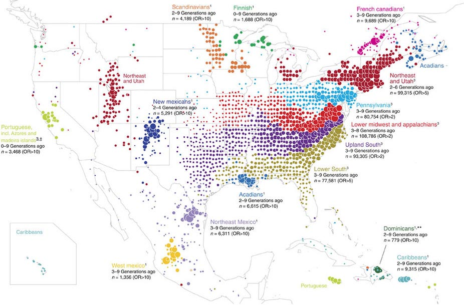
- An article in Nature (2017) found that the cultural regions of present day US roughly correspond to genetically cluste red regions (common ancestor) ... suggesting colonial migration patterns shape the region. [link](https://slatestarcodex.com/2017/02/08/albions-seed-genotyped/)
  
--- 

## Can Culture Explain the European Take-Off?
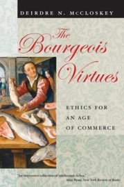
* D. McCloskey (2006, 2010, 2016) argues a cultural/ethical transformation occurred in the Dutch Republic and Britain around 1700.
  * This “bourgeoise revolution” was responsible for the origins of modern growth. 
  * In other societies cultural norms, embodied in rhetoric, literature, and art, denigrated commerce and innovation. 
* Transformation in this rhetoric after 1700 facilitated commercial development and innovation

* Materialists would say culture follows or co-evolves with changes in technology (productive forces) and market opportunities.
---

<!--  
### side note: ChatGPT as a history tutor
https://chat.openai.com/chat


(or other alternatives)


---
**related...**
### [Dall-E](https://labs.openai.com/)
## Text to image generation (Spring 2023 tech)

"An oil painting of a medieval peasant pushing a wheelbarrow."


---
### Gemini imagen 3
(Spring 2026 tech).

Generate an image of an oil painting of a medieval peasant pushing a wheelbarrow. Make it look like an oil painting that was painted in medieval times.


-->


## The Needham Puzzle
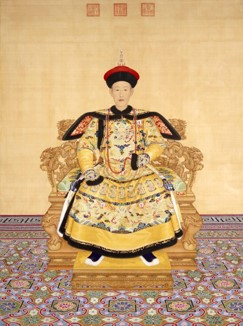
- Joseph Needham: Why did China, despite rich tradition of technological innovation and scientific discovery (paper, compass, gunpowder, printing, etc), effective centralized state, etc. not undergo same kind of economic and social transformation that led to industrialization in Europpe.

* Landes (2006) provided a cultural explanation, arguing Confucian culture became traditionalist. Example: Qianlong Emperor’s response to a trade mission from Britain: 

  > Strange and costly objects do not interest me. . . . We possess all things. I set no value on objects strange or ingenious, and have no use for your country’s manufactures.

---

Qialong was likely bluffing: 

  > Privately, . . . Qianlong was deeply fascinated by Western inventions . . . When James Dinwiddie was assembling the scientific equipment that Qianlong would so publicly dismiss, he did so without knowing that the emperor had actually ordered the missionaries to watch closely what Dinwiddie was doing so they could replicate his work after he was gone.

---
## The Protestant Work Ethic and the Spirit of Capitalism
- Title of famous book by Max Weber (1905). Observed that:
  - Protestant regions of Germany became richer than the  Catholic.
  - Richest countries were Protestant (Britain, USA, Netherlands, etc). A posiitive correlation today (chart)
  - Weber pointed to Calvinist belief in predestination and worldly manifestations of success.

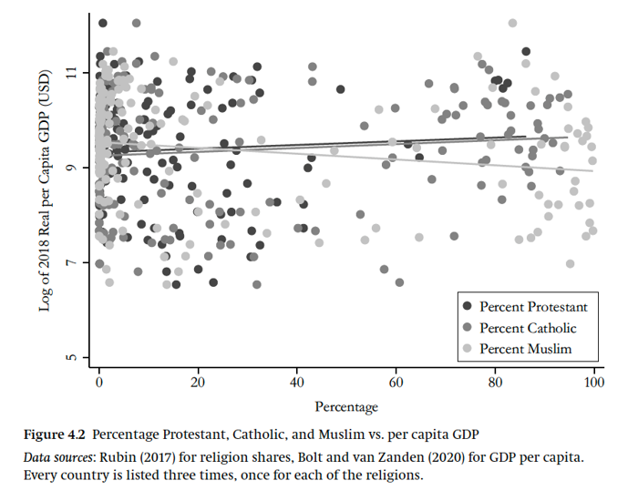


---
## Protestantism & Human Capital
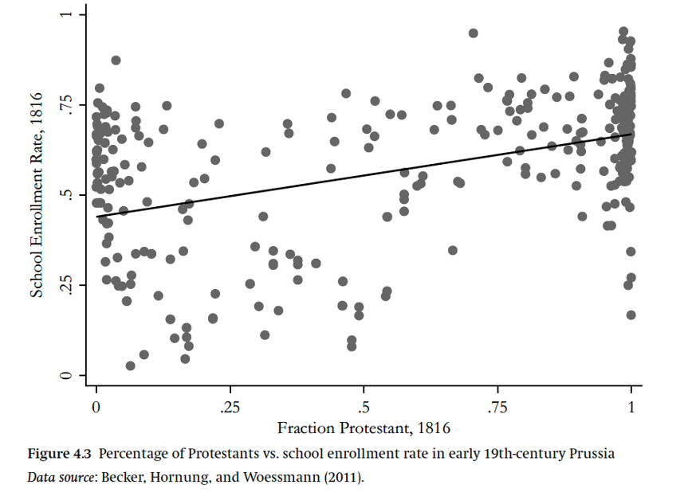
- Martin Luther encouraged Bible reading. But literacy had potential economic payoff. 
- Could Protestant economic success been unintended consequence of Luther’s desire to spread Word of God?
- Becker and Woessmann (2009) positive corr Protestantism and school enrollment in 19th C Prussia. 
- Differences in HK plausibly explain all differences in income between Protestants and Catholics. 


---
## Rubin on The Reformation and Institutional Change
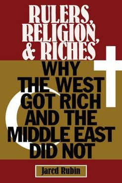
- Rubin (2017) argued Reformation undermined capacity of rulers to gain legitimacy via the Church.
- Church had provided Kings and Queens with legitimacy.
- After the Reformation, Protestant rulers had no independent church to prop up their regime (Protestant religious elites now under the thumb of the crown).
- Had to turn to Parliaments to legitimize their rule and stay in power.


---
## For historical anime lovers:

**Orb: On the Movements of the Earth**
(on Netflix)

* Heliocentrism, the inquisition, religious persecution, the reformation, religious wars, printing press...

"Cerebral, psychological..."

Also:  **Vinland Saga**
* Vikings, Britain, Norman Conquest, Exploration ...


---
## Islam and Middle Eastern development
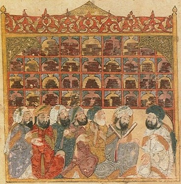
- During the Golden Age of Islam, Muslim scholars viewed Europe as “undeveloped" 
  >“[T]he exceeding distance [of Northern Europeans] from the sun thickens the air making their dispositions cold, their natures rude, their skin color white and their hair straight. Thus [. . .] dullness and ignorance overpower them”
	--Abu al-Qasim Sa'id (1068).
- Culture can interact with institutions. 
- Islamic countries are poorer than Western counterparts today, but this was not true before 1200.


---
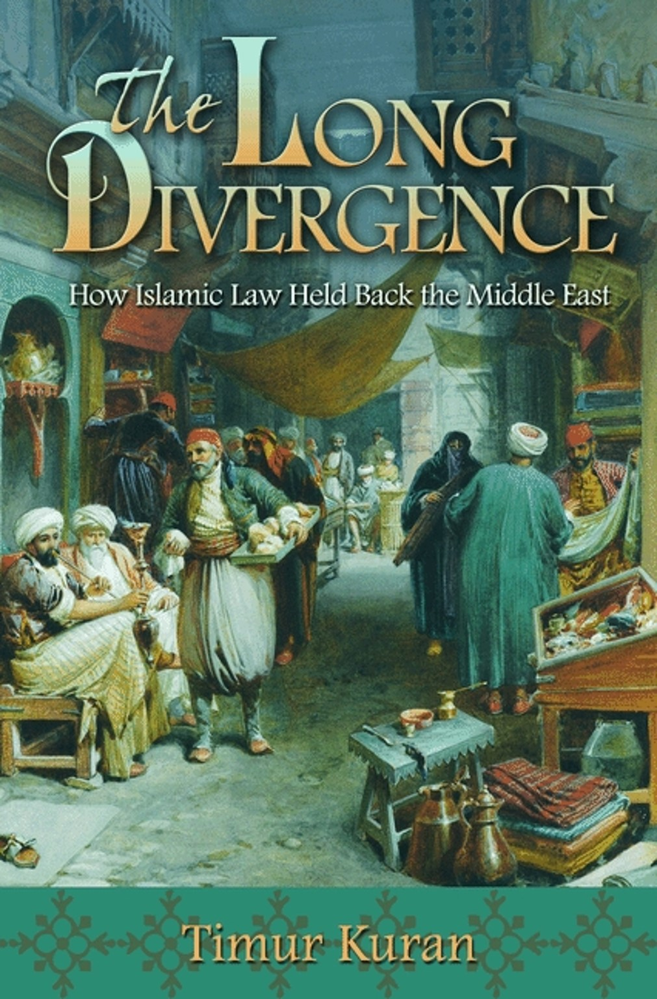
## Timur Kuran: *The Long Divergence*
- **The Argument:** Divergence reflects institutional features of Islamic *law*, not intrinsic culture.
- **The Paradox:** 9th-century egalitarian laws inadvertently became 18th-century commercial bottlenecks.
- **Partnerships & Inheritance:** Laws forced equal estate division and dissolved partnerships upon a member's death. 
  - Result: businesses stayed small and short-lived.
  - Contrast: Europe developed large, multi-generational, joint-stock companies.
- **Finance:** Bans on interest (*riba*) further slowed capital growth.
- **Takeaway:** Institutions and culture are deeply intertwined.

---
## Religious Legitimacy and Stagnation in the Middle East
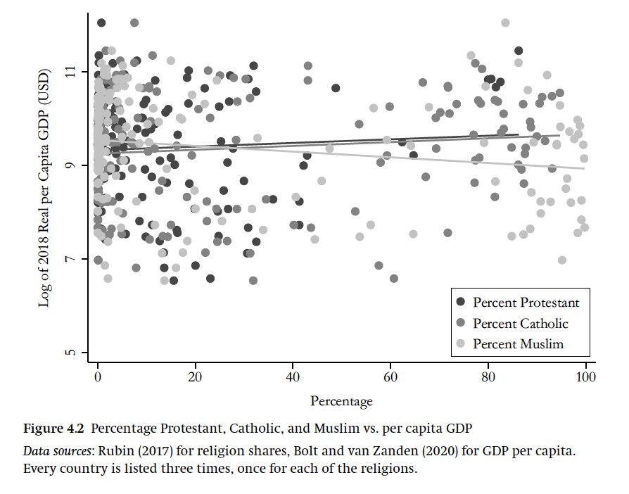
- Importance of religious authorities in Muslim societies meant rulers supported religious education over secular and scientific learning.
- Chaney (2016) finds that following the rise of *madrasas* (Islamic schools) in the 11th–12th centuries:
  - Religious book production dominated output.
  - Scientific production fell sharply.
- Decline in Muslim science likely due to the increased political bargaining power of religious elites.


---
## Trust and Pro-social Values
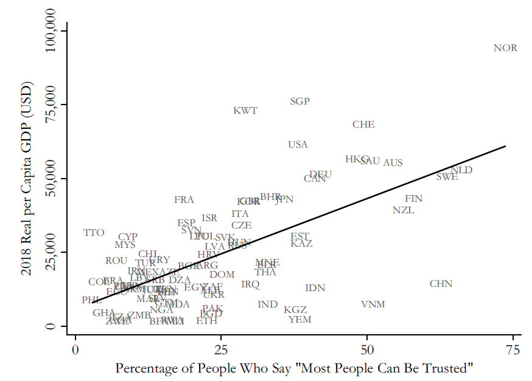
- Trust is positively associated with per capita GDP. 
- High levels of trust may both be a product and a cause of economic growth. - Disentangling causality is difficult. 
- But why are some societies more trusting than others?


---
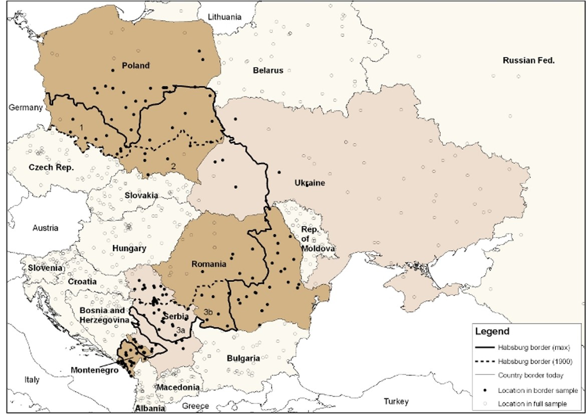
- Becker, Boeckh, Hainz, and Woessmann (2016) find that people who live on the Habsburg side of the old Habsburg–Ottoman– Russian border trust government officials, courts, and police more in the present day. 
- In the 18th and 19th centuries, the Habsburgs provided public services more efficiently than their eastern neighbors, increasing trust in government.
- That trust norms exist in the present day strongly suggests cultural norms persist after their original cause is long gone.

---

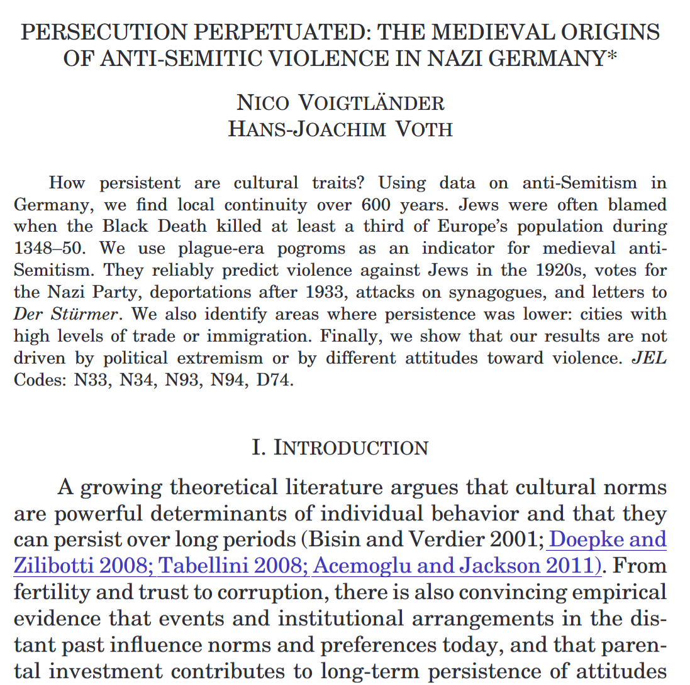

---
## Long Term Effects and Persistence of Culture
**Joseph Henrich: The Kinship Trap & The Church**
- **The Kinship Trap:** For most of history, societies relied on dense kinship networks and cousin marriages; trust and trade were strictly limited to family, stifling broad economic cooperation.
- **The Church’s Disruption:** Beginning in the Middle Ages, the Western Church aggressively banned cousin marriage to break up rival clan power and inherit estates, inadvertently shattering these deep family networks.
- **The Psychological Rewiring:** Stripped of their extended kin, Western Europeans were forced to become individualistic, build impartial institutions (like guilds and courts), and learn to trust and trade with strangers—creating the cultural foundation for modern impersonal markets.
- By High Middle Ages, Catholic Church had become largest landowner in Europe (controled 1/3 of land)

---
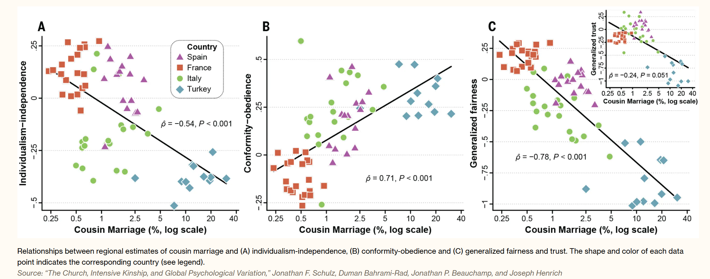


---

## Culture and Kinship

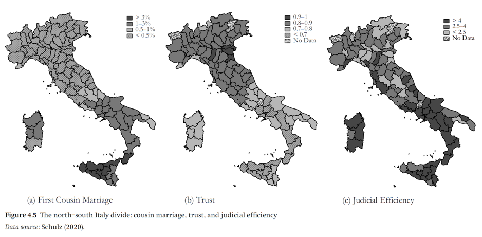
- Schulz et. al. (2019), Henrich (2020), and Schulz (2020): explain differences between North and South Italy by different kinship patterns. 
-  marriage policies of the Catholic Church undermined kin ties, forbidding marriages between cousins. 
  
---
### Culture and Kinship continued
- Kin groups became smaller in places with deeper Church influence. These places were therefore more likely to have governance institutions that relied on cross-kin cooperation. Over time, this led to institutions to support impersonal trade and the rule of law.
- Differences in cultural norms persist to the present. In southern Italy, where the influence of the Catholic Church was much weaker during the early Middle Ages, cousin marriage rates are higher, and trust, voter turnout, and judicial efficiency are all lower. 


---

## Culture and Gender Norms
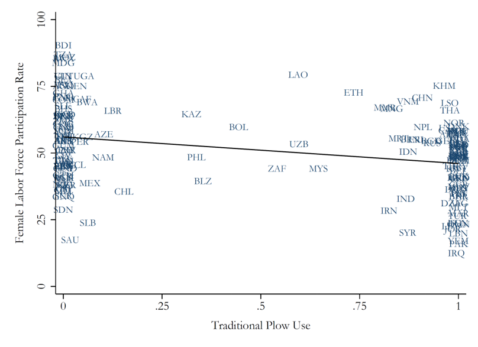
- Alesina, Giuliano, and Nunn (2013) argue plow ag required upper body strength, gave men men bargaining power. Social norm arose with men working  in field and women confined indoors. 
- Norms persist today, even in societies where majority of people no longer in ag. Societies have lower female labor participation, lower female firm ownership, and less female participation in politics.  
- Children of immigrants living in US and Europe exhibit more unequal beliefs about gender if their parents came from a country with a heritage of plow use. 
