<!--
theme: gaia
paginate: true
footer: Eco 331
style: |
  section {font-size: 26px;}
-->


<!-- 
Notes:
[[_read North Thomas 73]]
[[notes_transitions]]

-->


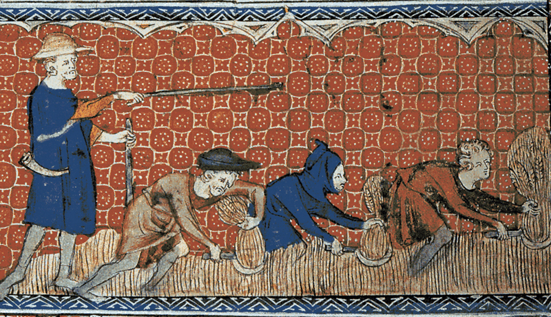
# ECO 331
## Economic History

```
Transitions to Capitalism
```
Jonathan Conning
Spring 2026
<br></br>

---
### Read 3/14

**The commercialization model**

- North, D., Thomas, R., 1973. Ch 1 "The Issue" & Ch 2 "An Overview" in The Rise of the Western World: A New Economic History. Cambridge University Press, Cambridge.
- Dyer, Christopher, 2005, An Age of Transition? Economy and Society in the Later Middle Ages. Oxford. (Read the 6 page Introduction)

---
### Read for Tue 3/17

**Marxist critics, Land Enclosures, and Agricultural Revolutions**

- Wood, E.M., 2002. "1: The Commercialization model and its legacy" and "2: Marxist Debates" (excerpts) from _The Origin of Capitalism: A longer View_. 

### possible
- Allen, R.C., 1992."Introduction." in _Enclosure and the Yeoman: the agricultural development of the South Midlands 1450-1850_. Oxford University Press.

---
## Epochs and Transitions
**How did the World Get Rich?**
  * Why did the Malthusian epoch last so long?
  * What led to the transition? (per-capita incomes not declining with pop growth).
  * What led to escape into the era of Modern Economic Growth?
 

---
### Another framing: 
* Where, how, and why did _capitalism_ arise as an economic system?
  * Private Property
  * Markets, specialization, and trade.
  * Firms

</br>

* "Capitalist imperatives": 
	* labor needs to sell labor to market to survive. 
	* Firms must accumulate, cut costs, innovate or fail.

</br>

* before capitalism: 'markets' embedded in social relations.
* with capitalism: social relations embedded in markets.


---
## Global Context (~1000 - 1300 CE)
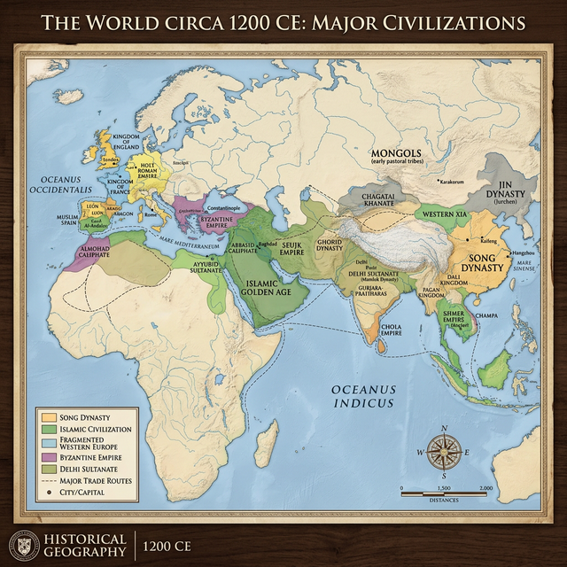
<div style="font-size: 15px; text-align: right; margin-top: -10px;"> <a href="https://worldhist.org/">Historical Maps</a> </div>

- If you surveyed the world in 1200 CE, Western Europe appeared as an economic and political **backwater**.
- **The Core:** The centers of global wealth, urbanization, and technological innovation were in the East and the Islamic world.
- **The Periphery:** Europe was politically fragmented, highly decentralized, and agrarian.
- **The Puzzle:** Why did the transition to capitalism and modern economic growth eventually happen in this peripheral region?

---
### Advanced Core: Song Dynasty China
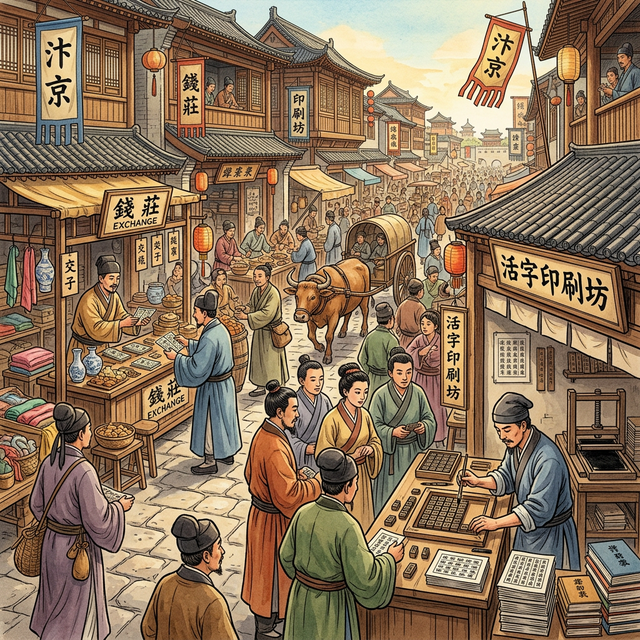
- **Peak of Pre-Industrial Growth:** The Song (960–1279 CE) and Ming dynasties achieved were centers of economic complexity.
- **Achievements:**
  - Commercialization and urbanization.
    - Inventions: paper money, the magnetic compass, gunpowder, and even movable type printing.
  - High agricultural yields.
- **The Needham Puzzle:** Despite this head start, China did not undergo the Industrial Revolution first. 

---
###  The Islamic Golden Age
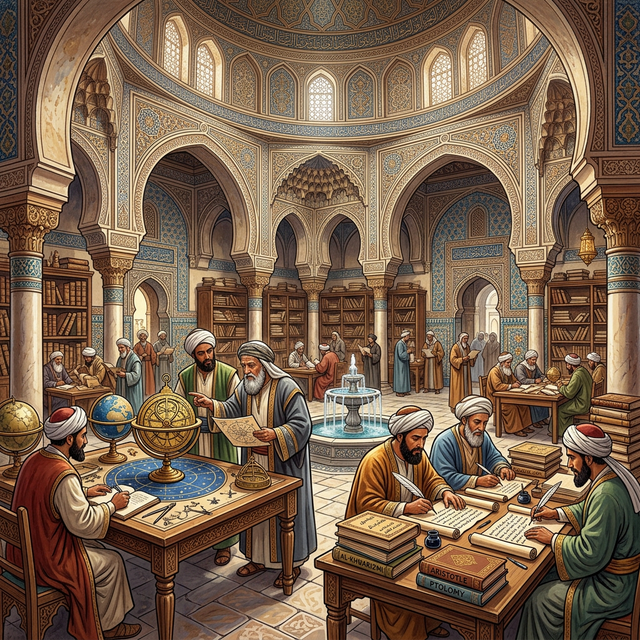
- **Center of Trade and Learning:** From the 8th to the 14th centuries, the Islamic world was the geographic and intellectual center of the world.
- **Achievements:**
  - Translated and preserved classical Greek and Persian texts.
  - Big advancements in mathematics (algebra), astronomy, and medicine.
  - Extensive trade networks from Spain to India.


---
### Persian and Classical Heritage
- **Persian Empires:** Long history of centralized statecraft, sophisticated agriculture (*qanats* irrigation), and trade along Silk Road.
- **The Paradox:** As discussed (Timur Kuran), early institutional advantages eventually became bottlenecks.
</br>
</br>
- **Classical Antiquity:** Europe *was* once highly advanced under the Greco-Roman tradition.

---
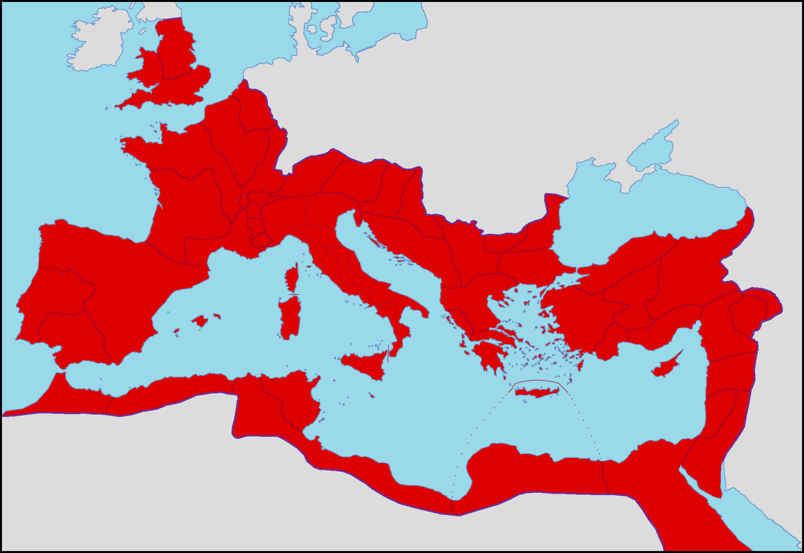
### From Classical Antiquity to the Middle Ages
- Roman Empire: 
  8th C BCE to 5th CE 
- Mediterranean & Long Distance Trade
  - Roman England 43 CE, 
    400y rule.
- Roman Law, Roads, Engineering, Science, Culture
- Not feudalism:  Land tenure forms varied but included Latifundia with slave labor, tenant farming, etc.  Property _could_ be bought, sold, or leased.

---

#### What Have the Romans Done for Us? 

[youtube link](https://www.youtube.com/watch?v=Qc7HmhrgTuQ)

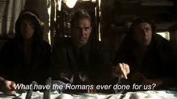

"... apart from the sanitation, the medicine, education, wine, public order, irrigation, roads, the fresh water system, and public health, what have the Romans ever done for us?"


---
## Fall of the Roman Empire
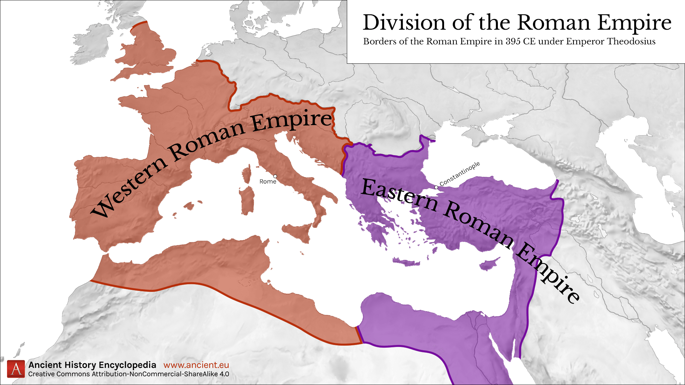
- **Power Vacuum (c. 476 CE):** Collapse of the Western Roman Empire eliminated centralized governance and the protection of the Roman legions.
- **Economic Contraction:**
  - De-urbanization. Rome's population fell from 1 million to a few tens of thousands.
  - Collapse of long-distance trade and disappearance of formal monetary economy.
- **Adaptation:** Local populations needed security from invasions (Germanic tribes, later Vikings and Magyars).

---
## The Rise of Feudalism
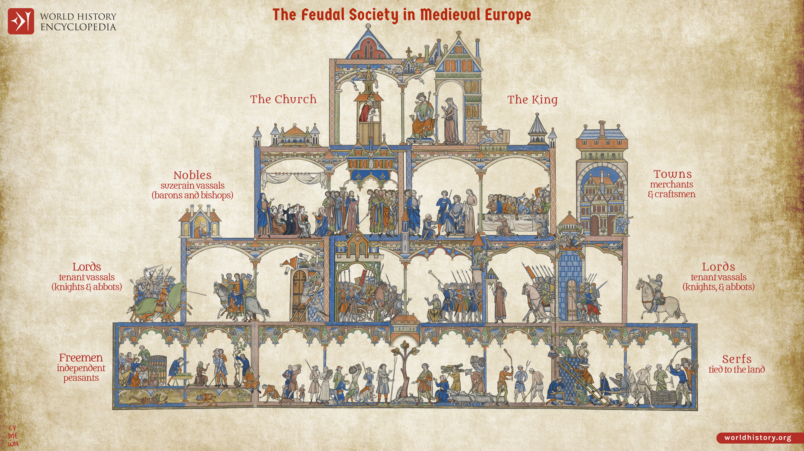
- **A Response to Chaos:** Feudalism was a decentralized military and political system that emerged to fill the power vacuum.
- **Oaths and Loyalty:** Kings granted land (fiefs) to lords and vassals in exchange for military service (knights). 
- **Chains of Obligation:** Personal loyalty and localized control replaced imperial bureaucracy and formal Roman law. 

---
### Manorialism: The Economic Foundation
- **Economic Fragmentation:** The massive, commercial Roman *latifundia* gradually evolved into local, self-sufficient medieval manors.
- **Serfdom:** Independent peasants traded their labor and their mobility in exchange for physical protection from the local lord.
  - Peasants became *serfs*, legally tied to the land.
- **Local Focus:** Subsistence agriculture prioritized over market production. Focus on the *three-field system*.
- **The Starting Line for Capitalism:** This fragmented, highly coercive, non-market framework is the starting point from which Western European capitalism would eventually emerge.


---
### The Middle Ages: 5th to 15th Centuries
- Between the fall of Rome and the Renaissance.
- Medieval Europe becomes largely isolated from the rest of the world.
- Period was once called 'Dark Ages' (no longer)
- New economic, political, social structures.
- Rise of Christianity helped reinforce hierarchies, deference to authority.
  
---

### Early medieval slave trade and 10th C Invasions

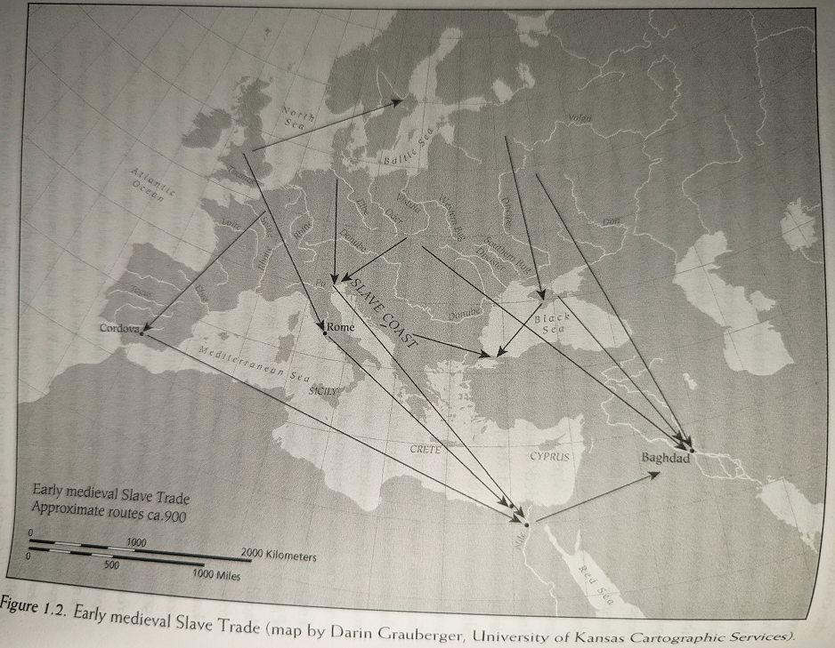

---
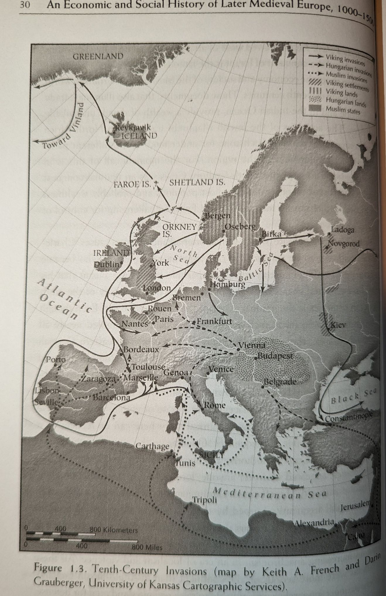


---

## Norman Conquest of England (1066)
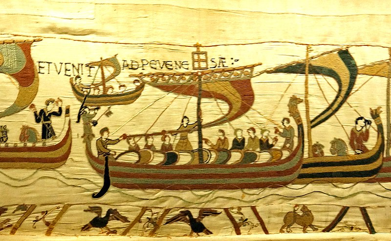
- Norman (Vikings who had settled France) conquer England in 1066.
- William the Conqueror 
  - Expropriated Anglo-Saxon elite and enfeoffed lands to followers.
  - New concentrations of land. 
  - A harsher feudalism. More exactions from peasantry.
  - Built Castles, Cathedrals, Monasteries.
  
---
### Domesday Book

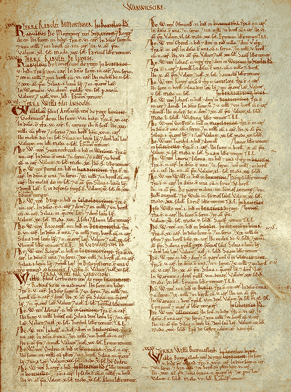
- Domesday Book (1086) - first comprehensive survey of land ownership in England.
  - 13,000 manors
  - 1/3 by the King
  - 1/3 of land in England owned by the Church
  - 1/3 by nobles and knights
  - Legal document used to this day.
- 90 \%  of population in agriculture

---
## Open Domesday

  https://opendomesday.org


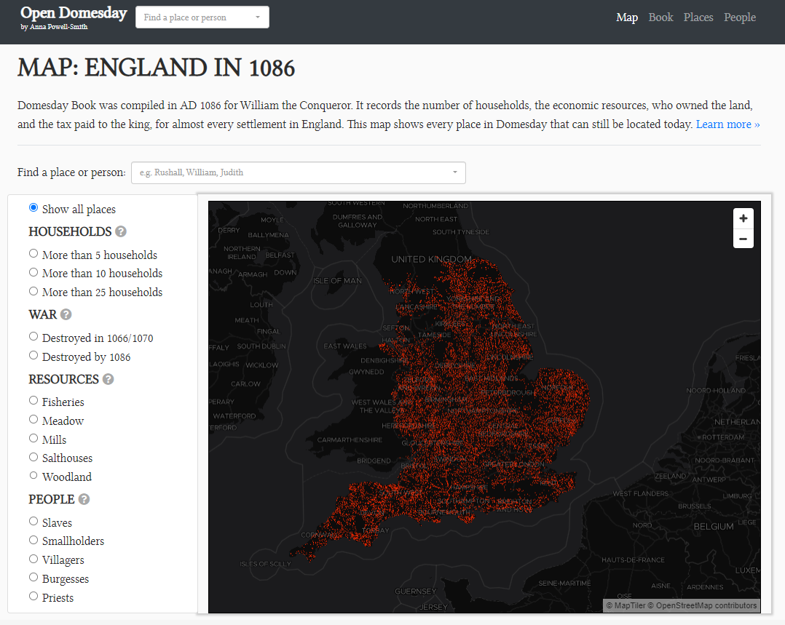

---


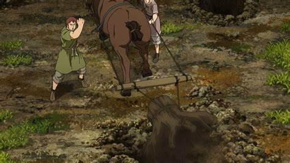

<!-- _footer: "[Trailer Season 2](https://www.youtube.com/watch?v=Ph50sNkApVM&t=2s)" -->

---

## Medieval Agriculture


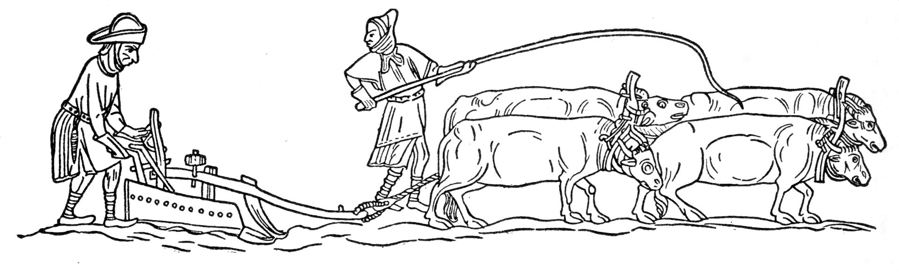


---

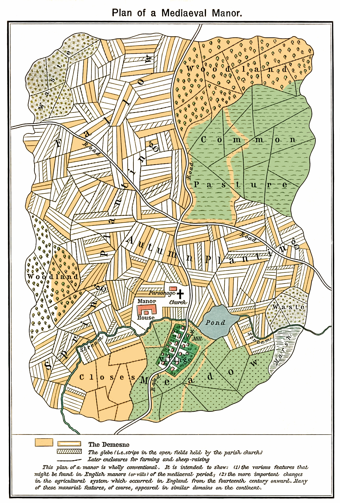
## A typical manor
- Autumn Planting Field
- Spring Planting Field
- Fallow Field
- Other lands:  Pastures, Woodlands, Meadows, Closes, Marshes, Waste

Within each open field:
- Demesne strips
- Glebe strips (Parish Church)
- Villein strips
  

Also: Village, Manor house, Church, roads, etc.


---
### The Open Field System

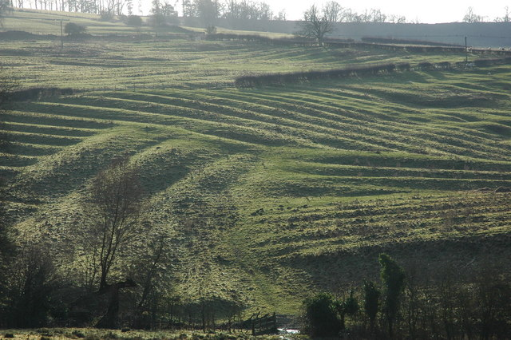
- Prevalent in Europe during middle ages (also Russia, Iran, Turkey)
- Each manor had 2-3 open fields of several hundred acres.
  - divided into narrow strips of land or furlongs.

---
## Emergence of manorial system
- **Late Roman villa system** (43CE- 5CE) with central estate worked by tenant farmers and slaves.
- Anglo Saxon settlements (5-11CE) territorial units and place names. 
- **Post-Roman organization:** local landlords took on protective and administrative roles for surrounding communities.
* **The Manor:** legal, economic and administrative unit.
* **Norman Conquest 1066**: imposed harsher and more uniform manorial structures.
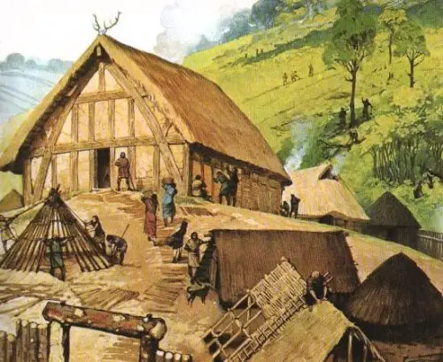
---
## Land Tenure and Labor Services
- Crown was only _alloidal_ land owner.  All others 'held' land from the Crown.
- Lords (tenants in chief) had rights granted by the King
- Sub-tenants rented land from the Lord. Could be free or unfree.
- Serfs (villeins) not free to leave for other locations or occupations without penalties.
  - Charged rent, fines, labor-services. 
  - Could accumulate property and pass tenancy on to heirs.
  - firm rights to cropland and commons, passed down through generations.
    - Lord could not evict tenant without cause.
- Complex system of rights and obligations, varied by region and time.
- Over time serfdom ended and relationship that of customary tenants. 

---


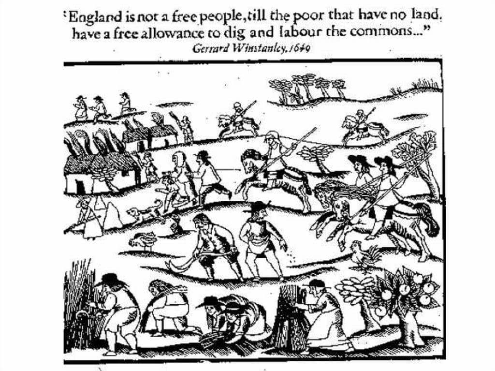
### From Manoralism and the Middle Ages to Agrarian Capitalism
- Transformation of feudal and peasant PRs and social order.
- Development of private property rights to land.
- Improvements, technology, rising agricultural productivity
- Structural transformation: rural to urban
- 'From below' or 'from above'? Via evolutionary and negotiated change or via conflict, eviction and theft?


---

### Differentiation and Market activity

- villeins: serfs or unfree tenants. Tied Could not move away, marry, inherit or sell without the lord's permission.
- freeholders: had free tenure. Owed fixed rent to the lord but few feudal services. They could sell or inherit without lord's permission.
- cottars: Occupied cottages and cultivated small land lots.
- Free and unfree tenants often had significant holdings (30 acres or more)
- Often hired laborers to fulfill labor services.
- Might offer land to cotter (though lord regulated)

---
### Manorial Rights
- Waste rights : fells, mountains, marsh.  Technically ownership vested in the lord, but Lord's ability to change use by enclosure restricted by common rights of tenants (e.g. to take wood, peat, pasture).  
- Lord: Game, Fisheries, Mills, minerals.  
  - Mill tolls
- Woodland: rights to timber vs underwood.  

---
### Manorial Courts
- Infringement of lord's priviliges
  - fishing/hunting without permission
  - cutting timber/underwood w/o license
  - encroachment or intakes on lords' soil
  - not grinding corn at lord's mill
- Offenses to Public order and stability of community
  - breaching king's peace (fighting, pilfering, slanders, vagabondage)
  - keeping under-tenants or harboring 'inmates' (e.g. allowing building of cottages, etc)
- Offenses against common rights and neighborhood:
  - 'stray' livestock or grazing where not allowed
  - failure to maintain fences, gates, water channels, etc.
  - burning waste on wrong dates, etc.

---
### Manorial Records

- Example [Cumbrian Manorial Records](https://www.lancaster.ac.uk/fass/projects/manorialrecords/manors/classes.htm)
- Manorial officials: Bailiffs (paid official) and Reeves/Graves (usually a tenant who collected the rents and fines).
- Entry fines and heriots (due at death of tenant).
- Admittance: admitting individual to a tenancy (e.g. marriage, inheritance, surrender)

---
## Admittance fines (1627)

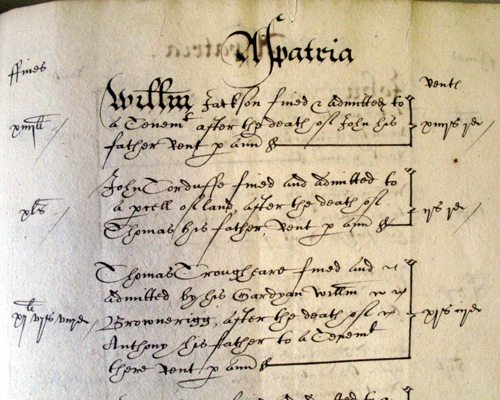
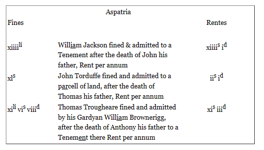

[src](https://www.lancaster.ac.uk/fass/projects/manorialrecords/gallery/fines.htm)


---
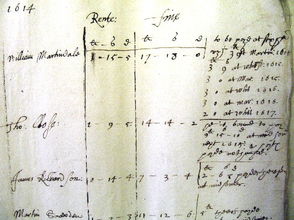

### Fines (gresums): 
 - e.g. Bleatarn Manor in Lancaster, annual fine income ~10X rents [source](https://www.lancaster.ac.uk/fass/projects/manorialrecords/gallery/fines.htm)

-  _merchet_ fine paid upon marriage.
-  the _filstingpound_ (insurance against corporal punishment)
-   _leyrwite_ (fine for bearing a child outside of wedlock).
- *Entry fines*: paid at time of death/inheritance/sale/new. 
- Fines often worth as much as 20X annual rent.

---
## Some major Events
- Statute of _Quia emptores_ 1290 forbids further subinfeudation.
  - Allowed tenants to sell tenancy to another (substitute) but not create further vassal sub-tenants. Fealty to the crown. Expanded market transactions and common law.
- Black Death (1348-1350) subsequent population collapse
- Peasant Revolt of 1381
- Dissolution of the Monasteries (16th century)
- Tudor Enclosures and reaction (16th century)
- Parliamentary Enclosures (18-19thth century)
---

<style scoped>section {font-size: 35px;} </style> 


> [For neo-classical economics,] an economic transaction is 
a solved political problem. Economics has gained the title of queen of the social sciences by choosing solved political problems as its domain. 

- Neo-institutional and marxist focus on property rights and political economy.

---
## Contrasting views on the transformation of Institutions
- **The Commercialization (neo-Smithian) Model** 
  - Stresses factors such as population, the rise of markets, and the development of new technologies as driving institutional change.
  - Some economic historians, including North and Thomas (1973) went as far as to argue that serfdom was a contractual arrangement (service for protection), but the value of the services and the terms of the contract changed in response to demographic and other pressures.
  - Feudal and other institutions held back people's natural tendency to want to improve and engage in trade and specialization. Over time, as markets thickened and technologies improved, it became in the interest of groups to remove these restrictions and new institutions emerged that paved way for capitalism.

---
## Contrasting views on the transformation of Institutions
- **Marxist Perspectives**
  - Give more prominence to class conflict and the 'balance of class forces'.
  - For example would argue that from 11th to 14th century, landlords gained the upper hand and converted many formerly more free peasants into serfs.  Norman Conquest of 1066 strengthened the power of the nobility and the Church further.
  - Malthusian would say high pre-Black death population led to low wages, population collapse led to higher wages. 
  - Many marxists would argue low wages were explained by landlord exploitation rather than Malthusian factors. 


---
### Robert Brenner and the Political Marxists
  - Famous 'Brenner Debate' followed 1976 critique of neo-Smithian and neo-Malthusian views of the transition to capitalism.
  - **_Political Marxists_** such as Brenner and Wood go as far as to argue that class conflict is largely 'autonomous' or independent of demographic and technological factors. 
  - There is no 'natural' tendency to accumulate and improve, indeed under Feudalism Lords found it more profitable to squeeze peasants and build miltary might. Peasants had little incentive to accumulate and sell to the market, because markets were limited and distorted.
  - Where landlords were strong and organized they could extract surplus from peasants via extra-economic means -- via compulsions and limits on mobility such as serfdom. Where peasants could resist, peasants were more free and better off.


---

  - **Neo-Malthusian view**: high popn in England pre-Black death led to low wages and serfdom. Low population post Black Death led to higher wages and end of serfdom.
  - **Brenner critique:** The Malthusian pattern is NOT true across Europe. 
    - France: pre-Black death had high popn but strong peasant property and low rents. 
    - Eastern Europe: serfdom imposed on relatively free peasantry _after_ Black death.
  - Hence (according to Brenner) where landlords were strong and organized they could impose serfdom. Where peasants could resist, peasants were more free and better off.
  - Capitalism and 'capitalist imperatives' emerged first in England because landlords eventually prevailed in dispossesing peasants from the land, forcing them to become 'free' wage laborers, with no choice but to participate in markets.

---
### Other Marxist Perspectives  
- Not all Marxists agree with Brenner's view that class conflict is mostly 'autonomous.'
- Famous marxists such as Rodney Hinton saw the Black plague and other factors including commercialization as helping to precipitate the 'feudal crisis' after the 14th century. 
- Yet they do still place 'conflict' at the center of their arguments and argue the feudal system would have eventually faced crisisbecause it was based a largely 'non-entrepreneurial' landlord class extracting surplus from peasants via coercive means.
---

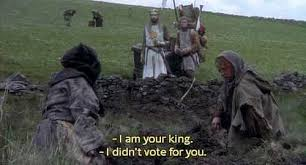

## More Monty Python 
[video link](https://vimeo.com/748305311)

* MP creators (Cleese, Chapman, Idle, Jones, Palin) studied History and Law at Oxford and Cambridge.
* Great man vs. historical materialist interpretations of history.
* Exposed to British academic Marxist historians: EP Thompson, Eric Hobbsbawm, Chirstopher Hill, Rodney Hilton, R.H. Tawney. 
* Anachronistic analysis: applying modern Marxist concepts to early medieval England.  

---


### North and Thomas (1973)

- "Efficient economic organization is key to growth."
- Need PR incentives "that bring the private rate of return close to the social rate."


---
<!-- footer: "" -->
### Harrison's chronometer

- Latitude easy (Pole Star angle).  Longitude precise time accuracy. Ships motion, changing temperature & humidity, etc.
- Phillip II of Spain prize in 1576. Dutch and British offer larger prizes.
- John Harrison award in 1770s.

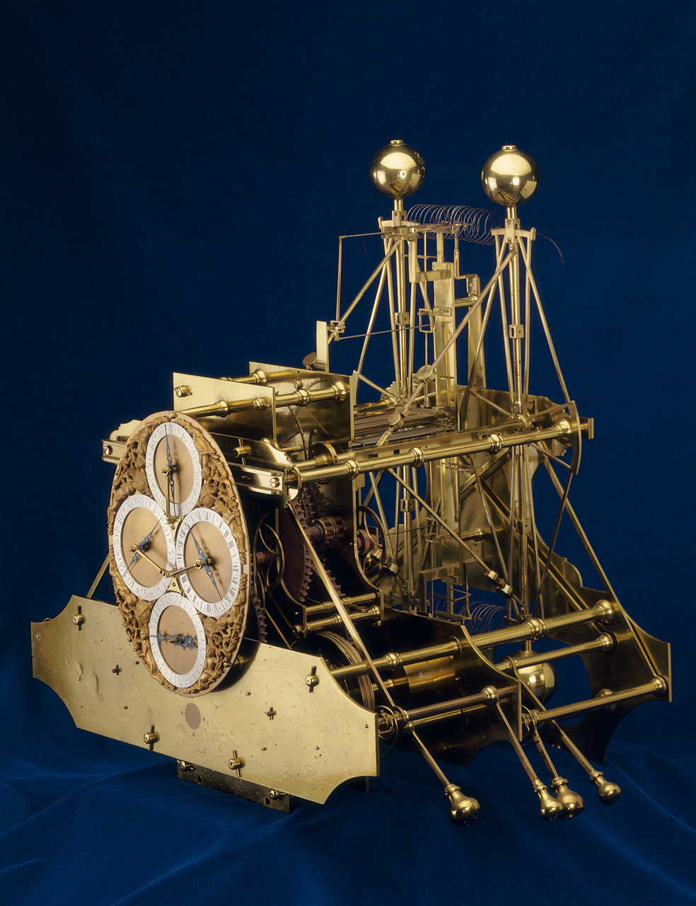


---


---


<style scoped>section {font-size: 36px;} </style> 

## Types of Goods
|                 |      Rival       |  Non- Rival  |
| --------------- | :--------------: | :----------: |
| Excludable      |  Private Goods   |  Club Goods  |
| Non- Excludable | Common Resources | Public Goods |

**Non-excludability or non-appropriability:**  
(negative or positive externalities).
**Non-rivalry** or non-exhaustibility 

Non-excludability is a Property rights problem
(but **PRs are themselves partly public goods**)


---
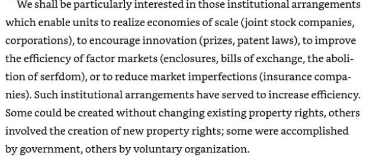

---

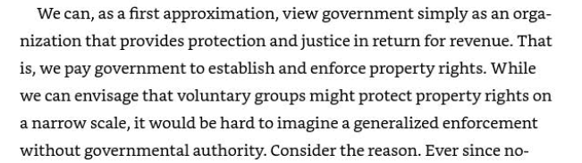

---
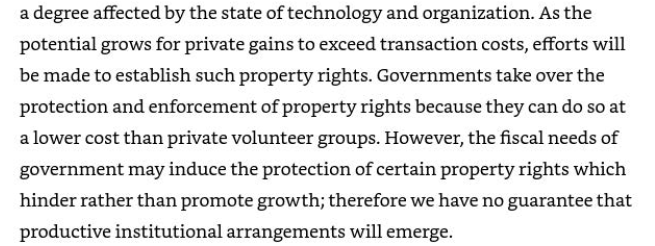

---
<!-- footer: "Capitalist Transition" -->
### Neo-smithian interpretation

* North and Thomas and neo-institutionalists fit into the "neo-Smithian" or commercialization interpretation of history.
  
* Costs of creating/enforcing PRs may exceed benefits to any group or individual. 
* But as benefits of PRs increase (driven by technology, Smithian expansion of commerce and trade, etc) benefits rise to exceed costs in creation of new PRs.
* May be resistance and delay, but inexorable trend towards more efficient PRs.
  - **Land policy in early modern Spain.**  Agriculture efficiency might have improved with more exclusive PRs to protect crop lands from _Mesta_ sheperds guild which ahd custormy rights to drive sheep across Spain (and paid royal fees).
    - Social return > private return to change.
    - Crown did not want to risk losing the Mesta guild's support.
    - Why didn't farmers just bribe sheperds to stay off their land?


---
## The Commercialization or neo-Smithian model

**Ellen Wood's critique**:
- This explanation of origin of capitalism presupposes it is natural outcome of human practices.  Required only maturation and removal of external obstacles.
  - Smith's "truck, barter, and trade." From the beginning, rational self-interest leading to profit maximization.  
* Conflict over institutional change may play a role, but "[in this view] capitalism had existed, at least in embryo, from the dawn of history, if not in the very core of human nature (Wood)."
- External forces help overcome obstacles:
  - technological improvements.
  - opportunities for trade expanded. 
  - expansion of autonomous cities


---
### Wood (continued)
- Early Marx and many marxists adopt neo-smithian view too: history as further division of labor, technological progress, burgher classes bring about capitalism by freeing selves of feudal fetters.
- But the later Marx of _Capital_ insists that capital is a new social relation. 
- Critical transformation of social property rights: expropriation of direct producers.
  - Dispossed became wage laborers
  - Rents derived from new commercial profits of capitalist tenants.
- "the market became capitalist when it became compulsory."
- Capitalist imperatives


---

## Questions


- How did serfdom and feudalism end in England?
- Why tenancies?
- Why are some tenancies more secure than others?
- Why was land left fallow?
- What is the tragedy of the commons?  Was this a problem in English manors/villages?
- What was the enclosure movement?
- What were the economic and social consequences of enclosure?  
- Are large farms more efficient than small farms (or in what contexts)?

- Brenner's argument: what is the role of class conflict in the transition to capitalism?


---
### Questions and Terms
- What are Property Rights?   Where do they come from?
- What are the different types/dimensions of property rights to land?
  - Bundles of rights: to use, inherit, exclude, alienate...
  - Exclusive, secure, alienable.
- Open access, Common property, private property.

- Customary vs. statutory rights.

- Property rights enforcement
  - private and community/public costs
- When is it socially/privately optimal to establish and enforce exclusive property claims?

---
### Evolutionary Theories of Property Rights

- Ronald Coase (1937)
- Esther Boserup (1965)
- Alchian and Demsetz (1972), North and Thomas (1973) and others.

Establishing and enforcing property rights is costly.
Property rights only worth enforcing where benefits exceed the costs.


How do property rights change? 
Do they change too fast or not fast enough? 
Do they become more efficient, or can inefficient arrangements arise and persist?

---
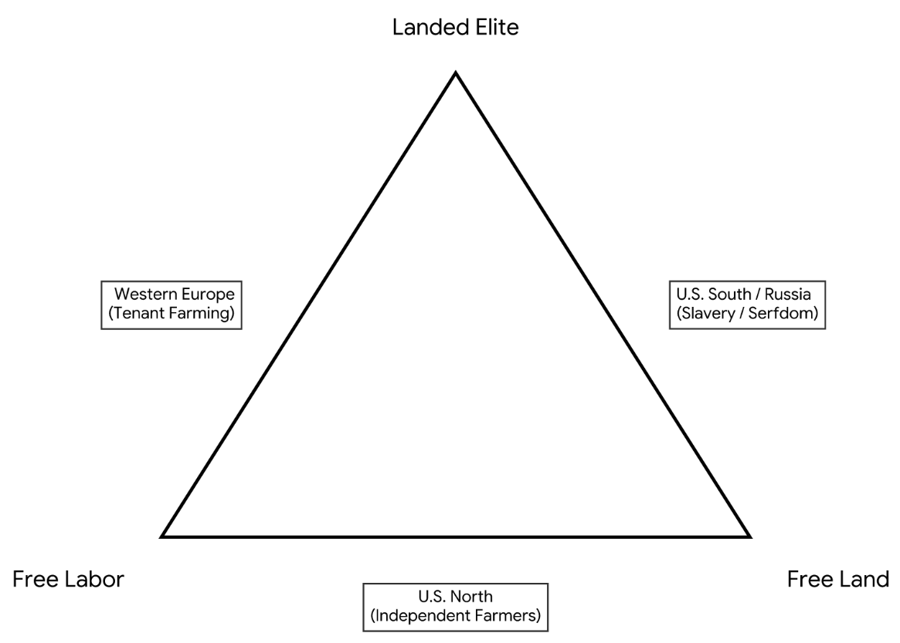

## Evsey Domar (1970)

## Domar's trilemma: 
Can only have two of three: 
1. **Free Land**
2. **Free labor**
3. **A Rentier landlord class**


---
## Open Access vs. Private Property

- Open Access/Commons: any one can enter and use.
  - Captures the average product of labor (APL)
  $$
  APL_c=\frac{F(T,L)}{L}
  $$

- Encloser/Private owner: one owner has right to exclude others.
  - a cost of enclosing/protecting c
  - Can now charge a rent for access.
  - Or earn a profit (equivalent in competition to a rent), hiring workers.
  - Hires until $w=MPL_e$

- But market wage $w$ must match what workers can earn on the commons so 
  $$
  MPL_e= w = APL_c>MPL_c
  $$
- 'Too much' labor is allocated to the commons.
---

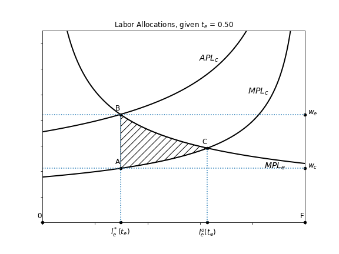


---
### Land insecurity (use-it-or-lose-it) tenure insecurity interpretation:
- The worker who enters the unenclosed commons earns an implied land rent
The average product a worker earns by remaining in the unenclosed sector is equal to the local wage in that sector (MPL_c) plus the value of any implied land-rents.

- In equilibrium the worker earns the same in the commons as a free worker in the enclosed sector.
$$
w_C+r_C\cdot \frac{\bar T}{L}=w_E
$$

* To preserve land-use-rights must use land and remain in community.

* Enclosed sector wage must compensate worker for leaving community and losing customary wage plus rents from surrendered land use-rights.
* Customary tenancy rights deliver are a form of land-rent.

---
### Evolutionary Theories of Property Rights

* Assume that property rights are costly to establish and enforce.
* At low levels of population density and few opportunities for tech/market improvement
  * Benefits of enclosure fall short of costs. 
  More efficient to keep lands unenclosed (customary tenures)
* As population pressures increase, and/or tech/mkt opportunities improves.
  * Benefits of enclosure increase relative to costs.
* Will private enclosure occur?
  * Potential efficiency gain but also rent-shifting gain to encloser.
  * Too much or too little enclosure.
  * will displaced be compensated for loss of informal rights.


---
### Class-Conflict centered explanations 
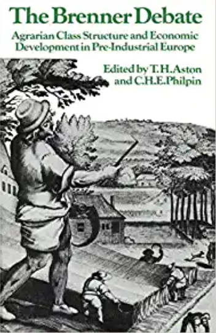

  * Earlier Marxist capitalist transition debates. 
    * Was 'prime mover' external (trade, technology) or internal (change 'balance of class forces').
  * Robert Brenner (1976) and "Political Marxists" such as Ellen Wood criticized the commercialization model. 
  * In their view, capitalism was not a natural outcome of economic development, but a political project. 
  * New social relations that destroyed the peasantry, imposed capitalist 'imperatives' on workers, landlords, tenants, and capitalists.

---
### Brenner (continued)
  * Argued that shift in balance of class forces happened primarily in England. 
  * Under feudalism, extra-economic exploitation (coercion), but peasantry had land. Peasant property had strengthened by 16th century.  Landlords did not have strong incentives to accumulate and improve.
  * In 18-19th C shift: peasantry dispossesed via enclosures and elimination of customary tenures. 
  * New agrarian capitalism: new 'free' rural wage LLabor proletariat and Landlords, Tenants came under new _capitalist imperatives_.
    * Labor had to work to survive
    * Tenants and landlords had to innovate and cut cost to survive competition.  
  * Drove up productivity, innovation, and growth.
  * Labor pushed out of agriculture into industry and urbanization.

---
New paper by Baker and Conning (2023): "A model of enclosures: Conflict, Coordination, and Efficiency in the Transformation of Property Rights to Land."

---
## Customary Rights

- "Peasant rights in forests and woodland... grew out of persistent, everyday friction with their lords".

>The 'ancient customs' of Stillington (Yorkshire) specified that the inhabitants of each ancient messuage or cottage could take three wagonloads of turves from the common every year and as much bracken as they could gather between the rising and setting of the sun on 14 September.

> "custom was mixed up with social relations. Lords had to be careful to ensure that their interest were not overwhelmed by this dynamic... subtle shifts in those daily transactions might gradually see customary regulations shift away from the lord's control."

> [but also sometimes] pitted the settled poor against the rootless and utterly destitute.

---

## Land Enclosures
- Refers to the fencing or hedging off areas of land for private use that had once been available for common use.
- The enclosure of open fields was of accompanied by the 'amalgamation' of strips of land into larger farms ('engrossment'). 
- Arable lands converted to pasture in 16C price rises.
- Enclosure led to more exclusive control and to the extinguishing of rights.
- Sometimes by agreement between landlord and tenants. But enclosed without consultation. 
- At its worst, enclosures forced tenant farmers off their land and removed the commons where a village would graze their animals
- Sometimes caused entire villages to disappear.

---
## Popular and societal resistance to enclosures:


"your sheep that were wont to be so meek and tame, and so small eaters, now, as I hear say, be become so great devourers and so wild, that they eat up, and swallow down the very men themselves. They consume, destroy, and devour whole fields, houses, and cities."
 **Sir Thomas More, Utopia. 1516.**


---
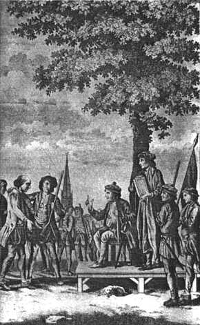
## Kett's rebellion (1549)
- 1540s crisis in agricutlure. Inflation, unemployment, rising rents, and declining wages.
- Enclosures of common lands, often led to loss of areas to graze animals and access to resources.
- Peasants had torn down enclosures, thought they had been acting legally, since there had been edicts against enclosures by Henry VIII.
- Peasants in Norfolk and Suffolk, led by yeoman Robert Kett, rebelled against enclosure of common lands and clergy.

---
### Kett's Rebellion (contd)
>29 grievances expressed "desire to limit the power of the gentry, exclude them from the world of the village, constrain rapid economic change, prevent the overexploitation of communal resources, and remodel the values of the clergy"
- 16000 rebels, multiple confrontations. 
- 3000 killed, 1000 hanged.


---
### Protestant clergyman Robert Crowley (1550):
“Cormorants, greedy gulls; yea, men that would eat up men, women, & children... They take our houses over our heads, they buy our lands out of our hands, they raise our rents, they levy great (yea unreasonable) fines, they enclose our commons! No custom, no law or statute can keep them from oppressing us in such sort, that we know not which way to turn so as to live.”

“...lease mongers that cancel leases on land in order to lease it again for double or triple the rent,” [Landlords] should “consider themselves to be but stewards, and not Lords over their possessions.”

- Yet Crowley told 1549 rebels that they had been misled by the devil: “to revenge wrongs is, in a subject, to take an usurp the office of a king, and, consequently, the office of God.”


---
Religious opposition to enclosures
## Historian R.H. Tawney (describing mid 1500s):
“the popular hatred of the encloser and the engrosser found a natural ally in religious sentiment, schooled, as it was, in a tradition which had taught that the greed of gain was a deadly sin, and that the plea of economic self-interest did not mitigate the verdict, but aggravated the offence."

“... doctrinal radicalism marched hand in hand with social conservatism. ...saw in economic individualism but another expression of the laxity and licence which had degraded the purity of religion..."

---
### Tudor Enclosures
- Tudor period (1485-1603). Rapid economic growth and state expansion.
  - Dissolution of the monasteries Henry VIII 1530s.
  - Many enclosures in the period but also commissions of inquiry and legislation to protect peasant rights:
    - Statute of Tillage 1486,  1515 Forest Act. 
    - 1536 Common Land Act (enclosures had to be approved by commission and compensation paid to affected)
    - 1547 "Poor Law" system of relief to the poor.
    - 1576 Statue of Artificers (required landlords provide cottages, prevent displacements).
- Rise of the Yeoman (successful peasant producers). Property rights strengthened. Expanded tenancies and holdings. Often initiated/benefited from enclosure.

---
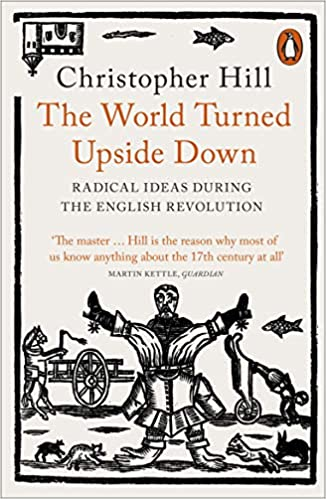
<style scoped>
section {
  font-size: 24px;
}
</style>
## The Diggers 1649
-  Radical religious and political movements of 17th C: Levellers, Ranters, early Quakers, etc.
- Civil war ends w/ Charles I executed.  New commonwealth govt. Leveller term applied to egalitarian factions in New Model Army who advocated 'natural rights' + representation.
- 'Diggers' or 'True Levellers' nationally organized group of more radical Protestants. 
- advocated for common ownership of land and an end to private property
- In 1648-49 aprox 40 families started to farm common lands in the village of St. George's Hill, Surrey.  Local landowners send gangs and arsonists. Diggers arrested and evicted.

---
### Diggers in popular culture
"The World Turned Upside Down" ballad.

Billy Bragg's popular (folk punk) interpretation (of very much changed lyrics): 
https://www.youtube.com/watch?v=YwQwA_kFxoE


---
## The English Agricultural Revolution
- 1520 estimate 80\% farmers subsistence, selling little to market.
- Yet by 1800 English ag yields were 2X level of middle ages and near highest in the world. 
- Output per worker 50\% higher than next highest European country.
- Institutional Revolution:
  - Most open fields had been enclosed
  - small peasant hoildings into large farms leased to tenants who cultivated them with wage labor.
  - Concentrated land ownership. High rents, stagnant wages (but pop growing fast).
- London rapid growth from 16C.  Great commercial power by 1800, reflecting growing British control over Atlantic trade. 
- First Industrial Revolution 1760-1830.

---
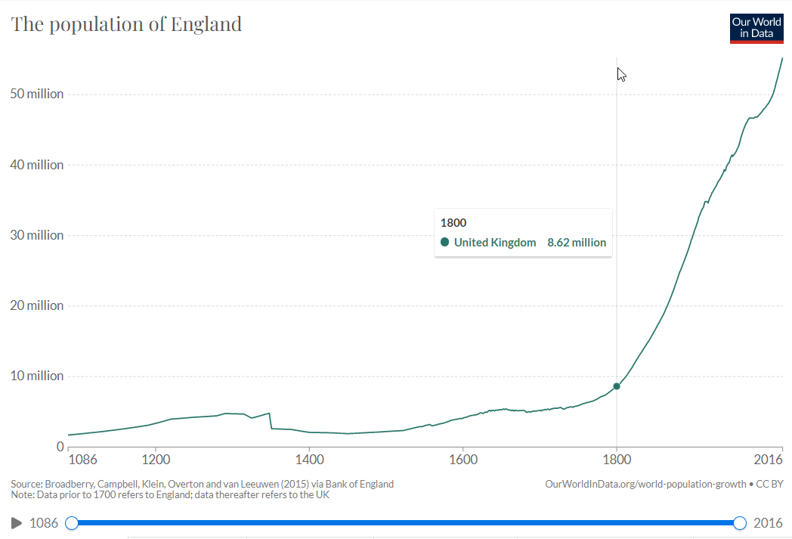

---
By 1851 Agricultural Census
Britain had strongly concentrated land ownership
- ~4000 largest proprietors owned 60 /% land
- Quarter million cultivators (mostly tenants)
- Employed ~1.5 million laborers
- Peasantry as a group hardly existed.

Contrast to France, USA, Russia, Prussia.
 - very different agrarian paths to capitalism.

---

### Traditional/Triumphalist accounts of the Agricultural Revolution
- Historian Arnold Toynbee _Lectures on the Industrial Revolutio in England_ (1884).
  - an "Agricultural Revolution" (AR) was prior and necessary for the IR. 
  - AR was made possible by the enclosure movement. Swept aside backward and inefficient agriculture (peasant and/or feudal remnants).
  - Landowners consolidate holdings and experiment with modern agricultural techniques. 
  - Great landlord innovators ( Jethro Tull, Lord Townshend, Arthur Young, ...) and 'improving tenants' .
  - Innovations raised productivity: selective breeding of livestock, new systems of crop rotations involving turnips and clover.
  - Drainage and other improvements to land.

- All this raised productivity, allowed for surplus of food to support booming population and labor to the cities booming with trade. 

---
>the destruction of the common field system of cultivation; the enclosure, on a large scale, of commons and waste lands; the consolidation of small farms into large ... wrought, without doubt, distinct improvement from an agricultural point of view. They meant substituion of scientific for unscientific culture.

Arnold Toynbee, _Lectures on the Industrial Revolution in England_ (1884)

> The breakup of the peasantry was the price England paid for the increased supplies of corn and meat to feed her growing population

Mathias (1983), _The First Industrial Nation_ 

---
## Agrarian Fundamentalists (Allen's term)
The view that improved farming, modern agrarian institutions, increase in inequality and first indistrial revolution are connected. It's claims:
  1. **Technical Revolution was caused by 'modernization'**. 
    - Traditional and 'feudal' peasant farms and open fields had stifled progress. Replace small backward peasant properties with large 'modern' farms.
    - Enclosures and large farms created private property and capitalism.
2. **Growth of agricultural productivity was a pre-requisite for the Industrial Revolution**
   - Enclosures and rising productivity fed the manufacturing cities, provided freed labor and savings for industry.
3. **Increase in Inequality an inherent feature**
   - Tradeoff between equity and growth viewpoint.
   
---
### Agrarian Fundamentalism


- **Tory Triumphalists** such as Arthur Young.
  - claim enclosures maintained or increased farm employment.
- **Marxists** including Robert Brenner and Ellen Wood.
  - claim enclosures led to 'labor shedding.' 
  - Destruction of peasant property to create new  capitalist imperatives, 'necessary' for capitalism/IR.

Agrarian Fundamentalism prompted the collectivization of Soviet Agriculture, and influenced agricultural policies through out colonial and post-colonial world.

> For all those who contrast a traditional society with a modern one, for all those who argue that the traditional society must be overturned for development to ocur, for all those who see inequality as the necessary price of growth -- England is the classic case. (Allen, p2)
---
### Criticisms of Open Field System
Included:
   1. overcommitment to Corn growtin
   2. Slow introduction of new crops and methods due to group decision making.
   3. inadequate drainage and weed control due to mixed property, collective decisions.
   4. communal grazing made selective breeding difficult, and also spread disease.

---
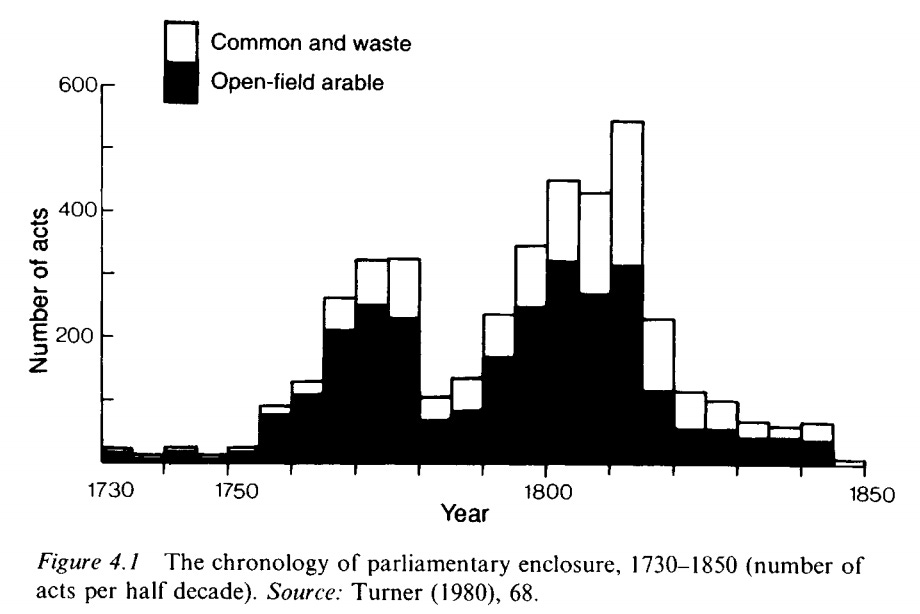


---
## Marx and Marxists on labor expulsion
> The expropriation and expulsion of the agricultural population, intermittent but renewed again and again, supplied ... the town industries with a mass of proletarians

Karl Marx, 1867

>both landlords and tenants were compelled [by] ... the imperatives of competition ... new forms of appropriation established new compulsions ... in large part by the dispossesion of the peasantry.

Ellen Wood, p66

>the characteristic ideology that set England apart ... was above all the ideology of 'improvement': not the Enlightenment idea of the improvement of humanity but the improvement of *property*, the ethic -- and indeed the science of profit ... the practice of enclosure and dispossession.  Ellen Wood, p.183

---
## Allen's view and findings
- “two agricultural revolutions,” one by yeomen farmers in the seventeenth century and another by landlords in the eighteenth,
- "large farms and enclosures were not necessary for the technical revolution in agriculture."
- Studied effect of enclosuree and farm size on cropping, employment and yields in South Midlands.  How easily did labor shift to manufacturing? What happened to wages, profits, and rents?
- the “great inventions” —clover/turnips, convertible husbandry, and New Leicester sheep— were scant contributors.

---
Food consumption:
- steadily rising output from 1520 to 1739
- stagnation during the period 1740-1800, with output up by just 10 percent
  - Food consumption per capita actually fell, from a peak no higher than the levels of the sixteenth.
- renewed acceleration from 1800 to 1850, increasing by 65 percent. 


---
## Rise and Fall of the Yeoman
- Black death popn decline destabilized serfdom.
- Labor mobility and wages increased, rents collapsed.
- Early enclosure and conversion to pasture were seigniorial response to new order.
- 1 of 10 villages in midlands destroyed between 1450-1525.
- This eliminated small-scale agriculture and transition to capitalist agriculture.
- Reaction to enclosures actually strengthened consolidation of peasant agriculture, created secure forms of tenure. 
- Yeomen were owner-occupier farmers.  They were responsible for most productivity growth -- the agricultural revolution. 

- The later landlords revolution eliminated the yeomen, by concentrating ownership in great estates, creating large leased farms.
  - In 18th C many yeomen sold property to landlords, others lost their land when landlords changed terms. Fueled in part by growing mortgage market.  

---
### Open fields a barrier to productivity improvements?
- Allen argues larger portion of agricultural improvement happened in yeoman agricultural revolution.  Productivity doubled between 1500-1800. Enclosure played minor role.

In later landlord revolution period, did enclosure lead to new adoptions:
- In heavy-soil arable regions yes -- enclosed villages more likely to improve.
- In light-soil regions also more likely to adopt new crop rotations. 
- But these do not represent large productivity gains.
- In 1800 yiled in open and enclosed fields were similar. 

On employment:
- Enclosure had little if any effect when it did not change tillage/pasture. Where led to conversion to pasture, employment declined. In pastoral areas, the Marxist labor shedding is clsoer to the facts.

---
On rents:
- they increased a lot. Combined with finding that enclosure did not raise productivity, Allen argues that enclosure represented redistribution of income from farmers to landlords.
- Real rents increased about seven fold between 1450-1850.
---

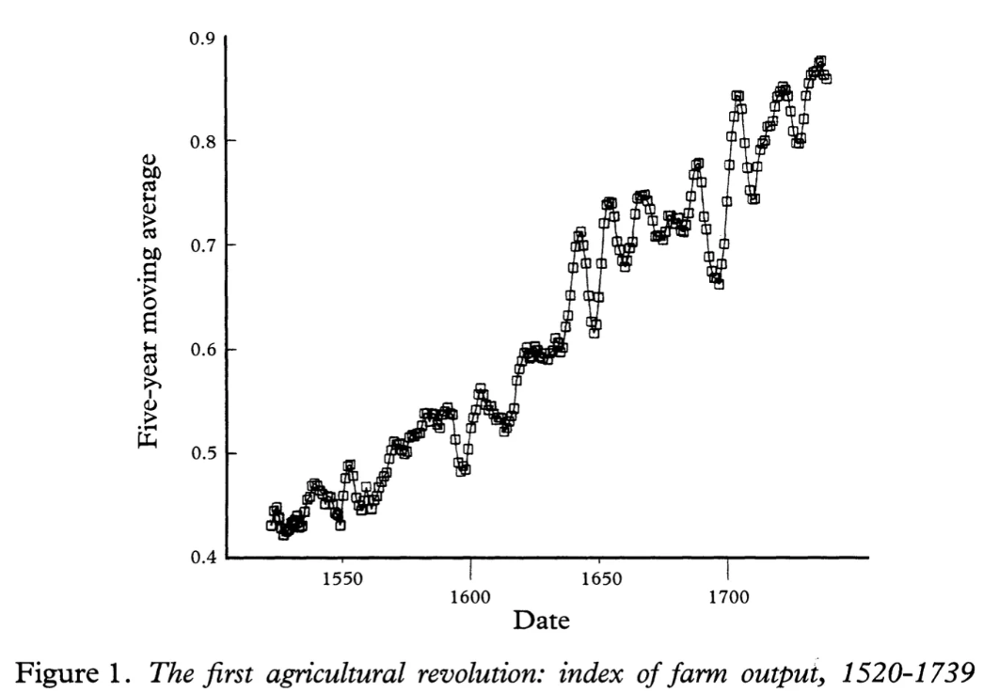


---
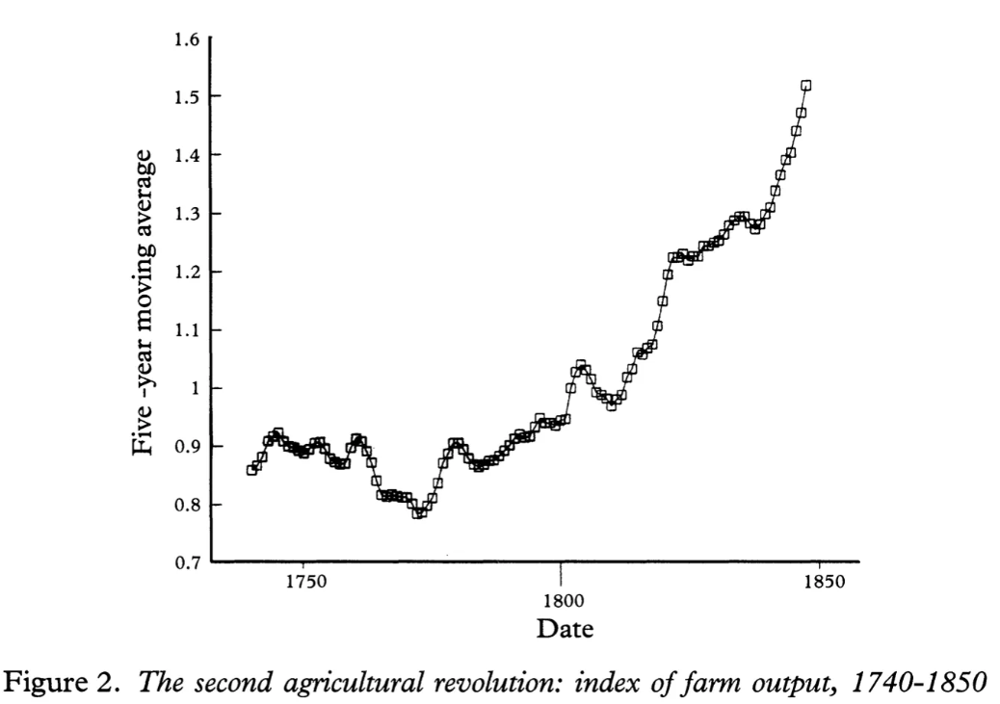


---
>The seventeenth century yeomen were the decisive contributors. They accomplished mos of the growth in yields and about half of the rise in labour productivity... the main contribution of the landlords' agricultural revlolution was further shedding of labor in the 18th century. While this did push labor productivity to record levels, it was of secondary importance to the achievement of the yeomen.
> Most of the productivity gains of the agricultural revolution accrued to the large landowners as rent increases. ...spent ofrtunes on stately homes and elegant living.  Agriculture made little contribution towards promoting  industrial capital formation. 
> 17 century rising agricultural productivity did release labor to cities.
> By early 19th century, enclosure and technical change no longer raised yields. Enclosures reduced employment per acre but the labor released was not successfully employed in manufacturing.  By the early 19th century, the agricultural revolution was producing pupers -- not proletarians.

---
## Enclosures and Agricultural Productivity

- Robert C. Allen's book _Enclosure and the Yeoman_ challenged the traditional view that enclosures were necessary for agricultural productivity.
- He argued that enclosure did not lead to increased productivity, and that open field systems, in which peasants had access to common land, had already achieved high levels of productivity.
- He suggested that productivity gains in agriculture were due to innovations in technology and methods of farming, not enclosure.


---

## Agrarian Fundamentalism

- Allen criticized the "agrarian fundamentalism" of Alwyn Young and other champions of enclosure who believed that removing peasant property rights and customary tenures was necessary for increasing productivity.
- According to Allen, the evidence from the South Midlands showed that yeoman farmers on open fields had raised agricultural productivity, disproving the view of the agrarian fundamentalists.


---
### British Agricultural Revolution 1500-1800
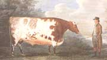


- Transition from organic ag system to more energy-intensive inputs.
- new crop rotations involving turnips and clover.
- Changes and innovations 
  - new plows and seed drills.
  - selective breeding of livestock
  - land reclamation (drainage of fenlands and irrigation)

---
- Large parts of Eastern England were fenlands, marshes, and peat bogs.
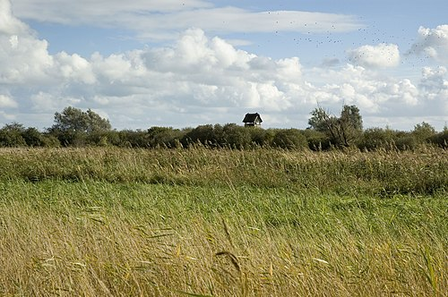
- Acts of Parliament 1740 to 1840 drained 1.5 million acres of land.
---

- Rising labor productivity
- England's population grew from 3.5 million to 9 million between 1500 and 1800.

- Great men.. "Great Inventors"  and "Great Innovators" narratives.

---
## Debated 'agricultural revolution'
- Agricultural Statistics are sparse, so much speculation in early period. Cereal Statistics in Britain not collected systematically until 1880s.
- **Greg Clark**: 'enclosure was mainly a capital investment induced by higher land rents relative to wages, with very little associated productivity gains.'
- Slow and steady vs. 'revolution'
>  [From 1500 to 1869] English agricultural output seems to have tripled,and [TFP]  increased by about 50%.   But this was achieved over a very long period with few abrupt changes so that the rate of growth of productivity per years was on average 0.15% ... in any twenty year period farmers would be unable to discern, given the noise of year to year fluctuations, that productivity was actually increasing. 

---
## Push or Pull?

- What certainly happened is the structural transformation of the economy: people moved from rural areas to urban.  From agriculture to manufacturing.
- The agricultural revolution story, is a 'Push' story: rising ag productivity released labor for industry.
  - Allen pointed out that in landlords revolution, rural unemployment rose. So labor shedding, but not absorbed into industry.
- But maybe it was more of a 'Pull' story: rising wages in industry attracted labor from agriculture.
- 

---

## Farm structures and productivity

The second and third agricultural revolution
- Modern economic growth > 1870. Only then did labor costs start to rise.
- Might have expected move to more capital-intensive agriculture throughout Europe.  Instead 'green revolution' or rising land productivity (new fertilizers). This is when yields really started to rise.
- European continent built agricultural extension services to help farmers adopt new technologies.  Not the case in Britain. 

---
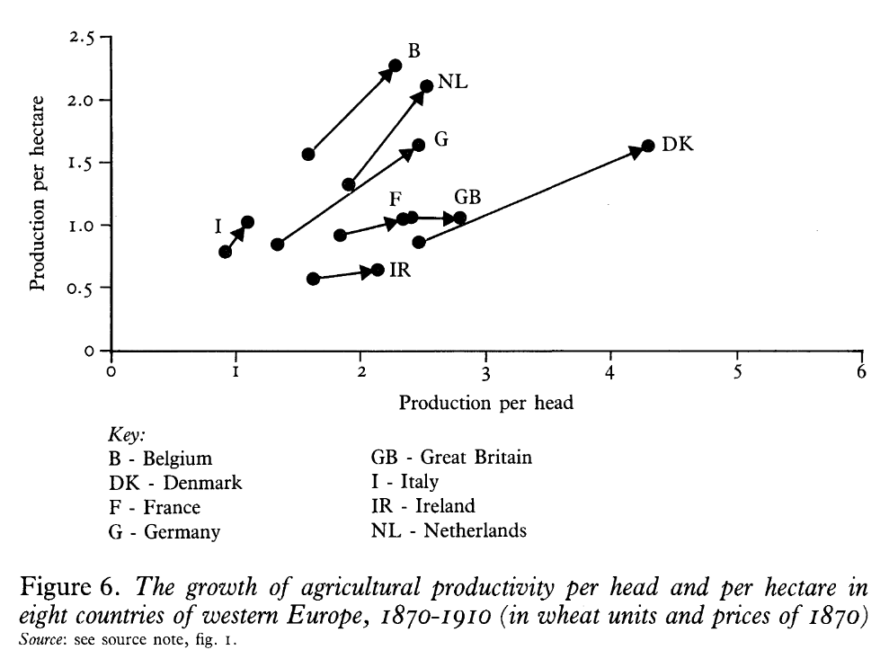

---
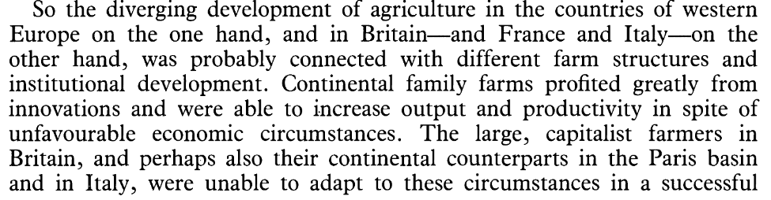
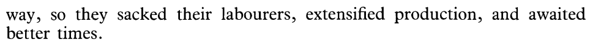
