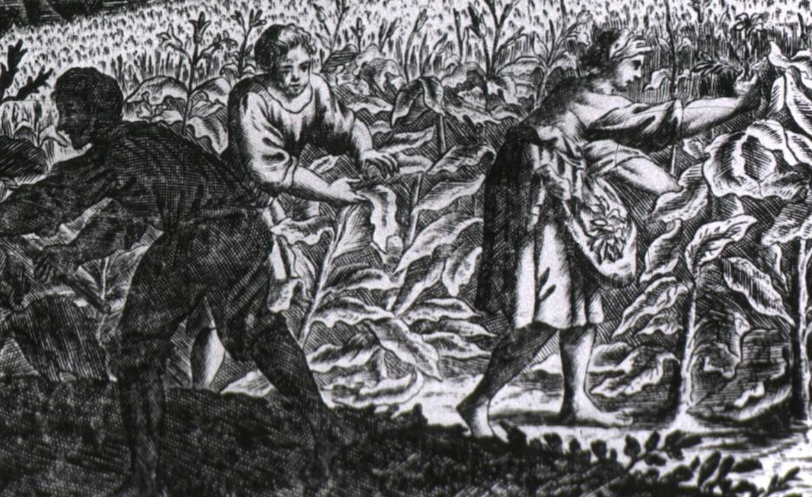
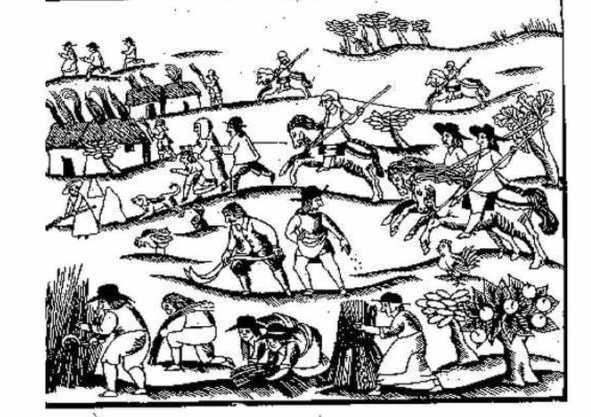
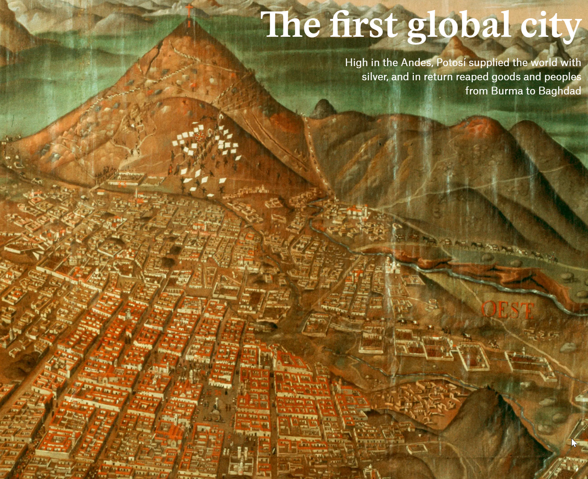
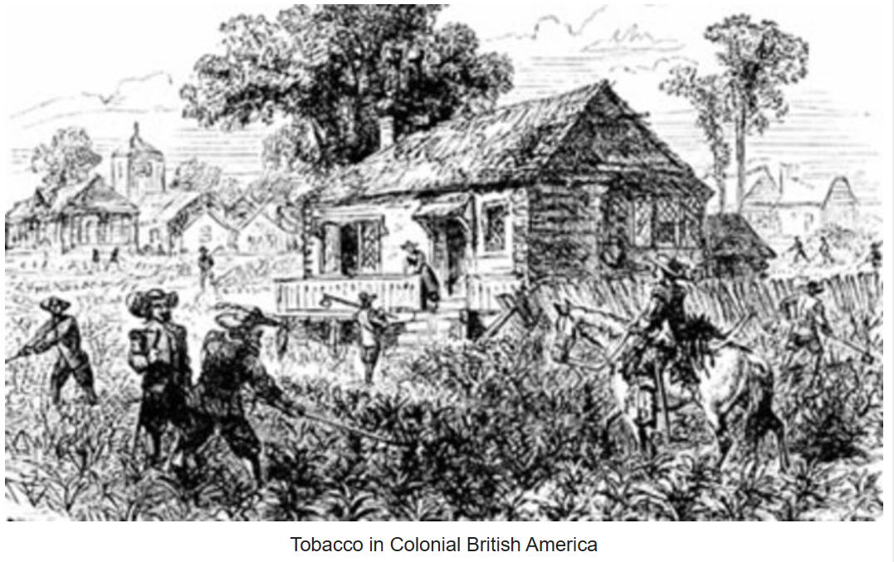
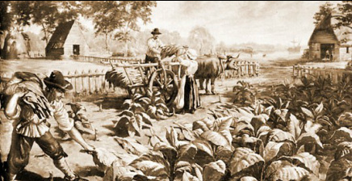
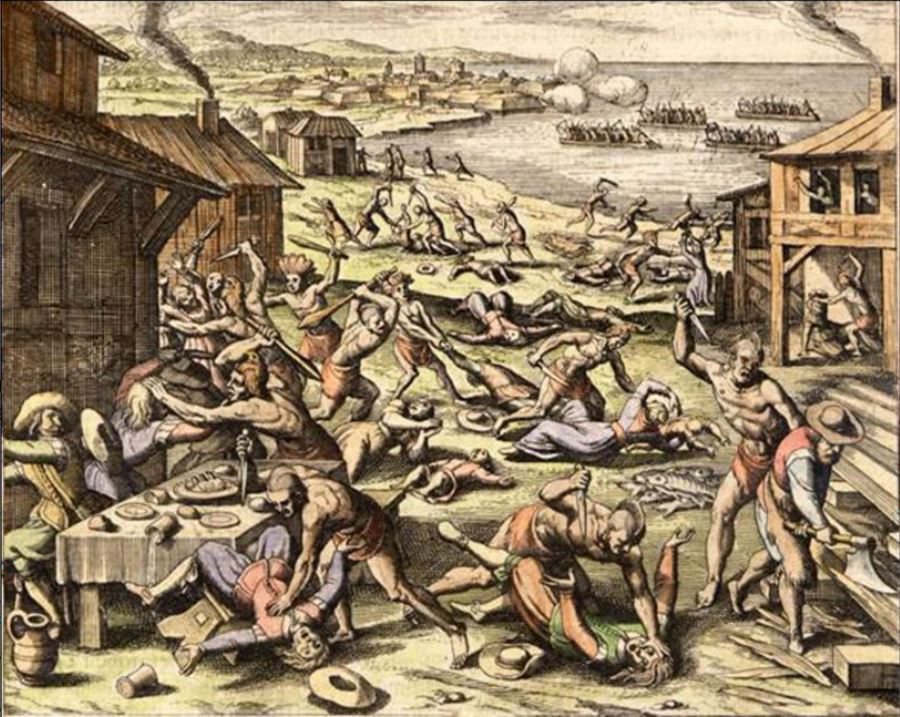
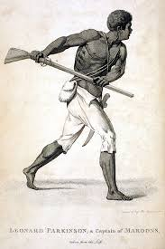
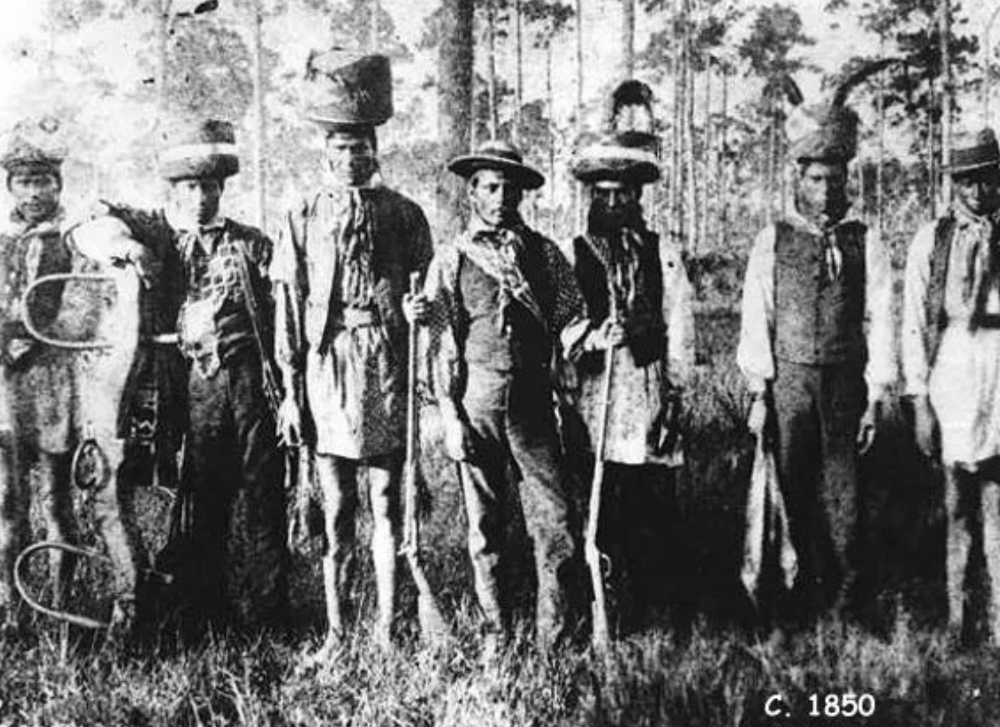
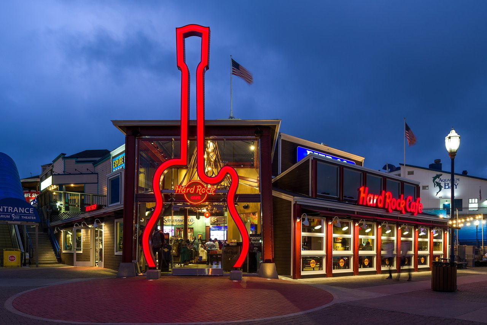

# The Frontier Paradox
Property Rights and 
Settlement in the New World

Jonathan Conning
Spring 2026

---

**Key reading:**
- Solow, Barbara, 1993. "Slavery and Colonization," Ch 1.
- Domar, Evsey D. 1970. “The Causes of Slavery or Serfdom.”

**Suggested for Context:**
- Galenson, David, 1981. *White Servitude in Colonial America.*
- Naidu, S. et al, 2025. "Geography of Coercion."

---

## 1. The Factor Ratio Reversal

 

- **England (Old World):** Land Scarcity / Labor Abundance.
- **Americas (New World):** Land Abundance / Labor Scarcity.
- **The Paradox:** Why did commercial settlement take so long?
- **Diverging Paths:** - **South:** Slavery & Landed Elite.
  - **North:** Family Farms & Frontier.

---

## 2. The Commercial Problem (Solow)

- **Adam Smith's Fallacy:** Abundant land $\neq$ rapid wealth.
- **The "Staple" Engine:** Distance = "Transport Tax."
  - Needs high-value exports (Sugar, Tobacco) to pay for trade.
- **The Subsistence Trap:** - Labor disperses to the frontier for $AP_L$.
  - This "suction pump" makes hiring labor for a surplus impossible.

---

## 3. The 17th Century Atlantic Pivot

**Estimated Population of British Colonies, 1700**

| Region | White | Enslaved (Black) | % Enslaved |
| :--- | :---: | :---: | :---: |
| **West Indies** | 33,000 | 112,000 | **77%** |
| **U.S. South** | 82,000 | 26,000 | **24%** |
| **U.S. North** | 148,000 | 5,000 | **3%** |

- **Migration Flow:** 220,000 to West Indies vs. 140,000 to Mainland.
- **Solow's Point:** The "Staple Engine" drove the demographic center of gravity to the Caribbean.

---

## 4. Domar’s Trilemma 

**The Impossible Trinity**

Pick **two**, and only two:
1. **Free Land** (Open Frontier)
2. **Free Labor** (Mobility)
3. **Landed Elite** (Rentiers)

- **The Conflict:** If land is free, labor must be bound to extract rent.

---

## 5. Theory: The Exit Option

- **Indifference Trap:** $AP_L > MP_L$.
- A squatter captures the entire output (including rent).
- Landlords can only offer the marginal product.
- **Rent Dissipation:** Frontier movement crashes land values to zero.

See next slide.

---

---

## 6. Spanish America: The Demographic Lottery

- **Spain's Advantage:** Hit sedentary, already "enclosed" populations (Aztecs, Incas).
- **No Exit Option:** Indigenous labor was tied to established systems.
- **Contrast:** British N. America had mobile populations and a "leaky" frontier.
- Spain co-opted an existing hierarchy; Britain had to invent one.

---

## 7. Tobacco: The Voracious Staple

- **Soil Depletion:** Tobacco is "nitrogen-hungry."
  - Fields exhausted in **3-5 years**.
- **Physical Dispersal:** Planters forced to constantly move west for fresh soil.
- **The Paradox:** The crop that funded the colony also pushed labor further from the center, weakening control.

---

## 8. Indenture: The Credit Market (1620-1680)

- **Passage Cost:** £5–£10 (Equivalent to ~2 years of wages).
- **The Forward Contract:** Labor provided as collateral for the "loan" of passage.
- **Servant Pipeline:** 50% to 66% of all white immigrants to the Chesapeake arrived indentured.
- **The "Leaky" Solution:** Every 5 years, labor graduated to the frontier (Freedom Dues).

---

## 9. The Navigation Acts (1651, 1660)

- **The Mercantilist Squeeze:** Colonial staples (Tobacco) could only ship to England on English ships.
- **The "Transport Tax":** Squeezed the profit margins of small frontier planters.
- **Bacon's Fuel:** Lowered income for those already struggling on the marginal land of the frontier.
- **Trade Impact:** Forced the growth of London as a mandatory hub.

---

## 10. Bacon’s Rebellion (1676): The Crisis

- **The "Dangerous Unity":** Nathaniel Bacon leads a coalition of poor whites, servants, and enslaved Africans.
- **The Target:** The Jamestown "Coastal Elite" (Governor Berkeley).
- **The Logic:** A collective exercise of the **Exit Option** against a gentry that held the best land and taxed the rest.
- Jamestown is burned; the elite flees.

---

## 11. Post-Bacon: Closing the Exit Option

- **The Pivot:** White servants eventually become "freedmen" (political competitors).
- **Institutional Shift:** - Systematically replace "Contract Labor" with "Coerced Labor."
  - **Racial Wedge:** Slave Codes (1705) elevate poor whites to break class solidarity.
- **Domar Result:** The South chooses **Free Land + Landed Elite**, sacrificing **Free Labor**.

---

## 12. The Switch: Mortality & Price

| Year | Servant Price (£) | Slave Price (£) | Life Expectancy |
| :--- | :---: | :---: | :--- |
| **1640** | £7 | £25 | **Low** (seasoning) |
| **1690** | £10 | £20 | **Rising** (20+ years) |

- **Asset Logic:** If mortality is high, a 7-year indenture is "for life."
- **1698:** Royal African Co. loses monopoly; slave prices drop.
- Slavery becomes the superior capital investment.

---

## 13. Maroons: The Ultimate Exit Option

- **Definition:** *Cimarrón* (Spanish) = "Wild" or "Runaway."
- **Parallel Societies:** - **Palmares (Brazil):** ~20,000 people.
  - **Jamaica:** Maroons won independence via war in 1739.
- **The Threat:** These enclaves proved the frontier was never truly "closed."

---

## 14. The Seminole Alliance

- **Origins:** Lower Creek Indians + Black Maroons (escaped slaves).
- **Geography:** Settled in the Florida frontier (Spanish territory).
- **The Threat:** A permanent, armed multi-ethnic enclave.
- **The Economic Conflict:** Slaveholders lost "capital" that leaked to this frontier.
- **Seminole Wars:** The U.S. spent millions to destroy this successful "Exit Option." 

---

- **The Unconquered:** Wars ended in 1858, no treaty signed. Remaining Seminoles retreated to the Everglades.  

- Re-engaged US government in early 20th C, as roads penetrated their territory. Federal recognition in 1957.  

- The Seminole Tribe is the richest Native American tribe in the United States, with a net worth of over $20 billion. Hard Rock International is 100% owned by the Seminole Tribe of Florida. 

- Approx. 23,000 enrolled members of Seminole tribe in Florida.  18,000 in Oklahoma.

---
## 14. The Spanish Sanctuary & Florida

- **Geopolitical Sabotage:** The Spanish Edict of 1693.
  - Freedom offered to any British slave who converts to Catholicism.
- **Fort Mose (1738):** First legally sanctioned free Black settlement (St. Augustine).
- **The Result:** Georgia is founded as a "buffer" to protect South Carolina's labor capital.

---

## 15. Georgia: The Failure of the Buffer

- **1732:** Oglethorpe bans slavery to ensure a "loyal" militia of free white farmers.
- **The "Malcontents":** Settlers complain they cannot compete with SC's $MP_L$ extraction.
- **1751:** The ban is lifted. 
- **1763:** Britain takes Florida, "Closing" the southern sanctuary and the Spanish Exit Option.

---

## 16. London: The Atlantic Entrepôt

- **Population Explosion:**
  - 1550: 120,000
  - 1700: **575,000** (Largest in Europe).
- **The Suction Pump:** London processed, refined, and re-exported the colonial staples (Tobacco/Sugar).
- **Structural Transformation:** London's demand "pulled" labor into the wage market and specialized English agriculture.

---

## 17. The Atlantic Circuit & Industry

- **Industrial Hubs (1760–1830):** Liverpool, Bristol, Glasgow.
- **Financing the Revolution:**
  - "Tobacco Lords" and Sugar Merchants provided the liquidity and credit.
  - The Atlantic trade was the "Venture Capital" of the 1st Industrial Revolution.
- **Integration:** The "Closing" of the American labor market funded the "Opening" of the British industrial market.

---

## 18. Geography as Coercion (Naidu 2025)

- **The Spatial Exit:** Slavery density increases with distance from the "Free North."
- **The Misallocation:** Slavery forced people into malarial, high-productivity areas where free workers refused to go.
- **The Markdown:** Owners captured **82%** of the $MP_L$.

---

## 19. Conclusion: Institutional Legacies

- **The Domar Lesson:** Abundance creates the incentive for the *most* restrictive institutions.
- **Path Dependency:** The 17th-century "fix" for labor scarcity dictated the 19th-century breakout.
- Aggregate GDP rose **9%** post-emancipation as labor moved to its most productive uses.

---