<!--
theme: gaia 
paginate: true
footer: Eco 331: Industrial Revolution
style: |
  section {font-size: 26px;}
-->


<!-- footer: "" -->


# ECO 331
## Economic History

```
The Industrial Revolution
```
Jonathan Conning
Spring 2026
<br></br>

---
### read by Tue 4/14 
* Oded Galor, Ch 4, "Full Steam"
* KR 8 "Britain's Industrial Revolution"


### read by Thu 4/16

* Mokyr, Joel, 1992. The Lever of Riches: Technological Creativity and Economic Progress, Oxford. Read chapter 5, "The Years of Miracles: The Industrial Revolution, 1750-1830." ([PDF](https://delong.typepad.com/files/mokyr-lever-revolution.pdf))

## Red by Tue 4/21

* Solow, Barbara, 1993. "Slavery and Colonization," Chapter 1 in Slavery and the Rise of the Atlantic System. Cambridge University Press. 

* Domar, Evsey D. 1970. “The Causes of Slavery or Serfdom: A Hypothesis.” The Journal of Economic History 30 (1): 18–32. PDF


---
### Britain's Industrial Revolution
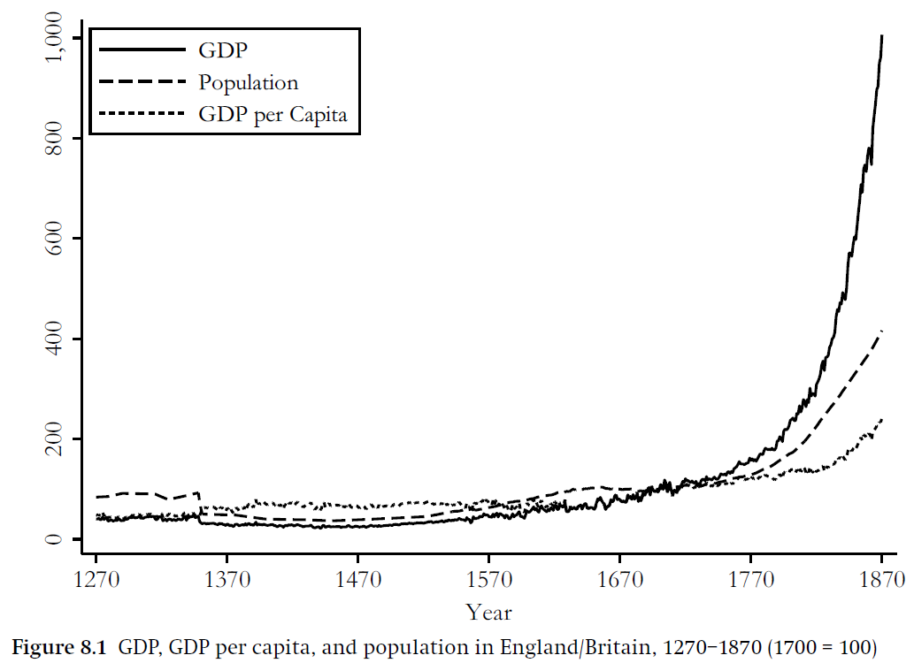
* 1700-1870, Britain's GDP grows 10X
* Popn 4X, GDP/capita 4X
* Unprecedented transformation.
* Growth was sustained. 

---
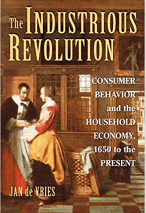
## Preconditions
* Commercialization
  * No warfare on British territory since civil war.
  * Commercialization, market integration.
  * New goods: ready-to-wear clothing, tea, sugar, tobacco, spices.
  * De Vries (2008) argues consumer "Industrious Revolution" as households supply more labor to buy new goods (contrast to Marxian interpretation).

---

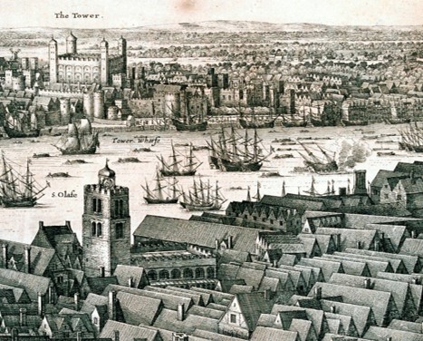

### The Rise of London
* In 1550: 50-70K  (~2% of popn)
  * 2X 2nd largest Norwich.
* By 1700: ~ 575K (10% of popn)
  * 19X Norwich

---
### Transport Improvements

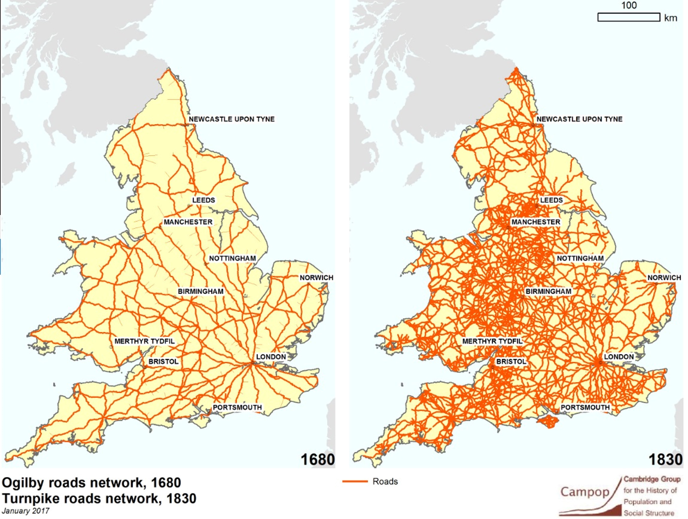
* 18th C transport revolution 
* Stagecoach speeds from 1.96 MPH in 1700 to 7.96 in 1820
* Improved road network, stagecoach design, way-stations
* 1840: Britain 2X road density of France
* Canals link NW industrial heartland w/ coal
* Rail travel in 1870 10x faster than 1700 coach
* Map of turnpikes 1680-1830


---
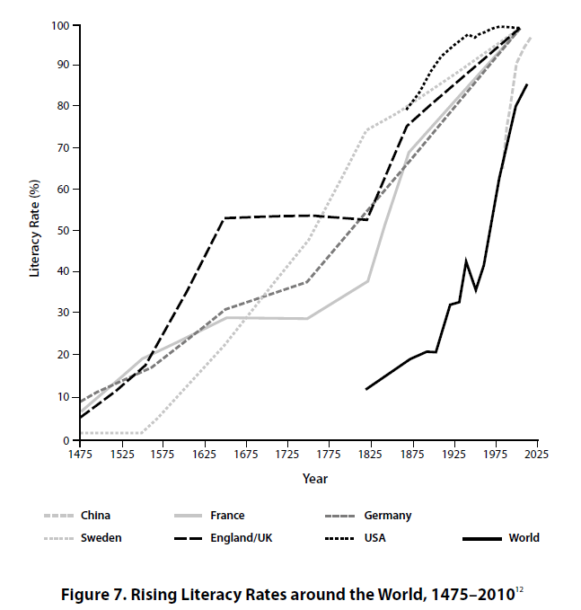


---
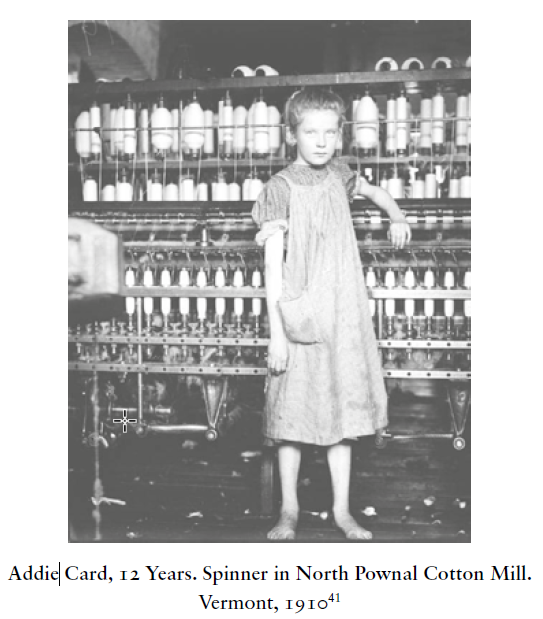

---


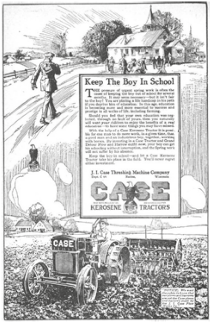
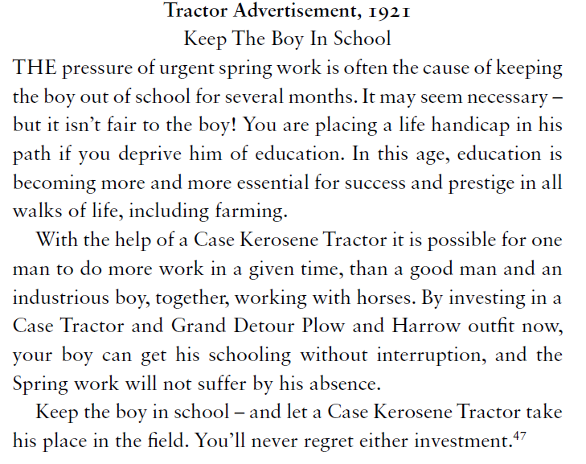

---


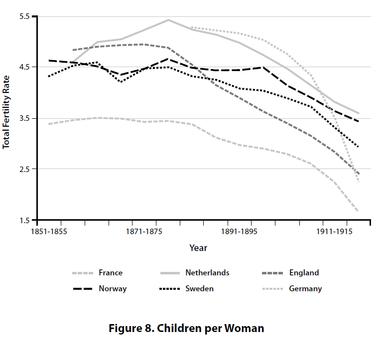

---


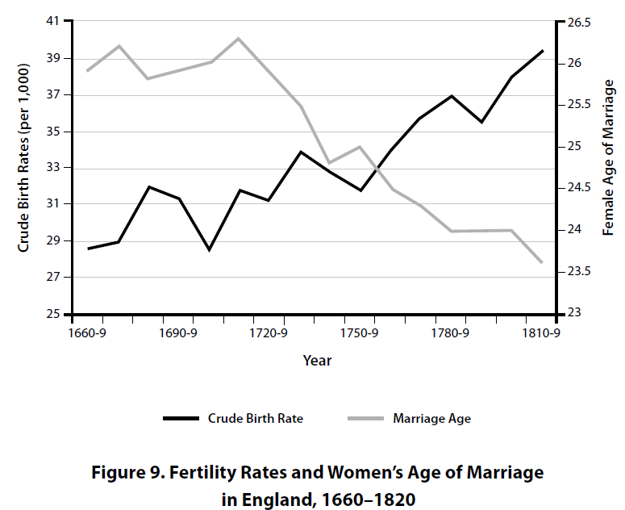

---

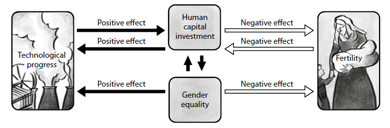

---


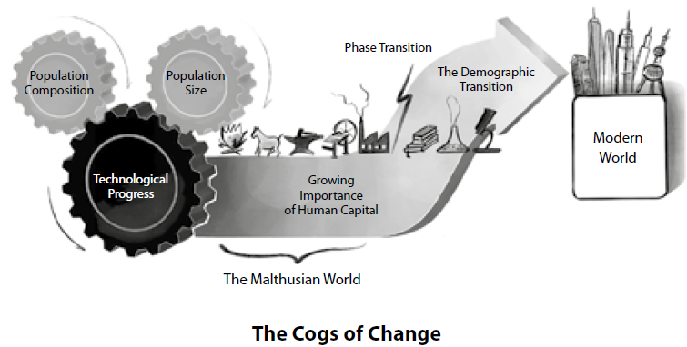

---
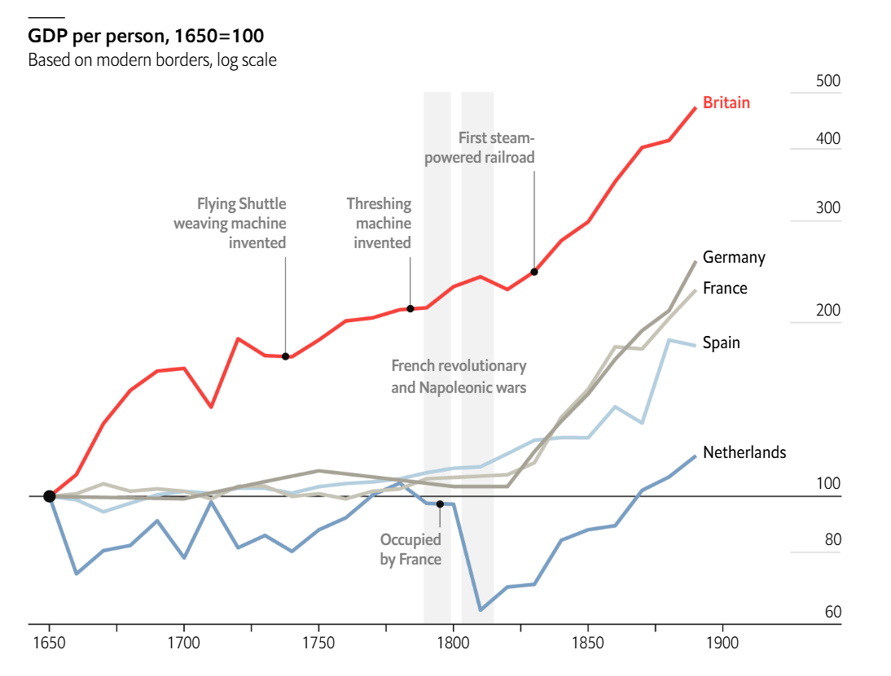


---
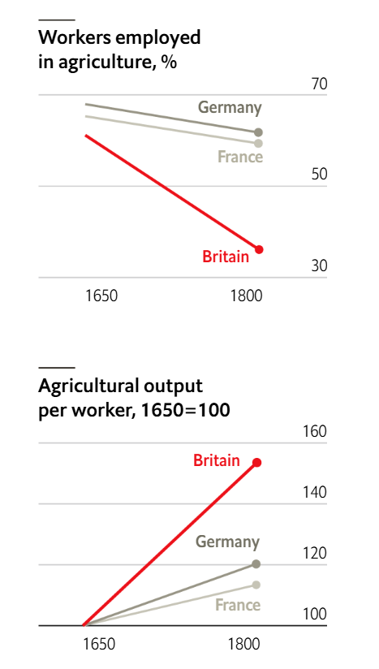

---
### Textile innovations
- John Kay (1733): Flying shuttle. Increased speed of weaving.
- James Heargreaves (1764): Spinning Jenny.  Allowed multiple spindles to be spun simultaneously.
- Richard Arkwright (1769): Water frame.  Machine powered machines, pivotal to move production from homes to factories.  For strong warp threads. Also developed carding machines for processing raw cotton.
- Samuel Crompton (1779):  Spinning mule.  Combined spinning jenny and water frame to produce fine strong yarn.
---
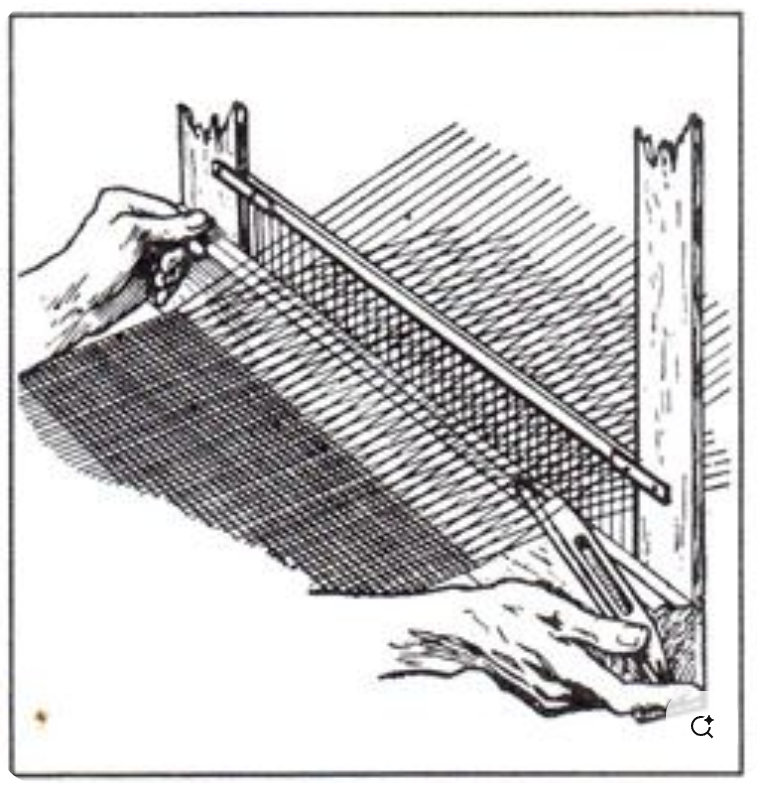

---
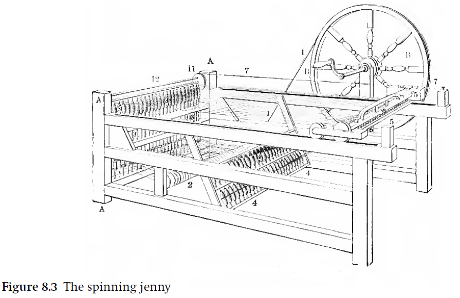

---
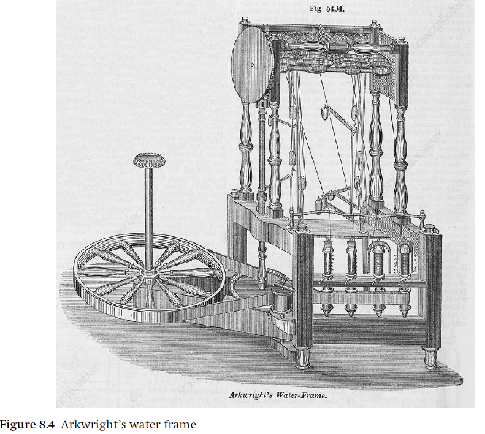


---
## Arkwright's Waterframe, patented 1769

<iframe width="560" height="315" src="https://www.youtube.com/embed/AloWMoc-3WU" title="YouTube video player" frameborder="0" allow="accelerometer; autoplay; clipboard-write; encrypted-media; gyroscope; picture-in-picture; web-share" allowfullscreen></iframe>

https://youtu.be/AloWMoc-3WU?si=uug7Berx47RHEQHQ

---
## Spinning Mule (1779)

- Faster, higher quality

<iframe width="560" height="315" src="https://www.youtube.com/embed/CG2hG1SLdoQ" title="YouTube video player" frameborder="0" allow="accelerometer; autoplay; clipboard-write; encrypted-media; gyroscope; picture-in-picture; web-share" allowfullscreen></iframe>

longer: https://youtu.be/aBRLhqoc6yE?si=GhPIp_NwkSsvxVV8&t=266


---
## Mokyr: Macro vs. Microinventions

- **Macroinventions:** Radical, unprecedented leaps in technology that break major bottlenecks (e.g., discovering atmospheric pressure can do work).
- **Microinventions:** Continuous, incremental improvements made by skilled mechanics and engineers that make macroinventions reliable and economically viable.
- *The British Industrial Revolution relied heavily on a culture that fostered both.*

---
### Atmospheric Engine (A Macroinvention)

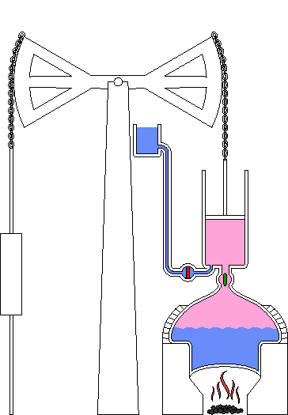

- Newcomen's 1712 engine: A radical conceptual leap, but highly inefficient.
- Water spray cools steam in chamber, causing condensation.
- Atmospheric pressure pushes piston down, lifting weights.

See [animation](https://en.wikipedia.org/wiki/Newcomen_atmospheric_engine)

---
### James Watt's Steam Engine (Macro & Microinventions)
* Watt 1769 design, greatly improves energy efficiency
  * Separate condensing cylinder (Brilliant macroinvention)
  * Avoided need to reheat chamber
  * Required years of collaborative microinventions (with Matthew Boulton and precision ironmaker John Wilkinson) to mass produce.
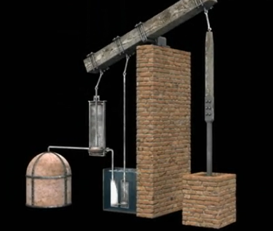

---

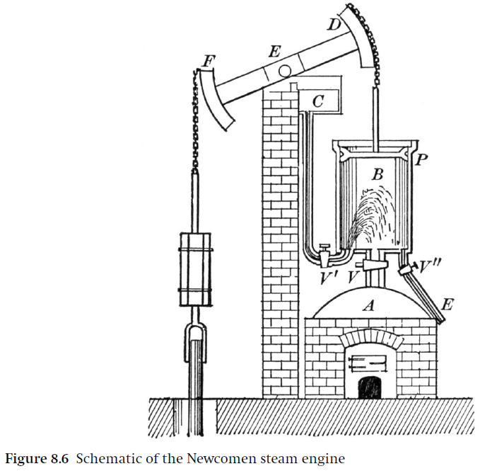
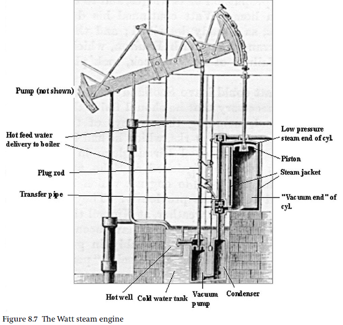

---


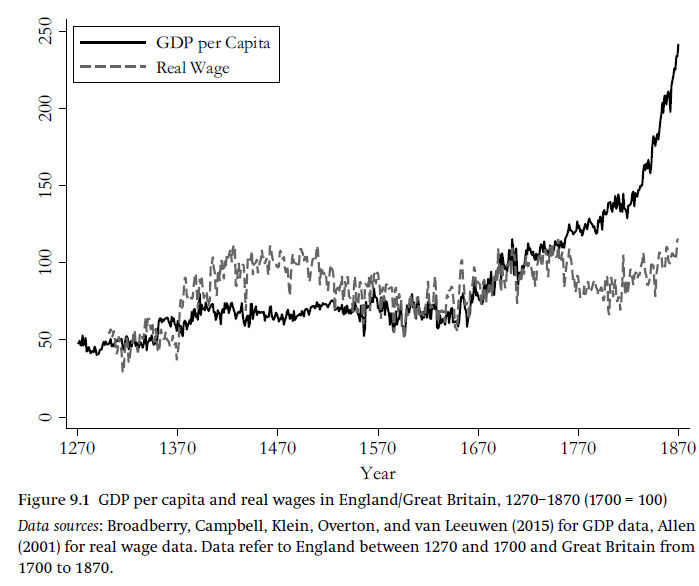

---
## The Geography of British Industrialization
- Rise of London part of broader shift towards ports, especially those involved in Atlantic trade
- Bristol and Liverpool grew on trade with the Americas, especially the slave trade
- Industrialization shifted economic activity to the northwest
- New economic centers in Manchester, Leeds, Birmingham and Sheffield based on manufacturing, textiles, and steel.

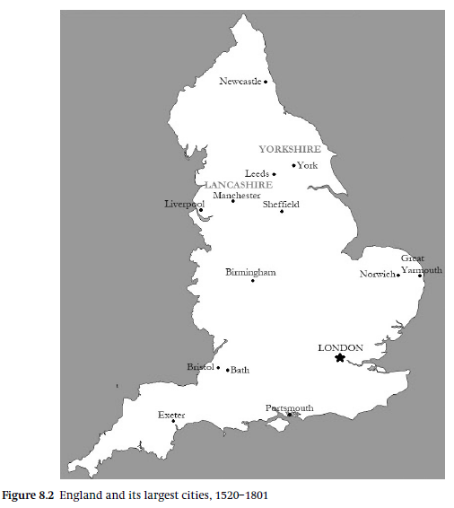

---

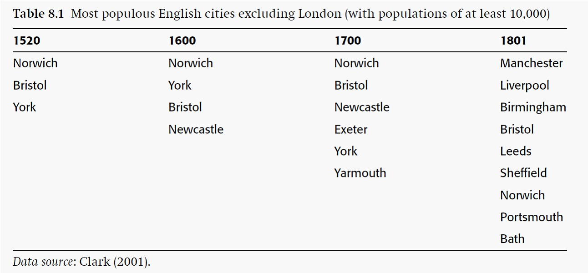


---
## Why Britain?  KRs Chapter 8
**List of preconditions:**
- Relatively 'limited' (yet strong) and representative governance.
- Large domestic economy
- Access/control of Atlantic trade
- Large base of highly skilled mechanical workers

**Other Contenders include**
- Slavery and Colonization <-- discussed next class.

**Two Dominant Theories**
- Allen: high wages and relatively cheap energy
- Mokyr: 'Industrial Enlightenment' Science + mechanical skill


---

## Mokyr's Culture of Growth

- Individual scientific genius not enough (plenty outside of Britain) 
- Scientific societies like the Royal Society (founded in 1660)
- Academic journals
- reliable Europe-wide postal system
- Comparative intellectual freedom
- A market for ideas -- - Voltaire's Republic of Letters.
- Culture not just academic; influenced businessmen, mechanics and engineers.


---

To understand Allen's theory we need to understand
## Technology Adoption and directed technical change

See interactives: https://www.geogebra.org/m/hzy5yyeg#chapter/927950

A Cobb-Douglas Aggregate production function:

$$
Y = A \cdot K^\alpha \cdot (H\cdot L)^{1-\alpha}
$$

With human-capital augmented laborL

$$
Y = A \cdot K^\alpha \cdot (H\cdot L)^{1-\alpha}
$$


---
Optimum
Choice of 
Technique
depends on 
economy $w/r$

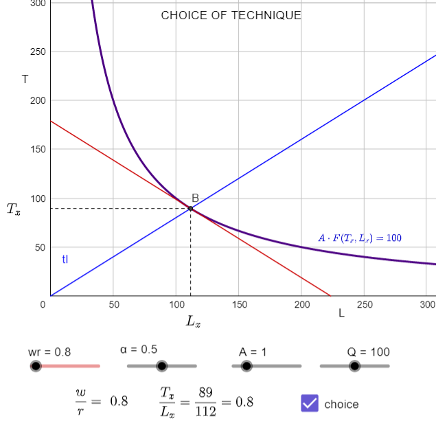

[interactive](https://www.geogebra.org/m/hzy5yyeg#material/nrfq7yxr)


---

## Adoption incentives

- Allen (2009) argues that regardless of how intensive the machine was being used, it was always profitable for industrialists in England to purchase a spinning jenny.
- Often not profitable for a French industrialist to do so (French wages were lower and capital more expensive)
- Never paid to adopt a spinning jenny in India.

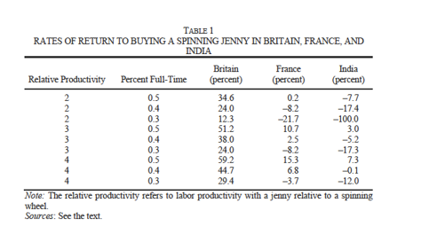


---


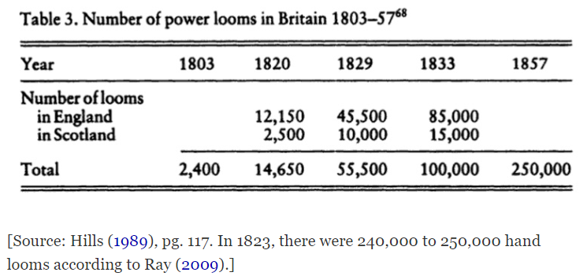
### Slow diffusion of power looms
* Spinning mechanized before weaving (looms). 
* A lot of cheap yarn lead to weaving boom 1780s-1815. Cotton *hand* weavers 4X as farmers took up weaving full-time. 
* ~250K hand looms in 1823 better at high quality cloth.
* For highest quality cloths, wage tripled (Allen 2016). 
* Allen high weaver wages induced invention and adoption of labor-saving power looms
* Tariffs restricted India textiles.

---

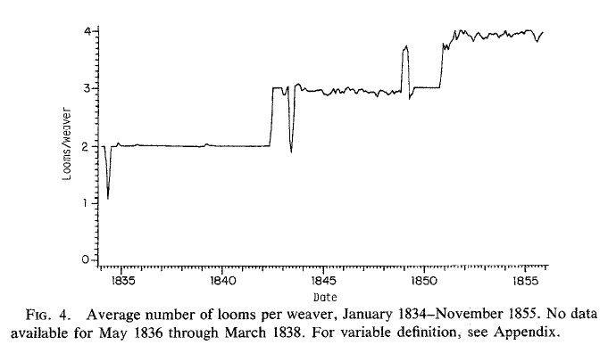
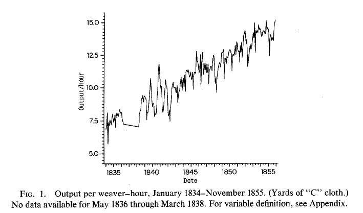

Rising K/L and labor productivity ([source](https://pseudoerasmus.com/2017/09/27/bmww1/))


---

### Slow diffusion of Steam
* Steam engines used in mines, pumps, mills, locomotives.
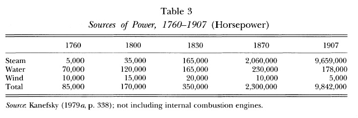

---

## Steady productivity growth
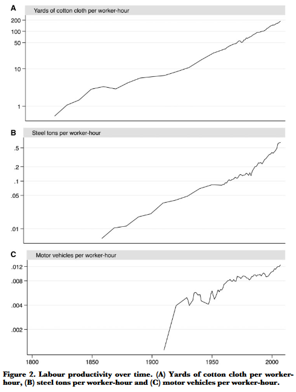


---

## Does productivity growth increase or decrease employment?
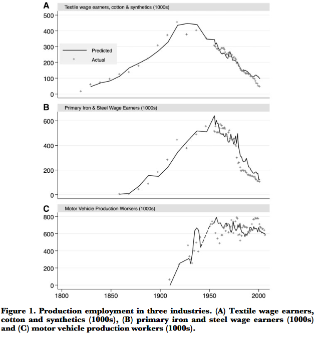


- Firm hires laborers until marginal value product of labor equals the wage.

$$
P \cdot MP_L = w
$$

* At constant price $P$ firm would want to hire more workers as productivity increases.
* Many firms doing the same pushes up wages.
* But what is happening to the demand for the good, and it's price $P$?  If may fall if supply rising faster than demand.
---
## Employment and wage dynamics
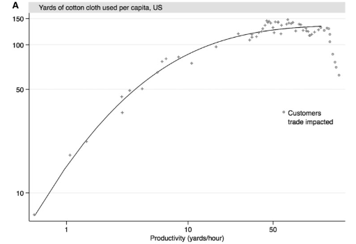

* Demand for cloth first grew quickly. Price $P$ rose as demand rose faster than supply, so labor demand and employment increases (wage may rise if supply inelastic) :
 $$
P \cdot MP_L = w
$$
* But eventually demand growth slows and product price $P$ falls faster than productivity rises. Supply outstrips demand.
* Industry would now start shedding workers as fewer (more productive workers) required to meet demand.

---
### Microeconomic mechanisms
[Geogebra interactives](https://www.geogebra.org/m/nd7sbqax)
- [MPL and K/L](https://www.geogebra.org/m/nd7sbqax#material/m6g4xdzk)
- [Optimum choice of K/L technique (given w/r)](https://www.geogebra.org/m/nd7sbqax#material/zfdxf6gj)
---

## Allen's IR Model

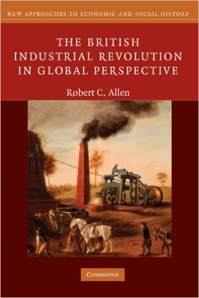

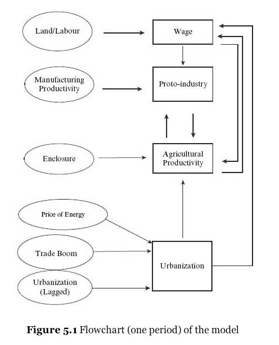

