<!--
theme: gaia 
paginate: true
footer: Eco 331: Late industrializers
style: |
  section {font-size: 26px;}
-->


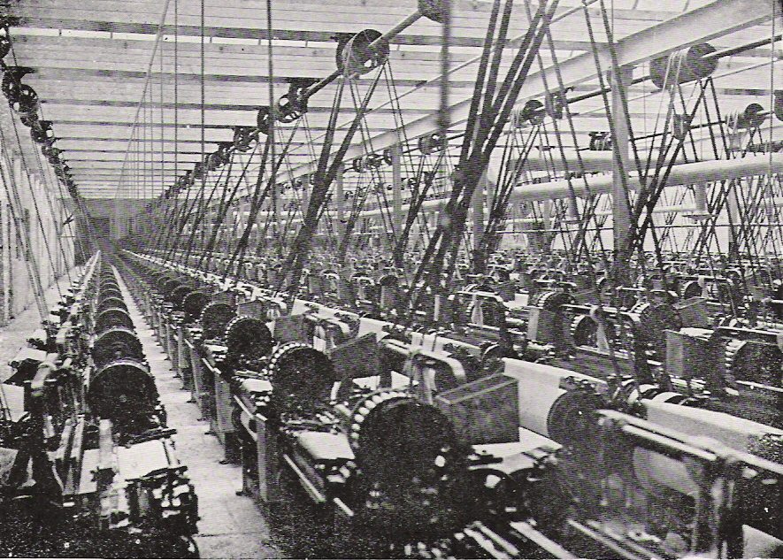
# ECO 331
## Economic History
```
The Late Industrializers
```
Jonathan Conning
Spring 2026
<br></br>


---

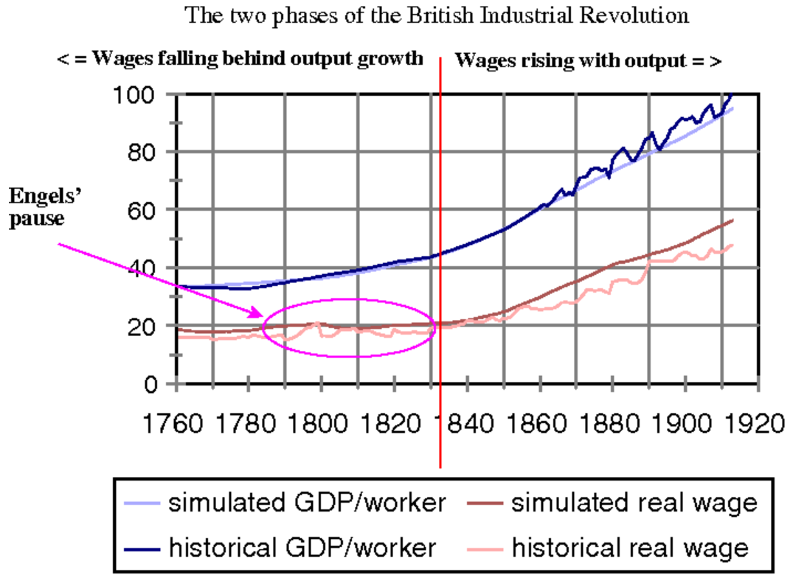
* The Industrial Revolution did not transform the lives of workers in a single generation
* British GDP per capita increased but many workers did not see major improvements in living standards, at least until after around 1840
* Allen (2009) labeled this “Engel’s Pause”
* But a decisive increase in both per capita GDP and real wages by end century

---

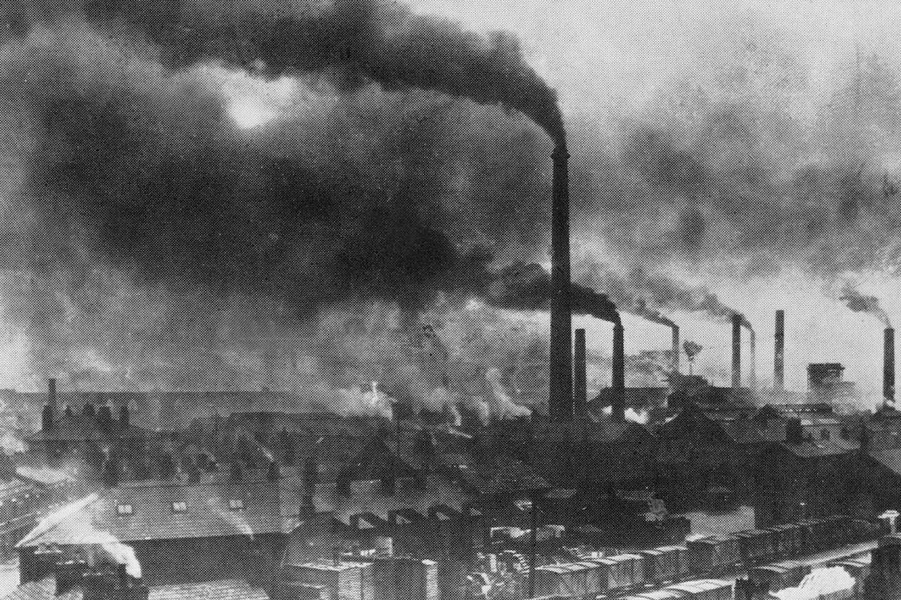
## Consequences of Industrialization
* Industrialization led to much pessimism about the state of the working class
* Karl Marx was the most famous proponent of the “pessimistic case”
* Urban crowding, dangerous factories, disease, child labor, pollution

---

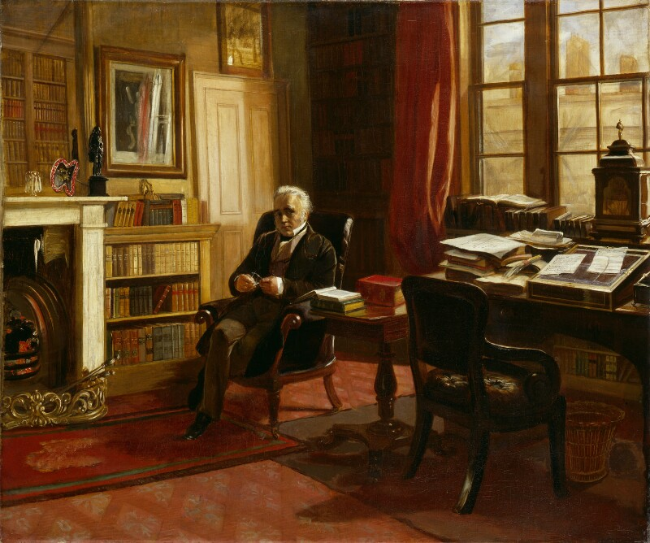
### Babington Macaulay's Optimism
* Macaulay was one of the first individuals to understand the long run consequences of the Industrial Revolution
* He predicted that modern economic growth would transform both England and the world
* He was proven correct

---

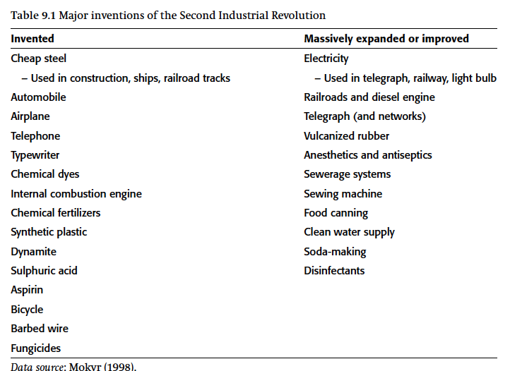
### The Second Industrial Revolution (1870-1914)
* Many innovations of the First Industrial Revolution did not rely directly on scientific breakthroughs
* After 1850, innovations in chemistry, medicine, and physics had direct economic payoffs
* This was the “marriage of science and technology”.  Industrial R&D.

---

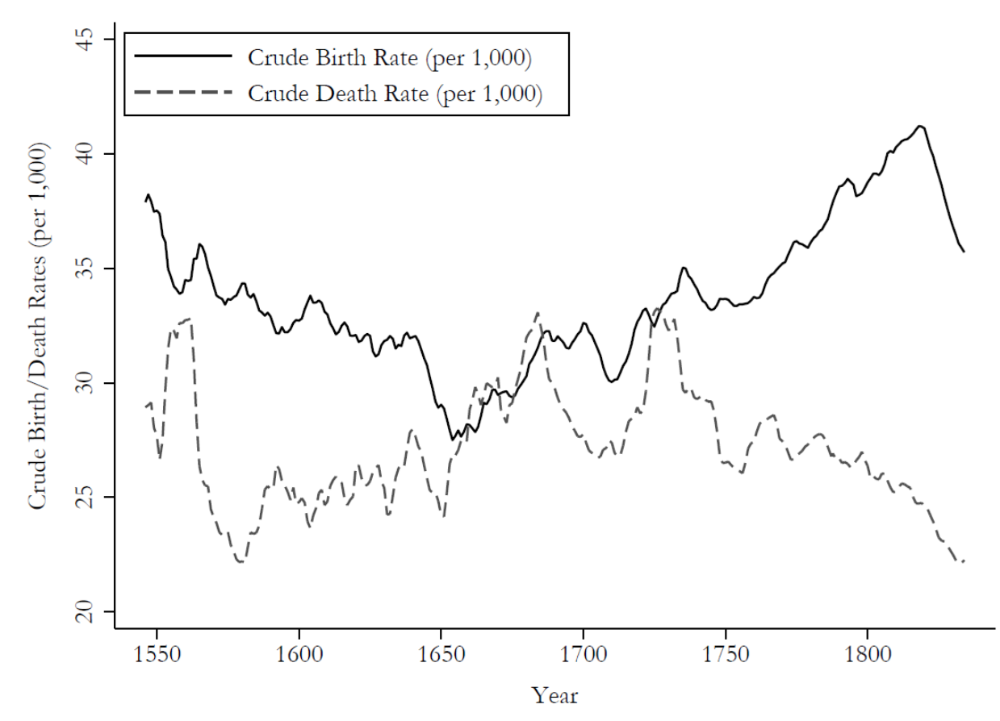
### The Demographic Transition
* Beginning with France (and then later in England), people started to control fertility within marriage
* This demographic transition meant that economies stopped behaving in a Malthusian fashion
* Population growth slowed even as incomes improved
* Fertility and mortality in England/Britain, 1541-1839

---

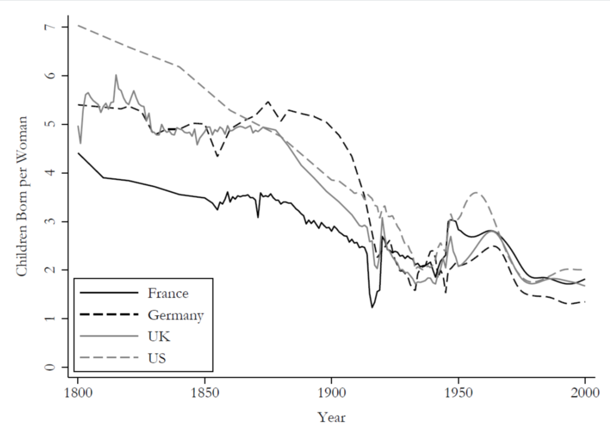
### The Demographic Transition
* Timing of the fertility transition is hard to explain
* Began in France in the late 18th century, before the onset of modern economic growth
* Spolaore and Wacziarg (2021) argue it diffused alongside French culture in 19th century
* As Malthusian pressures eased, resources were freed up to invest in education
* Children born per woman in
* Western Europe and the US, 1800-2000

---

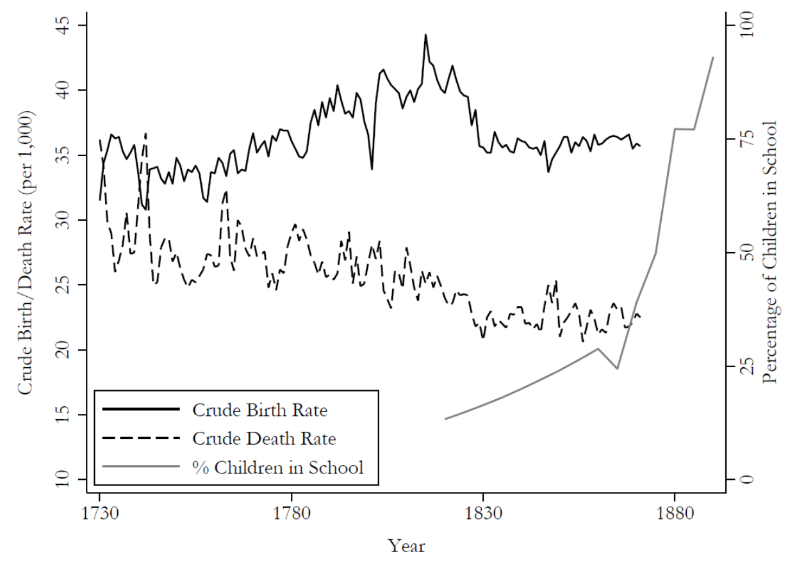
### Human Capital and the Demographic Transition
* Gary Becker argued that parents choose between the quality and quantity of children
* After the demographic transition, societies invested more in education
* An educated labor force was a key complement to technologies of the Second Industrial Revolution
* Public education supported by industrialists.

---

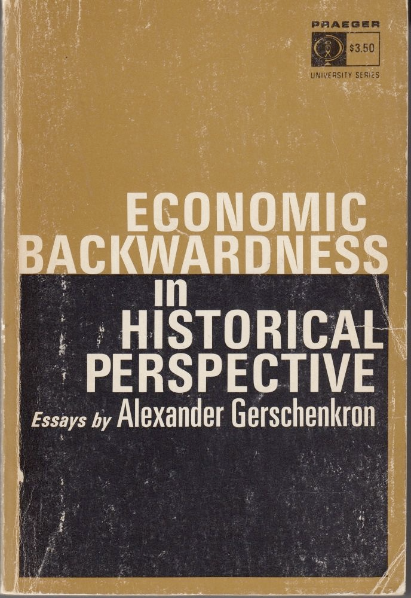

### Late Industrializers
* Alexander Gershenrkon: late industrializers did not have to go through same path as Britain
* Early stages of development could be leap-frogged
* Late industrializers had a backlog of advanced technologies they could adopt
* Germany harnessed capital on a larger scale (via investment banks)becoming a leader in new sectors such as chemical fertilizers (Bayer, IG Farben) and arms (Krupp)

---

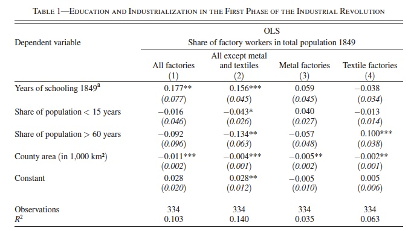
### Human Capital and the Diffusion of Industrialization
* Human capital played a critical role in the Second Industrial Revolution diffusion.
* Becker et al. (2011) find that pre-industrial levels of education (measured in 1816) in Germany predict non-textile-based industrialization in 19th


---

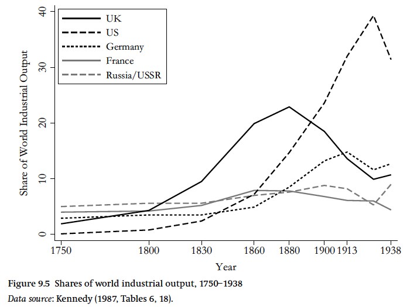
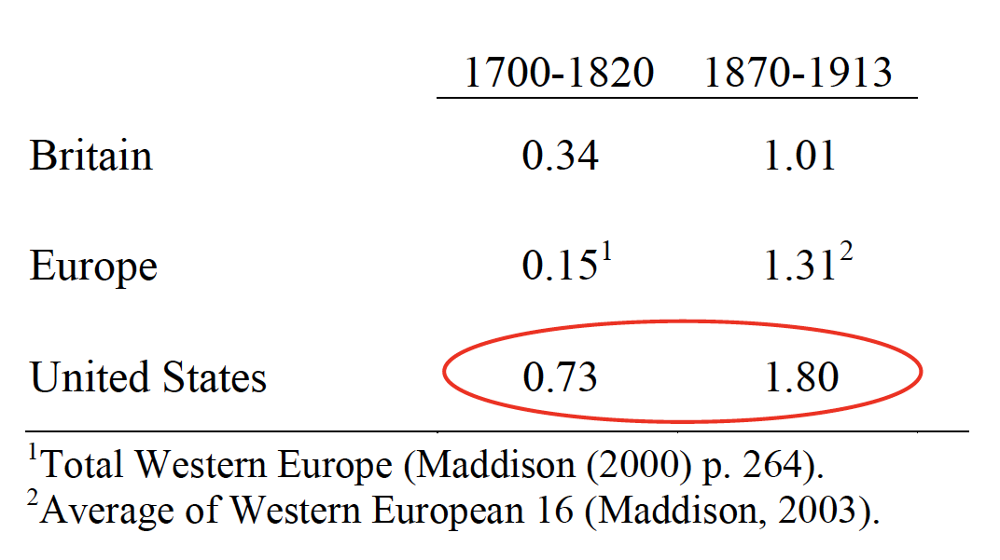
### The Economic Rise of the USA
* The United States became the world’s leading economy by the end of the 19th century

---

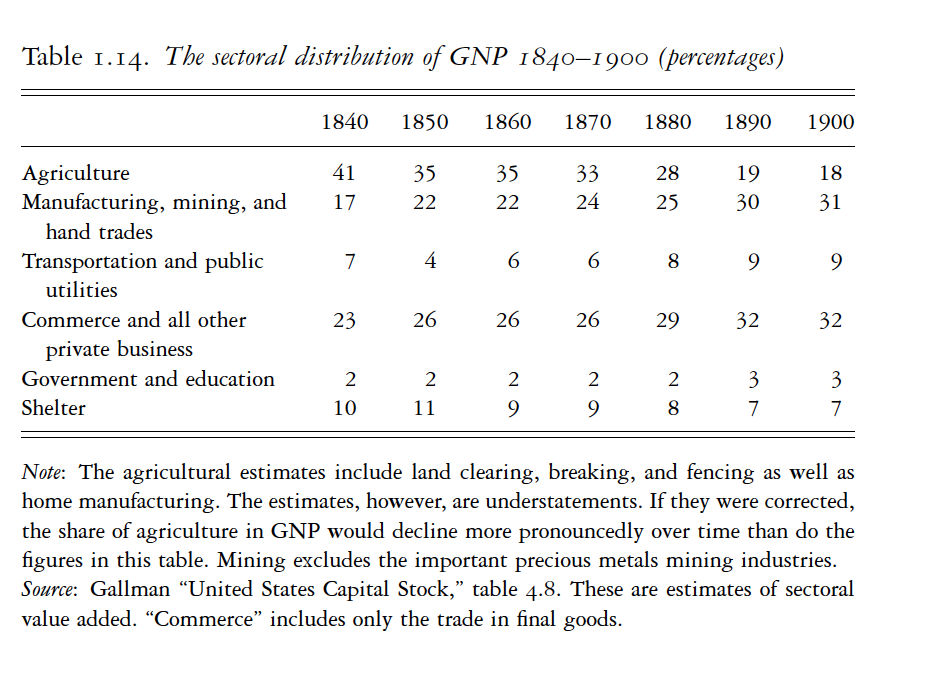
### The Economic Rise of the USA
* The Ten Largest Industries in the US in 1860 and 1910

---

### The Economic Rise of the USA
* The First Industrial Revolution (1760-1830)
* Began in England, spread to USA & Belgium in 1820s, Germany in the 1840s-1850s
* Key technologies: cotton textiles, steam engine, iron & steel
* Industrialization began in New England
* The Beverly Cotton Manufactory in Massachusetts in 1787
* Slater Mill in Rhode Island in 1790
* Waltham Mill in Massachusetts in 1814
* Timber, water, coal, iron, copper were abundant
* Lowell’s Textile Mill in Massachusetts

---

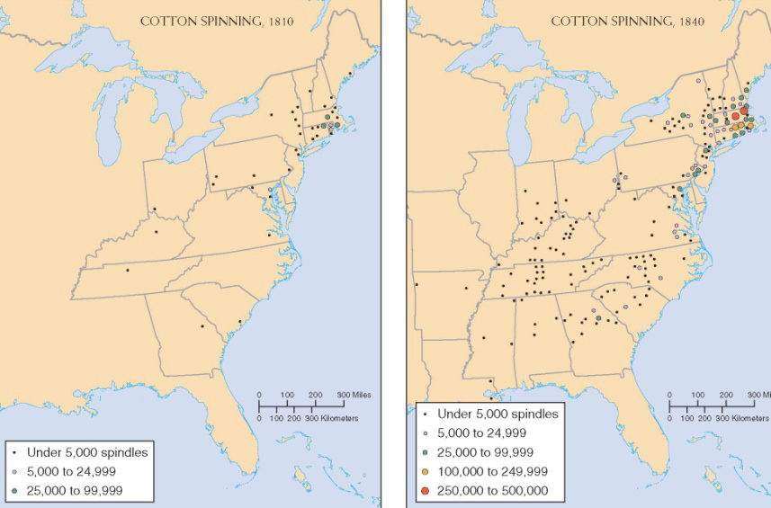
### Cotton and Textiles
* Industrialization in the first half of the 19th century centered on cotton
* America was a technological follower
* Rapid growth was possible due to abundance of cheap factor inputs

---

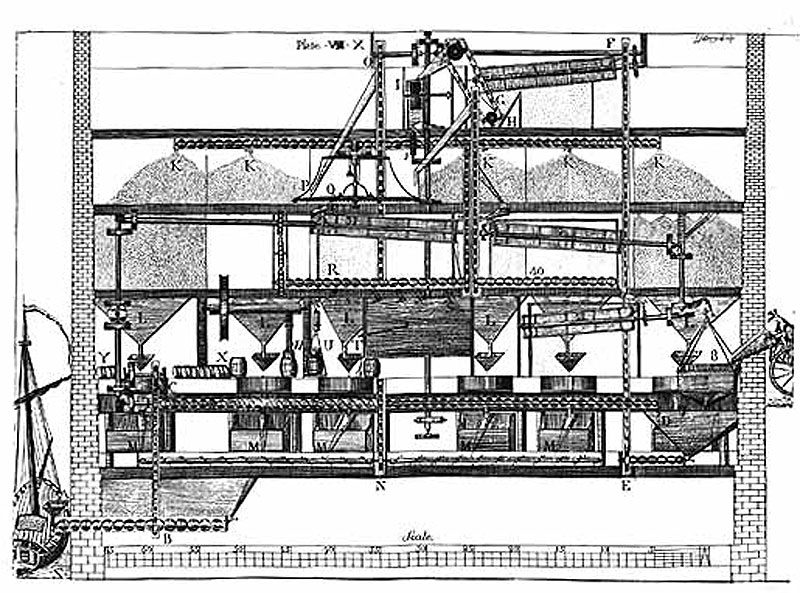
### The Diffusion of Technology from Britain  
* Recall Allen (2009): factor prices determine patterns of innovation
* Countries with factor prices similar to Britain should industrialize next
* North America had expensive labor and abundant natural resources. High cost of labor provided the incentive to innovate
* e.g. first automatic flour mill invented by Oliver Evans in 1782
* Belgium, the first European country to industrialize, had abundant coal

---

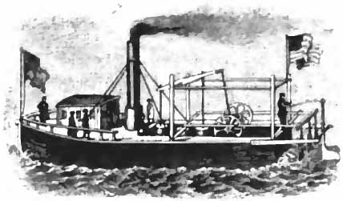
### The Diffusion of Technology from Britain  
* Mokyr (2009, 2016): a culture of growth or the Industrial Enlightenment was critical for the onset of economic growth
* America and Britain shared a common language and culture
* Attempts to restrict spread of IR technologies proved impossible
* Economic growth diffused first to Northern European societies that had participated in the Enlightenment and the Scientific Revolution


---


### The Rise of the United States
* America’s growth in the 19th century was also on the extensive margin
* Vast swathes of land were added and the population increased from around 2.5 million in 1776 to 76 million in 1900
* Immigration (especially from Ireland, Germany, Italy, and Eastern Europe) fueled this expansion
* This expansion in the size of the market complemented a distinctively “American” system of manufacturing
* US population and immigrant share, 1850-2010

---

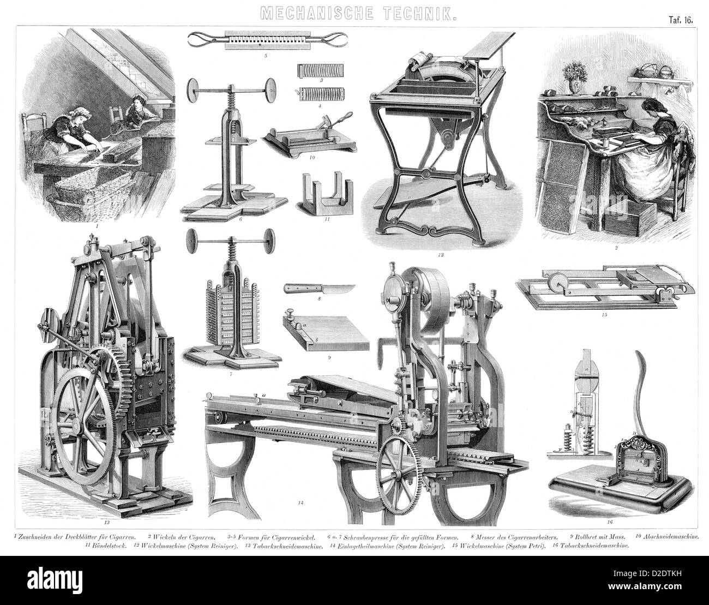
### The Second Industrial Revolution and American Economic Growth
* The American system of manufacturing centered on machine tools and the development of interchangeable parts
* A large market and homogeneous tastes encouraged product standardization
* Standardized products could be easily tweaked or improved upon
* Standardized products encouraged the standardization of other parts, and this made further innovation easier
* America became the leader in global manufacturing and in technology (though not necessarily in science until WWII)

---

### The Soviet Detour I
* In the 20th century the Soviet Union was seen as pioneering an alternative growth model to that of the United States or Western Europe
* The Soviet Union achieved rapid industrialization in the 1930s (at vast human cost including millions of deaths in Ukraine due to famine) and fast growth for several decades
* This was interpreted as due to the success of economic planning

---

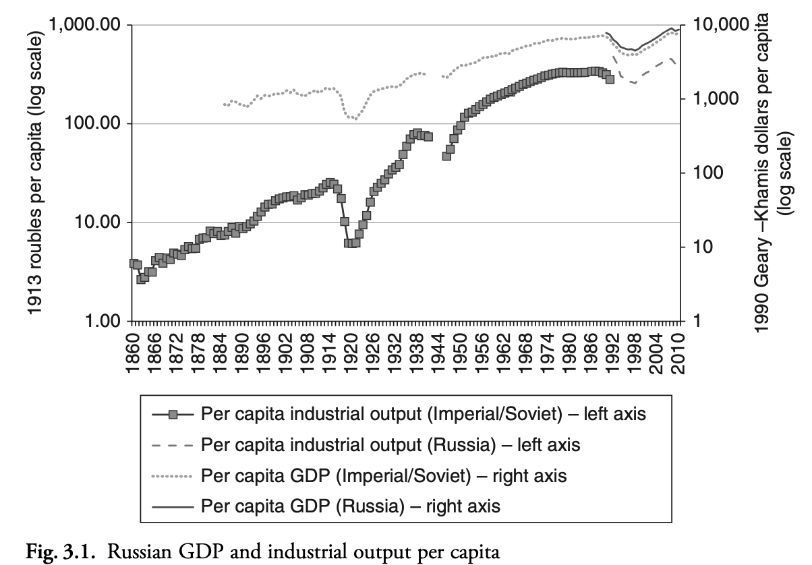
### The Soviet Detour II
* Russia under the Tsars was a rapidly growing and industrializing economy, on course to achieve rapid catch-up growth and industrialization prior to WWI
* Much of the early Soviet growth was recovery from the devastation the Russian economy experienced in WWI and during the Russian civil war
* This growth was largely achieved by mobilizing tremendous resources (labor, land, natural resources, and physical capital)

---

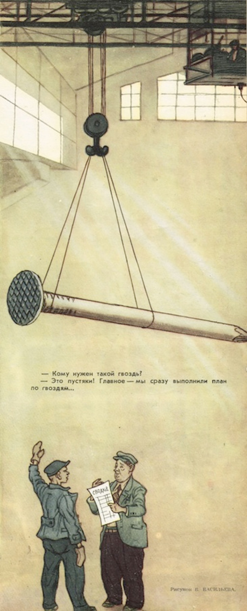
### The Soviet Detour III
* Planning mobilized resources on a large scale but at tremendous costs
* Even during the early phase of rapid growth, inefficiencies and wastage were legendary (Gregory and Harrison, 2005). 
* Centralization under a dictator produced chaos. Stalin spent time making seemingly trivial decisions, including setting price of metro tickets. Corruption and rent-seeking endemic
* Reforms after Stalin. But USSR struggled to provide basic consumer goods  


---

## Allen's "Standard Model" of Catch-up Growth
* Deliberate policy recipe used by 19th-century late industrializers (US, Germany) to catch up to Britain.
* **1. Internal Market Integration:** Building transport infrastructure (railways/canals).
* **2. External Protection:** Tariffs to protect nascent domestic industries from British competition.
* **3. Financial Institutions:** Creating investment banks to stabilize currency and provide industrial capital.
* **4. Mass Education:** Promoting schooling to facilitate technology adoption.

---

# Applying the Standard Model
* **Success stories:** The United States and Germany successfully applied these policies to achieve rapid industrialization.
* **Mixed results:** Other nations, such as Imperial Russia, Japan, and Latin American countries, attempted the model with varying degrees of success.
* **Big Push:** In later stages of development, some countries shifted from this standard set of policies toward what Allen calls "Big Push" industrialization.

---

### Allen's Revisionist View: The "Big Push"
* Argues that the Soviet "Big Push" model was a highly successful strategy for achieving rapid structural transformation.
* **Challenges the Tsarist Counterfactual:** Tsarist Russia was unlikely to achieve the same rapid transformation through market mechanisms alone.
* **Key Drivers:** 
    * Massive reallocation of labor from low-productivity agriculture to high-productivity industry.
    * State-directed capital accumulation.
    * Demographic transition and emphasis on education.

---

### Re-evaluating the Soviet Standard of Living
* Contrasts with the pessimistic view of purely falling living standards and famines.
* Data shows improvements in per capita consumption and quality-of-life indicators for both urban and rural populations by the late 1930s.
* **Nuance:** Distinguishes between the economic success of the industrialization strategy and the brutal political/human costs of forced collectivization.
